作者：米开朗基罗赵
链接：https://www.zhihu.com/question/23971601/answer/375355599
来源：知乎
著作权归作者所有。商业转载请联系作者获得授权，非商业转载请注明出处。

卡尔曼滤波解决的是如何从多个不确定数据中提取相对精确的数据。

1. 实践前提是这些数据满足高斯分布。
2. 理论前提是一个高斯斑乘以另一个高斯斑可以得到第三个高斯斑，第三个高斯斑即为提取到相对精确的数据范围。

以上理解来自博客[How a Kalman filter works, in pictures](https://link.zhihu.com/?target=http%3A//www.bzarg.com/p/how-a-kalman-filter-works-in-pictures/%23mathybits) ，写的很好，对原理解释的非常清楚，今天把它翻译为中文记录在下边，适合用来入门。

若有翻译不准确的地方，请指正.

------

#### 卡尔曼滤波是如何工作的，图解

​	我必须要告诉你一些关于卡尔曼滤波的知识，因为这踏马的太牛B了。

​	奇怪的是很少有软件工程师或者科学家对它有所了解。这让我有点小失望，因为在一些含有不确定因素的场景里，如何去综合获取有效的信息，卡尔曼滤波是一个通用并且强有力的算法。有时候它提取精确信息的能力看上去就像是“见证奇迹的时刻”。如果看到这里你认为我说的话里有夸大的水分，你可以看下我开发的效果视频（[http://www.bzarg.com/p/improving-imu-attitude-estimates-with-velocity-data](https://link.zhihu.com/?target=http%3A//www.bzarg.com/p/improving-imu-attitude-estimates-with-velocity-data)）。在这个demo里我通过检测角速度来获取一个自由物体的姿态，效果奇佳。

#### 什么是卡尔曼滤波？

​	你可以在任何含有==不确定因素==的动态系统里使用卡尔曼滤波，而且你应该可以通过某种数学建模对系统下一步动向做一个大概的==预测==。尽管系统总是会受到一些未知的干扰，但是卡尔曼滤波总是可以派上用场来提高系统预估的精确度，这样你就可以更加准确地知道到底发生了什么事情(系统状态是如何转移的)。而且它可以有效利用多个粗糙数据之间的关系，而单独面对这些数据你可能都无从下手。

​	卡尔曼滤波尤其适合动态系统。它==对于内存要求极低==（它仅需要保留系统上一个状态的数据，而不是一段跨度很长的历史数据）。并且它运算很快，这使得它非常适合解决实时问题和应用于嵌入式系统。

​	如果你尝试谷歌去搜索相关资料，对于卡尔曼滤波的数学表达总是很枯燥并且难理解。这提高了大家的学习成本甚至打击了学习兴趣，因为卡尔曼滤波真的是超级简单，当然前提是你用正确的方式去理解它。因此这就形成了一个很有意义的学术话题，我将会通过很多清晰、漂亮的图片以及颜色标注来阐述这个话题。对学习者的预备知识要求很简单，你只需要对概率论和矩阵运算有一些简单的基础知识。

​	我们从一个简单的例子入手，看下卡尔曼滤波可以解决什么问题。如果你想直接看公式推导，可以跳过下一节。

#### 利用卡尔曼滤波我们可以做什么？

​	我们举一个玩具的栗子：你开发了一款小型机器人，它可以在树林里自主移动，并且这款机器人需要明确自己的位置以便进行导航。

我们可以通过一组状态变量来描述机器人的状态，包括位置和速度：

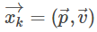

注意这个状态仅仅是系统所有状态中的一部分，你可以选取任何数据变量作为观测的状态。在我们这个例子中选取的是位置和速度，它也可以是水箱中的水位，汽车引擎的温度，一个用户的手指在平板上划过的位置，或者任何你想要跟踪的数据。

我们的机器人同时拥有一个GPS传感器，精度在10m。这已经很好了，但是对我们的机器人来说它需要以远高于10m的这个精度来定位自己的位置。在机器人所处的树林里有很多溪谷和断崖，如果机器人对位置误判了哪怕只是几步远的距离，它就有可能掉到坑里。所以仅靠GPS是不够的。

同时我们可以获取到一些机器人的运动的信息：驱动轮子的电机指令对我们也有用处。

如果没有外界干扰，仅仅是朝一个方向前进，那么下一个时刻的位置只是比上一个时刻的位置在该方向上移动了一个固定距离。当然我们无法获取影响运动的所有信息：机器人可能会受到风力影响，轮子可能会打滑，或者碰到了一些特殊的路况；所以轮子转过的距离并不能完全表示机器人移动的距离，==这就导致通过轮子转动预测机器人位置不会非常准确==。

GPS传感器也会告知我们一些关于机器人状态的信息，但是会包含一些不确定性因素。我们通过轮子转动可以预知机器人是如何运动的，同样也有一定的不准确度。

如果我们综合两者的信息呢？可以得到比只依靠单独一个信息来源更精确的结果么？答案当然是YES，这就是卡尔曼滤波要解决的问题。

#### 卡尔曼滤波如何看待你的问题

我们再来看下需要解决的问题，同样是上边的系统，系统状态包括位置和速度。

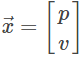

我们不知道位置和速度的准确值；但是我们可以列出一个准确数值可能落在的区间。在这个范围里，一些数值组合的可能性要高于另一些组合的可能性。

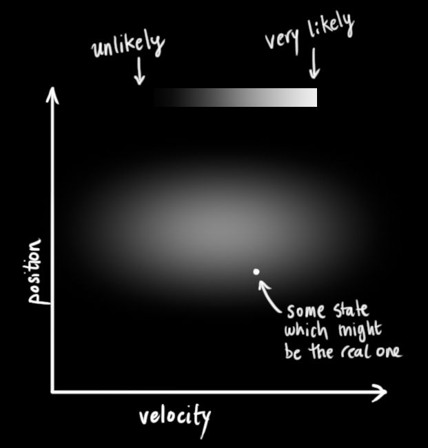

卡尔曼滤波假设所有的变量（在我们的例子中为位置和速度）是==随机的且符合高斯分布==（正态分布）。每个变量有一个平均值$\mu$，代表了随机分布的中心值（也表示这是可能性最大的值），和一个方差$\sigma^2$，代表了不确定度,下图中想表达的意思应该是标准差.

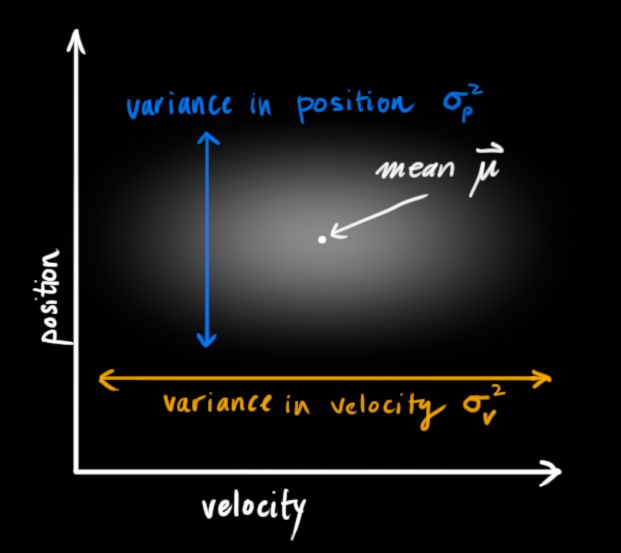

在上图中位置和速度是==无关联==的，即系统状态中的==一个变量并不会告诉你关于另一个变量的任何信息==。

下图则展示了一些有趣的事情：在现实中，速度和位置是==有关联==的。如果已经确定位置的值，那么某些速度值存在的可能性更高

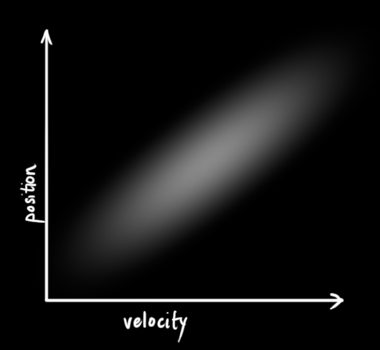

假如我们已知上一个状态的位置值，现在要预测下一个状态的位置值。如果我们的速度值很高，我们移动的距离会远一点。相反，如果速度慢，机器人不会走的很远。

这种关系在跟踪系统状态时很重要，因为它给了我们更多的信息：==一个测量值告诉我们另一个测量值可能是什么样子。==这就是卡尔曼滤波的目的，我们要尽量从所有不确定信息中提取有价值的信息！

这种关系可以通过一个称作==协方差==的矩阵表述。简而言之，矩阵中的每个元素 $\sum_{ij}$ 表示了第 $i$ 个状态变量和第 $j$ 个状态变量之间的关系。（你可能猜到了协方差矩阵是对称的，即交换下标$i$和$j$并无任何影响）。协方差矩阵通常表示为$\sum$，它的元素则表示为 $\sum_{ij}$ :

$\sum_{ij}=Cov(x_i,x_j)=E[(x_i-\mu_i)(x_j-\mu_j)]$

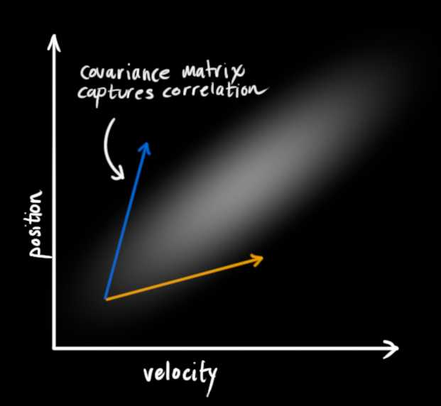

#### 利用矩阵描述问题

我们对系统状态的分布建模为==高斯分布==，所以在k时刻我们需要两个信息：最佳预估值 $\hat{x}_{k}$（平均值，有些地方也表示为$\mu$），和它的协方差矩阵 $P_k$

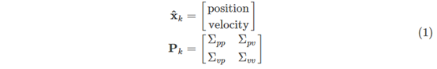

(这里我们只记录了位置和速度，但是我们可以把任何数据变量放进我们的==系统状态==里)

下一步，我们需要通过k-1时刻的状态来预测k时刻的状态。请注意，我们不知道状态的准确值，但是我们的预测函数并不在乎。它仅仅是对k-1时刻所有可能值的范围进行==预测转移==，然后得出一个k时刻新值的范围。

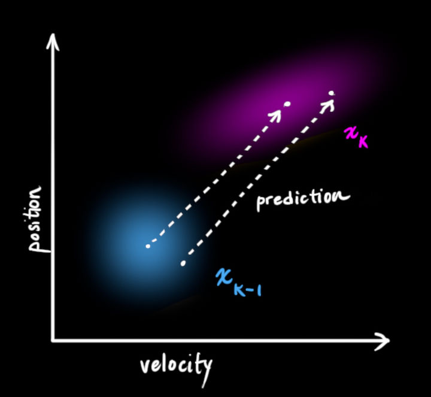

我们可以通过一个状态转移矩阵 ![[公式]](https://www.zhihu.com/equation?tex=F_%7Bk%7D) 来描述这个转换

![[公式]](https://www.zhihu.com/equation?tex=F_%7Bk%7D) 把k-1时刻所有可能的状态值转移到一个新的范围内，这个新的范围代表了系统新的状态值可能存在的范围，如果k-1时刻估计值的范围是准确的话。

通过一个==运动公式==来表示这种预测下个状态的过程：

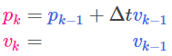

​	整理为矩阵:

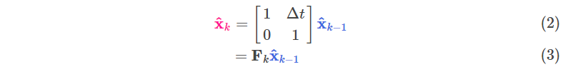

​	我们现在有了一个==状态转移矩阵==，可以简单预测下个状态，但仍不知道如何==更新协方差矩阵==。

​	这里我们需要另一个公式。如果我们对每个点进行矩阵A转换，它的协方差矩阵$\sum$会发生什么变化呢？

​	Easy，直接告诉你结果。

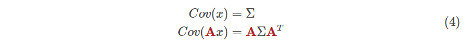

​	结合（4）和（3）：

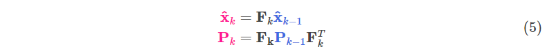

#### 外界作用力

我们并没有考虑到所有影响因素。系统状态的改变并不只依靠上一个系统状态，外界作用力可能会影响系统状态的变化。

例如，跟踪一列火车的运动状态，火车驾驶员可能踩了油门使火车提速。同样，在我们机器人例子中，导航软件可能发出一些指令启动或者制动轮子。如果我们知道这些额外的信息，我们可以通过一个向量$\vec u$ 来描述这些信息，把它添加到我们的==预测方程==里作为一个==修正==。

假如我们通过发出的指令得到预期的加速度a，上边的运动方程可以变化为：

矩阵形式：

$B_k$称作==控制矩阵==，$\vec {u_k}$ 称作==控制向量==（没有任何外界动力影响的系统，可以忽略该项）。

我们增加另一个细节，假如我们的==预测转换矩阵==不是100%准确呢，会发生什么？

#### 外界不确定性

如果状态只会根据系统自身特性演变那将不会有任何问题。如果我们可以把所有外界作用力对系统的影响计算清楚那也不会有任何问题。

但是如果有些外力我们无法预测呢？假如我们在跟踪一个四轴飞行器，它会受到风力影响。如果我们在跟踪一个轮式机器人，轮子可能会打滑，或者地面上的突起会使它降速。我们无法跟踪这些因素，并且这些事情发生的时候上述的预测方程可能会失灵。

我们可以把“世界”中的这些==不确定性==统一建模，在==预测方程中增加一个不确定项==。

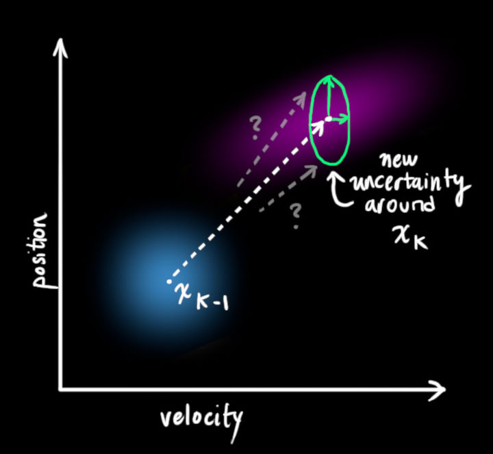

这样，原始状态中的每一个点可以都会预测转换到一个范围，而不是某个确定的点。可以这样描述： ![[公式]](https://www.zhihu.com/equation?tex=%5Cbar%7Bx%7D_%7Bk-1%7D) 中的每个点移动到一个符合方差 ![[公式]](https://www.zhihu.com/equation?tex=Q_%7Bk%7D) 的高斯分布里。另一种说法，我们把这些不确定因素描述为方差为 ![[公式]](https://www.zhihu.com/equation?tex=Q_%7Bk%7D) 的高斯噪声。

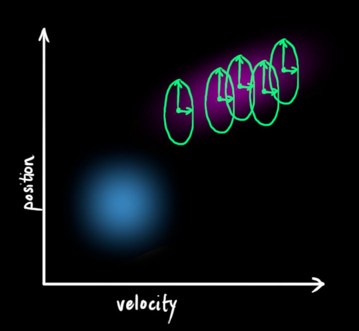

这会产生一个新的高斯分布，==方差不同，但是均值相同==。

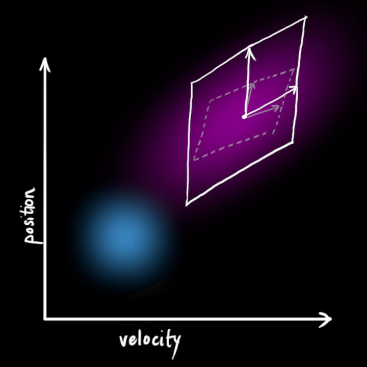

对 ![[公式]](https://www.zhihu.com/equation?tex=Q_%7Bk%7D) 简单叠加，可以拿到扩展的方差，这样就得到了完整的预测转换方程。

新的预测转换方程只是引入了已知的可以预测的外力影响因素。

新的不确定性可以通过老的不确定性计算得到，通过增加外界无法预测的、不确定的因素成分。

换句话说：

**新的最佳估计**是根据**先前的最佳估计**做出的**预测**，再加上对**已知外部影响**的校正。

**新的不确定度**是根据**先前的不确定度**做出的**预测**，再加上**来自环境额外的不确定度**。

到这里，我们得到了一个模糊的估计范围，一个通过$\hat x_k$ 和$P_k$描述的范围。如果再结合我们传感器的数据呢？

#### 通过测量值精炼预测值

我们可能还有一些传感器来测量系统的状态。目前我们不用太关心所测量的状态变量是什么。也许一个测量位置一个测量速度。每个传感器可以提供一些关于系统状态的数据信息，每个传感器检测一个系统变量并且产生一些读数。

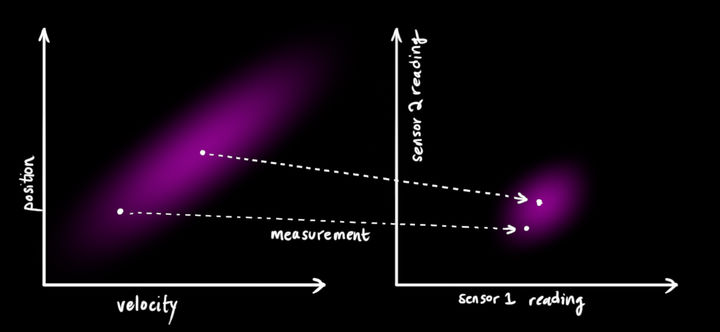

注意传感器测量的范围和单位可能与我们跟踪系统变量所使用的范围和单位不一致。

我们需要对传感器做下建模：通过矩阵$H_k$

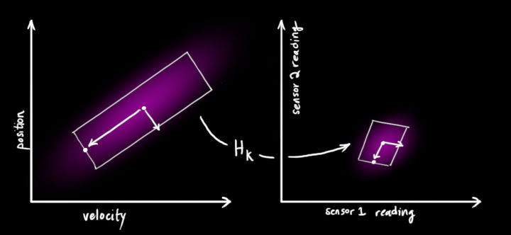

我们可以得到传感器读数分布的范围：

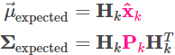

卡尔曼滤波器的伟大之处就在于它能够处理传感器噪声。换句话说，传感器本身的测量是不准确的，且原始估计中的每个状态都可能导致一定范围的传感器读数，而卡尔曼滤波能够在这些不确定性存在的情况下找到最优的状态。

我们观测到的每个数据，可以认为其对应某个真实的状态。但是因为存在不确定性，某些状态的可能性比另外一些可能性更高。

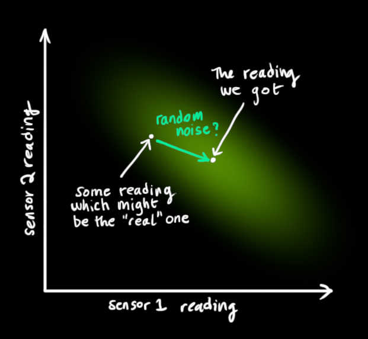

我们将这种不确定性的方差为描述为$R_k$。读数的平均值为$\vec {z_k}$ 。

所以现在我们有了两个高斯斑，一个来自于我们==预测值==，另一个来自于我们==测量值==,一个围绕通过状态转移预测的平均值，另一个围绕实际传感器读数。

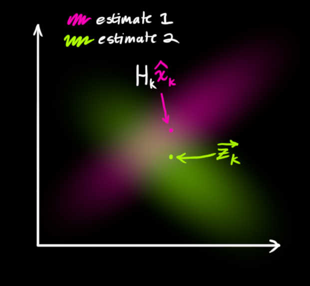

我们必须尝试去把两者的数据预测值（粉色）与观测值（绿色）融合起来。

所以我们得到的新的数据会长什么样子呢？对于任何状态( ![[公式]](https://www.zhihu.com/equation?tex=z_%7B1%7D) , ![[公式]](https://www.zhihu.com/equation?tex=z_%7B2%7D) )，我们有两个可能性：

（1）传感器读数更接近系统真实状态（2）预测值更接近系统真实状态。

如果我们有两个相互独立的获取系统状态的方式，并且我们想知道两者都为真的概率值，我们只需要将两者相乘。所以我们将两个高斯斑相乘。

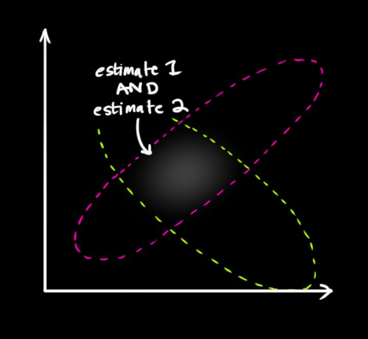

相乘之后得到的即为重叠部分，这个区域同时属于两个高斯斑。并且比单独任何一个区域都要精确。这个区域的==平均值取决于我们更取信于哪个数据来源==，这样我们也通过我们手中的数据得到了一个最好的估计值。

唔~这看上去像另一个高斯斑:

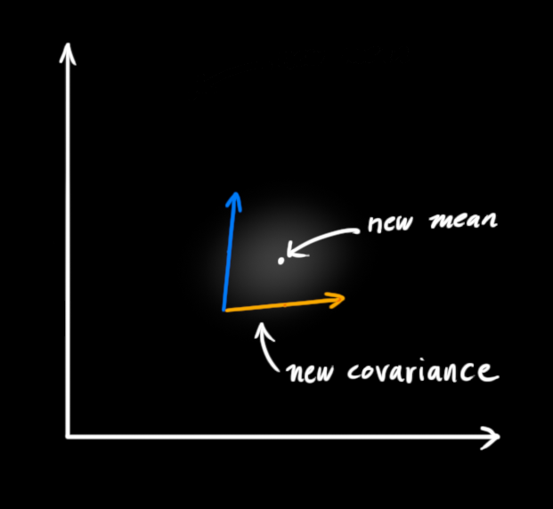

已经被证明，当你对两个均值方差都不相同的高斯斑进行相乘，你可以得到一个新的高斯斑。新高斯分布的均值和方差均可以通过老的均值方差求得。

#### 合并两个高斯分布

我们从一维数据开始，一维高斯（均值$\mu$,方差$\sigma^2$)被定义为：

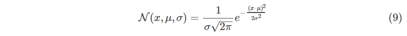

我们想知道两个高斯分布相乘会发生什么。蓝色曲线代表了两个高斯分布的交集部分。

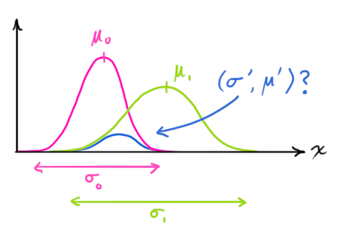

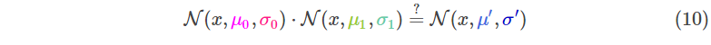

把（9）带入（10）然后做一些变换，可以得到

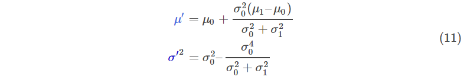

因式分解出一个部分，表示为k

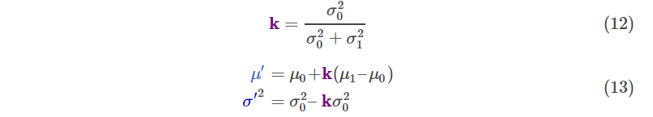

注意你是如何将处理之前的预测值，仅仅是简单将两者叠加相乘就可以得到新的预测值。现在看下这个公式是多么简单。

如果是一个多维矩阵呢？我们将（12）与（13）表示为矩阵形式。$\sum$表示协方差矩阵，$\vec \mu$ 表示平均向量：

K就是大名鼎鼎的“**卡尔曼增益**”（**Kalman gain**）。

#### 综合所有信息

我们有两个独立的维度去估计系统状态：

 预测值

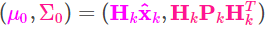

测量值

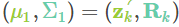

将两者相乘带入（15）寻找他们的重叠区域：

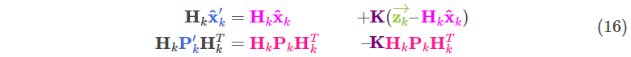

从（14）可知，卡尔曼增益为

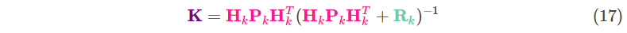

​	将（16）中的$\ H_k$从两边约去，注意（17）中的K也包含$H_k$ 。得到

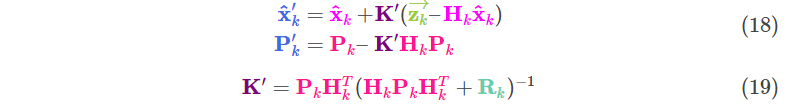

至此，我们得到了每个状态的更新步骤 $\hat x_k'$是我们最佳的预测值，我们可以持续迭代（独立于$P_k'$ ）。

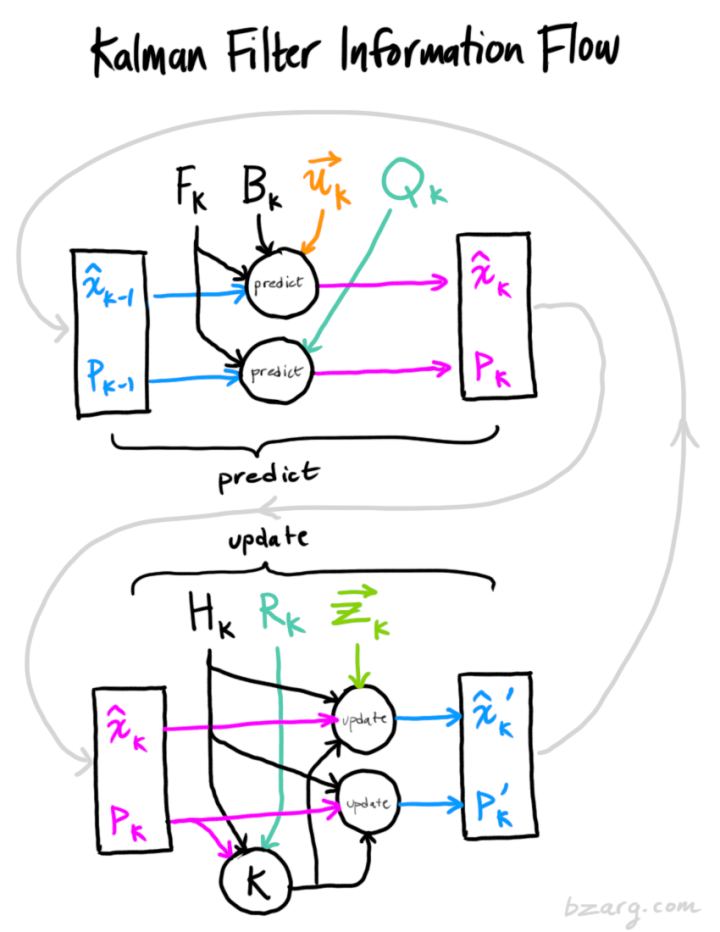

#### 总结

以上所有公式，仅需要实现（7）（18）（19）

这使你可以对任何线性系统建模。对于非线性系统，可以使用扩展卡尔曼滤波，只是对观测值和预测值的平均值进行简单线性化。（我可能会对非线性卡尔曼再写一篇博客）

如果我可以利用卡尔曼解决我的问题，那么希望读者也可以认识到这有多酷，并且在某个新的领域将它实用。

更多参考资料可以去看[http://www.cl.cam.ac.uk/~rmf25/papers/Understanding%20the%20Basis%20of%20the%20Kalman%20Filter.pdf](https://link.zhihu.com/?target=http%3A//www.cl.cam.ac.uk/~rmf25/papers/Understanding%20the%20Basis%20of%20the%20Kalman%20Filter.pdf) 这里采用了相似的方法介绍卡尔曼。这里进行了更深层的介绍，如果你有兴趣的话。