## 1.LOAM

LOAM需要匹配前后帧相同扫描线的内容,所以对雷达点云格式有要求,需要知道雷达点所在的线数

```
PointCoordinate64 HDData[PACKETNUM64*6][64];
```

```
// 64线雷达点，单位厘米
typedef struct
{
    short x;      //车体坐标系,
    short y;
    short z;
//    int angleH;   //角度，单位为0.01度
//    int angleV;
//    short realDistance; // 真实距离，单位厘米
    unsigned char Intensity;
}PointCoordinate64;
```

## 2.Gmapping-ROS

### 2.1 使用ros的slam功能包的3个条件

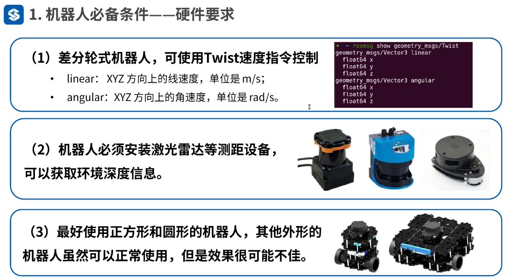

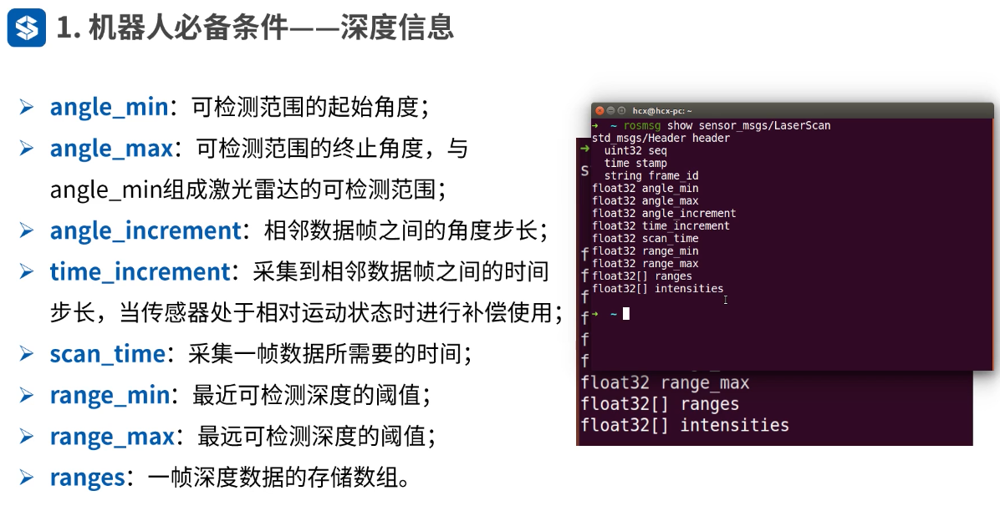

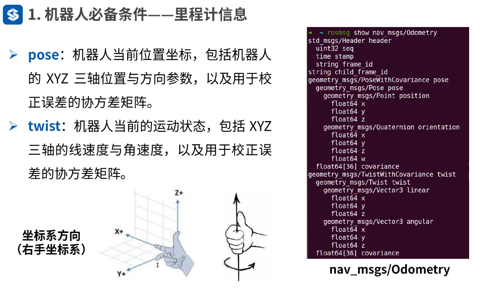

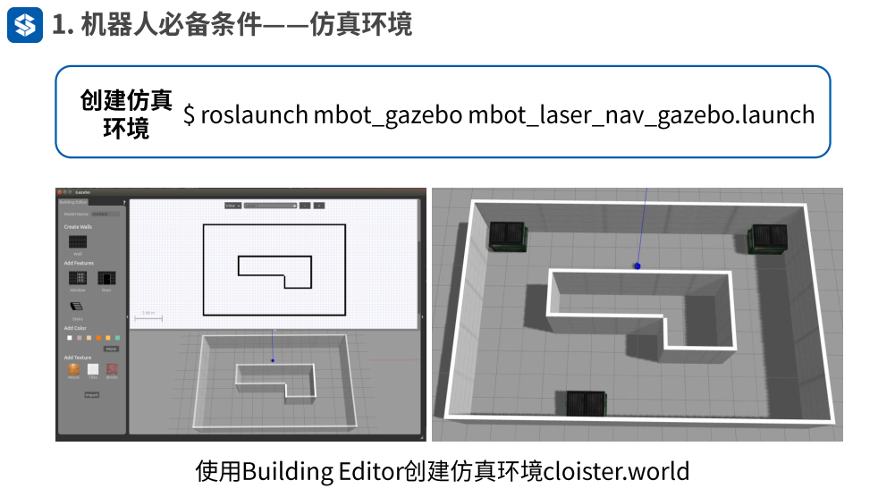

### 2.2 ROS SLAM功能包---gmapping

放在`/home/swc/tutorial_ws/src/mbot_navigation`，已编译

==**二维建图-定位**==

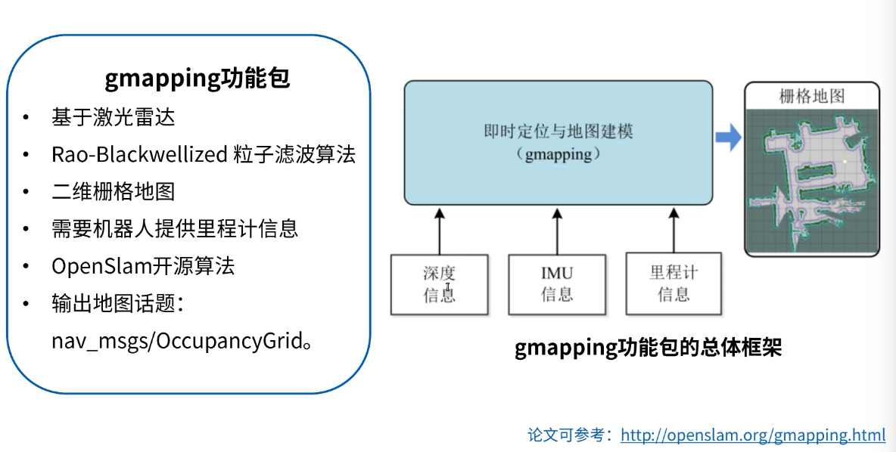

#### 2.2.1 输入输出

所需**输入信息**:

深度信息:必须

IMU:可选

里程计:必须      编码器,视觉里程计等  可以用激光雷达里程计吗?

**输出**:

二维栅格地图

#### 2.2.2 安装gmapping

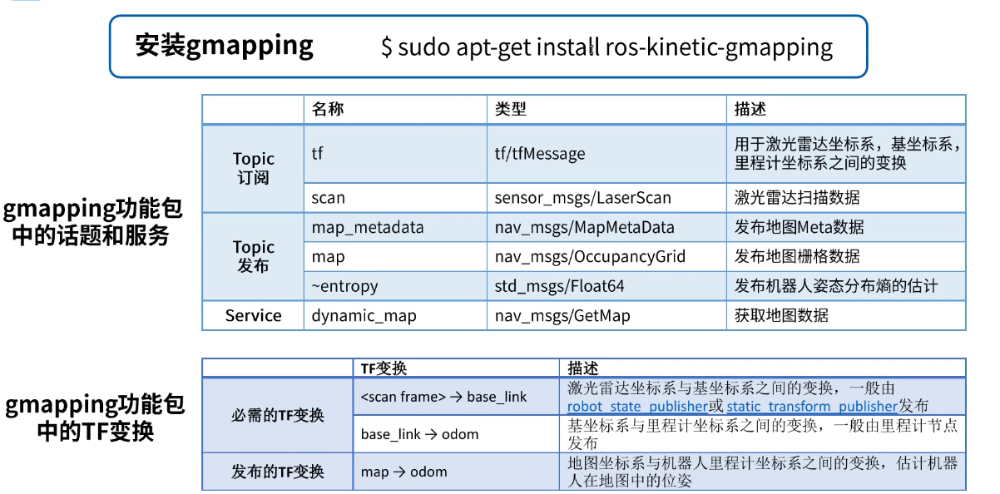


#### 2.2.3 占据栅格地图取值

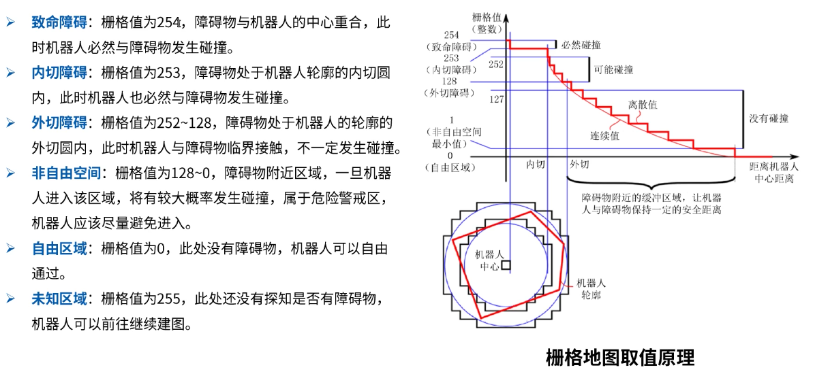

#### 2.2.4配置gmapping结点


### 3.AMCL

下面是博客复制的图片


## 3.Cartographer

### 3.0 安装

安装包和bag包都在移动硬盘study里面

系统环境：Ubuntu 16.04
ROS : Kinetic

首先安装wstool，rosdep 和 Ninja用于编译Cartographer ROS。

```
sudo apt-get update
sudo apt-get install -y python-wstool python-rosdep ninja-build
```

给Cartographer新建一个工作空间，这里命名为 catkin_google_ws

```
mkdir catkin_google_ws // 创建工作空间
cd catkin_google_ws //进入工作空间
wstool init src //初始化
wstool merge -t src https://raw.githubusercontent.com/googlecartographer/cartographer_ros/master/cartographer_ros.rosinstall //合并其他ros安装文件
```

修改ceres-solver的源地址（否则需要翻墙才能下载），其他两个不用修改。

```
gedit src/.rosinstall
```

将ceres-solver的地址改为

```
uri: https://github.com/ceres-solver/ceres-solver.git
```

修改完保存退出回到工作空间下。

```
wstool update -t src //更新工作空间
```

接下来安装protoc，如果之前安装过不同版本的protoc可以把以前的卸载了，重新安装

```
protoc --version//查看当前protoc版本
which protoc//查看protoc所在位置
sudo rm 上一步的路径
src/cartographer/scripts/install_proto3.sh //安装proto3
```

关于protoc的安装还可以看这篇博客https://blog.csdn.net/seeseeatre/article/details/84863485，protoc版本要安装正确。


**安装protobuf3**

```bash
# 首先安装protobuf
sudo apt-get install autoconf autogen
git clone https://github.com/protocolbuffers/protobuf.git
cd protobuf
git submodule update --init --recursive
./autogen.sh
./configure
make
# 这一步可能会报错，无视就好
make check
sudo make install
sudo ldconfig # refresh shared library cache.
123456789101112
```

这里可以通过来检查一下安装后protobuf的版本，目前是3.6.1

```bash
protoc --version
libprotoc 3.6.1
12
```

可以添加一个环境变量来确保链接到正确的prtobuf版本，不过不加似乎也没问题(o´ω`o)

```bash
which protoc
/usr/local/bin/protoc
export PROTOBUF_PROTOC_EXECUTABLE=/usr/local/bin/protoc
```

接下来

```
sudo rosdep init //如果之前安装过ROS，这里会报错，说已经存在了，这样的错误可以忽略。
rosdep update //更新依赖
rosdep install --from-paths src --ignore-src --rosdistro=${kinetic} -y //安装依赖
catkin_make_isolated --install --use-ninja //编译，安装。
```

编译成功，安装即完成。运行
`source ~/catkin_google_ws/devel_isolated/setup.bash`


`$roslaunch cartographer_ros demo_backpack_2d.launch bag_filename:=/home/swc/study/lidar_data/google/*.bag`

**lua配置文件:**

`/home/swc/google_ws/src/cartographer_ros/cartographer_ros/configuration_files/my_robot.lua`

**launch文件:**

/home/swc/google_ws/src/cartographer_ros/cartographer_ros/launch/demo_backpack_2d.launch

/home/swc/google_ws/src/cartographer_ros/cartographer_ros/launch/my_mapping.launch

**各种参数说明**

/home/swc/google_ws/src/cartographer_ros/docs/source/ros_api.rst

```rst
Required tf Transforms

**----------------------**

Transforms from all incoming sensor data frames to the :doc:`configured

<configuration>` **tracking_frame** and **published_frame** must be available.

Typically, these are published periodically by a `robot_state_publisher` or a

`static_transform_publisher`.
```


```
transforms: 
  - 
    header: 
      seq: 0
      stamp: 
        secs: 1597367770
        nsecs:  41779871
      frame_id: "base_link"
    child_frame_id: "horizontal_laser_link"
    transform: 
      translation: 
        x: 0.1007
        y: 0.0
        z: 0.0558
      rotation: 
        x: 0.0
        y: 0.0
        z: 0.0
        w: 1.0
  - 
    header: 
      seq: 0
      stamp: 
        secs: 1597367770
        nsecs:  41789851
      frame_id: "base_link"
    child_frame_id: "imu_link"
    transform: 
      translation: 
        x: 0.0
        y: 0.0
        z: 0.0
      rotation: 
        x: 0.0
        y: 0.0
        z: 0.0
        w: 1.0
  - 
    header: 
      seq: 0
      stamp: 
        secs: 1597367770
        nsecs:  41790476
      frame_id: "base_link"
    child_frame_id: "vertical_laser_link"
    transform: 
      translation: 
        x: 0.1007
        y: 0.0
        z: 0.1814
      rotation: 
        x: 0.707106665647
        y: 1.22474483074e-07
        z: 0.707106896726
        w: -1.22474523098e-07

```


建图可以不需要IMU,在lua文件中修改配置;

urdf定义tf变换,实际中怎么给==>也是使用机器人模型,静态发布

**使用步骤**

### 3.1 机器人模型(仿真的时候需要)

路径:`/home/swc/google_ws/src/cartographer_ros/cartographer_ros/urdf`


​	

link的name要和传感器数据的frame_id一致

### 3.2 修改配置文件

路径:`/home/swc/google_ws/src/cartographer_ros/cartographer_ros/configuration_files`

主要是配置**传感器**数据

```lua
---my_robot.lua
include "map_builder.lua"
include "trajectory_builder.lua"

options = {
  map_builder = MAP_BUILDER,
  trajectory_builder = TRAJECTORY_BUILDER,
  map_frame = "map",
  tracking_frame = "lidar_mid",  --lidar_mid  laser_scan   雷达的frame_id 也可以是imu
  published_frame = "lidar_mid",  --lidar_mid  laser_scan   for publishing poses 
  odom_frame = "odom",			 -- Only used if *provide_odom_frame* is true.
  provide_odom_frame = false,
  publish_frame_projected_to_2d = false,
  use_odometry = false,			-- If enabled, subscribes to `nav_msgs/Odometry`_ on the topic "odom"
  use_nav_sat = false,
  use_landmarks = false,
  num_laser_scans = 1,		--2d设为1
  num_multi_echo_laser_scans = 0,
  num_subdivisions_per_laser_scan = 1,
  num_point_clouds = 0,		--3d设为1
  lookup_transform_timeout_sec = 0.2,
  submap_publish_period_sec = 0.3,
  pose_publish_period_sec = 5e-3,
  trajectory_publish_period_sec = 30e-3,
  rangefinder_sampling_ratio = 1.,
  odometry_sampling_ratio = 1.,
  fixed_frame_pose_sampling_ratio = 1.,
  imu_sampling_ratio = 1.,
  landmarks_sampling_ratio = 1.,
}

MAP_BUILDER.use_trajectory_builder_2d = true
TRAJECTORY_BUILDER_2D.num_accumulated_range_data = 1

return options
```

### 3.3 修改launch文件

路径:`/home/swc/google_ws/src/cartographer_ros/cartographer_ros/launch`

2D建图使用`demo_backpack_2d.launch`,里面include了一个核心launch文件`backpack_2d.launch`

#### 3.3.1 `backpack_2d.launch`

```xml
<launch>
  <!-- 机器人描述文件 -->
  <param name="robot_description"
    textfile="$(find cartographer_ros)/urdf/backpack_2d.urdf" />
 
    <!-- 发布tf -->
  <node name="robot_state_publisher" pkg="robot_state_publisher"
    type="robot_state_publisher" />

  <node name="cartographer_node" pkg="cartographer_ros"
      type="cartographer_node" args="
          -configuration_directory $(find cartographer_ros)/configuration_files
          -configuration_basename backpack_2d.lua"    # 配置文件
      output="screen">
     <!-- 话题映射 <remap from="scans" to="scan" /> -->
    <remap from="echoes" to="horizontal_laser_2d" />
  </node>

  <!-- 地图分辨率-->
  <node name="cartographer_occupancy_grid_node" pkg="cartographer_ros"
      type="cartographer_occupancy_grid_node" args="-resolution 0.05" />
</launch>
```

#### 3.3.2 `demo_backpack_2d.launch`

```xml
<launch>
   <!-- 仿真的时候true-->
  <param name="/use_sim_time" value="true" />

  <!-- <include file="$(find cartographer_ros)/launch/backpack_2d.launch" /> -->

  <include file="$(find cartographer_ros)/launch/my_mapping.launch" />

  <node name="rviz" pkg="rviz" type="rviz" required="true"
      args="-d $(find cartographer_ros)/configuration_files/demo_2d.rviz" />

  <node name="playbag" pkg="rosbag" type="play" args="--clock $(arg bag_filename)" />
</launch>
```

### 3.4 实时发布自身位姿

[知乎链接](https://zhuanlan.zhihu.com/p/115105009)

#### 1.修改源码

1.在cartographer_ros/cartographer_ros/cartographer_ros/node.h添加::ros::Publisher _pose_pub

在类的私有变量中添加:

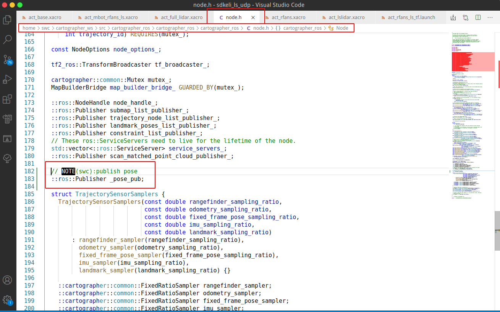

2.对node.cc进行修改：

可能需要包含的头文件:

```C++
#include <geometry_msgs/Pose2D.h>
#include "tf/tf.h"
```

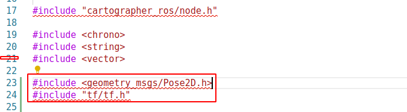

在函数:PublishTrajectoryStates中添加:

(有些版本函数名变了PublishLocalTrajectoryData())

```C++
  _pose_pub = node_handle_.advertise<geometry_msgs::Pose2D>("pose_from_cart", 10);
  geometry_msgs::Pose2D pos_now; 
```

```C++
geometry_msgs::Transform transform = ToGeometryMsgTransform(
            tracking_to_map * (*trajectory_state.published_to_tracking));
            
pos_now.x = static_cast<double>(transform.translation.x);
pos_now.y = static_cast<double>(transform.translation.y);
// printf("x:%f y:%f\n", pos_now.x, pos_now.y);
pos_now.theta = tf::getYaw(transform.rotation);
_pose_pub.publish(pos_now);
```

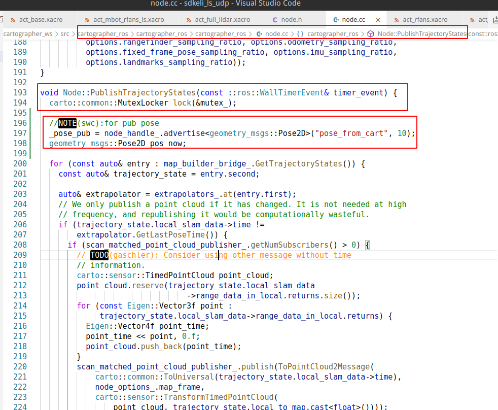

`=======================================================================================`

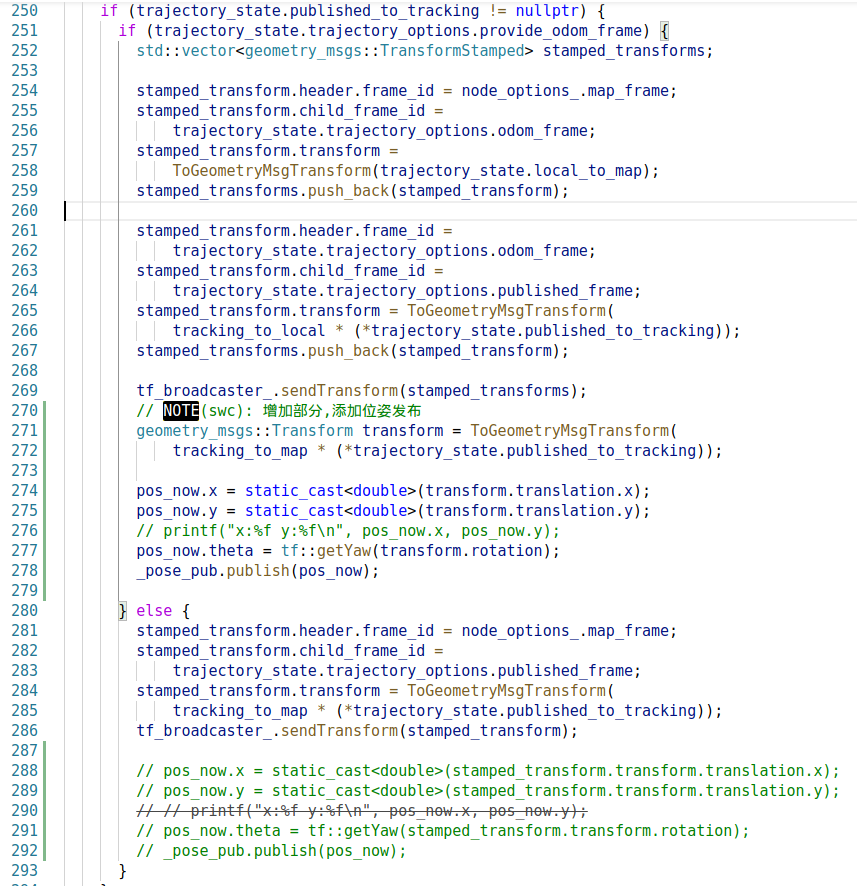

### 3.5 编译与运行

编译

`catkin_make_isolated --install --use-ninja`

运行:

`roslaunch cartographer_ros demo_backpack_2d.launch bag_filename:=/home/swc/study/lidar_data/google/*.bag`

保存地图:

+ 完成轨迹, 不接受进一步的数据。

```
rosservice call /finish_trajectory 0
```

+ 序列化保存其当前状态

```
rosservice call /write_state "{filename: '${HOME}/maps/back_front_10hz.pbstream'}"
```

+ 将pbstream转换为pgm和yaml

```
rosrun cartographer_ros cartographer_pbstream_to_ros_map -map_filestem=${HOME}/maps/back_front_10hz -pbstream_filename=${HOME}/maps/back_front_10hz.pbstream -resolution=0.05
```

### 3.6 官方建图+纯定位

**建图:**

roslaunch cartographer_ros demo_backpack_2d.launch bag_filename:=/home/swc/study/lidar_data/google/b2-2016-04-05-14-44-52.bag 

**map**:  carto_map.pbstream

**定位:**

```sh
roslaunch cartographer_ros demo_backpack_3d_localization.launch \
load_state_filename:=${HOME}/Downloads/b3-2016-04-05-13-54-42.bag.pbstream \
bag_filename:=${HOME}/Downloads/b3-2016-04-05-15-52-20.bag
```

获得定位的信息:

```C++
ros::NodeHandle nh;
ros::Publisher _pose_pub;
_pose_pub = nh.advertise<geometry_msgs::Pose2D>("pose_nav", 10);

tf::StampedTransform transform;
    tf::TransformListener listener;
    try
    {
        listener.waitForTransform("/map", "/base_link", ros::Time(0), ros::Duration(3.0));
        listener.lookupTransform("/map", "/base_link", ros::Time(0), transform);
    }
    catch (tf::TransformException &ex)
    {
        ROS_ERROR("%s", ex.what());
    }
    //输出位置信息
    pos_now.x = static_cast<double>(transform.getOrigin().x());
    pos_now.y = static_cast<double>(transform.getOrigin().y());
    pos_now.theta = tf::getYaw(transform.getRotation());
    _pose_pub.publish(pos_now);
```


### 3.7 细节问题

1. **Gazebo会发一个odom和cartographer的重复了,要重命名**

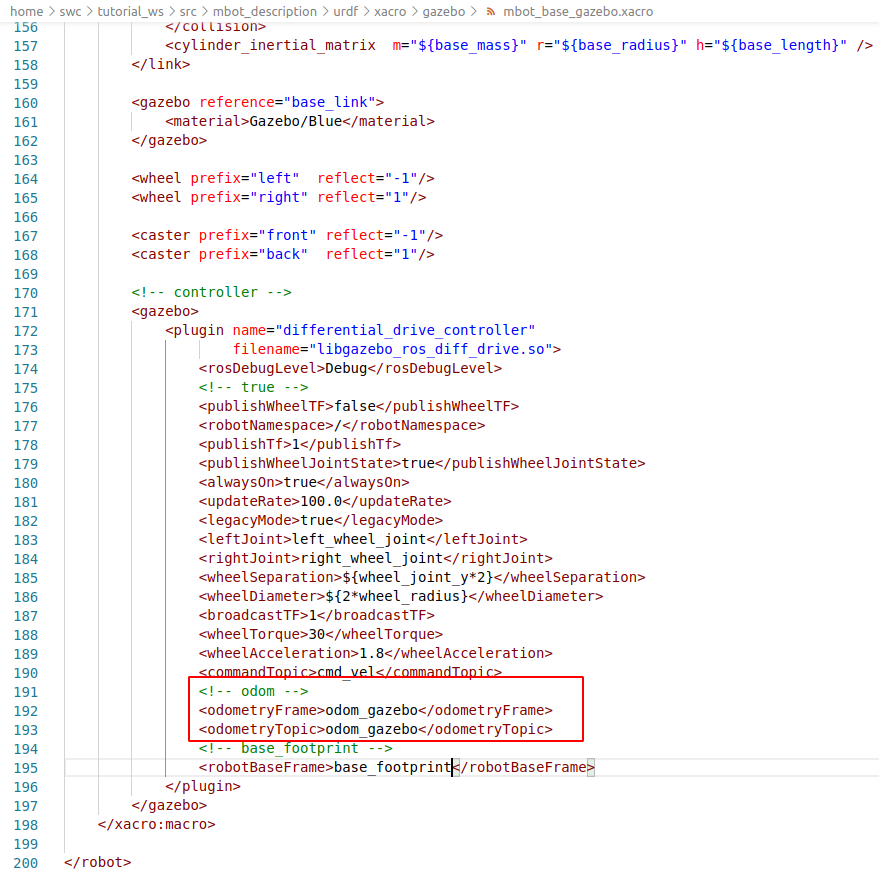

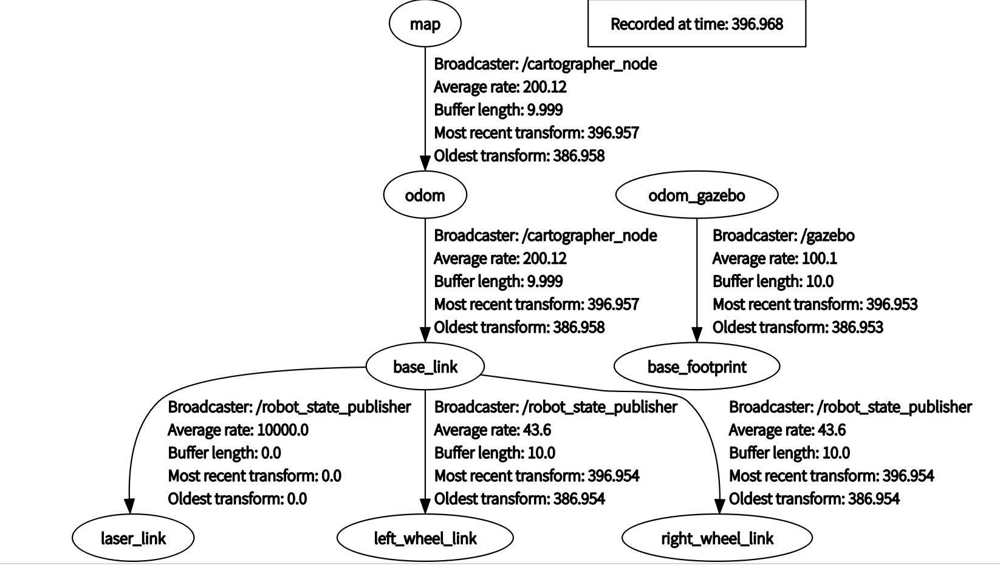

## 4.导航ros包---move_base

### 4.1move_base框架

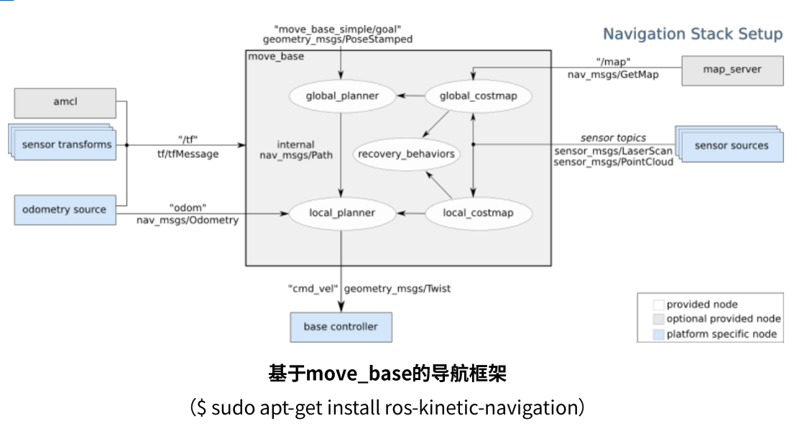

上图中：

+ 白色的部分：ros提供的move_base功能包，有全局路径规划和局部路径规划功能，输出速度信息

+ 灰色的部分：ros提供，可选
  + map_Server：地图服务器 
  + amcl：自适应蒙特卡洛定位，可以不用，只用里程计信息

+ 蓝色的部分 ：自己实现
  + 数据信息
  + tf变换
  + 里程计“odom”

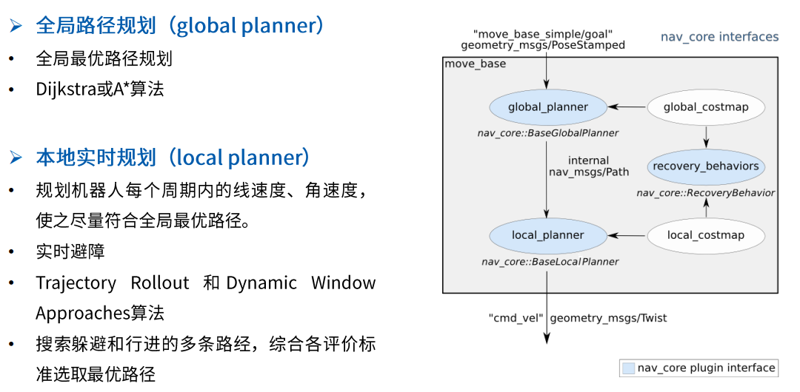

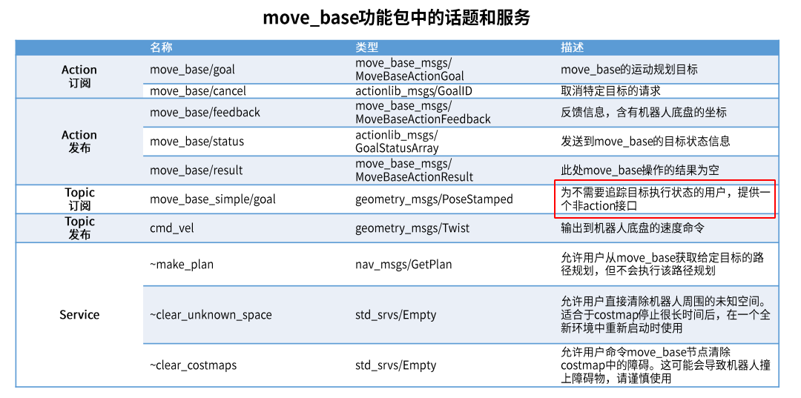

### 4.2 配置move_base节点

在move_base中有多种路径规划器算法可选，我们需要告诉move_base路径规划器使用哪种算法。一般来说，全局路径的规划插件包括：

+ navfn:ROS中比较旧的代码实现了dijkstra和A*全局规划算法。
+ global_planner:重新实现了Dijkstra和A*全局规划算法,可以看作navfn的改进版。
+ parrot_planner:一种简单的算法实现全局路径规划算法。

局部路径的规划插件包括：

+ base_local_planner:实现了Trajectory Rollout和DWA两种局部规划算法。
+ dwa_local_planner:实现了DWA局部规划算法，可以看作是base_local_planner的改进版本

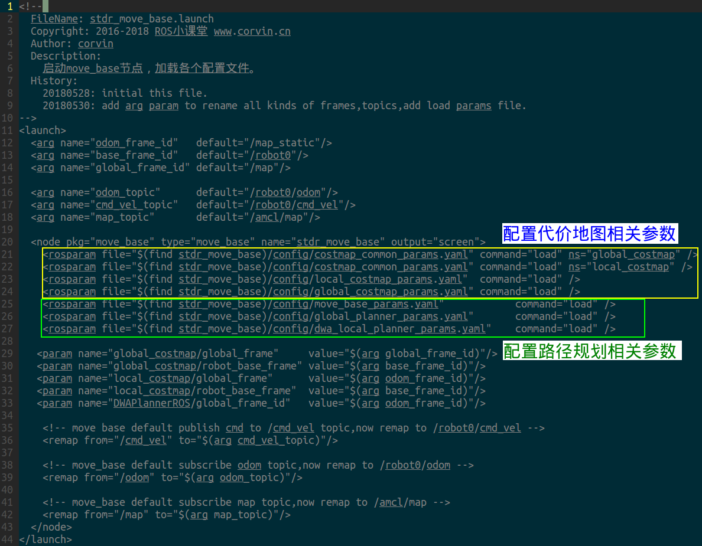

```xml
<!-- move_base.launch -->
<launch>
    
  <node pkg="move_base" type="move_base" respawn="false" name="move_base" output="screen" clear_params="true">
    <param name="footprint_padding" value="0.01" />
    <!-- 向底盘控制移动话题cmd_vel发送命令的频率. -->
    <param name="controller_frequency" value="10.0" />
    <!-- 在空间清理操作执行前,控制器花多长时间等有效控制下发. -->
    <param name="controller_patience" value="3.0" />
    <!-- 执行修复机制前,允许振荡的时长. -->
    <param name="oscillation_timeout" value="30.0" />
    <!-- 来回运动在多大距离以上不会被认为是振荡. -->
    <param name="oscillation_distance" value="0.5" />
    <!-- 配置文件 --> 
    <!-- 代价地图参数 -->
    <rosparam file="$(find mbot_navigation)/config/mbot/costmap_common_params.yaml" command="load" ns="global_costmap" />
    <rosparam file="$(find mbot_navigation)/config/mbot/costmap_common_params.yaml" command="load" ns="local_costmap" />
    <rosparam file="$(find mbot_navigation)/config/mbot/local_costmap_params.yaml" command="load" />
    <rosparam file="$(find mbot_navigation)/config/mbot/global_costmap_params.yaml" command="load" />
    <!-- 路径规划参数 -->
    <rosparam file="$(find mbot_navigation)/config/mbot/base_local_planner_params.yaml" command="load" />
  </node>
    
</launch>
```


```yaml
# costmap_common_params.yaml
obstacle_range: 2.5    # 障碍物范围
raytrace_range: 3.0    
footprint: [[0.175, 0.175], [0.175, -0.175], [-0.175, -0.175], [-0.175, 0.175]]  # 机器人尺寸
footprint_inflation: 0.01
robot_radius: 0.175		# 机器人半径
inflation_radius: 0.15	# 障碍区膨胀半径
max_obstacle_height: 0.6
min_obstacle_height: 0.0
observation_sources: scan
scan: {data_type: LaserScan, topic: /scan, marking: true, clearing: true, expected_update_rate: 0}
```

### 4.3 amcl

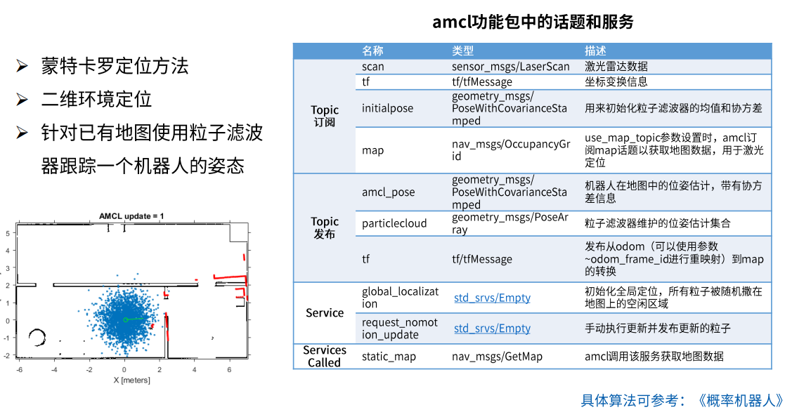

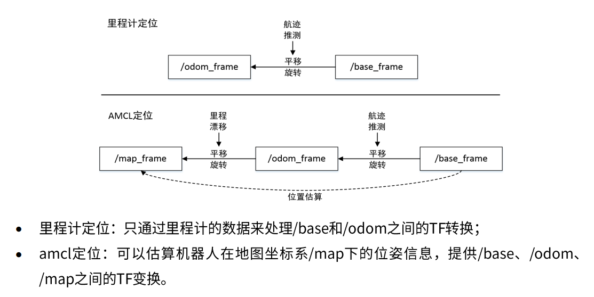

