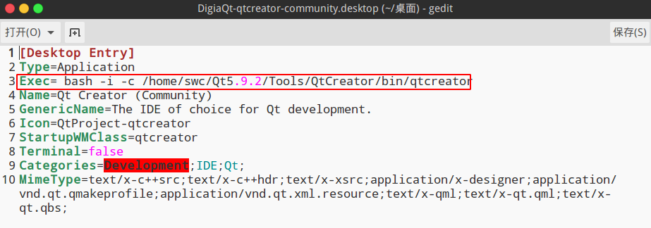
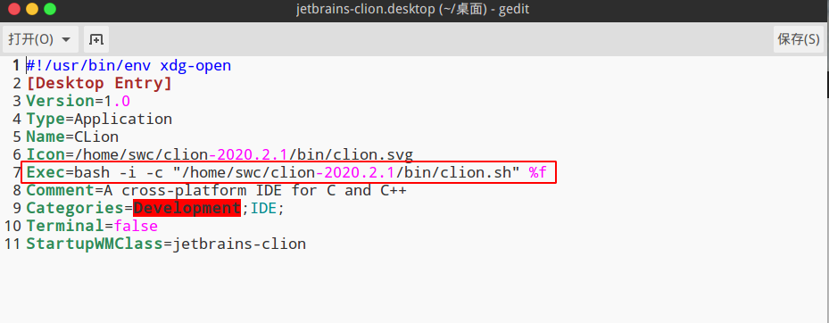
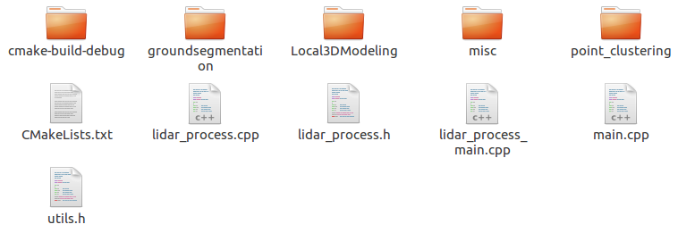

> 记录qmake和cmake的使用
>
> 主要是pro文件和cmakelists.txt文件的编写
>
> 只达到可以使用ros/pcl/eigen/opencv.....的地步
>
> 可以指定文件的生成目录

# 1.qmake



关于qmake，好一段时间令我一头雾水，不知道用来干嘛的，只知道怎么用，而且也只懂那么一两个命令，详细看过资料以后整理如下：

1.首先，感性的认识是，qmake可以利用源文件(包括头文件h，实现文件cpp，qt的ui文件等等)生成各种不同类型的工程，工程需要的Makefile文件，可执行的与不可执行的，这取决于所用的模板(包括app、lib、subdirs、vcapp、vclib)。

2.创建pro文件，添加各种源文件，还可以设定平台相关的不同源文件，设置各种规则，利用qmake命令生成工程。后面会介绍pro文件可以手工编写，也可以利用qmake命令智能的生成。

一般顺序是先创建.pro文件，然后由.pro文件生成Makefile文件，makefile文件保存了编译器和连接器的参数选项,还表述了所有源文件之间的关系(源代码文件需要的特定的包含文件,可执行文件要求包含的目标文件模 块及库等).创建程序(make程序)首先读取makefile文件,然后再激活编译器,汇编器,资源编译器和连接器以便产生最后的输出,最后输出并生成 的通常是可执行文件.创建程序利用内置的推理规则来激活编译器,以便通过对特定cpp文件的编译来产生特定的obj文件。

3.各种模板生成不同类型的工程，而每个模板可以用的qmake变量是不一样的：

app模板：编译一个可执行程序

选项　　　　　　　　描述

windows　　　　　程序是Window平台的界面程序

console　　　　　App模板专用: 程序是Window平台控制台程序

当你使用这个模板,以下的一些qmake变量是能用的,你可以在pro文件使用这些变量来配置你的应用程序需要的相关的信息

HEADERS –程序中需要编译的头文件列表.

SOURCES -程序中需要编译的源文件列表.

FORMS – 由Qt Designer为程序创建的ui文件列表(qte2是INTERFACES).

LEXSOURCES – 程序用到的所有的lex 源文件列表.

YACCSOURCES -程序用到的所有的yacc 源文件列表.

TARGET –可执行程序的名字.默认是跟工程文件名一样 (根据不同的平台后缀名会自动添加).

DESTDIR –可执行文件的发布目录.

DEFINES – 程序编译时候需要的预定义的列表INCLUDEPATH –程序需要的头文件的目录列表.

DEPENDPATH –程序搜索的依赖路径.

VPATH – 查找supplied 文件的搜索路径(我还没有弄懂~_~).

DEF_FILE – Windows 平台专用: 程序需要用到的.def .

RC_FILE – Windows 平台专用: 程序的资源文件.

RES_FILE – Windows 平台专用: 程序需要连接的资源文件.

lib模板库：

lib模板告诉qmake生成的Makefile是将要编译一个库,使用这个模板的时候,另外的系统变量会加到上面app模板提到的变量,因为app模板是支持VERSION 变量,你应该在pro文件使用这些来制定一些库的库的信息
使用这个模板的时候,下面的选项可以添加到 CONFIG 变量里面来决定编译成何种库
选项　　　　　　　　描述

dll　　　　　　　　编译成动态库 (dll or so).

staticlib　　　　　　编译成静态库.

plugin　　　　　　编译成插件库,本选项意味着dll也设置了.

VERSION – 目标库的版本号,如 2.3.1

编译成一个插件
插件的编译是使用lib模板,正如上面所描述的那样,这告诉 qmake生成的Makefile是将要编译成为每个平台都适当的形式的插件.通常是库的形式,跟普通的库一样VERSION 变量是用来指定一些有关插件的信息
VERSION – 目标库的版本号,如 2.3.1

声明Qt库模块

如果CONFIG变量包含了qt这个值,表明qmake支持了qt的程序，但是还需要调整一些你程序中使用的qt 的模块.这是使用QT变量,就能达到这个目的。QT是用来声明使用到的一些额外的模块.例如.通过下面的方法,我们使得XML和网络模块有效

CONFIG += qt

QT += network xml

注意,默认情况下 QT 包含了 core 和 gui模块了所以上面的声明是添加了XML和网络模块到默认的列表里面.下面的语句就是忽略了默认模块,当编译程序源代码时候会导致出错

QT = network xml # This will omit the core and gui modules.

如果你想编译一个不需要gui模块的工程,你需要用”-=”操作符号来去除包含,默认情况下,QT同时包含了core和gui两个模块,所以下面的语句就是小型的Qt工程会被编译

QT -= gui # Only the core module is used.

下面的表格显示了QT变量可以使用的选项,并解释了相应的特点

core (included by default) QtCore module 核心模块

gui (included by default) QtGui module 界面模块

network QtNetwork module 支持网络模块

opengl QtOpenGL module 支持opengl图像编程

sql QtSql module 支持sql数据库驱动

svg QtSvg module 支持svg矢量图形

xml QtXml module 支持xml模块

qt3support Qt3Support module 支持qt3类

要注意的是,添加opengl到QT变量里面 ,等价于往CONFIG变量里面添加,所以对qt应用程序,没有必要同时往QT变量和CONFIG变量里面添加opengl选项

声明Qt库模块

qmake可以通过专门的prf文件设置另外的配置特性.这些特性通常提供给编译时候的自定义的工具使用.为了在处理过程添加一个特性,往CONFIG变量里面添加一个特性名字,该名字跟特性的文件名相同(mkspecs\features目录里面)

例如 qmake可以在编译过程利用pkg-config 提供支持的额外的库,例如D-Bus库 和 ogg库,用下面的方法

CONFIG += link_pkgconfig

PKGCONFIG += ogg dbus-1 
声明其他的库

如果你需要在工程中使用其他的库,你需要在工程文件里面指定，让qmake找到库的路径和相应需要连接的库,可以在LIBS变量里面添加.库的路径要给出,或者常见的unix样式的符号来指定库和库的路径，例如下面的展示了如何使用指定的库

LIBS += -L/usr/local/lib -lmath

可以用类似的方法来指定头文件的路径,不过是使用INCLUDEPATH变量,如下面可能添加好几个头文件的路径

INCLUDEPATH = c:/msdev/include d:/stl/include

不过我的习惯是下面这样的,比较清晰还有,最好windows的路径不要有空格,中文也不要有,斜杠也推荐用/ 而不是windows的\ 因为跟分行符号\相同了 /可以在unix和windows用,但是\貌似到了unix或linux就不行了,所以用/ 是通用的

INCLUDEPATH = c:/msdev/include \

d:/stl/include

选项

在命令行里面,为qmake指定一些选项是为了自定义编译的过程。并覆盖平台的为qmake做的默认设置,下面的基本的选项提供了用法信息,指定qmake写到输出文件的那里,控制调试信息的等级在控制台打印出来。

·help 列出qmake帮助信息

·o file 直接输出到文件file。如果这个选项没有指定, qmake将会尝试使用合适的文件名作为输出,这依赖于当前的运行模式。如果指定了‘-’, 输出将会直接在控制台打印出来。

·d 列出qmake的调试信息 由于工程需要在每个目标平台上进行不同的编译,并有很多子目录, 你可以在运行qmake的时候使用下面的选项来设置相应的指定平台的变量。

·unix qmake运行在unix模式。在这个模式下,将会使用unix风格的文件命名规则和路径转换 , 另外的测试unix域是成功的。这是unix平台的默认模式。

·macx qmake运行在Mac OS X模式。在这个模式下,将会使用unix风格的文件命名规则和路径转换 , 另外的测试macx域是成功的。这是Mac OS X平台的默认模式。

·win32 qmake运行在win32模式。在这个模式下,将会使用Windows风格的文件命名规则和路径转换 , 另外的测试win32域是成功的。这是Windows平台的默认模式。 工程的模板通常在pro文件的TEMPLATE 变量里面指定。我们可以使用下面的选项来重写或者覆盖:

·t tmpl qmake将会用tmpl来重写TEMPLATE变量的任何设置, 但只在pro文件被处理之后。

·tp prefix qmake将添加prefix到TEMPLATE变量里面。 调整警告信息的级别能够帮助你找到pro文件的问题所在:

·Wall qmake将会报告所有知道的警告信息。

·Wnone qmake不产生任何警告信息。

·Wparserqmake只产生词法分析的警告。在解析你的pro文件的时候会警告你一些普通的缺陷和潜在问题。

·Wlogic qmake警告你在pro文件存在一些普通

Makefile 模式选项

qmake -makefile [options] files

在 Makefile 模式, qmake将会生成用于编译工程的Makefile文件,另外下面的选项可能在本模式下使用,以影响工程文件的生成方式:

·after qmake将会在指定的文件后面处理一些命令行给出的任务

·nocache qmake将忽略。qmake.cache 文件。

·nodepend qmake将不产生任何依赖信息。

·cache file qmake将使用指定的缓冲文件file而忽略其他找到的.qmake.cache 文件。

·spec spec qmake将会使用spec作为平台的路径和编译器信息, 环境变量 QMAKESPEC 设置的值将会被忽略。

你也可以在命令行传递qmake参数;他们将会在所有的指定的文件之前处理:

qmake -makefile -unix -o Makefile “CONFIG+=test” test.pro

上面的意思就是,在unix模式下,使用test.pro加入test选项生成Makefile,但是一些指定的选项当他们是默认的情况是没有必要的添加的,因此,如果在unix上就是下面的

qmake “CONFIG+=test” test.pro

如果你确定你自己想在指定的文件后面处理一些变量,你可以传递-after选项。当这个被指定时,命令行所有的任务在–after选项之后会被延迟,直到指定的文件传进来了。

Project 模式选项

Project Mode Options

qmake -project [options] files

在工程模式,qmake将会生成pro文件。另外,你可以在本模式下添加下面的选项:

·r qmake将会遍历目录

·nopwd qmake将会不理会你当前工作目录的源代码文件而去使用指定的文件在这个模式.files变量可以是文件或者目录的列表 如果指定一个目录,将会包含进DEPENDPATH变量里面 目录里面相关的代码会被包含进生成的工程文件里面。 如果给的是文件, 将会添加到正确的变量, 这主要依赖于他们的扩展名(后缀名); 例如, .ui 文件会被添加到 FORMS(qt2是INTERFACES吧),

.cpp 文件会被添加到 SOURCES。在这个模式下。你也可以传递任务到命令行里面, 当这样做的时候,这些任务将会放到生成pro文件之后。

一般先用project模式生成.pro文件，然后再将.pro文件qmake一次生成Makefile。

http://www.cnblogs.com/elect-fans/archive/2012/03/24/2415557.html

分类: Qt-qmake


模板:

```sh
TEMPLATE = app
CONFIG += console
CONFIG -= app_bundle
CONFIG -= qt
# 指定可执行文件的发布目录
DESTDIR += ../bin/

# 指定中间文件的生成路径
CONFIG(debug, debug|release) {
    OBJECTS_DIR = ./tmp_Debug
}
CONFIG(release, debug|release) {
    OBJECTS_DIR = ./tmp_Release
}

SOURCES += main.cpp \
    data_process.cpp \
    groundsegmentation/GaussianProcess.cpp \
    world_model/FH_commen_definition.cpp \
    groundsegmentation/FH_kdtree.cpp \
    groundsegmentation/global.cpp \
    groundsegmentation/groundSegmentation.cc\
    lidarSegmentation/objectClustering.cpp \
    lidar_feature/FH_lidar_feature_estimation_interface.cpp \
    lidar_feature/FH_rops.cpp \
    lidar_feature/segment_c.cpp \
    lidar_classifier/lidar_classifier_c.cpp \
    misc/matrix.cpp \
    pedestrian_sliding.cpp

HEADERS += \
    data_process.h \
    groundsegmentation/GaussianProcess.h \
    groundsegmentation/groundSegmentationmoban.hh \
    world_model/FH_commen_definition.h \
    groundsegmentation/FH_kdtree.h \
    groundsegmentation/CommenDef.h \
    groundsegmentation/global.h \
    lidarSegmentation/objectClustering.h \
    lidar_feature/FH_lidar_feature_estimation_interface.h \
    lidar_feature/FH_rops.h \
    lidar_feature/segment_c.h \
    lidar_classifier/lidar_classifier_c.h \
    misc/matrix.h \
    pedestrian_sliding.h

# 第三方头文件
INCLUDEPATH +=\
/usr/local/include/eigen3\
#../../message\
/usr/include/pcl-1.7\
/usr/include/vtk-6.2\
/opt/ros/kinetic/include\
/home/swc/catkin_ws/devel/include/

# 第三方动态库*.so文件
# -L  后面跟目录
# -l 后面跟具体的so文件
LIBS += \
    -L/usr/local/lib \    
    -lopencv_core -lopencv_highgui -lopencv_imgproc -lopencv_video -lopencv_videoio\
    -lpcl_common -lpcl_visualization -lpcl_features\
    -lboost_system -lvtkCommonCore-6.2 -lvtkFiltersCore-6.2 -lvtkRenderingCore-6.2 -lvtkCommonDataModel-6.2\
    -lvtkCommonMath-6.2\
    -L/opt/ros/kinetic/lib \
    -lroscpp -lrospack -lpthread -lrosconsole -lrosconsole_log4cxx\
    -lrosconsole_backend_interface -lxmlrpcpp -lroscpp_serialization -lrostime  -lcpp_common  -lroslib -lroslib
```

# 2.cmake



```cmake
cmake_minimum_required(VERSION 3.5)
project(many_threads_1)

set(CMAKE_CXX_STANDARD 14)

# 生成可执行文件路径 相对与build文件夹的路径
# 代码中使用的相对路径都是相对于这个
SET(EXECUTABLE_OUTPUT_PATH ../../build)

# 设置头文件路径
set(INC_DIR /opt/ros/kinetic/include)
# 设置链接库路径
set(LINK_DIR /opt/ros/kinetic/lib)

# 务必LINK_DIRECTORIES 要放在ADD_EXECUTABLE() or ADD_LIBRARY()前面。
# 引入头文件
include_directories(${INC_DIR})
# 引入库文件
link_directories(${LINK_DIR})

# 可执行文件
add_executable(many_threads_1
        main.cpp
        class_dir/second.cpp
        class_dir/second.h
        )

# ‘pthread_create’未定义的引用
# 由于pthread库不是Linux系统默认的库
# 在CMakeLists.txt加上两行：
find_package(Threads)

# 将第三方库连接在一起
target_link_libraries(
        many_threads_1
        ${CMAKE_THREAD_LIBS_INIT}
        librosconsole.so
)
```

```cmake
cmake_minimum_required(VERSION 3.17)
project(lidar_cmake)

set(CMAKE_CXX_STANDARD 14)

# 设置头文件路径
set(INC_DIR_LIST
        /opt/ros/kinetic/include
        /usr/local/include/eigen3
        /usr/include/pcl-1.7
        /usr/include/vtk-6.2
        /opt/ros/kinetic/include
        /home/swc/catkin_new/devel/include
        )
# 设置链接库路径
set(LINK_DIR_LIST
        /opt/ros/kinetic/lib
        /usr/local/lib
        # 这个好像默认就有
        /usr/lib/x86_64-linux-gnu
        )

set(SRC_LIST
        main.cpp
        lidar_process.cpp
        point_clustering/fh_rbnnobjectclustering.cpp
        Local3DModeling/GridCompressor.cpp
        groundsegmentation/GaussianProcess.cpp
        groundsegmentation/GroundSegmentation.cc
        misc/matrix.cpp
        misc/FH_commen_definition.cpp
        groundsegmentation/fh_kdtree.cpp
        lidar_process.h
        point_clustering/fh_rbnnobjectclustering.h
        Local3DModeling/GridCompressor.h
        groundsegmentation/CommenDef.h
        groundsegmentation/GaussianProcess.h
        groundsegmentation/GroundSegmentation.hh
        misc/matrix.h
        misc/FH_commen_definition.h
        groundsegmentation/CommonDefinitionX.hh
        groundsegmentation/fh_kdtree.h
        )

# 务必LINK_DIRECTORIES 要放在ADD_EXECUTABLE() or ADD_LIBRARY()前面。
# 引入头文件
include_directories(${INC_DIR_LIST})
# 引入库文件
link_directories(${LINK_DIR_LIST})

add_executable(lidar_cmake ${SRC_LIST})

target_link_libraries(
        lidar_cmake
        libopencv_core.so libopencv_highgui.so libopencv_imgproc.so libopencv_video.so libopencv_videoio.so
        libpcl_common.so libpcl_visualization.so libpcl_features.so libpcl_kdtree.so
        libboost_system.so libvtkCommonCore-6.2.so libvtkFiltersCore-6.2.so libvtkRenderingCore-6.2.so libvtkCommonDataModel-6.2.so
        libvtkCommonMath-6.2.so
        libroscpp.so librospack.so libpthread.so librosconsole.so librosconsole_log4cxx.so
        librosconsole_backend_interface.so libxmlrpcpp.so libroscpp_serialization.so librostime.so  libcpp_common.so  libroslib.so
)
```



用户需要使用的文件如果使用相对路径  `./parm/...  param`文件夹需要放到`cmake-build-debug`里面

+ [x] 要在命令行启动clion才可以检测到ros,已经修复,在desktop中添加一句话

  

