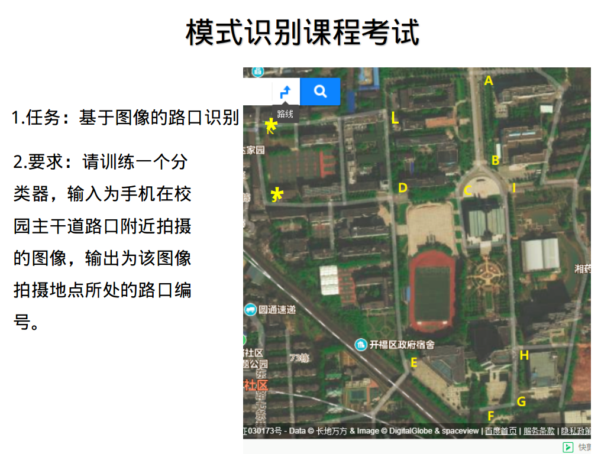
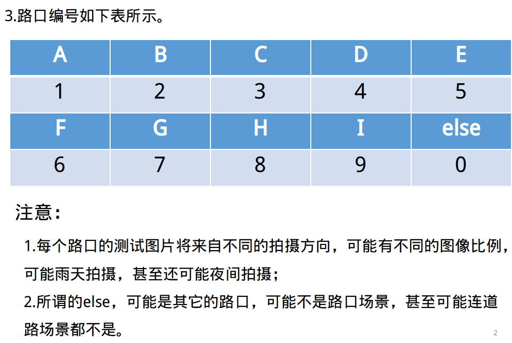
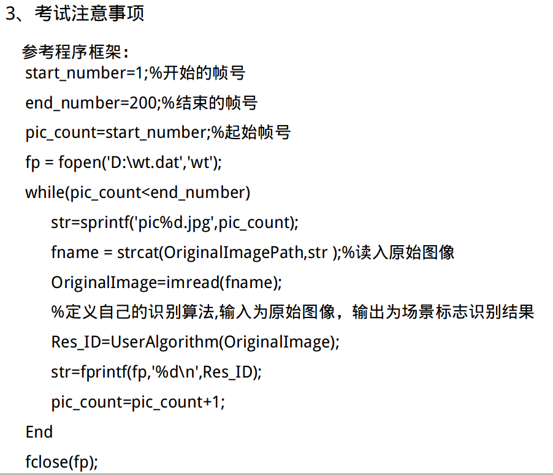
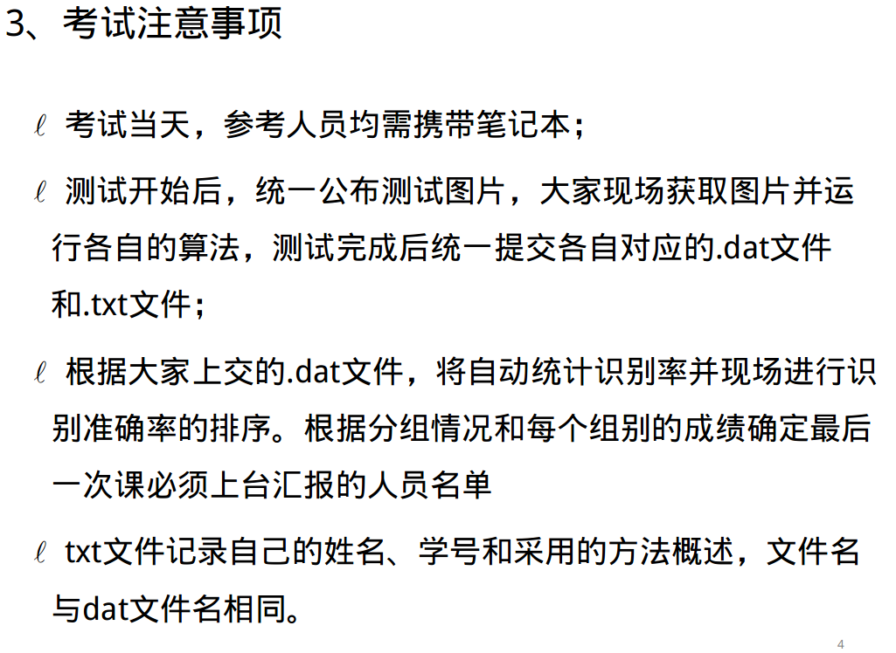
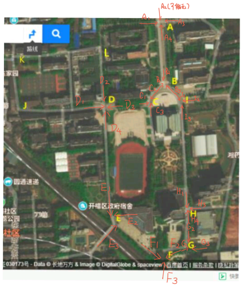
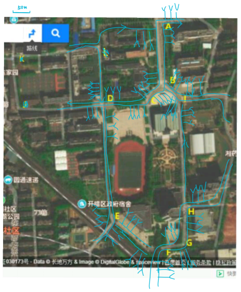
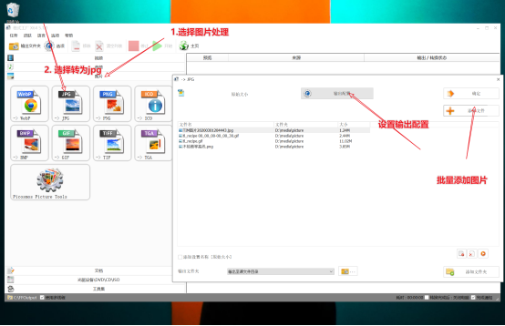
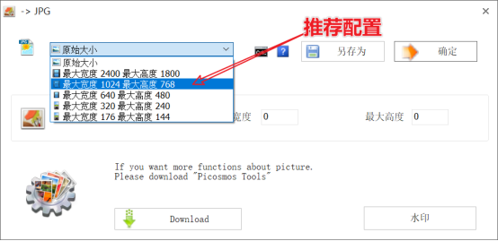

### 1 考试要求

### 2.数据采集

模式识别课程数据集共建共享公约v0. 2

1. 共同出力，共建共享;

2. 在群文件中按照文件夹名传入对应路口图片，如发现自己之前的图片有错误，可自主校正;

3. 校正别人的图像（可以有操作移动、删除）可能需要管理员权限，有意者可以联系我（智能王杰）。但是考虑到除了路口对应关系，拍照的角度方位等也没有明确标准，可能校对不好操作，还是靠各位同学上传时细心一点。

4. 图片是以路人视角拍摄;（老师说应用背景时图片导航）

5. 拍摄时最好距路口50m以内;（推荐10-50m内拍摄）

6. 因为要从路口的不同方向拍摄（老师的测试集是这样），

7. 为了后期方便检验路口各方向是否都有，推荐按照下图的编号命名照片，并附加自己的姓名（如D1#张三（1））。后面的编号“（1）”可以自动生成（在win10里选中所有要命名为D1#张三的照片，右键-“重命名”-键入“D1#张三”，对重复的文件就可以自动编号了。

8. 图片规格推荐480x640，也可其他分辨率;

9. 图片推荐既有横拍，也有竖拍;

10. 最终希望有不同时段的照片(白天，夜晚);（老师说夜晚的图片不是那种黑到人都分不清，可能会选取103门口的路口那种夜晚也能一眼分辨出的路口）

图片不要出现包括j人与j车在内的不适合出现的物体标志;

**推荐拍摄工作流**

1. 按照日常需求（去往返教研室与宿舍、图书馆与宿舍、博餐与宿舍、教研室与博餐，图书馆与博餐等），按行进方向，在接近需要拍摄的路口的50m内在不同远近拍摄路口的照片。

推荐的批处理工具：**格式工厂**

**==swc:==**

拍9段视频,逐帧抽出图片并命名,有C++的代码,在老电脑上面

### 3.解决思路

区分路口是一个多分类问题,难点是==else==如何判断

1. 特征提取应该使用卷积神经网络来提取,时间充足,可以用传统特征试一试

   空洞卷积?

2. 分类器的选择,直接深度学习多分类?考虑决策树有else?或者基于==决策树==的各种集成算法?==高维数据聚类?==

3. ==思路：==

   1. 使用**异常检测**领域的相关技术手段，比如 `oneclasssvm，iforest，auto encoder`等等，把训练集中没有的类别数据当作异常，使用异常检测的方法对其进行检测。
   2. 使用**聚类**的方法，对训练集中数据进行聚类操作，每个类别的数据聚在一起，设定相关的阈值，如果新的样本距每个类别的中心距离都超过了阈值，则认为该样本是其他类别。
   3. 对网络最后全连接层输出的n*9向量进行`softmax`, 如果最大概率仍然小于阈值,

先单分类 ---> 0 :else

​				---> 1:再多分类

test: 10*20

1.有遮挡

2.`640*480 / 480*640`

