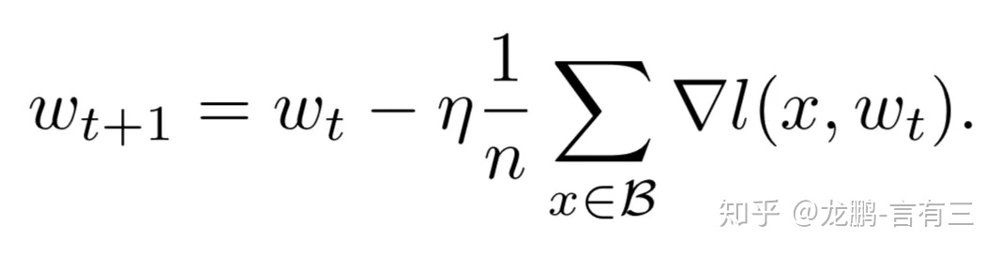
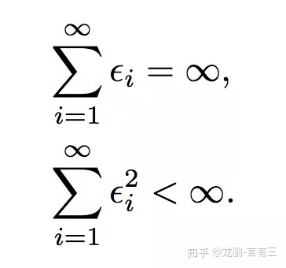
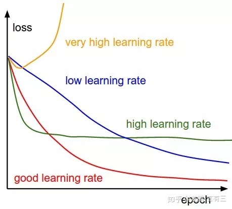
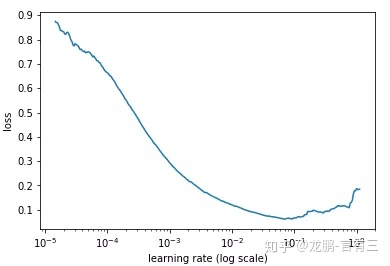
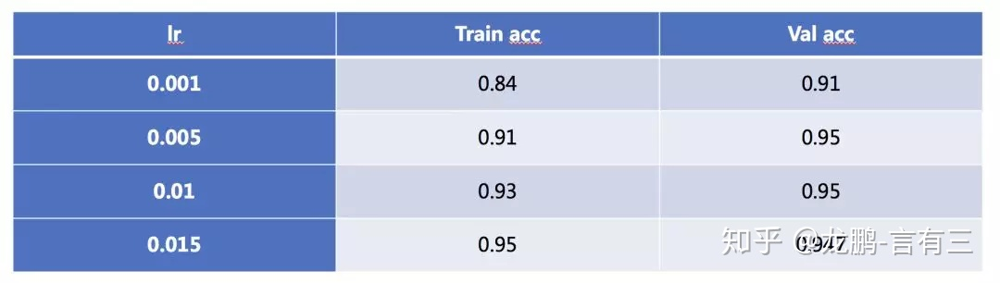
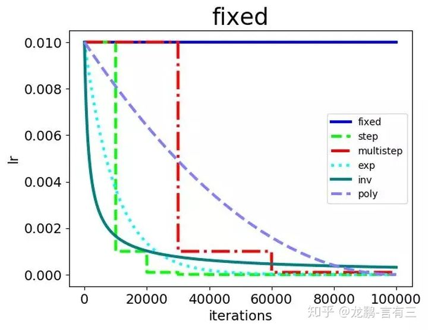
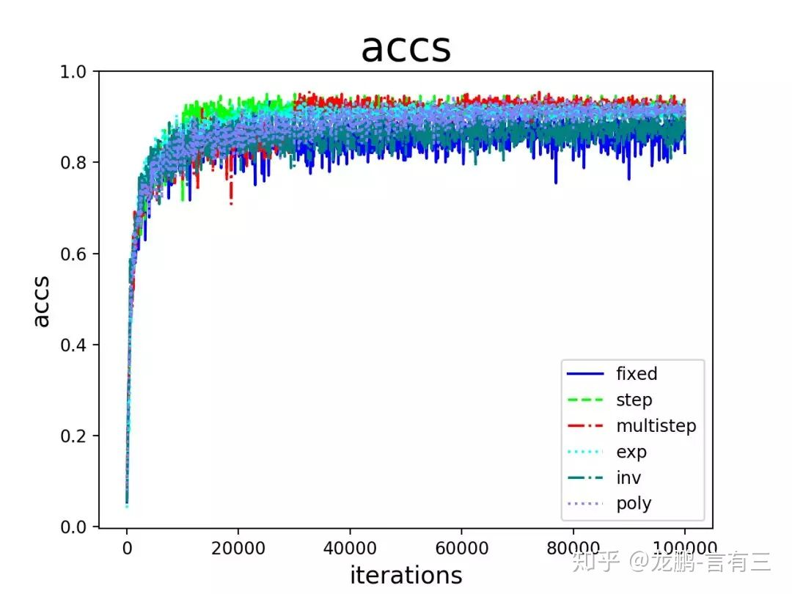

## 1.学习率和batchsize如何影响模型的性能？

https://zhuanlan.zhihu.com/p/64864995

### 1.为什么说学习率和batchsize 

目前深度学习模型多采用批量随机梯度下降算法进行优化，随机梯度下降算法的原理如下，

n是批量大小(batchsize)，η是学习率(learning rate)。可知道除了梯度本身，**这两个因子直接决定了模型的权重更新**，从优化本身来看它们是影响模型性能收敛最重要的参数。

**学习率直接影响模型的收敛状态，batchsize则影响模型的泛化性能**，两者又是分子分母的直接关系，相互也可影响，因此这一次来详述它们对模型性能的影响。

### **2 学习率如何影响模型性能？**

通常我们都需要合适的学习率才能进行学习，要达到一个强的凸函数的最小值，学习率的调整应该满足下面的条件，i代表第i次更新。

第一个式子决定了不管初始状态离最优状态多远，总是可以收敛。第二个式子约束了学习率随着训练进行有效地降低，保证收敛稳定性，各种自适应学习率算法本质上就是不断在调整各个时刻的学习率。

学习率决定了权重迭代的步长，因此是一个非常敏感的参数，它对模型性能的影响体现在两个方面，**第一个是初始学习率的大小，第二个是学习率的变换方案。**

**2.1、初始学习率大小对模型性能的影响**

初始的学习率肯定是有一个最优值的，过大则导致模型不收敛，过小则导致模型收敛特别慢或者无法学习，下图展示了不同大小的学习率下模型收敛情况的可能性，图来自于cs231n。

那么在不考虑具体的优化方法的差异的情况下，怎样确定最佳的初始学习率呢？

通常可以采用最简单的搜索法，即从小到大开始训练模型，然后记录损失的变化，通常会记录到这样的曲线。

随着学习率的增加，损失会慢慢变小，而后增加，而最佳的学习率就可以从其中损失最小的区域选择。

有经验的工程人员常常根据自己的经验进行选择，比如0.1，0.01等。

随着学习率的增加，模型也可能会从欠拟合过度到过拟合状态，在大型数据集上的表现尤其明显，笔者之前在Place365上使用DPN92层的模型进行过实验。随着学习率的增强，模型的训练精度增加，直到超过验证集。

**2.2、学习率变换策略对模型性能的影响**

学习率在模型的训练过程中很少有不变的，通常会有两种方式对学习率进行更改，一种是**预设规则学习率变化法**，一种是**自适应学习率变换方法**。

**2.2.1 预设规则学习率变化法**

常见的策略包括fixed，step，exp，inv，multistep，poly，sigmoid等，集中展示如下：

笔者之前做过一个实验来观察在SGD算法下，各种学习率变更策略对模型性能的影响，具体的结果如下：

从结果来看：

+ step，multistep方法的收敛效果最好，这也是我们平常用它们最多的原因。虽然学习率的变化是最离散的，但是并不影响模型收敛到比较好的结果。
+ 其次是exp，poly。它们能取得与step，multistep相当的结果，也是因为学习率以比较好的速率下降，虽然变化更加平滑，但是结果也未必能胜过step和multistep方法，在这很多的研究中都得到过验证，离散的学习率变更策略不影响模型的学习。
+ inv和fixed的收敛结果最差。这是比较好解释的，因为fixed方法始终使用了较大的学习率，而inv方法的学习率下降过程太快。

从上面的结果可以看出，对于采用非自适应学习率变换的方法，学习率的绝对值对模型的性能有较大影响，研究者常使用step变化策略。

**2.2.2 自适应学习率变化法**

自适应学习率策略以Adagrad，Adam等为代表;

不考虑其他任何因素，学习率的大小和迭代方法本身就是一个非常敏感的参数。如果经验不够，还是考虑从Adam系列方法的默认参数开始，如果经验丰富，可以尝试更多的实验配置

### **3 Batchsize如何影响模型性能？**

模型性能对batchsize虽然没有学习率那么敏感，但是在进一步提升模型性能时，batchsize就会成为一个非常关键的参数。

**3.1 大的batchsize减少训练时间，提高稳定性**

这是肯定的，同样的epoch数目，大的batchsize需要的batch数目减少了，所以可以减少训练时间，目前已经有多篇公开论文在1小时内训练完ImageNet数据集。另一方面，大的batch size梯度的计算更加稳定，因为模型训练曲线会更加平滑。在微调的时候，大的batch size可能会取得更好的结果。

**3.2 大的batchsize导致模型泛化能力下降**

在一定范围内，增加batchsize有助于收敛的稳定性，但是随着batchsize的增加，模型的性能会下降，如下图，来自于文[5]。

这是研究者们普遍观测到的规律，虽然可以通过一些技术缓解。这个导致性能下降的batch size在上图就是8000左右

那么这是为什么呢？

**研究[6]表明大的batchsize收敛到sharp minimum，而小的batchsize收敛到flat minimum，后者具有更好的泛化能力。**两者的区别就在于变化的趋势，一个快一个慢，如下图，造成这个现象的主要原因是小的batchsize带来的噪声有助于逃离sharp minimum。

Hoffer[7]等人的研究表明，**大的batchsize性能下降是因为训练时间不够长，本质上并不是batchsize的问题**，在同样的epochs下的参数更新变少了，因此需要更长的迭代次数。

**3.3 小结**

batchsize在变得很大(超过一个临界点)时，会降低模型的泛化能力。在此临界点之下，模型的性能变换随batch size通常没有学习率敏感。

### **4 学习率和batchsize的关系**

**通常当我们增加batchsize为原来的N倍时，要保证经过同样的样本后更新的权重相等，按照线性缩放规则，学习率应该增加为原来的N倍[5]。但是如果要保证权重的方差不变，则学习率应该增加为原来的sqrt(N)倍[7]，目前这两种策略都被研究过，使用前者的明显居多。**

从两种常见的调整策略来看，学习率和batchsize都是同时增加的。学习率是一个非常敏感的因子，不可能太大，否则模型会不收敛。同样batchsize也会影响模型性能，那实际使用中都如何调整这两个参数呢？

研究[8]表明，**衰减学习率可以通过增加batchsize来实现类似的效果**，这实际上从SGD的权重更新式子就可以看出来两者确实是等价的，文中通过充分的实验验证了这一点。

研究[9]表明，**对于一个固定的学习率，存在一个最优的batchsize能够最大化测试精度**，这个batchsize和学习率以及训练集的大小正相关。

对此实际上是有两个建议：

+ **如果增加了学习率，那么batch size最好也跟着增加，这样收敛更稳定。**
+ **尽量使用大的学习率，因为很多研究都表明更大的学习率有利于提高泛化能力。**如果真的要衰减，可以尝试其他办法，比如增加batch size，学习率对模型的收敛影响真的很大，慎重调整。

关于学习率和batch size这次就说这么多，感兴趣可以自行拓展阅读。

## 总结：

学习率和batchsize是影响模型性能极其重要的两个参数，我们应该非常谨慎地对待。

对于学习率算法，可以选择Adam等自适应学习率策略先训练模型看看收敛结果，再考虑使用SGD等算法进一步提升性能。对于Batchsize，大部分人并不会使用几千上万的batchsize，因此也不用担心模型性能的下降，用大一点(比如128)的batchsize吧，这样需要的迭代次数更少，结果也更加稳定。