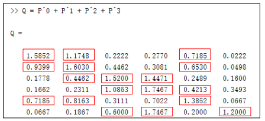

## class1 从欧式空间到非欧式空间

+ **欧式空间非规则化连接**

  + **活性卷积**

    

    

  + **可变形卷积**

    

**欧式空间卷积神经网络**

+ 处理固定输入维度数据、 局部输入数据必须有序
+ 语音、 图像、 视频（规则结构） 满足以上两点要求

**非欧式空间结构数据**  -> **图卷积**

+ 局部输入维度可变

+ 局部输入排列无序

## class2 图卷积 谱域图卷积介绍

### 1.图卷积简介

#### 1.1 经典卷积神经网络

**经典卷积网络的局限: 无法处理图结构数据**

==经典卷积==处理==图结构==数据的局限性:

+ 只能处理**固定输入维度**的数据

+ 局部输入数据**必须有序**

  

+ 语音,图像,视频(规则结构)满足以上两点要求,但是经典卷积并不适用与图结构数据(非欧氏空间)

#### 1.2 图卷积思路

+ 谱域图卷积
  + 根据**图谱理论**和**卷积定理**，将数据由空域转换到谱域做处理
  + 有较为坚实的理论基础。
+ 空域图卷积
  + 不依靠图谱卷积理论， 直接在空间上定义卷积操作。
  + 定义直观， 灵活性更强。

## class3 空域图卷积

### 1.谱域图卷积实现思路及其缺陷

#### 1.1 实现思路

#### 1.2 缺陷

+ **谱域图卷积不适用于有向图**

  + 图傅里叶变换的应用是有限制的， 仅限于在无向图。
  + 谱域图卷积的第一步是要将空域信号转换到谱域， 当图傅里叶变换无法使用时，
    谱域图卷积也就无法进行下去。

+ **谱域图卷积假定固定的图结构**

  

+ **模型复杂度问题**

  

### 2.GNN

> GNN 2017
>
> A Generalization of Convolutional Neural Networks to Graph-Structured Data

#### 2.1 卷积的理解

对卷积的一种定义是:

卷积是固定数量邻域节点排序后,与相同数量的卷积核参数相乘求和(GNN的思想)

**固定数量邻域**:图像中固定的邻域大小,比如3x3的卷积核,8邻域

**排序**:固定的顺序(图像中是左上角到右下角)

所以卷积的核心操作可以分为两步:

+ **1.构建邻域**

  + 找到固定数量的邻居节点
  + 对找到的邻居节点进行排序

  但是对于图结构数据而言:

  

  + 不存在固定的8邻域结构,每一个节点的邻域大小不是固定的,可能有2个相邻节点,也可能有3个
  + 同一邻域内的节点不存在顺序

+ **2.将邻域的点与卷积核参数进行内积**

#### 2.2 GNN

##### 2.2.1 GNN思路

GNN使用**随机游走**的方法解决图结构构建邻域时存在的两个问题:

> **随机游走(random walk)**涉及到马尔科夫模型的相关数学知识,这里不详细展开

**1.邻域大小不固定**

**2.邻域内节点无序**

具体的:

**1.使用随机游走,根据被选中的概率期望大小选择前p个固定数量的邻域节点**

**2.然后根据节点被选择的期望值对邻域内的节点进行排序**

**一些符号标记:**

+ $P$为图上的**随机游走转移矩阵**， 其中$P_{ij}$表示由$i$节点到$j$节点的转移概率
+ 相似度矩阵（similarity matrix）为$S$,文中的相似度矩阵可以理解为邻接矩阵
+ $D$为度矩阵,$D_{ii}=\sum_j S_{ij}$     一个节点的度等于连接它的所有边的权重之和

##### 2.2.2 GNN具体步骤

1. **计算转移矩阵$P$**

   假如图结构是已知的,那么相似度矩阵$S$和度矩阵$D$都是已知的,随机游走概率转移矩阵定义如下:

   $P=D^{-1}S$

   这就是使用归一化的邻接矩阵来作为转移矩阵

   这样处理后,$P$的每一行和为1,每一个值可以用来表示概率,比如$P_{13}$表示从第1个节点**一步**走到第3个节点的概率

2. **计算多步转移概率**

   由上可知,$P^1$表示一步概率,依次类推,$P^0$表示0步概率,这就是一个单位阵

   $P^k$表示k步概率

   那么,多步的转移概率可以表示为;
   $$
   Q^{(0)}=I,Q^{(1)}=I+P,...,Q^{(k)}=\sum_{i=0}^kP^i
   $$
   多步概率就是求和,$Q^{(k)}_{ij}$表示k步内,从节点i出发到节点j的期望概率

   

3. **根据期望大小来选择邻域**

   $\pi^{(k)}_i(c)$表示节点的序号,该节点为k步内由节点$i$出发的访问期望第$c$大的节点,那么有:
   $$
   Q_{i\pi^{(k)}_i(1)}>Q_{i\pi^{(k)}_i(2)}>...>Q_{i\pi^{(k)}_i(N)}
   $$
   如果设置邻域大小为3,就选前3个节点为邻域,并且按照访问期望进行排序

   这个邻域大小以及排序一旦确定之后,在之后的逐层卷积中就==不再发生变化了==.

4. **进行1D卷积**
$$
   Conv_1(x)=
\begin{align}
   \begin{bmatrix}
   \pi^{(k)}_1(1) \cdots \pi^{(k)}_1(p)\\
   \pi^{(k)}_2(1) \cdots \pi^{(k)}_2(p)\\
   \vdots \ \ \ddots \ \ \   \vdots \ \\
   \pi^{(k)}_N(1) \cdots \pi^{(k)}_N(p)\\
   \end{bmatrix}
   \end{align}
   \cdot
   \begin{bmatrix}
   w_1\\
   w_2\\
   \vdots\\
   w_p
   \end{bmatrix}
   =
   \begin{bmatrix}
   x_1\\
   x_2\\
   \vdots\\
   x_N
   \end{bmatrix}
$$

   这里的邻域大小是$p$,图的节点个数是$N$

   $x_i$表示第$i$个节点的特征

##### 2.2.3 GNN的再思考

本质上， GNN的做法是强制将一个图结构数据变化为了一个类似规则数据,从而可以被1D卷积所处理

##### 2.2.4 GNN 卷积操作示例

1. **图结构数据**

图示是一个6个节点的数据,边上的数字是边的权重

相似度矩阵$S$和度矩阵$D$分别为:

2. **计算单步转移概率矩阵$P=D^{-1}S$**,以及多步转移概率矩阵

   

   P的n次方$P^n$:这个矩阵的元素$P^n_{ij}$ 的意义是：
   从$i$节点出发走 $n$步 到$j$节点的概率。

   

   特别的:

   

3. **计算期望Q,假设最大走3步**
   $$
   Q^{(0)}=I,Q^{(1)}=I+P,...,Q^{(k)}=\sum_{i=0}^kP^i
   $$
   显然,P的每一行的和都为1,因为第i行表示第i个节点到达其他节点的概率,所以概率和为1

   

4. **根据Q,选择p个节点作为邻域,假设p=3**

   

5. **进行1D卷积**

   

### 3.GraphSAGE

> Inductive representation learning on large graphs, in Proc. of NIPS, 2017

#### 3.1 卷积的另一种理解

**卷积=采样+聚合**

GraphSAGE的核心思想是将卷积分解为采样和聚合两步,SAGE就是==Sample and AggreGatE==的缩写

GraphSAGE认为节点邻域中的节点没有顺序可言,不需要进行排序,所以聚合函数必须和输入顺序无关;

#### 3.2 GraphSAGE具体思路

1. 通过采样,得到邻域节点
2. 使用聚合函数来聚合邻居节点的信息,或得目标节点的==embedding==(节点特征)
3. 利用节点上聚合得到的信息,对节点/图的label进行预测;

##### 3.2.1 采样

使用均匀采样法(uniform sampling)来采样固定的邻域节点,即对于某一节点,在其一阶相连的节点上均匀采样以构建一个固定节点数量的邻域.

在每一次迭代中,采样的结果有可能是不一样的;

例如,节点$x_1$有3个直接相连的节点$x_{11},x_{12},x_{13}$,想要采样得到2个节点,就需要做两次均匀采样,由于选择每一个节点的概率都是相同的,所以一共有$C_3^2$中可能性

##### 3.2.2 聚合

原文中给出了三种聚合方法:

1. Mean aggregator

   平均聚合

2. Pooling aggregator

   最大值聚合

3. LSTM aggregator

   使用LSTM来encode邻居的特征。这里忽略掉邻居之间的顺序，即随机打乱，输入到LSTM中

   使用LSTM是考虑它非线性的学习能力,前两种聚合方法都太简单了.

##### 3.2.3 前向计算流程

**输入:**

图结构数据Graph $\mathcal G(\mathcal V,\mathcal E)$

输入特征{$x_v$}

网络深度 $K$

权重参数矩阵 $W^k$

非线性激活函数 $\sigma$

聚合函数 $aggregate_k$,每一层可能会使用不同的聚合函数

采样函数 $\mathcal N: v \to 2^{\nu} $

**输出:**

graph中每一个节点的特征向量

> **聚合函数:**
>
> 输入是上一层提取的节点特征,以及当前节点的邻域信息
>
> 聚合完成邻域节点特征后,和当前节点特征concat在一起,左乘权重矩阵,这个矩阵是一个待学习的参数,然后再通过一个激活函数加入非线性信息,这和传统的CNN流程类似.
>
> **结合中心点信息:**
>
> 对应与传统CNN中,3x3卷积核,不仅仅聚合8邻域的信息,同时也包含自身的信息

##### 3.2.4 GraphSAGE卷积操作示例

1. **图结构数据**

   

图示是一个6个节点的数据,边上的数字是边的权重

2. **采样+聚合**

   + 对于5号节点， 有1号、 2号、 4号三个一阶相邻的节点。 这三个节点是候选节点， 从这三个节点中采样， 来构建5号节点的邻域

   + 假设取均值聚合函数。 假设现在正处于第k层

   + 假设需要采样2个节点（有放回的采样); 对5号节点的邻域的的某一次采样的结果为： 1号节点和4号节点

   + 在第一步， 聚合邻域节点的结果为：
     $$
     \bold h_{\mathcal N(5)}^k=AGGREGATE_k(\bold h_1^{k-1},\bold h_4^{k-1})\\
     =1/2(\bold h_1^{k-1}+\bold h_4^{k-1})
     $$

   + 在第二步， 结合中心节点信息的结果为
     $$
     \bold h_5^k=\sigma(\bold W^k \cdot CONCAT(\bold h_5^{k-1},\bold h_{\mathcal N(5)}^k))
     $$
     $\bold h_5^k$就是第$k$层的输出

   **另外一次迭代:**

   在另一次迭代采样时， 对5号节点的邻域的的某一次采样的结果为： 1号节点和1号节点

   （由于是有放回的采样， 这是有可能的） 

   + 第一步,聚合邻域节点
     $$
     \bold h_{\mathcal N(5)}^k=AGGREGATE_k(\bold h_1^{k-1},\bold h_1^{k-1})\\
     =1/2(\bold h_1^{k-1}+\bold h_1^{k-1})
     $$

   + 在第二步，是一样的
     $$
     \bold h_5^k=\sigma(\bold W^k \cdot CONCAT(\bold h_5^{k-1},\bold h_{\mathcal N(5)}^k))
     $$
     $\bold h_5^k$就是第$k$层的输出

#### 3.3 GraphSAGE vs GNN

1. 在GNN（以及传统CNN）中需要确定邻域节点的顺序; 但是,GraphSAGE的作者认为图卷积邻域的节点==不需要进行排序==
2. 在GNN中邻域里的每个节点拥有不同的卷积核参数。在GraphSAGE中邻域里的==所有节点共享同样的卷积核参数==
3. 在邻域选择方法上, GNN通过==随机游走的概率大小==来构建邻域, GraphSAGE通过==均匀采样==构建邻域

### 4.GAT

> GRAPH ATTENTION NETWORKS,ICLR,2018

#### 4.1  卷积的另一种理解

**注意力机制attention**

注意力机制是一种能让模型对重要信息重点关注并充分学习吸收的技术。 它模仿了人类观察物品的方式。

核心逻辑就是「从关注全部到关注重点」

所以,**卷积**可以定义为利用**注意力机制（attention）** 对邻域节点有区别的聚合。

#### 4.2 GAT具体思路

##### 4.2.1 核心思想

+ GAT即==GRAPH ATTENTION NETWORKS==， 其核心思想为将attention引入到图卷积模型中
+ 作者认为邻域中所有的节点共享相同卷积核参数会限制模型的能力。 因为邻域内的==每一个节点和中心节点的关联度都是不同的==，在卷积聚合邻域节点信息时需要对邻域中的不同的节点==区别对待==。
+ 利用==attention机制==来建模邻域节点与中心节点的关联度

##### 4.2.2 GAT具体步骤

**1.使用注意力机制计算节点之间的关联度**

+ **计算关联度**

先使用线性变换参数$W$将节点特征从$F$维转换成$F'$维,将节点$i$和$j$的特征拼接在一起,得到一个$2F'$的特征向量,再与

$\vec a^T \in R^{2F'}$相乘,得到一个标量,表示节点$i$和节点$j$之间的关联度;

+ **softmax归一化**

  为了使不同节点之间的注意力系数易于比较， 作者使用softmax函数对每个节点的注意力系数进行归一化。

  

**2.利用注意力系数对邻域节点进行有区别的信息聚合， 完成图卷积操作**

$f:$非线性激活函数

#### 4.3 GAT总结

GAT与其他图卷积的比较

1. 在邻域节点构建上,不同于GNN(随机游走),GraphSAGE(采样),==GAT直接选用一阶相邻节点作为邻域节点==(和GCN类似）

2. 在节点排序上， GAT中的邻域的所有节点==无需排序==并且==共享卷积核参数==（和GraphSAGE类似） 

3. 由于GAT引入了Attention机制，可以构建相邻节点的关系，是对邻域节点的有区别的聚合。

   若将$\alpha_{ij}$和$W$结合起来看做一个系数,实际上GAT对每个节点隐式的分配了不同的卷积核参数

+ ==GAT可以认为是对局部图结构的一种学习==

+ 现有的图卷积方法常常更关注节点特征(feature) 而忽视了图结构 (structure)

  

#### 4.4 GAT卷积示例

对于5号节点， 有1号、 2号、 4号三个一阶相邻的节点。 这三个节点是GAT的邻域。

**1.1 使用注意力机制计算节点之间的关联度**

比如5号节点和1号节点的关联度如下：

其中$\vec h_i \in R^{F}$代表$i$节点上的特征(信号),$W\in R^{F\times F'}$和$\vec a^T \in R^{2F'}$是可学习参数;

$e_{52},e_{54},e_{55}$的计算与$e_{51}$类似

**1.2 softmax归一化**

**2.利用注意力系数对邻域节点进行有区别的信息聚合,完成图卷积操作**

注意,4个邻域节点的W是通用的

### 5.PGC

