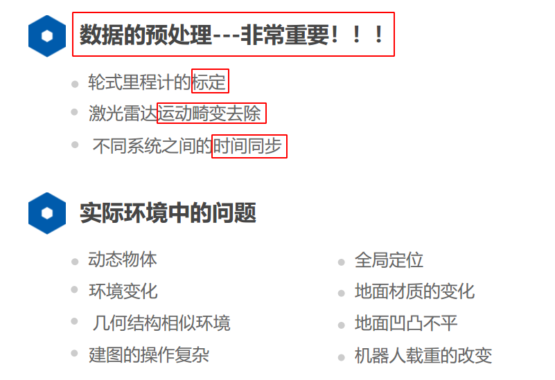
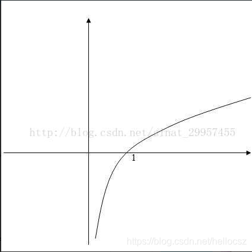
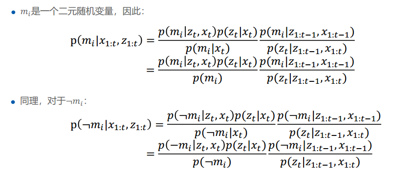

## Class 1 激光SLAM介绍

## Class 2 里程计运动模型及标定

里程计模型

里程计标定

## class 3 激光雷达运动畸变去除

### 1 激光雷达传感器介绍

+ **测距原理**

  + **三角测距**
    + 中近距离精度较高
    + 价格便宜
    + 远距离精度差
    + 易受干扰
    + 一般在室内使用
  + **ToF(飞行时间)**
    + 测距范围广
    + 测距精度高(近处测距精度差)
    + 抗干扰能力强
    + 价格昂贵(目前已经大幅度降价,固态很便宜)
    + 室内室外皆可使用

+ **三角测距原理**

  .......

### 2 激光雷达数学模型

## class7 基于已知定位的建图

位姿估计的方法:

帧间匹配 + 优化 -> 图优化,得到(x,y,theta)

但是导航需要的是(栅格)地图

### 1.地图的分类

**尺度地图**:距离和世界一致,1m就是1m,常用的栅格地图,特征地图,点云地图都是度量地图

**拓扑地图**:只表示A点和B点之间的联通关系和距离,两个点之间具体是怎么样的不知道 ,在大场景下使用

**语义地图**:SLAM和深度学习的结合,通过添加语义信息,可以极大的去除outlier的干扰,极大的提升定位的鲁棒性,更接近人的感知方式

### 2.覆盖栅格建图算法

#### 2.1 地图特点

**占用**:障碍物

**空闲**:可通行

**优点**:

+ 天然区分可通行区域,适合路径规划
+ 目前机器人普遍都在二维平面上运动,栅格图也比较合适

**缺点**:

如果分辨率过大,比如说`20cm*20cm`,会忽略有些比较小的可通行区域,比如`10cm*10cm`,但是一个障碍物落在一个栅格里面,整个栅格都是不可同行的了

==**解决办法:**==使用可变的分辨率,类似octomap,也可以节省内存

#### 2.2 构建方法

##### 事件的几率

事件的几率（odds），是指该事件发生的概率与该事件不发生的概率的比值。如果事件发生的概率是p，那么该事件的几率是p/(1-p)。取该事件**发生几率的对数**，定义为该事件的**对数几率**（log odds）或logit函数,从对数几率中恢复 概率 也很简单
$$
\alpha=logit(p)=log(\frac{p}{1-p})=log(p)-log(1-p)=-log(\frac{1}{p}-1)
$$

$$
p=logit^{-1}(\alpha)=\frac{1}{e^{-\alpha}+1}
$$

> log底数的选择,只要大于1就行
>
> 一般选择e

为什么要取对数:

事件发生的概率p的取值范围为[0,1]，对于这样的输入，计算出来的几率只能是非负的（大家可以自己验证），而通过取对数，便可以将输出转换到==整个实数范围==内，下面是log函数的在二维坐标系中的图像，依照图像就会对标黄的那句话有一个形象的了解了。

对数差异值域为(−∞,+∞)。这种使用对数差异比的形式更新置信度的贝叶斯滤波器很适合计算，它避免了概率值接近0或1时的截止误差。

##### 2.2.1 假设

+ 栅格地图中的每一个 **栅格** 是一个**二元随机变量**,只能取两个值:**占用**(Occupied)或者**空闲**(Free)

+ 对于任意一个栅格$m_i$ ,$p(m_i)=1$表示被占用,$p(m_i)=0$表示空闲,$p(m_i)=0.5$表示未知,经常作为栅格的先验,在实际应用中, 如果$p(m_i)>threshold_a$就认为栅格被占用, 如果$p(m_i)<threshold_f$就认为栅格是空闲的

+ 假设在建图的过程中,环境不会发生改变,是静态环境

+ 栅格地图中的每一个栅格都是独立的,对于整张栅格地图的估计,可以转换为对于每一个栅格的估计,把所有栅格概率乘起来(和NDT有点像)
  $$
  p(m)=\prod p(m_i)
  $$

+ 地图估计问题表示为

$$
p(m|x_{1:t},z_{1:t})=\prod p(m_i|x_{1:t},z_{1:t})
$$

+ 所以,估计环境的地图只需要对每一个独立的栅格进行估计即可

##### 2.2.2 地图估计

主要是使用贝叶斯公式,是一个静态二值贝叶斯滤波

