[TOC]

## class 1 PCA&Downsampling&Filtering

### 1.Introduction

+ **点云表示**

  Nx3的矩阵，或者Nx(3+D)的矩阵，D：点的额外特征

  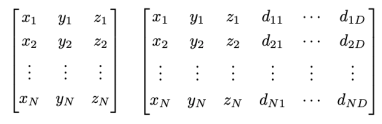

  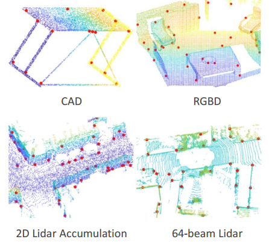

+ **点云获取设备**
  + lidar
  + RGB-D
  + CAD Models
  + Depth from Images

+ **点云的应用领域**

  + 机器人，自动驾驶
    + 定位：SLAM，闭环检测，点云匹配
    + 感知：目标检测，分类
    + 三维重建
  + 消费设备
    + 人脸识别(Face Id)
    + 手势识别
    + 体态识别

+ **3D信息的其他表示形式**

  + Mesh  普遍应用在游戏领域，机器人领域不常用

  + Voxel Grid

  + Octree

    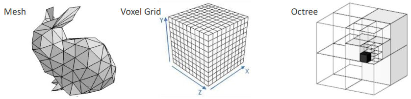

+ **点云表示的优点**
  + 数学上表示简单
  + 含有3D信息
  
+ **点云表示的缺点**
  + **稀疏**			从激光雷达采集的点云，远处的点很稀疏，近处的点很密集
  + **没有规律**     无法像图像那样简单的最近邻搜索
  + **没有纹理信息**
  + **无序**             很难使用深度学习
  + **旋转不变**

### 2.Principle Component Analysis(PCA)

|                           三维PCA                            |                           二维PCA                            |
| :----------------------------------------------------------: | :----------------------------------------------------------: |
| 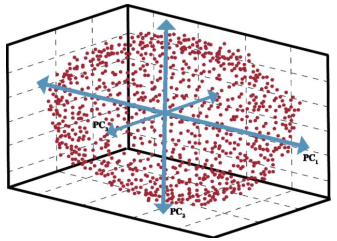 | 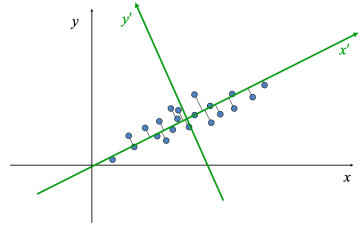 |

+ **使用PCA找到点云的主方向**

+ **PCA的应用**

  + 降维
  + 曲面**法向量估计**
  + 关键点检测
  + 特征提取

+ **一些概念**

  + 向量点乘，就是一个向量投影到另一个向量上的长度

    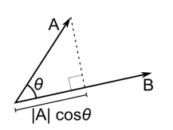

  + 矩阵向量相乘，  线性加和

    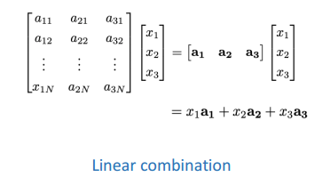

  + **矩阵的SVD分解**

    $M=U*\Sigma*V^*$,其中，$U,V^*$是正交矩阵（旋转矩阵），$\Sigma$是对角阵，元素是$M$的特征值的平方根，按照从大到小的顺序排列；

    如下图所示，一个圆 经过一个$M$处理，就是，先经过一个$V^*$,做一个旋转，经过一个$\Sigma$,各个维度上的一个缩放，圆变成了椭圆，最后经过一个$U$，旋转一下，得到最后的结果

    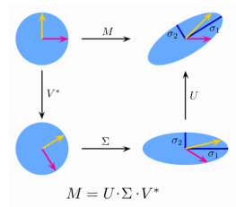

+ **谱定理Spectral Theorem**

  对阵矩阵A的分解

  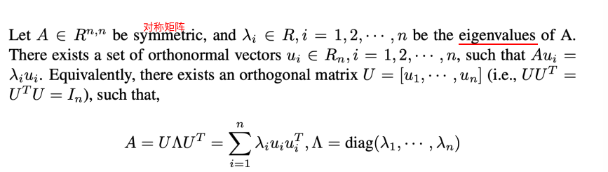

+ **瑞丽商Rayleigh Quotients**

  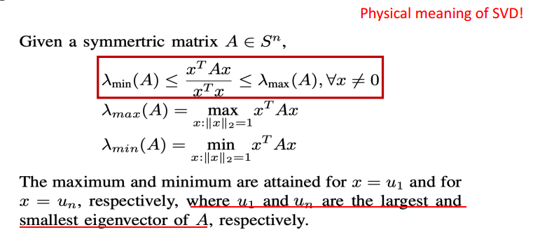

  ​	根据SVD的那个解释图，瑞丽商表示对称矩阵A可以把x缩放多少倍，最大特征值倍到最小特征值倍

+ **PCA**

   **证明过程也可以看机器学习课程笔记（notes/pdf_notes)**

  + **Input:**  $x_i\in R^n,i=1,2,3,...,m$

  + **output**： 主成分向量 $z_1,z_2,...,z_k\in R^n,k<=n$

  + **Q：哪些是最主要的成分？**

    **A：把数据投影到这个方向上，方差最大的就是最主要的成分**

  + **Q：怎样获取第二、第三重要的成分？**

    **A：将第一主成分去掉，再找一次主成分，得到第二主成分，以此类推**

  + 下面会有详细解释

+ **Principle Component Analysis - Proof**

  + 将数据做归一化处理，因为只关心数据的方向，和中心点无关

    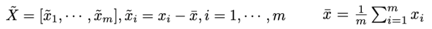

  + PCA就是找到一个方向$z\in R^n,||z||_2=1$，投影之后方差最大, 所以先投影，得到$\alpha_i$（标量）

    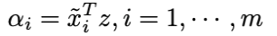

  + 投影之后计算方差（归一化后,均值为0），写成矩阵形式

    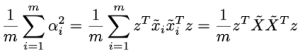

  + 最大化这个方差

    ​							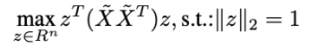

  + 调用瑞丽商公式

    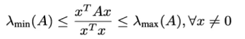

  + 调用谱定理

    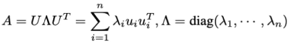

  + 应用到PCA

    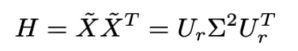

+ **PCA - Summary**

  + 给定数据 $x_i\in R^n,i=1,2,3,...,m$，==**PCA的流程**==

    1. 归一化

       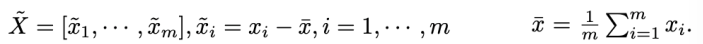

    2. 计算协方差矩阵然后对其进行SVD分解 

       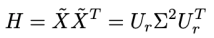

    3. 主方向是$U_r$的列向量,前n列，就是前n个主方向（Eigenvector of 𝑋 = Eigenvector of 𝐻）

  + **PCA实际上是一个换基底的过程**

+ **PCA - 降维**

  给定数据$x_i\in R^n,i=1,2,3,...,m$，使用PCA提取出来$l$个主成分${z_1,z_2,...,z_l},z_j\in R^n$

  + 将数据$x_i$的维度从$n$维降到$l$维，$l<<n$

  + 降维是一个编码过程

    Encoder 

    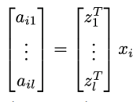

  + 从主成分中**恢复原数据**，重建$x_i$,是一个解码过程

    Decoder

    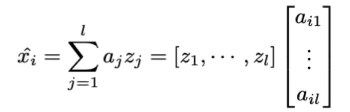

    会有损失

    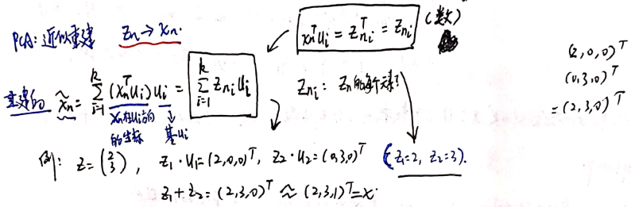

  + 一些例子

    第一个主成分 第二个主成分  的 对比

    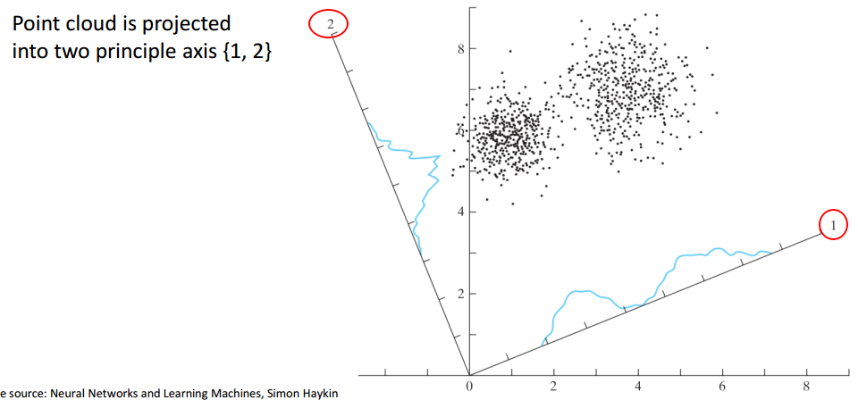

### 3.Kernal PCA 核PCA

**PCA优点：**

1. 无参数
2. 易于计算
3. 没有局部最优

**PCA局限：**

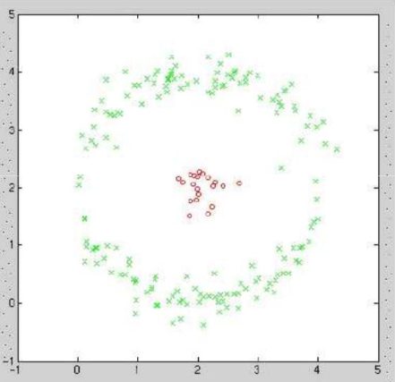

1. 只适应于线性降维

   是矩阵相乘，是对原始数据的列的线性组合，只能处理线性可分的数据，无法处理非线性数据,不能把上图红色和绿色分开

2. 计算效率低

   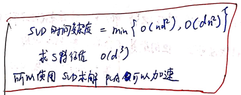

**使用核函数把非线性转换成线性可分**

==[证明过程没看]==

+ 常用的核函数

  

+ 核函数的选择：一般情况下只能实验，除非事先知道原始数据的分布

+ **核PCA流程**

+ 本质上是把高维空间的运算转换为一个**核函数**

  1. 选择一个核函数$k(x_i,x_j)$,计算Gram Matrix$K(i,j)=k(x_i,x_j)$

  2. 归一化$K$

     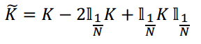

  3. 计算特征值，特征向量

     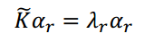

  4. 归一化$\alpha_r$，使得$\alpha_r^T\alpha_r=\frac{1}{\lambda _r}$

  5. 对于任意的数据点$x\in R^n$，计算把它投影到第$r$个主成分上的结果$y_r$

     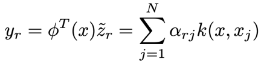

### 4.表面法向量

+ **表面法线**

  在p点处垂直于切面的向量

  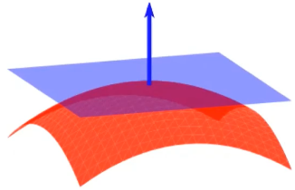

  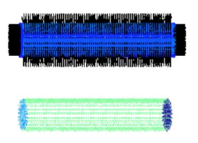

+ **法向量的应用**
  + 点云聚类、分割
  + **平面检测**
  + 特征提取

+ **计算法向量的方法**
  
  1. 选择一个点 p
  
  2. 找到这个点的一个领域
  
3. 对邻域内的点做一个PCA
  
  4. PCA后，**最小特征值对应的特征向量，就是法向量**
  
  5. 计算曲率，邻域特征值$\lambda_1>\lambda_2>\lambda_3$，曲率$curvature=\lambda_3/(\lambda_1+\lambda_2+\lambda_3)$
  
     曲率越大,表明邻域的起伏变化越大,越小表明邻域越平坦

+ **法向量的定向**

  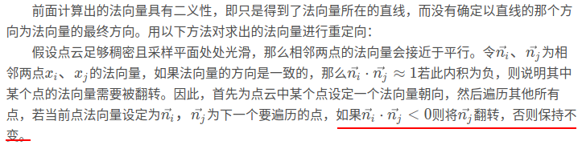

  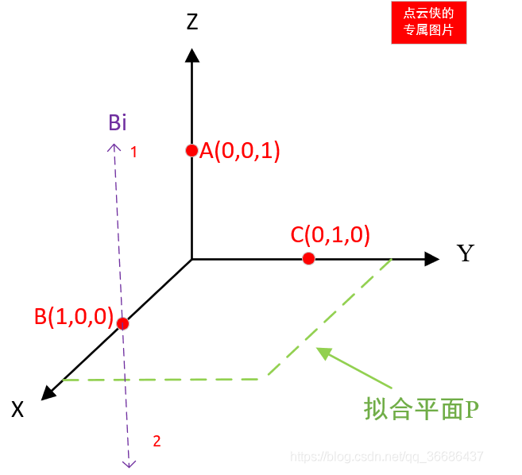

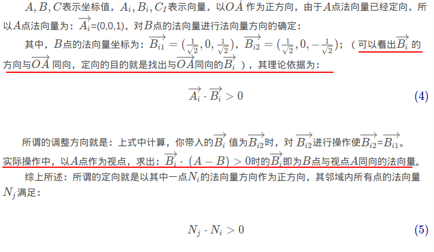

+ **Surface Normal Estimation**

  上面说的是一般的法向量计算，但是采集到的点云是有很多噪声的，**怎样处理噪声呢？**
  
  1. 根据问题的不同选择邻域的大小
  
     1. 更大的邻域->法向量的估计更加平滑，但是会受到一些无关物体的影响，一些精细部位的法向量提取不出来
     2. 更小的邻域->法向量的估计更加尖锐，可以提取精细部位的法向量，但是会受到噪声的影响
  
  2. Weighted based on other features 根据其他特征信息来选择邻域  
  
     a. lidar intensity 
  
     b. RGB values
  
     选择邻域的时候，只选择和自身特征比较像的点
  
  3. **RANSAC**
  
  4. Deep Learning

```C++
/* PCL 中 提取法向量 */
// 读取点云数据
set_input_pcd();
// 计算法线
clock_t start_time, finish_time;
start_time  = clock();
pcl::NormalEstimationOMP<pcl::PointXYZ, pcl::Normal> normal_exactor;
// 法线
pcl::PointCloud<pcl::Normal>::Ptr normals(new pcl::PointCloud<pcl::Normal>);
// 建立kdtree 进行 邻近点搜索
pcl::search::KdTree<pcl::PointXYZ>::Ptr kd_tree(new pcl::search::KdTree<pcl::PointXYZ>());
normal_exactor.setNumberOfThreads(20);   // 设置openMP的线程数
normal_exactor.setViewPoint(0, 0, 0); // 设置视点,默认为(0,0,0)
normal_exactor.setInputCloud(filtered_pcd_);  // 设置输入点云
normal_exactor.setSearchMethod(kd_tree);   // 设置最近点搜索算法
normal_exactor.setKSearch(10);             // k,the number of k-nearest neighbors
// the sphere radius used as the maximum distance to consider a point a neighbor
//    normal_exactor.setRadiusSearch(0.03);       // 半径搜索
normal_exactor.compute(*normals);           // 开始法向量计算
```

### 5.Filters

#### 5.1 Noise removal

##### 5.1.1 Radius Outlier Removal(ROR)

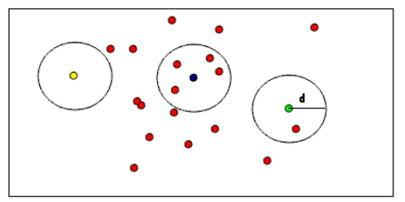


1. 对于每一个点，找到它 半径为r  的一个邻域
2. 如果邻域内的点数$k<k^*$, 就认为这个点是噪声点，将其去除

##### 5.1.2 Statistical Outlier Removal(SOR)

是ROR的升级版

1. 遍历每一个点，找到它的一个邻域

2. 计算这个点到它邻域内点的距离$d_{i,j},i=[1,2,..,m],j=[1,2,...,n]$，i：自己，j：邻域内的其他点

3. 将这些距离用一个**高斯分布**去表示，$d\sim N(\mu,\sigma)$

   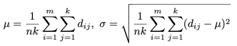

4. 再次遍历每一个点，计算它到邻域内每一个点的平均距离

5. 根据3中得到的高斯分布，如果这个平均距离超过了这个高斯分布的$3\sigma$范围，就认为这个点是噪点，将其去除，具体的：

   

+ SOR结果

  

#### 5.2 Voxel Grid Downsampling

**总体流程**

1. 建立一个包含所有点云的voxel grid
2. 在每一个voxel中只选择一个点，这样就完成了降采样

**有两个问题：**

1. 在每一个voxel中，怎样去选点
2. 算法怎样更加高效

**选点策略：**

1. Centroid 选择质心

   a. 对于x,y,z坐标，计算点的平均值

   b. 对于其他属性，比如语义信息，采用投票的方式取平均

   c. 得到一个voxel的质心来降采样，这种方法更加精准，但是速度慢

2. Random select 随机选择

   a. 在voxel中随机选择一个点进行降采样

   b. 不是很精确，但是速度快

**一般的Voxel Grid Downsampling流程**

1. 计算点集$\{p_1,p_2,...,p_N\}$的三个轴的最大最小值

   $x_{max}=max\{x_1,x_2,...,x_N\},x_{min}=min\{x_1,x_2,...,x_N\},y_{max}=...$	

2. 指定voxel grid的分辨率$r$，每一个voxel的大小

3. 计算voxel grid 三个轴的尺度
   $$
   D_x=(x_{max}-x_{min})/r \\
   D_y=(y_{max}-y_{min})/r \\
   D_z=(z_{max}-z_{min})/r 
   $$

4. 计算每一个点的`voxel index`： $h$
   $$
   h_x=\lfloor(x-x_{min})/r\rfloor\\
   h_y=\lfloor(y-y_{min})/r\rfloor\\
   h_z=\lfloor(z-z_{min})/r\rfloor\\
   h=h_x+h_y*D_x+h_z*D_x*D_y
   $$
   
5. 根据第4步中计算出的点的index进行排序(pcl中就是这么实现的)，eg：`0,0,1,,2,2,2,8,8,8,8,...`
6. 遍历排序过的点，根据Centroid/Random策略选点，就完成了voxel grid downsampling

**需要注意的几个问题**

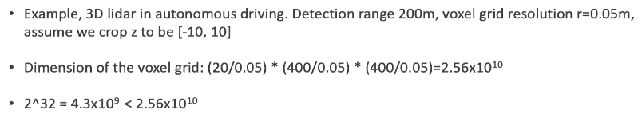

+ 有时候，voxel grid 的尺度是很大的，导致有些点计算出的index会非常大，超过`int32`的范围，这时候，就需要使用`int64`类型的整型变量来存储index


**Voxel Grid Downsampling – Approximated**

怎样加速voxel grid downsampling 的过程?

+ 精确的voxel grid 下采样需要一个排序操作,时间复杂度是O(N*log(N))
+ 大多数voxel中都是没有点的
+ eg: N=10000个点,我们知道在降采样后的点数M<100,比如,95
+ 假设有一个神奇的函数,可以把这10000个点映射到100个容器中
+ 最后,我们只要从这100个容器里面提取点就行了,理想情况下,还有95个非空的容器,有5个容器是空的

+ 这个神奇的函数 ,实现了降采样的过程,把10000个点放到100个容器里面,  可以 使用 **哈希表** 来模拟

**使用哈希表的voxel grid 降采样流程:**

1. 计算三个坐标轴的最大最小值
2. 指定每一个voxel的大小   r
3. 计算voxel grid 三个维度的大小
4. 遍历每一个点,计算voxel index: h
5. 使用一个哈希函数将这个voxel index 映射到M个容器中的一个$G_i\in \{G_i,G_2,..,G_M\}$
6. 遍历$\{G_i,G_2,..,G_M\}$, 得到M个点

+ 哈希函数
  $$
  hash(h_x,h_y,h_z):R^3\to R
  $$
  
+ 经常使用的一个哈希函数(取余)

$$
hash(h_x,h_y,h_z)=(h_x+h_y*D_X+h_x*D_x*D_y) \% \ M
$$

​		经过这个哈希函数,得到的值一定在[0,M]

+ **这个哈希函数不是完美的**,会发生conflict  冲突现象

  + 不同的voxel index 会映射成 相同的值

    $hash(h_x,h_y,h_z)=hash(h_x^\prime,h_y^\prime,h_z^\prime)$,但是$h_x\not =h_x^\prime,h_y\not =h_y^\prime,h_z\not =h_z^\prime $,不在空间中临近的地方

  + 原因:

    这10000个点按理来说应该填满95个容器,但是实际上只填充了80,其他的点填到了它不该呆的地方

+ 处理冲突的方法
  + 检测到冲突
  + 把冲突容器中的点释放,即从容器中选择一个点作为降采样的输出,清空这个容器(点数置零)
  + 把新的点放到这个容器中
+ 少了排序过程,比普通的voxel grid downsampling快5倍左右,因为会有冲突现象,所以最后降采样的结果会比普通的voxelgrid downsampling要多

+ **pcl 代码**

  ```C++
  clock_t start_time, finish_time;
  start_time  = clock();
  printf("origin points size: %d...\n", input_pcd_->points.size());
  pcl::ApproximateVoxelGrid<pcl::PointXYZ> approximate_voxel_filter;
  approximate_voxel_filter.setLeafSize(0.1, 0.1, 0.1);
  approximate_voxel_filter.setInputCloud(input_pcd_);
  approximate_voxel_filter.filter(*filtered_pcd_);
  finish_time = clock();
  double cost_time = (double)(finish_time - start_time) / CLOCKS_PER_SEC * 1000.0;
  ```

  ```C++
  // pcl 降采样实现代码
  pcl::ApproximateVoxelGrid<PointT>::applyFilter (PointCloud &output)
  {
    int centroid_size = 4;
    if (downsample_all_data_)
      centroid_size = boost::mpl::size<FieldList>::value;
  
    // ---[ RGB special case
    std::vector<pcl::PCLPointField> fields;
    int rgba_index = -1;
    rgba_index = pcl::getFieldIndex (*input_, "rgb", fields);
    if (rgba_index == -1)
      rgba_index = pcl::getFieldIndex (*input_, "rgba", fields);
    if (rgba_index >= 0)
    {
      rgba_index = fields[rgba_index].offset;
      centroid_size += 3;
    }
    // histsize_ : 降采样后 容器的数量 默认512
    for (size_t i = 0; i < histsize_; i++) 
    {
      history_[i].count = 0;
      history_[i].centroid = Eigen::VectorXf::Zero (centroid_size);
    }
    Eigen::VectorXf scratch = Eigen::VectorXf::Zero (centroid_size);
  
    output.points.resize (input_->points.size ());   // size output for worst case
    size_t op = 0;    // output pointer
      // 遍历输入的每一个点
    for (size_t cp = 0; cp < input_->points.size (); ++cp) 
    {
      int ix = static_cast<int> (floor (input_->points[cp].x * inverse_leaf_size_[0]));
      int iy = static_cast<int> (floor (input_->points[cp].y * inverse_leaf_size_[1]));
      int iz = static_cast<int> (floor (input_->points[cp].z * inverse_leaf_size_[2]));
        // 计算 hash 
      unsigned int hash = static_cast<unsigned int> ((ix * 7171 + iy * 3079 + iz * 4231) & (histsize_ - 1));
      he *hhe = &history_[hash];
        // 如果冲突了,
        // 1. 将这个容器中已经存储的点 采样出去,清空这个容器
      if (hhe->count && ((ix != hhe->ix) || (iy != hhe->iy) || (iz != hhe->iz))) 
      {
        flush (output, op++, hhe, rgba_index, centroid_size);
        hhe->count = 0;
        hhe->centroid.setZero ();// = Eigen::VectorXf::Zero (centroid_size);
      }
        // 2. 把新的点加入这个容器/正常情况下,点数++
      hhe->ix = ix;
      hhe->iy = iy;
      hhe->iz = iz;
      hhe->count++;
  
      // Unpack the point into scratch, then accumulate
      // ---[ RGB special case
      if (rgba_index >= 0)
      {
        // fill r/g/b data
        pcl::RGB rgb;
        memcpy (&rgb, (reinterpret_cast<const char *> (&input_->points[cp])) + rgba_index, sizeof (RGB));
        scratch[centroid_size-3] = rgb.r;
        scratch[centroid_size-2] = rgb.g;
        scratch[centroid_size-1] = rgb.b;
      }
      pcl::for_each_type <FieldList> (xNdCopyPointEigenFunctor <PointT> (input_->points[cp], scratch));
      hhe->centroid += scratch;
    }
      // 把容器中所有的点 降采样
    for (size_t i = 0; i < histsize_; i++) 
    {
      he *hhe = &history_[i];
      if (hhe->count)
        flush (output, op++, hhe, rgba_index, centroid_size);
    }
    output.points.resize (op);
    output.width = static_cast<uint32_t> (output.points.size ());
    output.height       = 1;                    // downsampling breaks the organized structure
    output.is_dense     = false;                 // we filter out invalid points
  }
  ```

#### 5.3 Farthest Point Sampling(FPS)

**最远点采样**

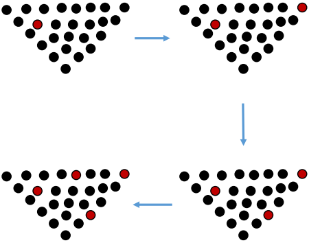

**流程:**

1. 先从点云中随机选择一个点作为第一个`FPS point`

2. 迭代下面的过程,直到获得指定的点数

   a. 对于原始点云中的每一个点,计算它到达`FPS point`中**最近点** 的距离(到达`FPS point`中点 距离的最小值),把这个距离最小值作为它到`FPS point`的距离

   b. 选择距离最大的点,添加到`FPS point`中

使用FPS的用处:

+ 对于一个点云,有些地方密度很大,有些地方很稀疏,FPS可以把一些密度很大的地方的点给去掉
+ 经常用于深度学习

#### 5.4 Normal Space Sampling(NSS)

**法向量空间采样**

经常用在ICP中,如下图所示,想要对齐红色点集和绿色点集,计算它们之间的R,T

一般的均匀采样是上面的图示,采样得到的点,可能会漏掉中间凸起的部分,无论怎样左右平移,都可以匹配上,导致匹配失败.

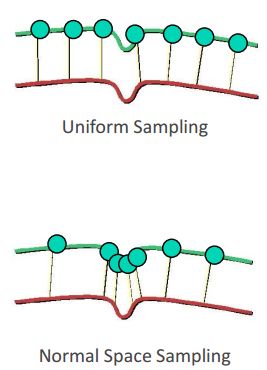


**NSS流程:**

1. 先在法向量空间建立很多容器,按照角度分成很多份?
2. 遍历每一个点,根据它的法向量,把它放到步骤1 中的容器中
3. 在每一个容器中都取k个点,这样就保证每一个方向上都有点,而不是集中在一些平滑的地方

#### 5.5 上采样

+ **Gaussian Filter**

  高斯滤波

  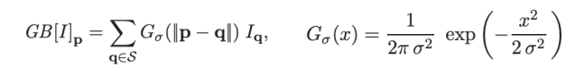

  常用在图像上,使用一个高斯函数,遍历图像上的每一个点,取一个邻域,邻域大小与高斯分布的方差有关,把邻域内的点像素值进行加权平均,权重由一个高斯分布给出

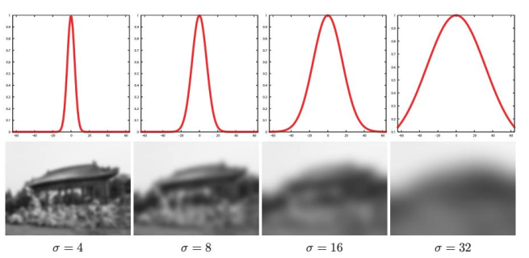

+ **Edge Preserving Blurring**

  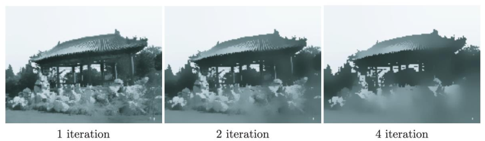


+ **双边滤波  Bilateral Filter**

  高斯滤波,会导致图片越来越模糊,双边滤波改善了这个情况


## class 2 Nearest Neighbors

**最近邻搜索问题**

**Nearest Neighbor (NN) Problem**

主要有两种NN问题

+ **K-NN**

  在空间`M`中有一个点集`S`,一个查询点$q\in M$,找到查询点在S中最近的k个点

  下图是3-NN

  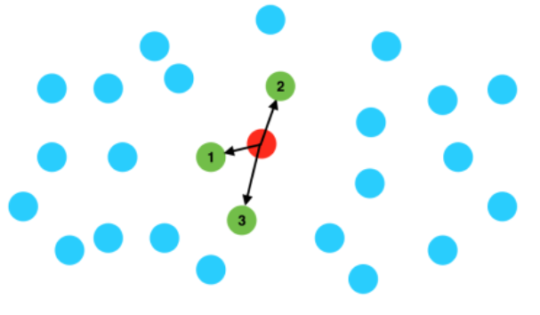

+ **Fixed Radius-NN**

  在空间`M`中有一个点集`S`,一个查询点$q\in M$,找到所有在S中和查询点距离小于r的点

  $||s-q||<r$

  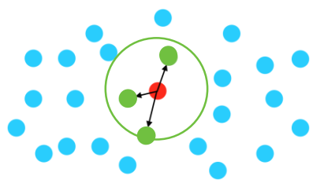

+ **NN 问题的应用领域**

  + 表面法向量估计
  + 噪点滤除
  + 降采样
  + 聚类
  + 特征点检测和特征提取
  + 深度学习
  + ...

+ **为什么最近邻搜索对点云来说很困难?**

  + 对于图像,最近邻搜索只要简单的$x+\Delta x,y+\Delta y$
  + 对于点云来说
    + 点云不规则
    + 比图像多一个维度
    + 点云数据量巨大

+ **Core Ideas Shared by BST, kd-tree, octree**

  + 空间分割

    + 把空间分割成不同的区域
    + 只在一些特定的区域内搜索,不是搜索所有的数据

  + 提前停止搜索

    

###  1.Binary Search Tree

二叉搜索树

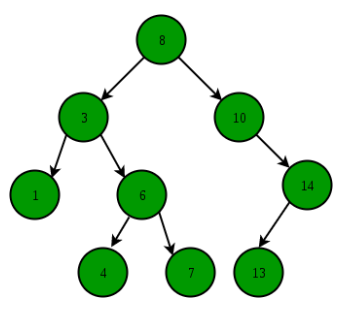

+ **节点定义**

  ```C++
  struct Node() 
  {
      Node* left;
      Node* right;
      int val;// 存储的属性
      int key;// 节点的数值
      Node(int val,int key):key(key),value(value);
  };
  ```

+ **建树/插入元素**

  ```C++
  vector<int> db_data(db_size);
  
  Node* insert(Node* root,int key,int value) {
      //
      if(root==nullptrt) {
          root = new Node(key,value);
      } else if(key > root->key) {
          root = insert(root->right,key,value);
      } else if(key < root->key) {
          root = insert(root->left,key,value);
      } else {
          printf("key already exits\n");
      }
      return root;
  }
  
  Node* root = new root();
  for(int i=0;i<db_size;++i) {
      root = insert(root,db_data[i],i);
  }
  ```

+ **插入复杂度**

  O(h),h是树的深度

  最坏的情况,h就是BST元素的个数,即称为了一个链表,$h=n$

  最好的情况,平衡二叉树,$h=log_2(n)$

+ **查找一个元素**

  给定一个二叉搜索树BST,和一个查询数据query(key),在这棵树中查询等于key的节点,如果没有返回null

  有递归和迭代两种查找方法

  + **递归**

    ```C++
    Node* search_recursive(Node* root,int key) {
        if(root == nullptr || root->key == key) {
            return root;
        }
        if(key > root->key) {
            return root = search(root->right,key);
        } else {
            return root = search(root->left,key);
        }
    }
    ```

  + **迭代**

    ```C++
    Node* search_recursive(Node* root,int key) {
        Node* current_node = root;
        while(!current_node) {
            if(current_node->key == key) {
                break;
            } else if(current_node->key > key) {
                current_node = current_node->left;
            } else {
                current_node = current_node->right;
            }
        }
        return current_node;
    }
    ```

  + **两种查询方式的对比**

    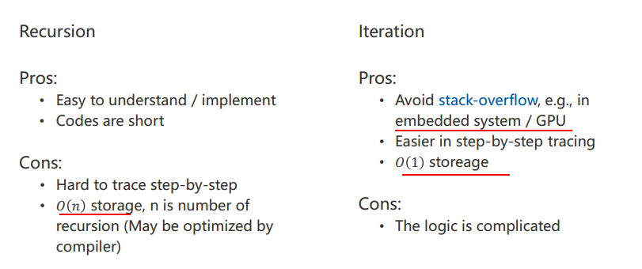

  在GPU上面选择循环

+ **BST-1NN search**

  


查询数据-query point 11

查询过程,使用一个变量`worst distance`,表示目前二叉树到查询点最近的距离,就是应该查询的最远距离,超过这个距离的数据就不需要查询了;

Worst distance is the largest distance that you should search around the query point

1) **首先第一个节点是8**

​	a) worst distance = 3 (11-8)	

​		就算不向下查找,也知道这棵树离查询点的距离至少是3

​	b) 在节点8左边的节点值都比8小,所以距离查询点的距离一定比3大,所以不需要查询节点8的左节点

​	c) 节点8的右子树数值范围(8,+inf),worst distance = 3,还可以更小,需要 查询的范围(8,14)  在右子树里面

​		下一次查询的范围是(当前节点值,查询数据+worst distance)

2) **来到查询的第二个节点10**

​	a) worst distance = 1(11-10)

​	b) 同第一个节点,只需要查询节点10的右子树(10,+inf),查询范围是(10,12)在右子树里面

3) **查询第三个节点 14**

​	a) worst distance = 1

​		此时的距离=14-11=3>1,所以worst_distance还是1

​	b) 14比查询点大,14的左子树数值范围(10,14),查询范围是(10,12),在左子树里面,所以需要查询左子树

4) 查询第四个节点13,同第3)步,继续查它的左子树,左子树为空,返回到节点14

​	需要查询14的右子树吗?右子树范围是(14,+inf),需要查询的范围是(10,12),不需要

5)  返回节点10

​	需要查询10的左子树吗?左子树范围是(8,10),需要查询的范围是(10,12),不需要

6)  返回节点8

​	需要查询8的左子树吗?左子树范围是(-inf,8),需要查询的范围是(10,12),不需要

**上面查询的过程就是NN搜索的核心,跳过了很多不需要查询的区域**

如下图所示,随着worst distance的减小,就不需要查询右子树的内容了

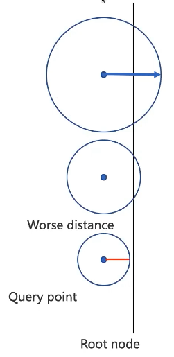

+ **BST-kNN search**

  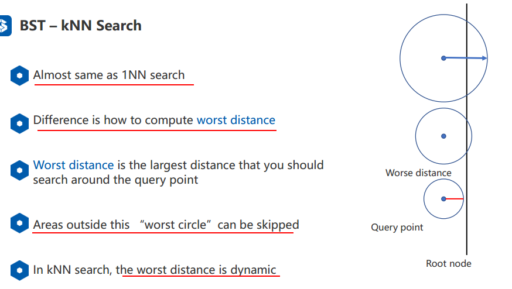

  + **Worst Distance for kNN**

    建立一个容器存储距离结果,容器降序排序,最后一个就是worst_distance

    如果当前距离<worst_dist,就把这个结果插入到容器中

    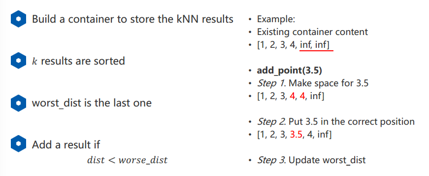

+ **Radius NN Search**

  与kNN类似,不过worst_disttance固定为指定的radius,只要dist<worst_dist就是查询结果

  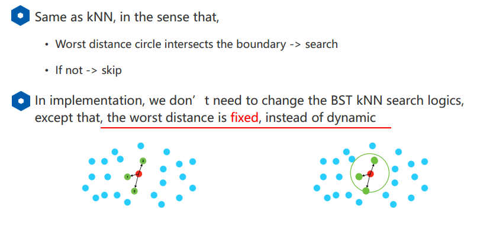

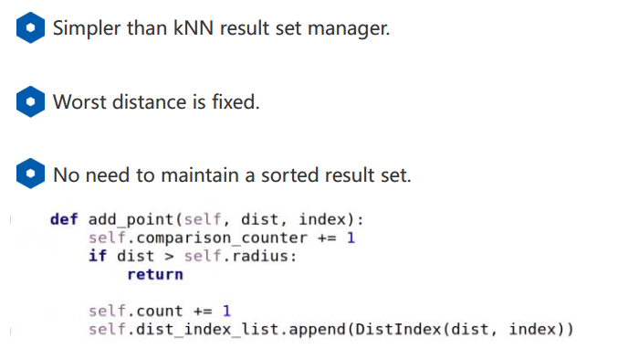

### 2.Kd Tree

BST只适用于一维数据的最近邻查找

高维数据:使用Kd树


+ 是BST在高维上的扩展

  + 在高维的每一个维度进行一个BST

+ Kd-tree建树

  + 如果只有一个点,或者 number of points < leaf_size,就建立一个叶子节点
  + 否则,在选择的轴上面,使用一个超平面把数据分成两半
  + 重复上面两步,直到没有数据可分,全部都是叶子节点

+ **以二维数据为例**

  

  有两种在维度上划分的方法,一种是超平面选择在数据点上面,另一种不是在数据点上,只是习惯的问题,课程中使用第二种划分方法,每一个数据点都在一个区域里面,点要么在左边,要么在右边,不会在中间;

  + **切割策略**

    寻找到要切割的维度

    + 每一个维度轮流切

    + 自适应切,找到方差最大的方向去切

    + 这两种切割方法对最后的NN结果影响不大,所以选择第一种简单一点

      

  + **建树过程**

    

    最小点数设置为1，即叶子节点保存最多一个数据点

    首先在x轴上面切,使用s1这个超平面,然后在左边区域,在y轴上面用s2切割

    

    依次类推

  + **kd tree节点的表达**

    ```C++
    class KDTreeNode
    {
    public:
        KDTreeNode();
        ~KDTreeNode();
    
    private:
        // int dim;		// 节点的维度
        
        int cut_dim;    // dimension to cut;
        
        float cut_val;  //cut value 切割面的位置(默认-1)
    
        vector<int> point_indices; // 存储当前节点中数据的下标
    
        KDTreeNode *left, *right;  // pointers to left and right nodes.
        // 是否为叶子节点
        inline bool is_leaf() {
            if(cut_value == -1) {
                return true;
            }
            return false;
        }
    };
    ```

    

    ​	左下角这个节点:

    ​	cut_dim = y

    ​	cut_val = s2

    ​	points=[a,b,d,e]

      右上角这个节点:

    ​	cut_dim = y

    ​	cut_val = -1

    ​	points=[i]

    ​	

  + **建树**

    选择一个维度,切割两半,再递归的进行左右两边的划分

    

  + **时间复杂度**

    n个数据点,分为logn层,排序是nlogn,所以整体时间复杂度是`O(n log n log n)`

    可以把排序算法替换为找中值算法O(n) 所以整体时间复杂度是`O(n log n)`

    在实际建树过程中,会使用一些技巧降低时间复杂度

    1) 选择一个节点中的一部分数据进行排序,选择切割位置,而不对全部数据进行排序

    2) 使用均值代替中值,选取切割位置

    这样不会保证是平衡的kd-tree,但是基本上可以用,而且建树速度很快

  + **kNN Search**

    也需要一个变量worst distance

    

    需不需要查找蓝色区域:

    1) 如果查询点在蓝色区域内部,需要查询,worst distance可能为0

    或者

    2) q到当前节点分割面的位置距离小于worst distance,也需要查询,因为有可能蓝色区域内存在距离查询点更近的点

    

  + **Radius-NN Search**

    

**建树&NN search 伪代码**

Node-data就相当于二叉搜索树节点的值,来了一个数据,对应维度的数值就和它相比,比它小是左孩子,比它大是右孩子

range:数据点集?


从上面对k-d树节点的数据类型的描述可以看出构建k-d树是一个逐级展开的递归过程。下表给出的是构建k-d树的伪代码:


k-d树查询算法的伪代码:


上述两次实例表明，当查询点的邻域与分割超平面两侧空间交割时，需要查找另一侧子空间，导致检索过程复杂，效率下降。研究表明N个节点的K维k-d树搜索过程时间复杂度为：$t_{worst}=O(kN^{1-1/k})$。

以上为了介绍方便，讨论的是二维情形。像实际的应用中，如SIFT特征矢量128维，SURF特征矢量64维，维度都比较大，直接利用k-d树快速检索（维数不超过20）的性能急剧下降。假设数据集的维数为D，一般来说要求数据的规模N满足N»2D，才能达到高效的搜索。所以这就引出了一系列对k-d树算法的改进。有待进一步研究学习。

## class 3 cluster

### 1.数学基础

+ 聚类就是把相似的物体聚在一起，不相似的物体分开；

+ 聚焦两类聚类方法

  + 理论上被证明的
    + K-means
    
    + GMM
    
    + EM
    
    + Spectral Clustering
    
  + 工程中常用的
    + mean-shift
    + DBSCAN
  
+ **线性代数**

  + **矩阵的SVD分解**

    $M=U*\Sigma*V^*$,其中，$U,V^*$是正交矩阵（旋转矩阵），$\Sigma$是对角阵，元素是$M$的特征值的平方根，按照从大到小的顺序排列；

    如下图所示，一个圆 经过一个$M$处理，就是，先经过一个$V^*$,做一个旋转，经过一个$\Sigma$,各个维度上的一个缩放，圆变成了椭圆，最后经过一个$U$，旋转一下，得到最后的结果

    一个矩阵可以分解为旋转矩阵+缩放矩阵+旋转矩阵

    

  + **谱定理Spectral Theorem**

    对阵矩阵A的分解

    

  + **瑞丽商Rayleigh Quotients**

    

    ​	根据SVD的那个解释图，瑞丽商表示对称矩阵A可以把x缩放多少倍，最大特征值倍到最小特征值倍

+ **概率论**

  + 联合概率

  + 边缘分布概率

    由联合分布求某一个变量的概率分布

    

    把其余的变量通过求和或者积分 消掉

    

  + 条件概率

    

    

+ **图论**

  + 有向图  Directed Graphical Model (DGM)

    + DGM被用于表示条件独立

    + $G(V,E)$

      + V是节点的集合,一个节点表示一个变量

      + E是有方向的边的集合,一条边代表一个条件关系,两个随机变量的联系

        

      + 马尔科夫假设:一个随机变量(节点)只和它的父节点有关,与父节点之前的节点无关

        + 如上图,就是一个简单的有向图

        + the joint distribution is $p(x,z)=p(z)p(z|x)$

          

  + 无向图UGM

    + 

+ **优化方法---拉格朗日乘数法**

  考虑一个优化问题:
  $$
  max\ f(x,y),s.t.:\ g(x,y)=0
  $$
  

  对于简单的优化问题,用梯度下降就能解决,但是这里加入了限制条件,如下图所示:

  

图中:

1. 虚线圆代表 f(x,y) 的登高线,越往里面值越大

2. g(x,y)=0代表x,y必须在红线上面

3. 优化为题的解,就是虚线和红线相切的位置,在红线的其他位置,移动(x,y)  存在一个方向,f(x,y)会变大,但是在相切的位置

   无论怎么移动,都会变小

   

**拉格朗日乘数法解决优化问题:**

$max\ f(x,y),s.t.:\ g(x,y)=0$

1. 引入一个新的变量  $\lambda$  叫做拉格朗日乘数

2. 构造拉格朗日函数:

   $\mathcal{L}(x,y,\lambda)=f(x,y)-\lambda g(x,y)$

3. 求解(一阶导数为0):

   $\nabla_{x,y,\lambda}\mathcal{L}(x,y,\lambda)=0$

4. 3中的等式,可以分解为对三个变量x,y,z求一阶导数

   

### 2.K-means

输入N个点,分割成K类

1. 随机从N个点中选择K个点作为中心点
2. 遍历剩下的所有点,把每一个点分配到这K类中的一个(距离哪一个最近就分配到哪一个中心点)
3. 重新计算每一个类中点的均值作为新的K个中心点
4. 重复2-3步
5. 直到中心点移动距离小于阈值,分配的点也不再变化,或者迭代次数到达设置的次数,损失函数小于阈值


+ **K-means的数学表达**

  

  这个损失函数的意义就是,每一个点到它所属cluster的中心点的距离之和,k-means的目标就是为了让这个损失函数(即距离之和)最小

  **E (expectation) step of the EM algorithm:**

  固定n是一个常数,那么只要,找到离它最近的中心点就行了

  

  **M (maximization) step of the EM algorithm**

  

+ **实践中的技巧**

  + K-means受到初始化的影响,所以可以运行多次k-means,选择损失函数最小的

  + mini-batch K-means

    每次迭代,只从训练数据中选取一个子集,而不是使用全部数据点,就是说,对于K个中心点,只选n个点去更新中心点

    这样做会减少运行时间,最终结果稍微有点不好

  + mini-batch取1就称为Sequential k-means

    1. 对于每一个数据点$x_n$,找到距离它最近的中心点$\mu_k^{old}$

    2. 更新中心点

       $\mu_k^{new}=\mu_k^{old}+\eta_n(x_n-\mu_k^{old})$

    $\eta_n$代表学习率

    这种k-means适用与数据递增的情况,数据并不是一次获取的

+ **K-Medoids**

  标准的k-means使用欧式距离,在有些情况中会有问题

  1. 有离群点,非常容易受到噪声的影响
  2. 对于数据点的类型有限制,如果点的类型表示类别,

  

  k-中心点聚类的步骤

  输入N个点,分割成K类

  1. 随机从N个点中选择K个点作为中心点
  2. 遍历剩下的所有点,把每一个点分配到这K类中的一个(距离哪一个最近就分配到哪一个中心点)
  3. 重新计算每一个类的中心点,得到新的K个中心点
     3. 重新计算每一个类的中心点计算方法:在同一个类中,计算每一个点到其中所有点的距离之和,选择距离之和最小的那个数据点作为新的中心点
  4. 重复2-3步
  5. 直到中心点移动距离小于阈值,分配的点也不再变化,或者迭代次数到达设置的次数

+ **k-means的缺点**

  + K是未知的

  + 对噪声很敏感

  + 一个点要么属于一个类,要么属于另一个类,没有置信度,对于在边界上面的点,很难分类准确,GMM解决了这个问题

    

### 3.GMM

未看,有点复杂


### 4.Spectral Clustering 谱聚类

K-means和GMM都是基于欧氏距离的,这就无形中有个假设,每一类都是圆形的,或者椭圆的,是个凸的形状,对于不是凸的形状,聚类就会失败

谱聚类用图来聚类,使用数据点之间的连接性来聚类


+ **带权重的无向图**

  两个顶点之间的权重代表它们的相似性

  用权重矩阵(相似性矩阵)的形式来表示这个无向图

  

+ **建立无向图,相似性矩阵的方法**


+ **总结**

  复杂度O(n^3)

  优点:

  + 对类别的特征没有要求
  + 支持任何维度的数据
  + 可以自动估计类别的个数
  + 基于相似性进行聚类,欧式距离,连接性

  缺点:

  ​	计算量太大


### 5.Mean Shift 

+ **引言**

  

给一堆平面上的点,给一个圆,找到一个位置,这个圆中的点最多,

一种做法,是遍历所有点,做半径为r的最近邻搜索,记录点数,最后取最大值所在的位置,这样复杂度太高了,

一种近似的做法是,随机找一个位置放置一个半径为r的圆,求这个圆包围的点的平均值(质心),把这个圆移动到这里,

然后再求这个圆包围的点的平均值(质心),移动圆,直到圆的位置不再发生变化;

这样做类似与爬山,最后的结果和数据的分布有关,只会找到一个局部最优解,和初始值的选择关系很大;

这就是mean-shift的核心思想(移动mean均值)

+ **聚类步骤**

  

  1. 随机放置一个半径为 r 的圆

  2. 移动这个圆到包围点的质心

  3. 重复step-2,直到质心不再发生变化

  4. 重复setp-1,2,3,得到很多个圆,去除重叠的圆:

     如果有两个圆重叠,就选择包围最多点的圆

  5. 确定聚类结果:每一个点被分配到离它最近的圆的中心代表的类

  唯一需要的参数:圆的半径 r

+ **总结**

  + **时间复杂度**$O(T.n.log(n))$
    + T是圆的个数
    + n.log(n)是每次爬山的复杂度,使用kd数来就最近邻搜索的时间复杂度是O(logn)

  + **优点**
    + 自动发现类的数量
    + 只需要一个参数
    + 对噪声不敏感
  + **缺点**
    + 爬山会陷入局部最优
    + 依赖初始值
    + 假设类别的形状是凸 的 ,比如椭圆
    + 主要工作在欧式空间
    + 不适应在高维数据,因为高维空间一般都很稀疏

### 6.DBSCAN


**密度聚类步骤:**

首先把所有点都标记为没有访问过`unvisited`

**参数**:半径`r`,最小点数:`min_samples`

1. 随机选择一个没有访问过的点p,找到它半径为r内的邻居

2. 判断半径为r内的点的数量是否大于`min_samples`

   1. yes,p是一个**核心点**,创建一个类`C`,进入step-3,把p标记为`visited`
   2. no,把p标记为噪声点,并标记为`visited`

3. 遍历核心点p半径r内的点,标记为类别C,并标记为`visited`

   如果遍历到的点也是核心点,就把它设置为新的p,重复step-3

   如果不是核心点,就停止

4. 从数据集中把类别 C 的数据去除,回到step-1

5. 直到所有的点都`visited`为止


+ **核心点:**

  半径r内的点数大于阈值的点

+ **边缘点:**

  在一个核心点的半径r范围内,仍然是类C的一部分,但是它r内点数小于阈值,不是核心点,不会以它会中心向外扩张,所以它们是一个类的边缘

+ **噪声点:**

  半径r内的点数小于阈值的点


+ **总结**

  复杂度:$O(n.log(n))$

  优点:

  1. 对类别的形状没有要求
  2. 自动发现数据中的类
  3. 对于噪声不敏感

  缺点:

  1. 对于密度不均匀的数据可能处理效果不是很好,DBSCAN假设高密度类之间被稀疏的数据给分隔开
  2. 主要工作在欧式空间
  3. 不适用于高维空间,因为高维空间一般都很稀疏

```C++
#ifndef DBSCAN_H
#define DBSCAN_H

#include <vector>
#include <cmath>

#define UNCLASSIFIED -1
#define CORE_POINT 1
#define BORDER_POINT 2
#define NOISE -2
#define SUCCESS 0
#define FAILURE -3

using namespace std;

typedef struct Point_
{
    float x, y, z;  // X, Y, Z position
    int clusterID;  // clustered ID
}Point;

class DBSCAN {
public:    
    DBSCAN(unsigned int minPts, float eps, vector<Point> points){
        m_minPoints = minPts;
        m_epsilon = eps;
        m_points = points;
        m_pointSize = points.size();
    }
    ~DBSCAN(){}

    int run();
    vector<int> calculateCluster(Point point);
    int expandCluster(Point point, int clusterID);
    inline double calculateDistance(const Point& pointCore, const Point& pointTarget);

    int getTotalPointSize() {return m_pointSize;}
    int getMinimumClusterSize() {return m_minPoints;}
    int getEpsilonSize() {return m_epsilon;}
    
public:
    vector<Point> m_points;
    
private:    
    unsigned int m_pointSize;
    unsigned int m_minPoints;
    float m_epsilon;
};

#endif // DBSCAN_H
```


```C++
#include "dbscan.h"

int DBSCAN::run()
{
    int clusterID = 1;
    vector<Point>::iterator iter;
    for(iter = m_points.begin(); iter != m_points.end(); ++iter)
    {
        if ( iter->clusterID == UNCLASSIFIED )
        {
            if ( expandCluster(*iter, clusterID) != FAILURE )
            {
                clusterID += 1;
            }
        }
    }

    return 0;
}

int DBSCAN::expandCluster(Point point, int clusterID)
{    
    vector<int> clusterSeeds = calculateCluster(point);

    if ( clusterSeeds.size() < m_minPoints )
    {
        point.clusterID = NOISE;
        return FAILURE;
    }
    else
    {
        int index = 0, indexCorePoint = 0;
        vector<int>::iterator iterSeeds;
        for( iterSeeds = clusterSeeds.begin(); iterSeeds != clusterSeeds.end(); ++iterSeeds)
        {
            m_points.at(*iterSeeds).clusterID = clusterID;
            if (m_points.at(*iterSeeds).x == point.x && 
                m_points.at(*iterSeeds).y == point.y && 
                m_points.at(*iterSeeds).z == point.z )
            {
                indexCorePoint = index;
            }
            ++index;
        }
        clusterSeeds.erase(clusterSeeds.begin()+indexCorePoint);

        for( vector<int>::size_type i = 0, n = clusterSeeds.size(); i < n; ++i )
        {
            vector<int> clusterNeighors = calculateCluster(m_points.at(clusterSeeds[i]));

            if ( clusterNeighors.size() >= m_minPoints )
            {
                vector<int>::iterator iterNeighors;
                for ( iterNeighors = clusterNeighors.begin(); iterNeighors != clusterNeighors.end(); ++iterNeighors )
                {
                    if ( m_points.at(*iterNeighors).clusterID == UNCLASSIFIED || 
                        m_points.at(*iterNeighors).clusterID == NOISE )
                    {
                        if ( m_points.at(*iterNeighors).clusterID == UNCLASSIFIED )
                        {
                            clusterSeeds.push_back(*iterNeighors);
                            n = clusterSeeds.size();
                        }
                        m_points.at(*iterNeighors).clusterID = clusterID;
                    }
                }
            }
        }

        return SUCCESS;
    }
}

vector<int> DBSCAN::calculateCluster(Point point)
{
    int index = 0;
    vector<Point>::iterator iter;
    vector<int> clusterIndex;
    for( iter = m_points.begin(); iter != m_points.end(); ++iter)
    {
        if ( calculateDistance(point, *iter) <= m_epsilon )
        {
            clusterIndex.push_back(index);
        }


        index++;
    }
    return clusterIndex;
}

inline double DBSCAN::calculateDistance(const Point& pointCore, const Point& pointTarget )
{
    return pow(pointCore.x - pointTarget.x,2)+pow(pointCore.y - pointTarget.y,2)+pow(pointCore.z - pointTarget.z,2);
}
```


### 7.聚类总结


谱聚类的效果最好,但是时间复杂度太高O(n^3)

一般使用DBSCAN,时间复杂度O(nlogn),比较快,然后仔细调一下参数

在点云分割中,因为远处的点比较稀疏,所以min_points需要自适应变化,距离越远,这个值越大

### 8.RBNN

`A clustering method for efficient segmentation of 3D laser data (Klasing,ICRA-2008)`


```C++
void FH_RBNNObjectClustering::startObjectSegmentation() {
    output_objects_.clear();

    M_tree_->build_tree(M_num_);
    // all segs without filtering
    std::vector<seg> tempSegVector;
    tempSegVector.clear();

    seg tempSeg;
    tempSeg.segIndex = 0;
    tempSeg.pointsVector.clear();
    tempSeg.pointsIndexVector.clear();
    tempSeg.intensityVector.clear();
    tempSeg.segLabel = -1;
    tempSeg.like_vehicle = false;
    tempSeg.deleted_ = false;

    // 每个点属于的类别为-1
    std::vector<int> SegmentIndex(M_num_, -1);

    std::vector<int> pointIdxRadiusSearch;

    //初始化是0类
    int nowSegIndex = 0;
    double radius = 0;
    /*
    struct KDTreeResult
    {
    public:
        float dis;  // square distance
        int idx;    // neighbor index
    };
    */
    FH_kdtree::KDTreeResultVector neighbor;
    std::vector<float>            query(3);

    unsigned char tmp_intensity;

    float this_x, this_y, this_z, this_distance;

    for(int i = 0; i < M_num_; i++) {
        // if this point has been clustered,continue
        if(SegmentIndex[i] != -1) {
            continue;
        }
        pointIdxRadiusSearch.clear();

        //distance
        this_x = M_data_[i * 3];
        this_y = M_data_[i * 3 + 1];
        this_z = M_data_[i * 3 + 2];
        this_distance = sqrt(this_x * this_x + this_y * this_y);
        if (this_distance < 10.0) { //距离车子较近时取小的radius
            radius = r_;
        }
//        else if (sqrt(M_data[i*3]*M_data[i*3] + M_data[i*3+1]*M_data[i*3+1])<35.0)
//            radius=r;
//        else
//            radius=2*r;
        else
            //距离较远时,就随距离自适应变化
        {
            radius = this_distance * 0.037;
        }

        query[0] = this_x;
        query[1] = this_y;
        query[2] = this_z;
        // 搜索距离query radius附近的点,把搜索到的点的idx和距离放在neighbor里面
        M_tree_->r_nearest(query, radius, neighbor);
        //pointIdxRadiusSearch 表示r领域内点的索引
        for(int j = 0; j < neighbor.size(); j++) {
            pointIdxRadiusSearch.push_back(neighbor[j].idx);
        }

        for (int j = 0; j < pointIdxRadiusSearch.size(); j++) {
            int searched_point_idx = pointIdxRadiusSearch[j];
            // query_point itself
            if (searched_point_idx == i) {
                continue;
            }
            // NOTE(swc):当前点和搜索点的类别共有四种情况,下面是对这四种情况分别处理
            // 第一种情况: 如果当前点被聚类 且 搜索点被聚类
            // 就把搜索到的点所属的点云簇中的点都放到当前点所属的类别中,把搜索到的点的类别设为当前点类别
            // 并清空搜索点所属的类别中的点云
            if (SegmentIndex[i] != -1 && SegmentIndex[searched_point_idx] != -1) {
                // if these two points have different segment_idx,then merge clusters
                // TODO(swc):用mergecluster()函数重写
                if (SegmentIndex[i] != SegmentIndex[searched_point_idx]) {
                    int searched_point_ClusterIndex = SegmentIndex[searched_point_idx];
                    int pointvectorNum = tempSegVector[searched_point_ClusterIndex].pointsVector.size();

                    for (int k = 0; k < pointvectorNum; k++) {
                        int index1 = tempSegVector[searched_point_ClusterIndex].pointsIndexVector[k];
                        float3D point1 = tempSegVector[searched_point_ClusterIndex].pointsVector[k];
                        tmp_intensity = tempSegVector[searched_point_ClusterIndex].intensityVector[k];

                        tempSegVector[SegmentIndex[i]].pointsIndexVector.push_back(index1);
                        tempSegVector[SegmentIndex[i]].pointsVector.push_back(point1);
                        tempSegVector[SegmentIndex[i]].intensityVector.push_back(tmp_intensity);

                        int index2 = tempSegVector[searched_point_ClusterIndex].pointsIndexVector[k];
                        SegmentIndex[index2] = SegmentIndex[i];
                    }
                    tempSegVector[searched_point_ClusterIndex].pointsIndexVector.clear();
                    tempSegVector[searched_point_ClusterIndex].pointsVector.clear();
                }
            }
            //
            else {
                float3D tempPoint;
                // 第二种情况: 如果当前点没有被聚类 且 搜索点被聚类过了,就认为当前点所属类别和搜索点一样
                if (SegmentIndex[searched_point_idx] != -1) {
                    SegmentIndex[i] = SegmentIndex[searched_point_idx];
                    tempPoint.x = M_data_[i * 3];
                    tempPoint.y = M_data_[i * 3 + 1];
                    tempPoint.z = M_data_[i * 3 + 2];
                    tmp_intensity = intensity_s_[i];
                    tempSegVector[SegmentIndex[searched_point_idx]].pointsIndexVector.push_back(i);
                    tempSegVector[SegmentIndex[searched_point_idx]].pointsVector.push_back(tempPoint);
                    tempSegVector[SegmentIndex[searched_point_idx]].intensityVector.push_back(tmp_intensity);
                }
                // 第三种情况: 如果搜索点没有被聚类 且 当前点被聚类过了,就认为搜索点所属类别和当前点一样
                else {
                    if (SegmentIndex[i] != -1) {
                        SegmentIndex[searched_point_idx] = SegmentIndex[i];
                        tempPoint.x = M_data_[searched_point_idx * 3];
                        tempPoint.y = M_data_[searched_point_idx * 3 + 1];
                        tempPoint.z = M_data_[searched_point_idx * 3 + 2];
                        tmp_intensity = intensity_s_[searched_point_idx];
                        tempSegVector[SegmentIndex[i]].pointsIndexVector.push_back(pointIdxRadiusSearch[j]);
                        tempSegVector[SegmentIndex[i]].pointsVector.push_back(tempPoint);
                        tempSegVector[SegmentIndex[i]].intensityVector.push_back(tmp_intensity);
                    }
                }
            }
        }
        // 第四种情况: 搜索点和当前点都没有被聚类
        // if there is still no cluster, create a new one and assign all neighbors to it
        if (SegmentIndex[i] == -1) {
            float3D tempPoint;
            SegmentIndex[i] = nowSegIndex;
            tempSeg.segIndex = nowSegIndex;

            tmp_intensity = intensity_s_[i];
            tempPoint.x = M_data_[i * 3];
            tempPoint.y = M_data_[i * 3 + 1];
            tempPoint.z = M_data_[i * 3 + 2];

            tempSeg.pointsVector.push_back(tempPoint);
            tempSeg.pointsIndexVector.push_back(i);
            tempSeg.intensityVector.push_back(tmp_intensity);

            for (int j = 0; j < pointIdxRadiusSearch.size(); j++) {
                if (pointIdxRadiusSearch[j] == i) {
                    continue;
                }
                SegmentIndex[pointIdxRadiusSearch[j]] = SegmentIndex[i];
                float3D tempPoint;
                tempPoint.x = M_data_[pointIdxRadiusSearch[j] * 3];
                tempPoint.y = M_data_[pointIdxRadiusSearch[j] * 3 + 1];
                tempPoint.z = M_data_[pointIdxRadiusSearch[j] * 3 + 2];
                tmp_intensity = intensity_s_[pointIdxRadiusSearch[j]];

                tempSeg.pointsVector.push_back(tempPoint);
                tempSeg.pointsIndexVector.push_back(pointIdxRadiusSearch[j]);
                tempSeg.intensityVector.push_back(tmp_intensity);
            }

            tempSegVector.push_back(tempSeg);

            tempSeg.intensityVector.clear();
            tempSeg.pointsVector.clear();
            tempSeg.pointsIndexVector.clear();
            tempSeg.segLabel = -1;
            tempSeg.segIndex = -1;

            nowSegIndex++;
        }
    }
    //================去除点数小于nMin的类===============
    int   tmp_nMin, tmp_point_num;
    float tmp_distance, tmp_x, tmp_y;
    for (size_t l = 0; l < tempSegVector.size(); l++) {
        tmp_point_num = tempSegVector[l].pointsVector.size();
        if(tmp_point_num >= 1) {
            tmp_x = tempSegVector[l].pointsVector[0].x;
            tmp_y = tempSegVector[l].pointsVector[0].y;
            tmp_distance = sqrt(tmp_x * tmp_x + tmp_y * tmp_y);
            // 根据物体的远近确定最少点数
            if(tmp_distance > 50) {
                tmp_nMin = nMin_ / 4;
            } else if(tmp_distance > 30) {
                tmp_nMin = nMin_ / 2;
            } else {
                tmp_nMin = nMin_;
            }
            if (tmp_point_num >= tmp_nMin) {
                calculateSegAttribute(tempSegVector[l]);
                output_objects_.push_back(tempSegVector[l]);
            }
        }
    }
}
```

## class 4 Model Fitting

|                                                              |                                                              |                                                              |
| ------------------------------------------------------------ | ------------------------------------------------------------ | ------------------------------------------------------------ |
|  |  |  |


+ **知道哪些是内点**

  使用最小二乘

+ **有少量的外点,不知道内点和外点是哪些**

  + Robust Least Square  eg: robust loss function
  + Hough Transform
  + RANSAC

+ **有大量的外点**

  + Hough Transform
  + RANSAC

### 1.Least Square Fitting

最小二乘拟合:把问题转换成平方和的形式


+ 给定n个点$\{p_1,...,p_n\}$,找到一条直线去拟合这些点
+ 二维点$p_i\in R^2=(x,y)$直线模型:$ax+by+c=0$

+ 拟合就是让点到这条直线的距离最小,$p_i=(x_i,y_i)$到直线的距离是

  

损失函数


+ **用矩阵的形式去写,组织成标准的最小二乘问题**

  

  A是列满秩的,数据点要足够多,n>=3

  x的解就是,矩阵A的最小特征值对应的特征向量,使用[SVD分解](./SVD奇异值分解.md)

+ **有很多模型拟合问题可以转换为LSQ最小二乘问题**

  LSQ主要有三种形式

  

+ **最小二乘法对噪声非常敏感**

  

+ **改进损失函数,减少噪声的影响**
  + L1       $\rho=|s|$
  + L2       $\rho=s^2$
  + Cauchy  $\rho=log(1+|s|)$
  + Huber


​      问题变成了非线性问题,不能使用矩阵分解去求解

+ **非线性LSQ**

  LSQ的一般形式:

  $\hat x=argmin||f(x)||^2$

  f 是非线性函数,比如说,使用了cauchy损失函数的线性LSQ

  使用优化的方法进行求解

  + 梯度下降
  + 高斯牛顿
  + Levenberg-Marquardt(L-M)

+ **总结**
  + 适用于没有噪声或噪声比较少的情况,噪点比较多,效果很差
  + 简单,计算非常快,只要计算数据点的特征向量
  + 无法处理在数据中不止有一个模型的情况,比如有两条直线


+ **一般解法**

  

  


### 2.Hough Transform

**霍夫变换**

欧式空间转换到参数空间

欧式空间中的一条直线,是参数空间的一个点:


欧式空间:

$y=m_0 x+b_0$, 对于所有的$x,y$都满足

即:

$b_0=-m_0x+y$,对于所有的$x,y$都满足

所以在参数空间是一个点

同理,欧式空间的一个点对应参数空间的一条直线

这样对于所有的N个数据点,在参数空间就有N条直线,选择直线最多的交点代表的参数作为直线拟合的结果


+ **总结**

  

### 3.RANSAC

不受限与模型的复杂度和参数数量

只和内点个数有关,只要内点足够多,就可以用RANSAC


用直线拟合的例子来讲解RANSAC步骤

1. 随机选择一个样本,包含可以拟合一个模型的最少点数,如果是直线,就是随机选择两点,如果是拟合面,就是随机选3个点

   

2. 使用随机选择的样本,求解模型参数

   


3. 对于数据集中每一个点,计算损失函数,这里就是计算每个点到直线的距离

   

4. 计算符合第2步模型的点的个数,内点个数

   符合模型的点:到这条直线距离小于阈值的点$d_i< \tau$

5. 重复1-4 N次,选择内点个数最多的模型


+ 距离阈值$\tau$的选择
  + 经验
  + 使用$\chi^2$分布(一般不用这种方法,需要的条件太多)
+ **迭代次数N的选择**
  + 做N次取样,有p的概率,至少可以有一个模型是好的,所有内点都是真的内点,没有外点,比如说,p=0.99
  + 做法:
  + 一些参数:
    + $e$:  外点的比例 outlier ratio (probability that a point is an outlier)
    + $s$:  一次采样的最少点数,解算一个模型需要的最少点数,直线拟合,就是2个点
    + $N$: 需要求的迭代次数
    + $p$:  confidence we get at least a good sample that is free from outliers


​					$1-p$:一次好的sample都取不到的概率

					

关于$e$的选择,大概取一个值就好,不需要很精确

上面是一个查询表,对于p=0.99,纵轴是s,直线拟合就是s=2,横轴是外点比例,坐标值就是N的大小

+ **Practical Tricks**

  + 已经计算出N后,没必要迭代N次,可以提前终止,当内点的比例大于期待值的时候

    T:内点个数

    e:外点比例

    M:数据点总点数

    $\frac{T}{M}\ge1-e$就停止迭代

  + 最后一次迭代之后,用最终的内点做一次LSQ,获得更加准确的模型

    

+ **总结**
  + 优点
    + 简单高效
    + 可以有效从充满外点的数据中找出内点,内点比例只有10%也可以工作
  + 缺点
    + 需要确定内点阈值$\tau$
    + 如果内点比例很少,需要的迭代次数就会很多


## class 5 Deep Learning with Point Clouds

### 1.深度学习介绍

**优点**:

简单

**缺点**:

是一个黑箱,如果它出错,不可debug,不能调整,不知道它是怎么工作的,在航空航天,自动驾驶等领域,这种不可调节,不可控的缺点就会被无限放大.

### 2.Multivariate Linear Regression 

**多元线性回归问题**

+ 深度学习就是一个**优化问题**:

  ​                        $min\ f(x)$
  
+ 从一个简单的**线性函数**开始

  $$
  y=f(x)=w^Tx+b=
  \begin{bmatrix} w \\ b \end{bmatrix}
  \begin{bmatrix} x&1 \end{bmatrix}
  \doteq w^Tx
  $$
  
  
  + 给定一个集合$\{x_i\in R^n,y\in R\}$
  + 求解$w\in R^n,b\in R$


+ 上面问题的一个具体例子,考虑房价预测问题
+ 含有M个样本的数据集**dataset**   $\{(x_1,y_1),(x_2,y_2),...,(x_m,y_m)\}$
  + n维样本特征$x_i\in R^n$  ,包括 大小,年份等等
  + 样本真值(**ground truth)**       $y_i\in R$

+ 未知参数$w\in R^n,b\in R$

+ 一个样本的预测函数,将其转换为齐次形式:
  $$
  \hat y_i=w^Tx_i+b=
  \begin{bmatrix} w \\ b \end{bmatrix}
  \begin{bmatrix} x_i & 1 \end{bmatrix}
  \doteq w^Tx_i
  $$

+ 怎样求解**w**呢,这是一个线性回归问题,需要最小化预测和真值之间的差距,如果使用平方差损失函数,就是下面的最小化问题:

  

+ 在线性情况下,原来的问题是一个经典的 $Ax=b$问题,这里x就是w,A是样本X,可以直接解方程求解,但是很多情况下,遇到的问题并不是线性问题,就需要使用梯度下降法(**Gradient Descent**)来求解:

  

### 3.Gradient Descent

**梯度下降**

+ 对于任意的**可微(损失)函数** $F(x):R^n\to R^m$
+ 我们的目标是让这个损失函数**最小化**,找到使之最小的$x^*$


+ 在 $x_n$处,如果

$$
x_{n+1}=x_n-\gamma \nabla F(x_n)
$$

​		其中$\nabla F(x_n) $是 $F$ 在 $x_n$处的梯度,  $\gamma$是步长, 步长的选择很重要,高斯牛顿,LM,SGD实际上都是步长选择策略

​		那么一定会有      $F(x_{n+1})<F(x_n)$

​	 梯度的**反方向**是函数数值减少 最快的 方向


**重新看多元线性回归问题**

+ 我们的目标

  

+ 在深度学习中,一般是一个batch进行处理,这里取batch=1,拿出一个样本进行分析

  

+ J对w求导,J先对z求导,z再对w求导,注意,这里的w 和 x 都是向量,不是标量,和标量求导有所不同,下面会展开讲

  

+ 补充: 常用函数的求导法则,重点关注 **链式规则**


+ 多元函数 的 **链式法则**

  

下面展开说**向量/矩阵的求导**

### 4.**向量/矩阵的求导**


求导其实高中就学过，基本都是标量对标量求导，也即是下图中的第一种形式，很简单就不展开。

**所谓向量对标量的求导，其实就是向量里的每个分量分别对标量求导，最后把求导的结果排列在一起，按一个向量表示而已。**

类似的结论也存在于标量对向量的求导，向量对向量的求导，向量对矩阵的求导，矩阵对向量的求导，以及矩阵对矩阵的求导等。


根据函数和自变量 是标量还是向量,有下面的规则:


在矩阵求导中有两种布局，分别为**分母布局(denominator layout)**和**分子布局(numerator layout)**。这两种不同布局的求导规则是不一样的。


以分子布局为例;

以分子为主，**求导的结果的维度和分子的维度是一致的。**

如果向量**y**是一个m维的列向量，那么求导结果∂**y**/∂x也是一个m维列向量；

如果向量**y**是一个m维的行向量，那么求导结果∂**y**/∂x也是一个m维行向量。

**深度学习一般使用分母布局,结果是一个向量,而不是矩阵**


### 5.Multivariate Linear Regression 

回到多元线性回归问题

+ 我们的目标

  

+ 在深度学习中,一般是一个batch进行处理,这里取batch=1,拿出一个样本进行分析

  

+ J对w求导,J先对z求导,z再对w求导,  J,z是标量,w,x是向量

  

+ 更新w,直到损失函数小于阈值,或者到达迭代次数

  ​	

### 6.神经元perceptron

+ 刚刚解决了一个**线性模型**的优化问题

  

+ 这就是最简单的**神经网络**组成单元:**神经元**
  + w 是训练参数
  + $x_i$是网络的训练数据,$y_i$是标签
  + 在1968年被提出

+ 神经元 图示

+ The most simple Neural Network (NN): A **Perceptron**: $y=w^Tx$

  

  + 一个神经元还需要 一个**激活函数(Activation Function)** 将线性模型 **非线性化** 

+ **Train a Perceptron**

  + 给定一些样本

    

  + 一个感知机

    $y=w^Tx$

  + 调整权重$w$使预测输出  $\hat y$  和 真值 $y$ 接近

    

  怎样评价是否接近呢?

  需要用到损失函数

### 7.损失函数

+ **回归损失函数**
+ **L1 Loss         L2 Loss**


+ **分类损失函数**

  下面这个多层感知机是一个分类网络,预测输入图片的类别

  

+ **交叉熵损失函数Cross Entropy Loss**
  $$
  H(p,q)=-\Sigma p(y_i)log \ q(y_i),\  \ \Sigma p(y_i)=1 \ \Sigma q(y_i)=1
  $$

  + $p(y_i=1)$,类别$i$的真值概率,不是1,就是0

  + $q(y_i=1)$,预测输出是类别$i$的概率,神经网络的输出不可能是0,1,会给出一个概率,0.9,0.1

  + p是真值的概率分布,q是预测的概率分布,怎么样去描述这两个概率分布的差距呢?就用**交叉熵损失函数**

  + 如果从信息论的角度取理解这个函数会很复杂,这里有一个简单的处理方法

    

  + 对于真值来说,只有一个$i$,   $p(y_i^\star)=1$其他都是0,所以$H(p,q)=-\Sigma p(y_i)log \ q(y_i)=-log \ q(y_i^\star)$

    **最大化**网络预测输出正确类别的概率$ log \ q(y_i^\star)$,就是**最小化**$H(p,q)=-log \ q(y_i^\star)$

+ **Cross Entropy Loss → Negative Log Softmax**

  因为神经网络的输出一般都是数值大小,不是概率值,概率要满足相加等于1,需要使用softmax函数将数值转成概率

  $H(p,q)=-log \ q(y_i^\star)$

  

### 8.Multi-Layer Perceptron(MLP)

**多层感知机**


+ 一共有  4+2=6 个神经元(不算输入层)

+ 需要训练的参数的数量

  `4*3+2*4=20`

+ 多层感知机的输出  $y=w_2^T(w_1^Tx)=w^{'T}x$

  是线性模型的简单叠加,仍然是线性模型

+ **It is linear no matter how many layers are in the MLP!**

+ 线性模型太简单了,比如,无法处理**异或问题**

  因为线性模型的决策面 永远 只是一个**超平面**,无法找到一个面把异或问题 的 数据点 完全 分开

  解决办法:使用**激活函数**非线性化

  

+ **Activation Function**

  + 在神经元 后面 增加一个激活函数$g(.)$,添加非线性

  + 一个神经元变成$y=g(f(x))=g(w^Tx)$

  + 常用的激活函数

    + ReLU

    

+ 加入激活函数后,**超过两层**的MLP(也叫全连接层)可以拟合任意的函数$f(x)$(**已经被证明了**)

+ **怎样训练MLP**

  + 与单个神经元类似,使用梯度下降

    ​	

  + **back propagation反向传播**

  + 是梯度下降的一种有效方式

+ 步长的选择策略 各种优化器

  + SGD 随机梯度下降
  + Adam

  

### 9.Convolution Neural Network(CNN)

#### 1D Convolution


+ $w$是**卷积核**
  + 卷积核长度是  $k$
  + $w$ 是训练参数
+ $x$是输入数据
  + 数据维度: $n$
  + **感受野**: $[x_t,x_{t+1},...,x_{t+k-1}]$  k 个 值
  + 每一个**感受野**有一个输出 $y_t$

+ $y$  :输出
  
+ 输出维度:  $o$
  
+ 图示:

  ​	

+ 卷积过程,卷积核每次向前移动s个数值

  

+ 使用CNN的理由

  

  1. 稀疏连接,不是全连接

     + 参数量更少 3 vs 18
     + 更少的参数量,就越不会导致**过拟合**

  2. 权重共享

     + less overfitting

  3. 具有不变性

     + 特征不应该与出现在图像上的位置有关

     + 无论物体出现在哪里,提取的特征都应该是一样的

     + 因为有感受野的存在,CNN 满足不变形:

       

+ **Padding**

  由上述卷积的过程可知:在卷积核移动的过程中,会遇到边界值

  

  对于边界值,一般在原始数据的边界处进行**padding**操作,一般是补0,也可以复制边界值

+ 如果padding的个数是p,卷积核大小 是 k,输入数据长度是 n,卷积核移动步长为1,那么输出结果的长度是:

  $o=(n+p)-k+1$

  没有padding的话

  $o=n-k+1$

  

+ 卷积核移动的步长 **Stride**

  

  如果移动步长s>1,会带来:

  + 更少的计算量
  + 更大的感受野,上图,左边最上面一个神经元,可以看到原始数据的7个数据,而右边的只能看到5个数据

+ **卷积结果长度的计算**

  + 卷积核大小: k
  + 输入大小: n
  + padding: p
  + stride:s

  

#### 2D Convolution


+ 2D 卷积的过程示意图:

  也是一个卷积核在2D数据上面沿着两个维度进行滑动

  

+ 几种 padding的方法

  + valid :padding=0,通常输入大小要比输入要小
  + **same-padding**:加上padding之后,使得输入输出的大小是一样的

  

+ **多个卷积核**


​	不同的**卷积核**可以提取不同的特征,有不同的特征图**feature_map**,所以可以使用多个卷积核来提取图片特征

​	如果输入不是单通道数据,而是$C_i *H*W$,卷积核个数:$c_o$,每一个卷积核都要在输入输入的每一个通道上面做卷积,得到$C_i$个`feature_map`,然后这些`feature_map`对应位置取平均值或者其他操作,得到一张`feature_map`,最后$c_o$个卷积核得到$c_o$张`feature_map`

+ **Pooling 池化**

  + 聚合每一个感受野中的信息
  + 没有训练参数
  + 输入/输出 通道数一致
  + 最大池化,平均池化
  + 简化版的卷积

+ **2D卷积总结**

  + 会有$c_0$个卷积核,共享stride和padding,但是参数不共享

  +  参数量$c_{in}*k_h*k_w*c_{out}$

  + 卷积结果size

    

  + 计算量

    $O((c_{in}*k_h*k_w*c_{out})*(o_h*o_w))$

#### 3D Convolution

+ 是2D的自然扩展

+ 蓝色:输入

+ 橙色:卷积核

+ 绿色:输出

  

### 10. Deep Learning for Point Cloud

#### **在点云上面进行深度学习的几种尝试:**

+ 3D 卷积

+ 从多个视角对点云进行投影,得到2D图片,然后使用2D卷积

+ 把点云表示成`3*N`的矩阵,直接使用2D卷积

  


#### **VoxNet,IROS,2015    ---- 3D CNN**


+ voxel中可以存放的内容:
  + 0,1是否占用
  + 点的个数
  + 概率
  + TSDF,TDF等
+ 缺点
  + voxel之后损失精度,如果分辨率很高,很占内存

#### **MVCNN-ICCV 2015**

**不同视角投影--> 2D image -->2D CNN**


缺点:

投影次数很多,计算量很大

#### **MLP for Point Cloud?**


**无法实现:**

如上截图所示,输入**相同的点云数据**,如果点的顺序不同,结果也会不同,有工作提出，把输入数据的所有可能的排列顺序都列举出来，这也不太现实，数据量太大了

#### ==PointNet CVPR 2017==

从上述使用深度学习处理点云的尝试中可以看出,不同于图像数据在计算机中的表示通常编码了像素点之间的空间关系，点云数据由**无序**的数据点构成一个**集合**来表示,点云数据是在欧式空间下的一个子集,它具有以下三个特征:

> **1. 无序**
>
> 点云数据是一个集合,对数据的顺序是不敏感的.这就意味着处理点云数据的模型需要对数据的不同排列保持不变形.
>
> 目前文献中使用的方法包括将无序的数据重排序、用数据的所有排列进行数据增强然后使用RNN模型(计算量太大)、用==对称函数==来保证排列不变性。由于第三种方式的简洁性且容易在模型中实现，在PointNet中使用**maxpooling**这个对称函数来提取点云数据的特征
>
> **2. 点与点之间的空间关系**
>
> 一个物体通常由特定空间内的一定数量的点云构成,也就是说,这些点云之间存在空间关系.为了能有效利用这种空间关系,在PointNet中,通过将局部特征和全局特征**串联**的方式来聚合信息.
>
> **3. 不变性**
>
> 点云数据所代表的目标对某些空间转换应该具有不变性，如旋转和平移。PointNet提出了在进行特征提取之前，先对点云数据进行对齐的方式来保证不变性。对齐操作是通过训练一个小型的网络来得到转换矩阵，并将之和输入点云数据相乘来实现。

PointNet是第一个直接处理点云数据的深度学习模型

+ **PointNet**可以做的事情:


+ **PointNet网络架构**

**shared_mlp + max_pool = PointNet**


**PointNet**的模型结构如上图所示,其中两个**transform**模块在后续的工作中被去除了,它本来的作用是求一个旋转矩阵,是一个小型的PointNet

第一个T-Net，将输入点云转换成一个长度为9的向量，把它转换成一个3x3的矩阵（转移矩阵）

第二个T-Net，将输入点云转换成一个长度为64x64的向量，把它转换成一个64x64的矩阵（转移矩阵）

原来的目的是想应对输入点云的朝向问题，所以就想通过深度学习找到一个输入数据的标准朝向，把输入数据都转换到这个朝向上，但实际上是没有用的，因为只要一个神经网络足够强大，可以适应这种旋转。

> 1、
>
> 输入为一帧的全部点云数据的集合，表示为一个nx3的2d tensor，其中n代表点云数量，3对应xyz坐标，也可以是其他维度的，加入额外的信息，变成nxm
> 2、
>
> 输入数据先通过和一个T-Net学习到的转换矩阵相乘来对齐，保证了模型的对特定空间转换的不变性。
> 3、
>
> 通过多次MLP对各点云数据进行特征提取后，再用一个T-Net对特征进行对齐。
> 4、
>
> 上面的步骤，都是对单个点的操作，对一个物体做分类，肯定不能单独看一个点，类似CNN的感受野的概念，要使用全局信息，这是通过max_pool实现的，这是PointNet的核心，无论怎么交换输入顺序，最后的max都是一样的（也可以通过其他方式实现，比如平均值等，但是实验证明max效果最好）
> 5、
>
> 对分类任务，将全局特征通过mlp来预测最后的分类分数；
>
> 对分割任务，将全局特征和之前学习到的各点云的局部特征进行串联，再通过mlp得到每个数据点的分类结果。

+ **shared_mlp+max_pooling**

  + 单独处理每一个点/特征  $n*C_1 -> n*C_2$

  + 经过一个**element-wise-max**  $n*C_2->1*C_2$

    

+ **Proof**

  我们知道，至少有一个中间层的MLP可以拟合任意的函数，同样的PointNet被证明它可以拟合点云上的任何函数（PN有max，精度有损失，但是仍然满足，原文中有证明）

  + 一些概念

    

  + 证明形式

    

    > h(.)是一个神经网络
    >
    > r(.)也是一个神经网络

    + 
    + 把原始点云中的每一个点映射到voxelgrid中的一个格子里面，假如voxelgrid大小是MxMxM，再把这个格子表示为一个长度为MxMxM的向量，其中这个格子对应的位置为1，其余为0，**h(.)模拟这个投影函数**     （假设voxelgrid 分辨率很高，每一个点占一个voxel）
    + 经过一个MAX函数，得到MxMxM的向量
    + 经过$\gamma()$函数对这些点进行重建，得到输入点集，只要voxelgrid精度足够高，就可以完美重建

+ **PointNet – Classification**

  

+ **PointNet – Segmentation**

  + 分割就是在每一个点上面做分类

  + 对每一个点的特征做一个MLP

  + 怎样提取每一个点的特征？单独点的特征+全局特征

    

+ **PointNet - Critical Points Set & Upper Bound Shape**

  做max操作时，有些点是不会被选中的，

  被选中的点叫做：**Critical Points**

  没有被选中的点叫做：**Upper Bound Shape** 无论往输入点集中加入多少这种点，对最后的max结果都没有影响

  在空间中随机选一些点，如果它对最后的max结果没有影响，就把它插入Original Shape

  

+ **PointNet - Improved as VFE**

  + **==Voxel Feature Encoding(VFE)==**

    + 在VoxelNet中提出
    + 两个 PN
    + 比PN效果更好

    

+ **PointNet - 局限性**

  + 缺少逐层特征提取，就算是VFE，也只是两层
  + PointNet只有一个感受野，看到所有的点，但是CNN有多个逐层增加的感受野

  

#### PointNet++

为了解决PointNet不能逐层特征提取，无法获得多个尺度的信息的问题，原PointNet作者提出了PointNet++，加入了逐层特征提取功能

PointNet++由以下几个关键部分构成：

> **采样层（sampling）**
> 激光雷达单帧的数据点可以多达100k个，如果对每一个点都提取局部特征，计算量是非常巨大的。因此，作者提出了先对数据点进行采样。作者使用的采样算法是最远点采样（farthest point sampling, FPS），相对于随机采样，这种采样算法能够更好地覆盖整个采样空间。
>
> **组合层（grouping）**
> 为了提取一个点的局部特征，首先需要定义这个点的“局部”是什么。一个图片像素点的局部是其周围一定曼哈顿距离下的像素点，通常由卷积层的卷积核大小确定。同理，点云数据中的一个点的局部由其周围给定半径划出的球形空间内的其他点构成。组合层的作用就是找出通过采样层后的每一个点的所有构成其局部的点，以方便后续对每个局部提取特征。
>
> **特征提取层（feature learning）**
> 因为PointNet给出了一个基于点云数据的特征提取网络，因此可以用PointNet对组合层给出的各个局部进行特征提取来得到局部特征。值得注意的是，虽然组合层给出的各个局部可能由不同数量的点构成，但是通过PointNet后都能得到维度一致的特征（由上述K值决定）（maxpooling操作输出的数据维度(K)）


+ **Hierarchical Features 多层特征提取** 

  

  多层的特征提取由多个`set abstraction`组成，在每一个`set abstraction`内：

  1. **Sampling layer** 首先进行采样   FPS采样

+ 点数从$N_{i-1}->N_i$
  
2. **Grouping layer**
  
   **输入**是点集$N\times(d+C)$, 经过采样后得到的中心点点集$N^\prime\times d$
  
     **输出**是一个一个的点集,$N^\prime\times K \times (d+C)$, `K`代表邻域内的点数
  
   论文中说,不同group的K值是不同的,经过PointNet之后,维度是一样的
  
   以采样的后选择的点为中心选择一个小邻域，有两种方式[待定]
  
   1. radius neighbors+random sampling,因为神经网络需要输入点数一样，所以如果是半径领域，还需要一个随机采样，保证每一个邻域内点数一致
     2. K Nearest Neighbors
     3. 上面两种方法效果差不多
  
3. **PointNet**
  
   **输入**是$N^\prime$个group,大小是$N^\prime\times K \times (d+C)$, `K`代表邻域内的点数
  
     **输出**是$N^\prime$个group的特征,大小是$N^\prime\times(d+C^\prime)$
  
     对一个小邻域内的点做PointNet
  
     + ==需要先对一个邻域内的点进行归一化处理==，因为，远处和近处的同一个物体提取到的特征应该是相同的，不应该被远近影响
     + 通道数变化$C_{i-1}-> C_i$
     + 要和当前点的坐标(d)联合起来$C_{i-1}->C_{i-1}+d->C_i$
  
  4. 一个`set abstraction`的
  
     输入是一个$N\times(d+C)$的矩阵，N：表示N个点，d：d维坐标，C：点特征维度
  
     输出是一个$N^\prime\times(d+C^\prime)$ 的矩阵，$N^\prime$：降采样后的点数，d：d维坐标，$C^\prime$：新的点特征维度，聚合了局部特征
  
     通过`set abstraction`的叠加,最后每一个group对应输入点云中的点云就越来越多,和CNN的感受野类似

+ **PointNet变种1 Multi-scale grouping (MSG)**

  选择不同尺度的group输入PointNet

  

  在group层做出改进:

  对于同一个采样点,选择不同大小的neighbors,group之后输入不同的PointNet,最后把不同尺度neighbor提取出的特征串联在一起

  + 由于多了两个PointNet,计算量增加,同时,模型能力也得到了提升

  

+ **PointNet变种2 Multi-resolution grouping (MRG)**

  

  + 做PointNet时,不仅看n-1层的输出,也看n-2层的结果
  + 与MSG有类似的优缺点

+ **PointNet++    Segmentation**

  **Segmentation**是对每一个点的分类,但经过PointNet++处理后,点云做了下采样,要想恢复到原来的点云,需要**插值**,具体的做法是:

  

  


​	从前面的层中上采样,蓝色的是之前的层,(N_1,d+C1),C2是当前蓝色中每一个点,在结果(橙色)中,找一个邻域,对其中的特征向量进行加权平均,插值得到的,再经过一个MLP(unit pointnet),然后再上采样插值一次,得到(N,k)的矩阵,N是点的个数,k是类别个数.

总的来说,就是上采样之前的层提取的特征,具体的:

+ $x\in R^3$: 上采样层中的点(N1个点)
+ $f\in R^{c_2}$:插值得到的特征
+ $x_i\in R^3$: 前一层中的点(N2个点)
+ $w_i\in R$: $d(x,x_i)$距离的倒数,距离越近,权重越大
+ $f_i\in R^{c_2}$:前一层中点的特征


+ **PointNet & PointNet++   Summary** 

  **PointNet**

  + 第一个直接处理点云的深度学习方法
  + 缺少逐层的特征提取

  **PointNet++**

  + 通过重复`sampling-group-PointNet`实现多层的特征提取
  + 模型性能得到显著提升
  + 需要更多的计算量

+ **Tricks – Data Augmentation**

  训练时的一些小技巧

  **1. Normalization**

  + PointNet
    + 把输入归一化到0均值
  + PointNet++
    + 采样点  邻域的归一化,centerd-with-node
    + zero-mean

  **2.Input Point Dropout**

  ​		例如,输入点数最多是5000,每个训练batch,随机选择[100,5000]个点(有点像降采样)

  ​		可以提升网络的稳定性

  **3.坐标加高斯噪声**

  $(x+\Delta x,y+\Delta y,z+\Delta z)$  $\Delta \sim N(0,\sigma^2)$

  **4.旋转**

  + 更不容易过拟合
  + 模型性能有所下降
  + 对于物体的旋转更加鲁棒

#### SO-Net


#### Graph Convolutional Network for Point Cloud

图卷积神经网络在点云上的应用


## class 6 3D Object Detection

+ **什么是3D 目标检测**

  

  + **输入**:图片或者点云
  + **输出**:框住3D物体的三维框 3D bounding boxes-`[x,y,z,length,width,height,heading,class]`
  + **heading**:  朝向,沿着z轴的角度(yaw)

### 1.目标检测基础知识

大多数三维的目标检测是从二维目标检测方法借鉴来的

+ **怎样实现目标检测检测?**

  目标检测任务通常可以分为两个任务

  

  + **目标定位:** 先不管物体是什么,先把它从图片中找到
  + **目标分类**: 对找到的物体进行分类

+ **目标检测的难点**

  + **图像**目标检测难点

    + 遮挡
    + 尺度
    + 类别不均衡
    + 旋转(视角的不同)
    + 泛化性
    + 光照

  + **点云**目标检测的难点

    + 遮挡
    + ~~尺度~~
    + 类别不均衡
    + 视角 旋转
    + 泛化 性
    + ~~光照~~
    + 缺少纹理信息
    + 远处点稀疏

  + **长尾效应**

    **少数类(头类)占用大部分数据，而大多数类(尾类)只有少量的数据**

    

    使用目前比较先进的人体检测网络去检测上面这张图,也只检测出几个人体,因为图片中人体的形状比较奇怪,在神经网络的训练数据中几乎没有出现过;

    实际上深度学习最多只能解决实际中80%-90%的情况,剩下的情况无法解决,而这剩下的10%往往是致命的,所以深度学习也不是万能的,虽然基于深度学习的3D目标检测效果要比`地面分割-障碍物聚类-特征提取-分类`的准确度要高很多,但是也有深度学习无法解决的问题,此外,传统方法相比深度学习泛化性能要好很多,比如说地面分割

+ **目标检测性能评价指标**

  ​		

  + **Intersection over Union(IoU) 交并比**

    判断一个预测框和ground truth的匹配程度

    

  + **Precision & Recal**

    **准确率 和 召回率**

    

    对于检测出来的框:

  > true positives: 正确的框的个数,真值为正类,检测为正类
  >
  > false positives: 错误的框的个数,真值为负类,检测为正类

  ​		对于没有检测出来的框:

  > true negatives: 真值是负类,也没有检测出来(也是负类)
  >
  > false negatives: 真值是正类,检测出来为负类

  ​		准确率是对于检测出来的结果中,正确框的比例

  ​		召回率是对于所有的真值框,检测出来的真值框的比例;

  ​		这两个指标通常 是不能都很高的,通过一些方法,可以把某一个变的很高,但是另一个就会变低,比如说,

  ​		把置信度调的很低,recall会变的很高,但是precision会很低,根据实际应用进行调节

  

  > 注意:一个ground truth 只能有一个TP,其他检测出来的框是FP

  + **Average Precision(AP)**

    对于每一个类,可以算一个AP,然后计算出所有类的AP,计算平均值,得到mAP;

    mAP是目标检测最重要的一个性能评价指标;

    **mAP的计算方法:**

    **对于一个类别计算AP:**

    1. 选择一个IoU阈值

    2. 选择一个confidence置信度阈值

       只选择置信度大于阈值的框

    3. 确认每一个框是TP还是FP
  
       + TP: IoU > threshold & Highest IoU – ==One TP per GT Box!一个GT只能有一个TP,其他都判断为FP==
     + FP:  IoU < threshold / Duplicated box(重复的框)
         + Duplicated box: each ground truth box can be associated with one TP only, others are FP.

    4. Compute Precision / Recall

       

    5. 根据从高到低不同的置信度阈值,重复**2-4**得到多组Precision / Recall, 绘制**P-R**曲线

    6. 计算**P-R**曲线下的面积(Area Under Curve ;AUC)就是AP,面积越大,性能越好

    对于所有类别,分别计算AP

    计算它们的平均值,得到mAP

  + **P-R Curve**

    以下图为例,计算猫的P-R曲线

    
  
  

根据置信度阈值从高到低排序

如果选择阈值是0.98,就只有第一行数据有效,此时P=1,R=0.25,得到PR曲线上面的一个点,依次类推可以得到7个点,绘制出PR曲线(蓝色的线):

(蓝色和红色 图例写反了)


蓝色的线是锯齿状的,一般说来,P和R是一个大一个小的,呈现负相关的状态,为了让这个PR曲线更好看,有一种插值方法(Precision Interpolated)


为了消掉这个锯齿,对于每一个P-R点,用大于等于r的点中,最高的p值作为当前点的p值,这样就把锯齿消除掉了,有了上面图中红色的线.


+ **Non-Maximum Suppresson(NMS) 非极大值抑制**

  通常深度学习目标检测对于每一个物体会输出很多个框,这样就会导致,在算Precision的时候,数值很低,mAP 很低;

  同时,我们也希望,每一个物体只输出一个最好的框;

  

  **NMS的计算方法**

  1. 把**所有的检测框(同一个类别的?)** 保存到 输入列表中input list

  2. 根据置信度对这些检测框进行排序

  3. 选择一个置信度最大的放到输出列表output list,同时将其从输入列表input list中去除

  4. 遍历输入列表input list中所有的检测框

     + 计算3中置信度最大的检测框和其他检测框的IoU
     + 如果 $IoU > threshold\ \tau $,就把这个检测框删除,从输入列表中删除

  5. 重复 步骤3,4 直到输入列表中没有检测框

  6. 输出列表就是最后的结果

     

### 2.Image Based Object Detection

基于图像的目标检测发展进程

+ 传统方法
+ 深度学习方法
  + one-stage
  + two-stage


#### 2.1 Two Stage

##### 1.RCNN

**Detection=Localization+Classification**

+ 分类使用神经网络

+ 定位    -----  可以先通过一些方法找到候选区域

  + 比如说,简单的颜色聚类

  

这种思路下的开山之作是**RCNN**


+ 上图是RCNN的流程

  1. 首先使用传统方法(select search)生成一些**候选区域/感兴趣区域ROI,**大概有2000个候选框

     RCNN中使用的方法:

  > Selective Search:
  > \1. Generate initial sub-segmentation, we generate many candidate  regions
  > \2. Use greedy algorithm to recursively combine similar regions into larger ones 
  > \3. Use the generated regions to produce the final candidate region proposals 

  2. 把图片中对应的候选框区域裁剪出来，然后缩放到固定的大小
  3. 把这些固定大小的图片输入CNN提取特征，RCNN原文是使用SVM进行分类，其实可以直接使用CNN进行分类
  4. 第一步中生成的候选框肯定不准，所以要进行回归，RCNN原文把bbox的四个偏移量回归出来，**对候选框进行修正**

+ RCNN的问题

  + 因为候选框太多了，所以十分耗时
  + 候选框的选择是没有学习过程的，所以生成效果不是很好

训练一个RCNN模型非常昂贵，并且步骤较多：

+ 根据选择性搜索，要对每张图片提取2000个单独区域；
+ 用CNN提取每个区域的特征。假设我们有N张图片，那么CNN特征就是N*2000；
+ 用RCNN进行目标检测的整个过程有三个模型：

1. 用于特征提取的**CNN**
2. 用于目标物体辨别的线性**SVM分类器**
3. 调整边界框的**回归模型**。

这些过程合并在一起，会让RCNN的速度变慢，通常每个新图片需要40—50秒的时间进行预测，基本上无法处理大型数据集。

##### 2.Fast RCNN


RCNN速度很慢的原因是

1. RoI的获取太麻烦（选择性搜索Selective Search）且正确率感人,而且有很多重叠的部分,进行特征提取时就会有很多冗余的部分
2. RoI的特征提取太耗时（先切图片，然后CNN提特征，导致数据无法共享），且中间涉及大量的硬盘读写，数据要在硬盘，内存，现存三者之间来回倒腾。

在Fast RCNN中，解决了第二个问题，R-CNN的主要性能瓶颈在于需要**对每个提议区域独立抽取特征**。

由于这些区域通常有大量重叠，独立的特征抽取会导致大量的重复计算。

Fast R-CNN对R-CNN的一个主要改进在于只对**整个图像**做卷积神经网络的前向计算。

输入图片首先经过一个CNN生成一张feature map，于此同时在原图上进行和RCNN相同的ROI候选区域提取，然后这些候选框同比例的缩放到这张feature map上，这些候选框经过“ROI pooling"操作，调整到一个固定的尺寸，再把它们输入一个MLP，输出类别和回归框，


**Fast RCNN 计算步骤：**

**1. 提取特征**

与R-CNN相比，Fast R-CNN用来**提取特征的卷积神经网络的输入是整个图像，而不是各个提议区域**。

而且，由于用于提取特征得网络参数可以通过训练更新。

设输入一张图像，将CNN的输出尺寸记为 ![[公式]](https://www.zhihu.com/equation?tex=1+%5Ctimes+c+%5Ctimes+h_%7B1%7D+%5Ctimes+w_%7B1%7D)

**2. RoI与Roi pooling**

假设已经有选择性搜索Selective Search生成了 ![[公式]](https://www.zhihu.com/equation?tex=n+) 个提议区域Region Proposal/Region of Interest（RoI）。这些RoI的大小各异，因此需要额外操作提取相同尺寸的特征（假设高和宽为 ![[公式]](https://www.zhihu.com/equation?tex=+h_%7B2%7D) 和 ![[公式]](https://www.zhihu.com/equation?tex=w_%7B2%7D+) ）以便于连结后输出。Fast R-CNN引入兴趣区域池化（region of interest pooling，RoI池化）层，将卷积神经网络的输出和提议区域作为输入，输出连结后的各个提议区域抽取的特征，输出大小为 ![[公式]](https://www.zhihu.com/equation?tex=n+%5Ctimes+c+%5Ctimes+h_%7B2%7D+%5Ctimes+w_%7B2%7D) 。


**3. 预测**

通过全连接层将输出形状变换为 n×d ，其中超参数 d 取决于模型设计，n为ROI的个数。

• 预测类别时，将全连接层的输出的形状再变换到 n×q 并使用softmax回归（q 为类别个数）。

• 预测边界框时，将全连接层的输出的形状变换为 n×4。（为每个提议区域预测类别和边界框）

Fast R-CNN中提出的兴趣域池化层 Roi Pooling 与我们熟知的各类池化层不同。

+ 传统池化层通过设置池化窗口宽度 width 、填充 padding 和步幅 stride 来间接控制输出形状。
+ 而 RoI Pooling 层则通过参数设置直接控制输出形状。

###### **==Fast RCNN – ROI Pooling==**


一张图片经过CNN后输出一张feature map,大小会缩放,把在原图上得到的RoI区域同比例缩放到这张feature map上,位置坐标肯定是浮点数,下图右边红色的框,经过一个floor取整操作后,变成黑色的框;


+ 设ROI pooling输出的尺寸为2x2

  

  根据设置的ROI输出尺寸,将feature map对应的ROI区域分成2x2份,长宽都分成2份,也有floor操作然后,每一小块进行max操作,取最大值作为输出

  上面这张图是对应ROI区域比输出尺寸大的情况,如果ROI区域比输出尺寸小的情况呢?

  下图ROI 输出尺寸4x4

  与图像放大类似:根据放大比例,对于输出图像的一个坐标,计算在原图中的坐标,floor之后,取原图中对应坐标的值,填到放大后的图像上


+ **分类以及边界框回归**


+ **Fast RCNN summary**

  

##### 3.ROI Align(Mask-RCNN)

在上面ROI Pooling操作中使用了很多floor,因为从原图到feature map,缩放比例是很巨大的,所以这个取整操作就会损失很多精度;


在图像缩放中,在新图像中寻找原图中的人对应坐标,插值的方法要比直接使用最近邻点效果要好,同样的,我们可以把ROI pooling 中各种取整的操作,改成插值的方式,直接在浮点数上面操作,这就是ROI Align

如上图所示,把原图上的ROI区域缩放到feature map上面,框的四个顶点是浮点数,假设ROI输出是2x2,在2x2的每一个cell内采样4个点,每一个点的值使用双线性插值得到,最后每一个cell 的输出是这四个采样点的max/avg

+ **双线性插值**

  

  首先插值得到R2和R1的值,再使用它们插值得到采样点P的值

+ **一个例子**

  


+ **RCNN vs Fast RCNN**

  


​	Fast RCNN相比于RCNN,它只做一次卷积操作,在feature map上进行ROI pooling,时间大幅度减少;

​	但是,分析Fast RCNN 各部分的耗时时发现,如上右图,大部分的耗时都发生在不使用深度学习的region proposal上面,如果使用深度学习来做这部分工作,耗时也会降下来,这就是Faster RCNN

##### 4.Faster RCNN


.

+ **Region Proposal Network(RPN)**
  + 输入:
    + feature map
    + Anchors
    
  + 输出:
    
    + Object proposals(x,y,h,w)
    
  + **Anchors -> Proposals**
  
    RPN的作用是把预先设好的anchors转换为proposals
  
    在feature map的每一个位置上,预设$k$个anchors
  
    


​		这$k$个anchors有不同的尺度和长宽比

​				

​			在backbone输出的feature map上,对每一个点,使用一个3x3的卷积

```python
self.conv = nn.Conv2d(in_channels, in_channels, kernel_size=3, stride=1, padding=1)
```

​	这个输出结果再并联接上两个1x1卷积层,卷积核个数分别为2k和4k,一个用来分类,是前景还是背景,一个用来回归出anchor和gt的偏移量

```python
# 计算预测的目标分数（这里的目标只是指前景或者背景）,是二分类,所以卷积核个数是k
self.cls_logits = nn.Conv2d(in_channels, num_anchors, kernel_size=1, stride=1)
# 计算预测的目标bbox regression参数
self.bbox_pred = nn.Conv2d(in_channels, num_anchors * 4, kernel_size=1, stride=1)
```


**==那么这些Anchors的作用到底是什么呢?==**

对于特征图中的每一个点,计算它在原图像中对应的坐标,在这个坐标周围生成$k$个anchors,这$k$个anchors对应的类别(前景/背景)以及和gt box的偏移量就是**训练数据对应的真值**

对于一张1000x600x3的图像， 大约有60x40x9(20k)个anchor， 忽略跨越边界的anchor以后， 剩下约6k个anchor。 在源码中,对于和gt box IoU>0.7的设置成为正样本,对于IoU<0.3的,设为负样本,介于0.3和0.7之间的之间舍弃,这样就过滤了大量的anchors

如果没有IoU>0.7的,就把和gt box IoU最大的设置为正样本

然后,再从这些正负样本中,随机采样256个anchors,正负样本1:1,如果正样本个数不足128,就用负样本去补全;


**把这些Anchors经过候选框回归的调整,就得到最后的候选框**,由于RPN生成的候选框之间存在大量重叠，

 (测试时)基于候选框的cls得分， 采用非极大值抑制， IoU设为0.7， 这样每张图片只剩2k个候选框


+ 只有在train时，cls+reg才能得到强监督信息(来源于ground truth)。即ground truth会告诉cls+reg结构，哪些才是真的前景，从而引导cls+reg结构学得正确区分前后景的能力；在inference阶段，就要靠cls+reg自力更生了。
+ 在train阶段，会输出约2000个proposal，但只会抽取其中256个proposal来训练RPN的cls+reg结构（其中，128个前景proposal用来训练cls+reg，128个背景proposal用来只训练cls）；到了inference阶段，则直接输出最高score的300个proposal。此时由于没有了监督信息，所有RPN并不知道这些proposal是否为前景，整个过程只是惯性地推送一波无tag的proposal给后面的Fast R-CNN。
+ RPN的运用使得region proposal的额外开销就只有一个两层网络。
  


回归框损失:

回归的目标是偏移值,anchor_box和groud truth 的偏置


+ **Faster RCNN summary**

  整体网络框架

  (黄色部分只在训练时有效)

  + **AnchorsGenerator + RPNHead = Proposals**


+ **检测**


+ CSDN找到的一张很清晰的网络结构图,https://blog.csdn.net/JNingWei/article/details/80337660

  RPN中计算Loss的部分对应与GT中的部分对应错了,cls loss应该对应object/non-obj,reg loss对应 location gt,不过无伤大雅


+ **Steps**
  1. CNN  ->  Feature map
  2. RPN   ->  proposals
  3. ROI  Pooling
  4. CNN+MLP  -> bounding boxes
+ **Losses**
  1. RPN 分类损失
  2. RPN 边界框回归损失
  3. 最终的边界框分类损失
  4. 最终的边界框回归损失

##### 5.Mask RCNN

+ 输入: 图像
+ 输出:
  + 目标框
  + per-pixel mask
+ 对于Faster RCNN的两个改进
  + ROI Align
  + 目标检测+实例分割
+ **RCNN 家族**


##### 6.FPN

**Feature Pyramid Networks for Object Detection**

RCNN家族没有考虑图片的多尺度信息,导致对于小目标的检测效果不好;

Faster RCNN + FPN 后 在coco数据集mAP提升2.3

+ **利用多尺度信息的几种方法**


​		(a) 使用**图像金字塔**,首先得到不同的图像,然后分别预测,效率很低

​		(b)只使用从原图提取的特征图进行预测,RCNN系列的做法,没有专门处理多尺度信息,框不出小物体;

​	    (c)在不同的特征图中进行预测,类似SSD,底层大scale的feature map语义信息少，虽然框出了小物体，但小物体容易被错分;

​	    (d)FPN:把不同尺度的特征图融合起来,再去预测,比(c)效果要好

+ **FPN核心思想**

  

设计出包含 “ **top-down路径** ” 和 “ **横向连接** ” 的套件，来 **融合** “ **少位置信息而多语义信息的top层feature map** ” 和 “ **多位置信息而少语义信息的down层feature map** ” :

首先要保证融合的特征图之间的尺度关系是2倍的关系,一般backbone特征提取网络,每一层的输出特征图也满足这个关系,比如

`c1xHxW ->c1x(H/2)x(W/2)`,这些特征图经过一个`1x1`卷积调整人通道数为相同,FPN源码中`1x1`卷积核个数为256,这样不同尺度之间的特征图就可以融合了,

先把小的特征图上采样(采用最近邻插值法)到和大的特征图相同的尺度,然后再和大的特征图相加;

+ **底层feature map位置信息多但语义信息少，FPN为其增强了语义信息，提升了对小物体的检测效果**；

+ 提升检测精度，包括加强对小物体的检测效果和对大物体的检测效果。**一般来说，顶层feature map是检测大物体的关键，因为容易框出大物体；底层feature map是检测小物体的关键，因为容易框出小物体；**

+ **FPN只是给底层featue map提供了福利，所以仅仅提升了对小物体的检测效果**；

+ 顶层feature map语义信息多但位置信息少，还是对检测大物体不利。后来者PAN在FPN的基础上再加了一个bottom-up方向的增强，使得顶层feature map也可以享受到底层带来的丰富的位置信息，从而把大物体的检测效果也提上去了

  

+ **具体例子**

  backbone使用resnet50

  

C5得到的特征图下采样和C4得到的特征图融合,再把融合得到的特征图下采样和C3融合,依次类推,

融合之后,在经过一个`3x3`卷积,得到`P2~P5`,再对P5下采样,得到P6

在FPN+ Faster RCNN 中,RPN使用`P2~P6`预测proposals,把得到的proposals投影到`P2~P5`上,使用`P2~P5`进行检测;

投影公式:


对于`P2~P6`这5个预测特征层,每一层对应不同的尺度:


对于P2,它是比较底层的特征,含有更多的底层的信息,位置信息比较丰富,比较适合预测小目标,所以生成面积为32x32的anchors

#### 2.2 One Stage

##### 1.SSD

**SSD:Single Shot MultiBox Detector**

+ **Faster RCNN**

  

  


​	Faster RCNN存在两个问题:

 1. 对小目标检测效果很差

    只使用了一个feature map,这个feature map比较高层,细节信息很少

 2. 模型大,检测速度较慢

    two-stage的通病

+ **SSD 网络结构**

  

  + 输入是300x300x3

  + 在不同特征尺度上预测不同尺度的目标

    大尺度特征图,细节信息比较多,预测小目标,小特征图预测大目标

  + 

  + 小例子

    

    ​	8x8:预测猫

    ​	4x4:预测狗

+ **default box**

  

  

  

  6个预测特征层所有的default box就可以基本上把所有的object给覆盖

+ **predictor的实现**

  在每一个预测特征特征层使用一个3x3的卷积核进行预测每一个位置的目标类别分数和边界框回归参数

  预测特征层的每一个位置对应k个default box,预测(c+4)个信息,所以需要$(c+4)k$个卷积核,c:包括背景类

  对于mxn的feature map,输出为$m\times n \times k\times (c+4)$

  

+ **正负样本的选择**

  + **正样本**

    

    + 与gt box的IoU最大的default box
    + 对于一个default box,只要与一个gt box的IoU大于0.5,就认为是正样本

  + **负样本**

    

    8732的default box中其实正样本个数会很少,如果直接将正样本以外的所有样本设为负样本,那么就会导致很严重的样本不均衡问题

    根据网络计算的confidence loss,将排在前面的default box设为负样本,这实际上是难例挖掘的过程,

    最终正负样本比例1:3

+ **损失计算**

  

  

  


### 3. 3D Object Detection

使用深度学习进行3D目标检测的几种思路


+ 多视角投影,得到很多2D图像,使用2D方法处理
+ Point-wise (pointnet)
+ voxel-based
+ pointcloud & image fusion

#### 1.MV3D

Multi-View 3D Object Detection Network for Autonomous Driving[CVPR 2017]


因为雷达的俯视图BEV可以有效防止遮挡,所以MV3D首先在BEV上使用RPN得到一些3D候选框,然后把这些候选框投影到雷达前视图和RGB图像上,再经过ROI pooling得到尺度相同的feature map,再把它们连接在一起做一个融合,经过神经网络,对这些框进行分类和回归;

总的来说,**MV3D = Multi-View Projection + Faster RCNN**

#### 2.VoxelNet

VoxelNet: End-to-End Learning for Point Cloud Based 3D Object Detection


上图是VoxelNet的网络结构图,由三个模块组成:

**Feature Learning Network + Convolutional Middle Layers + RPN**

+ **Feature Learning Network**

  1. **Build voxel grid  and Random Sampling** 

     建立完voxel grid 后, 10x400x352

     对每一个voxel中的点进行采样,如果点数大于T,随机采样到T个点,如果点数小于T,填0或者复制其中的点到T个

  2. **Stacked VFE**

     

     对于每一个voxel,使用两个简化版的PointNet的串联提取特征(去掉了T-Net)

     VFE的输入7xT    7表示点的7个特征$V_{in}=\{\hat{p_i}=[x_i,y_i,z_i,r_i,x_i-v_x,y_i-v_y,z_i-v_z]^t\in R^7\}_{i=1...t}$

     

     先经过一个FCN提取特征,max-pooling之后复制n份和之前FCN的输出拼接在一起,再通过一个FCN+MaxPooling得到这个voxel最终的特征,

     这样就把逐点的特征和局部的聚合特征组合在了一起

     一个例子:

     

     输入是:`7xTx10x400x352`

     输出:`1x128x10x400x352`

  3. **Sparse Tensor Representation**

     

     + `10x400x352`voxels,不可能都跑VFE,非常耗时,占用内存,而且90%的voxel都是空的,在voxelNet中把这些非空voxel表示为稀疏张量的形式;

     + 首先建立两个容器

       + K:一帧点云最多K个voxel

       + T:每个voxel有T个点

       + 7:每个点用7个属性表示

       + 所以上图第一个大长方体`KxTx7`的每一层表示一个voxel,这个大的长方体

         是第一个容器(1)

         它正下方的`1x3xk`存储每一个非空voxel的坐标,是第二个容器(2)

     + 然后使用一个hash_map,它的键是voxel坐标,值是points

       遍历每一个点,计算它的voxel坐标 `vx,vy,vz`  并使用hash函数把坐标转换为小于K的一个数`k=hasn(Vx,Vy,Vz)`

       如果这个坐标对应的hash已经存在过了,而且其中的点数<T,就把它插入这个voxel,如果点数>T,就忽略

       如果这个坐标不存在,就新建一个voxel,并把这个点插入到hash_map中

     + 在第一个容器中进行VFEs,经过VFEs后,每一个voxel变成了一个1xC的特征向量,`Kx128`

     + 特征提取完成后,再把容器1  投影回 原始的voxel grid,对于没有投影到的voxel grid (空的voxel)设为0

       `->128x10x400x352`只有这样,才能使用3D CNN

+ **Convolutional Middle Layers**

  + input:`128x10x400x352`

  + 3D CNN

    + 一共有**三层三维卷积**
    + `Conv3D(in_channels,out_channels,kerne-size,strides,padding)`
    + `#1 Conv3D(128,64,3,(2,1,1),(1,1,1))`
    + `#2 Conv3D(64,64,3,(1,1,1),(0,1,1))`
    + `#3 Conv3D(64,64,3,(2,1,1),(1,1,1))`

    卷积输出尺度的计算公式为:

    

    三层卷积后:`128x10x400x352 -> 64x2x400x352`
    
    reshape成`64x2x400x352 -> 128x400x352`
    
    ==**this is image-like feature map!**==
  
+ **RPN**

   最后分别通过一个1x1的卷积,一个做分类,一个做回归

   

与图像中的RPN功能相同,得到2k个分类分数,7k个3D box的偏移量

+ 一个RPN对应一个类别
+ RPN只预测anchor box是否是物体

k=2,每一个点对应2个anchor

一个0度一个90度

7:`x,y,z,dx,dy,dz,heading`

+ ==RPN中使用的feature map 怎样映射回原始voxel grid,得到anchor box?==

  

+ **Loss Function**

  + 

    常规的RPN损失

  + 确定正负样本
    + 正样本:IoU>0.5,或者与GT 的 IoU最大的
    + 负样本:IoU<0.35
    + IoU在0.35 0.5 之间 的不考虑

  + 回归框损失
    + 与图像中类似,计算偏移量
    + 下图有些地方应该是错了,$u^*$应该是anchor和gt的真实偏移量,$u$是预测的偏移量
    + 


+ **点云数据增强方法**

  + Z轴旋转一个角度$\theta$

    + 一般$\theta\in[-\pi/4,\pi/4]$,不会旋转太大,因为太大会不真实

      

  + 尺度缩放s倍,$s\in[0.95,1.05]$

  + 随机旋转平移每一个ground truth box

    

    + 同样,也不能旋转平移太多,会不真实
    + 如果两个box发生碰撞,放弃这个增强

+ VoxelNet 性能表现

  

#### 3.PointPillars


PointPillars以点云为输入,估计车辆,行人,骑行者的3D box,网络主要分为三个阶段:

(1)一个特征编码网络,将点云转化为2D伪图像pseudo- image;

(2)一个2D卷积backbone将(1)中的伪图像转化为高级的feature map;

(3)一个检测头SSD dection head,检测并回归出3D框

+ **Pointcloud to Pseudo-Image**

  To apply a 2D convolutional architecture, we first convert the point cloud to a pseudo-image.

  + **第一步**,将点云投影到x-y平面,等间距栅格化,得到一个pillar的集合
  + **第二步**,对于每一个pillar内的点,进行属性增强,增加$r, x_c, y_c, z_c, x_p, y_p$,r:反射率,下标c表示到pillar中所有点的几何中心的偏移,下标p表示到pillar的xy中心的偏移,最后和x,y,z加起来能得到9维的点,比voxelnet多了两个:$x_p, y_p$

  + **第三步**,由于点云的稀疏性,大多数pillars都是空的,非空的pillar中通常也只有几个点,==这种稀疏性得到了利用==:
    + 每一帧数据,最多提取$P$个非空Pillar
    + 每一个Pillar内最多有$N$个点
    + 对于超出的,使用随机采样,对于不够的,使用0去padding
    + 最后得到一个致密的tensor$(D,P,N)$
  + **第四步**,用一个简化版的PointNet:FC+BN+ReLU提取每一个点的特征,得到$(C,P,N)$的tensor,这是point-wise特征
  + **第五步,**最大池化,得到$(C,P)$的tensor,得到pillar-wise的特征
  + **第六步,**最后,根据每一个pillar的index,把这个$(C,P$)大的每一列都放到$H*W$的栅格上,这里的H,W就是第一步栅格化后的栅格map尺寸大小,C是特征维数,这就形成了一张伪图像;

+ **Backbone**

  

  + 有两个子网络构有两个子网络构成:

    一个自上而下的网络以越来越小的空间分辨率产生特征，另一个网络对自上而下的特征进行上采样和连接.

+ **Detection Head SSD**

  


+ **Loss function**

  

  + $L_{loc}$ 回归损失

    

  


​		**SmoothL1:**

​		

​		


  + $L_{dir}$ 朝向损失


      + 在回归损失中,使用sin函数,不能区分180度的翻转
      + 把朝向0到360度离散化成bins,使用softmax分类属于哪一个bin
      + 比如说,分成4个bins,[0, 90], [90, 180], [180, 270], [270, 360]

+ $L_{cls}$分类损失


  + 使用focal loss,可以一定程度解决样本不均衡的问题

  + 引出:

    + 检测行人,一张图片中有一个行人

    + 网络输出了100个框

      + 99个框是背景框,背景的概率是0.6
      + 1个框是行人,行人的概率是0.2

    + **交叉熵损失**为:

      

      损失函数完全被正确分类的背景主导了,梯度下降后,背景的概率又提升了,这样对于数量少的样本,虽然它分错了,概率只有0.2,但是网络也不会朝着提高它的方向训练,因为大部分是负样本,都分对了,损失函数接近0 

    + **简单改动一下,让损失函数更加关注分类错误的类别**

      对于$p_t>0.5$的,分类效果已经很好了,就降低它的相对损失

      对于$p_t<0.5$的,分类效果不是很好了,就增加它在损失函数中的比重

      


​				改动之后,分类错误的类别占的比重升高很多

#### 4.PointRCNN


## class 7 Feature Detection

**特征点提取->特征描述**

### 1.Introduction

以图像为例

+ **Feature Detection:**

  找到图片/点云中的特征点/区域


+ ==**特征点的应用**==

+ **用于特征描述和特征匹配**

  **Feature Detection:**确认兴趣点

  **Feature Description:**检测到特征点之后,在特征点附近可以提取**特征向量**去描述它

  **Feature Matching:**使用提取到的特征向量可以确认特征点之间的对应关系

  下面就是一个图像拼接的例子:
  
  


+ **SLAM**

  视觉SLAM建出的地图通常是稀疏的**特征点地图**

  

+ **3D点云特征点示意图**

  找到特征点,然后去匹配

  

+ **点云特征点的应用----点云配准**

  点云配准任务:

  + **寻找一个转移矩阵将两帧点云对齐到一起**
  + **一个转移矩阵包括**
    + 旋转 R
    + 平移 T
  + **Method1 -- ICP**
    + 需要一个初始位姿
    + 需要两帧点云比较大的重合率
  + **Method2 -- 特征点检测和匹配**
    + 不需要初始位姿
    + 不需要较高的重合率
    + 在class9中会详细讲解点云匹配

+ **点云特征点提取的方法**

  + 借鉴图像提取特征点的方法
    + Harris
    + SUSAN (Small Univalue Segment Assimilating Nucleus)
    + SIFT (Scale-Invariant Feature Transform)
  + 直接从3D形状出发
    + ISS (Intrinsic Shape Signatures)
  + 深度学习的方法
    + 由于缺少相关数据集,目前还很少

### 2.Harris2D Detector

角点检测

+ **Patch Matching**

  首先说一下模板匹配问题

  如下图所示,在左边框处一个模板,在右边这幅图中找到和紫色框中最相似的

  

  + 如果随便选patch的话,匹配起来就很苦难:

    

  + 所以要寻找一些比较独特的点,在这些点上面取出patch进行匹配

    
    
    + 角点/交界点是比较好的选择
    + 邻域内变化很大
    + 对视角变化不敏感

+ **对于角点的直观描述**

  

  + flat:往任何方向移动,patch内的内容都不变化
  + edge:往一个方向移动,path有变化,但是另一个方向(边的方向),patch内容没有变化
  + corner:往任意方向移动,patch内容都会变化
  
+ **Harris-数学描述**

  + 怎样用数学语言去描述,移动一个patch之后,发生的变化量呢?

  + 给定一张输入图片$I$.一个patch $x,y\in \Omega$

  + 在x和y方向上移动这个patch,[u,v],计算对应像素值的变化和:

    

    

  + 移动的距离u,v是固定的

  + 怎样去选择u,v呢?

  + 越小越好,越小就越接近一个坐标的梯度

+ **2D 函数 的 泰勒展开**

  

+ **u,v足够小时将泰勒展开代入**$E(u,v)$

  
  + $M$是图像梯度的协方差矩阵

  + $I_x,I_y$表示图像$I$在$(x_i,y_i)$对于x,y的一阶导数

    $I_x=I(x+1,y)-I(x,y)$

    $I_y=I(x,y+1)-I(x,y)$

    定义$I_i=[I_{x_i},I_{y_i}]^T\in R^2$

    那么协方差矩阵$M=\Sigma_i I_iI_i^T$

+ **怎样从协方差矩阵中获得关于特征点的信息呢?**

  + Linear edge:x,y中的一个方向导数为0左右,另一个方向会有一个很大的值

  + flat:沿x,y方向的梯度都在0左右

  + corner:沿x,y两个方向都有很大的值

  + 

  + 把梯度$I_i=[I_{x_i},I_{y_i}]^T\in R^2$看做一个一个点,把flat,linear edge,corner三种情况对应的导数画出来:

    

  可以通过**协方差矩阵**的特征值$\lambda_1,\lambda_2$,把这三种情况区分出来

  因为矩阵可以表示为两个旋转加一个缩放(沿各个轴的缩放)

  

  

  + 对于每一个位置,计算协方差矩阵M,根据M的两个特征值来判断是否为特征点
  
+ **Response Function 𝑅**

  

  根据特征值$\lambda_1,\lambda_2$计算出**Response Function 𝑅**,如果$R>th$,这个点就是特征点

+ 做图像特征点检测的例子

  + 1.输入图像

    

  + 2.对每一个位置计算协方差矩阵,再计算response 函数R,根据这个值R可视化

    

  + 3.根据阈值确定哪些点是特征点

    

  + NMS,对于R最大的值所在的位置,把这个位置一个区域内其他的特征点去掉

    

  + 把最后特征点结果显示在输入图像上

    

### 2.Harris3D Detector

回顾图像中的Harris做法,就是计算一个patch内intensity的变化,这个变化可以用这个点位置patch内的intensity变化得到


假设点云中的每一个点也有intensity,可以将Harris推广到三维吗?

首先需要解决几个问题:

1. ==点云中的点是离散的,怎样计算各个方向的一阶导数?==
2. 怎样选择一个patch?  ->   半径小于r
3. 怎样取移动一个patch?  ->  [u,v,w]


### 3.ISS

Intrinsic Shape Signatures

+ 特征点就是那些在它的邻域内点的分布变化比较大的点

+ 描述点在三个方向的分布,自然想到==PCA==
+ 对每一个点周围的一个区域建立一个协方差矩阵M,对M进行特征值分解,最小特征值最够大,就说明是一个特征点


+ **ISS-加权协方差矩阵**

  给定一个点$p_i$,计算它半径$r$内的加权协方差矩阵

  + 稀疏区域点的权重 要比 稠密区域点的权重大

    

  + **Weighted covariance matrix:**

    

+ **ISS-去掉平面和线**

  + 计算$Cov(p_i)$的特征值 ,按照降序排序:$\lambda_i^1,\lambda_i^2,\lambda_i^3$

  + 判断$p_i$是否是特征点:

    

    这样就把平面点和线段点去掉了:

    + 平面点:$\lambda_i^1=\lambda_i^2>\lambda_i^3\approx0$  (在两个特征向量方向上点的分布差不多大,其他一个特征向量方向基本上没有点)
    + 直线点:$\lambda_i^1>\lambda_i^2\approx\lambda_i^3\approx0$  (在两个特征向量方向上几乎没有点,其他一个特征向量方向上有很多点)

    + 所以特征点要保证$\lambda_i^1>\lambda_i^2>\lambda_i^3$
    + 只要$\lambda_i^3$足够大,这个点就是一个特征点

+ 最后对$\lambda_i^3$进行一个NMS


==因为传统方法都是需要计算邻域内点的协方差矩阵,选择特征值比较大的点,所以**对噪声比较敏感**==

+ KITTI数据中提取特征点:

  因为有很多噪声点,点云不是很规则,所以效果不是很好

  

+ ModelNet中的效果

  在规整的点云中,传统特征点检测效果还可以接收

  

+ ModelNet with Noise

  加了噪声之后,效果就不好了


## class 8 Feature Description

传统点云的特征描述方法主要可以分为两类:

+ **Histogram based基于直方图的**

  + Encode local geometric variations, put them into a histogram编码局部的集合变化,放到直方图中

    

  + Methods

    + Point Feature Histogram (PFH)
    + Fast Point Feature Histogram (FPFH)

  + 如上图中所示的方法,把点云投影到一个一个环中,计算点数作为特征

  + 图中方法的缺陷

    + 无法区分镜像 

+ **Signature based**

  把点云分为四个象限,分别求每一个象限的中心点,得到一个8维的特征,它可以区分出镜像,但是对于旋转很敏感

  一种常见的思路是,在特征点附近建一个局部参考坐标系(LRF),使用这个坐标系,对镜像和旋转很鲁棒

  

  + Compute geometric measures based on local reference frame(LRF)
  + Methods
    + Structure Indexing
    + Signature of Histograms of OrienTations (SHOT)

### 1.PFH - Point Feature Histogram

+ **输入**

  + 点云三维坐标
  + 每一个点的法向量
  + 一个查询点,在这个点的邻域内计算特征向量,这个点就是特征点

+ **输出**

  + 长度为$B^3$的特征向量
    + $B$ :是一个直方图上的分块数量,the number of bins on each histogram, e.g., 𝐵 = 5(PCL)
    + 3  :有三个直方图

+ **特征想法/出发点**

  + 提取的特征应该对点云的6D-pose 保持不变性(旋转或平移后,特征相同)
  + 通过特征点领域内法向量的变化来描述这片区域

+ **邻域Neighborhood**

  + 给定一个特征点$p_q$,找到半径$r$内的一个邻域

  + **FPH** 考虑邻域内 的 每一对点, 计算每一对点的特征

    

  如上图所示, 红色点为特征点, 以它为半径的邻域内有5个点,每两个点之间形成一个点对,下面对这样的点对pairs提取特征:

+ **Local Reference Frame(LRF)**

  + 在点对之间建立一个局部参考坐标系,因为是点之间的相对关系,所以它和点云的绝对6D位姿是无关的

    

  + 坐标系的建立

    + 点对:$p_1,p_2$以及在这两点的法向量$n_1,n_2$
    + 在$p_1$建立坐标系: 
    + **第一个轴**是$u=n_1$,
    + **第二个轴**是$u$和点对之间连线法向量的叉乘$v=\frac{p_2-p_1}{||p_2-p_1||_2}\times u$(变为特征向量是想让v变成单位向量)
    + **第三个轴**是$u,v$的叉乘,$w=u\times v$
    + p1处的这个坐标系,受到p1的法向量n1和`p1,p2`的相对位置关系的影响,也就携带了这些信息

+ **特征提取**

  + 目标,提取两个法向量之间的不同difference between surface normal 𝑛1, 𝑛2 → [𝛼, 𝜙, 𝜃, 𝑑]

  + 有四个特征: [𝛼, 𝜙, 𝜃, 𝑑]一个距离,三个角度

    

  + 通常不使用距离作为一个特征,因为视角的关系,点云的密度会发生变化,这样点对之间的距离也会发生变化,这样特征就和视角有关了,不希望这样

  + 如果在邻域内有k个点,那么就有$k^2$个点对,就有$k^2$个特征向量

  + r内一共有k+1个点,特征点有k个点对,k个邻居点之间有k(k-1)个点对,所以共有k^2个点对

  + 把这$k^2$个三元组[𝛼, 𝜙, 𝜃] **放到直方图中**(PFH中的做法很反人类,在FPFH中得到了改进)

    + 把每一个三元组当做一个3D point
    + 每一个维度分成B 份,构成一个voxel grid
    + 把每个三元组代表的三维点,放到这个voxel grid中
    + 把这个voxel grid 压平,变成一个长度为$B^3$的特征向量,就得到了PFH特征向量
  + 归一化
    
    

+ **PFH 总结**

  **特征想法/出发点:**

  + 对点云的6D-pose 应该保持不变性(旋转或平移后,特征相同)
    + 以点的法向量和点对之间的相对位置关系建立一个局部参考坐标系
  + 通过特征点领域内法向量的变化来描述这片区域
    + 计算点对的两个点的法向量差异,用三元组[𝛼, 𝜙, 𝜃] 表示

  **计算复杂度:**

  + 对于邻域内有k个点的特征点p:   O(k^2)
  + n 个特征点:  O(nk^2)
  + 可以改进为O(nk)  (in FPFH)

  **特点:**

  + 简单高效
  + 非常依赖于表面法向量的估计,如果法向量估计错了,PFH特征也会有偏差

### 2.FPFH - Fast Point Feature Histogram

+ **输入**
  + 点云三维坐标
  + 每一个点的法向量
  + 一个查询点,在这个点的邻域内计算特征向量,这个点就是特征点

+ **Simplified Point Feature Histogram(SPFH)**

  

  + 只计算特征点和半径为r的邻域内k个点之间的三元组$[\alpha\ \phi \ \theta]$,上图 $p_q$相连的5条红色的线

  + PFH   - 计算r的邻域内每一对点对之间的三元组,有$k^2$个

  + SPFH的输出:

    三个被分为B份的直方图,分别放三元组的三个值,再把它们拼起来,得到一个长度为  3B 的直方图

    

+ **FPFH is the weighted sum of neighboring SPFH**

  

  1. 计算特征点的 SPFH

  2. 再计算特征点邻域内点的 SPFH

  3. FPFH = weighted sum of (1) and (2)

     

  4. 有一些边计算了两次,上图中,比较粗的那些边

  5. 最后把三个直方图拼起来,而不是使用"voxel grid"

  6. 一个直方图可视化的例子:

     

+ **FPFH vs PFH**

  | FPFH                                     | PFH              |
  | :--------------------------------------- | :--------------- |
  | 邻域内部分连接                           | 邻域内全连接     |
  | 邻域范围`[r,2r]`(因为要算邻域内点的SPFH) | 邻域范围:r       |
  | 有一些边被计算两次                       | 每条边只计算一次 |
  | 复杂度 O(nk)                             | 复杂度 O(nk^2)   |
  | 直方图长度  3B                           | 直方图长度 B^3   |

  (n:特征点的个数,k:半径内的点数)
  
  FPFH 和 PFH 效果差不多,所以通常使用更快的FPFH

### 3.SHOT – Signature of Histograms of OrienTations

+ **输入**
  + 点云三维坐标
  + 每一个点的法向量
  + 一个查询点,在这个点的邻域内计算特征向量,这个点就是特征点

+ PFH/FPFH使用三个角度$[\alpha\ \phi \ \theta]$来编码表示 点对 **pair-wise**的信息

  + 与6D姿态无关
  + 获取一个邻域内表面的变化
  + 邻域内的点的绝对坐标没有考虑,**这样无法处理面对镜像问题**

+ 怎样去利用邻域内点的位置信息？

  + 比如说，在６点中方向有５个点，在９点钟方向有8个点...
  + 想要利用这些位置信息,**需要建立一个局部参考坐标系,而且这个坐标系要满足6D无关的**

+ **LRF**

  怎样利用邻域内的点建立一个坐标系呢?使用**PCA**

  1. 在特征点$p$半径$R$周围的邻域内计算一个加权的协方差矩阵$M$

     

     权重由点到$p$的距离决定,距离越远,权重越低

  2. 对$M$特征值分解,得到特征值从大到小对应的三个特征向量,这就是邻域内点的三个轴$x,y,z$,

     是邻域内点的固有特征,和点云的6D姿态无关,但是PCA只能获取三个轴,坐标系还需要方向,每一个轴有两个方向:

     + 正方向记为  $x^+,y^+,z^+$  
+ 负方向记为  $x^-,y^-,z^-$  
  
3. 首先确定x轴的方向
  
   **主要思想是根据两个方向的点数确定**,哪个方向点数多,哪个方向就是正方向,根据方向将邻域内的点分为两个子集:
  
     
  
  4. 以同样的方式确定z轴
  5. y轴就是x和z的叉乘  $y=z\times x$
  6. 这样得到的LRF是**不会随着物体的旋转平移发生变化的**

+ **建立好局部参考坐标系LRF后**

  就可以利用点的坐标信息

  1. 把空间划分成很多小块,eg:半径方向,经度纬度方向

  2. 在每一个小块里面计算直方图

  3. 把所有的直方图连接起来,得到一个'signature'

     + 有了我们建立的这个LRF,对点云的旋转,平移,是不会对'signature'产生影响的

  4. 把'signature'归一化到和为1,最后就得到了SHOT特征

+ **SHOT具体的步骤:**

  1. 把特征点周围半径为R的一个邻域划分成 32 个小块

     

     + 经度方向  8份
       + 图示经度  4  份,只是为了看着清楚
     + 纬度方向  2份
     + 半径方向  2 份
     
  2. 在每一个小块内以$cos\theta_i$建立直方图

     + 一个小块$v_i$内的一个点的法向量  $n_{v_i}$
     
     + 特征点的法向量                             $n_u$
     
     + $cos\theta_i=n_{v_i}.n_u$
     
     + 把每一个小块中的直方图连接起来
     
     + 直方图的长度,在pcl中
     
       pcl::SHOT352 builds histogram of length 11 for each volume. 11 × 32 = 352
     
  3. **Boundary Effect!**

     目前提取特征的过程有一个问题就是**"硬切割"**的过程,

     1.划分小格子时,一个点不是落在这个格子就是落在其他格子里面(边界点的影响)

     2.把$cos\theta_i$放进直方图中时也是这样

     3.LRF建立不好,坐标系会有抖动,建立直方图的时候,也会出现直方图两个分块相交出的点

     4.为了防止噪声的影响,**在边界出的点对它的邻域**也应该有影响,使用**"软切割"**

  4. **"软切割"**的具体做法 

     

     **在四个维度的线性插值**

     + 划分volmue的时候,对周围8个邻居会有影响,3个维度,每个维度都有向上取整,向下取值两种情况,所以是8

     + 在建立直方图时,一个$cos\theta_i$值对两个bin有影响,也是向上取整,向下取整两种情况

     + 一个小例子,最后得到一个 在 直方图  中的权重

       通过上述的分割方法

       

       在每一个维度上的权重

       

       以$w_\rho$为例,$r_\rho$是$\rho$的分辨率,分子是距离$\rho_i$的距离,距离越近,权重越大,就是简单的线性插值

       

       最后得到在直方图中的权重w:

       

+ **PFH, FPFH, SHOT总结**

  

### 4.RoPS

**出发点:**

大脑中存储的是物体的多视点图像及其特征,从多个角度观察物体，则识别物体的能力大大提高,

这就启发我们,在构建特征描述子时，若能将从多个视点获得的物体表面 信息进行融合，将有助于提高特征描述子的鉴别力.


**旋转投影统计特征**:

目前在用的组合特征之一,是电科一位博士的成果

现有算法要么鉴别力不高， 要么对噪声、分辨率变化、遮挡、背景干扰、网格孔洞以及拓扑变化等干扰十分敏感。

针对此，本文提出了两种高鉴别力且稳健的局部特征描述子，即 RoPS 及 TriSI 特征描述子.


**算法框架**

包括局部表面姿态归一化,视点设置,二维图像生成,二维图像特征提取以及多视角特征融合;

RoPS 和 TriSI 是该理论框架的两个具体实现，二者采用了相同的局部表 面姿态归一化算法(LRF),不同的视点设置方案、不同的二维图像生成方式以及不同的二维图像特征提取方 法，但二者均获得了优异的性能，从而表明了该理论框架的有效性


+ **LRF的建立**

  

  


+ **特征生成**

  


最后生成的特征维数:

feature size = number_of_rotations * number_of_axis_to_rotate_around * number_of_projections * number_of_central_moments

=$3\times3\times3\times5$(经验证最好的数值)

=135

**会计算四个中心矩:**

m=1,n=1

m=2,n=1

m=1,n=2

m=2,n=2

### 5.基于深度学习的特征提取方法

+ 所有的人工设计的特征描述方法都是基于几何的
  + 在特征点附近的表面法向量变化
  + 在特征点附近的点的分布
+ 遇到以下情况会很不稳定
  + 噪声
  + 遮挡/不完整的形状
  + 稀疏
+ 深度学习
  + 会提取语义信息,不仅仅是几何上的信息
  + 对于噪声不敏感


## class 9 Registration

+ **点云配准**:找到一个**转移矩阵**(包括旋转矩阵(3x3),转移矩阵(3x1)),把两帧点云对齐在一起


+ **点云配准的应用**:

  + Odometry / SLAM
  + mapping
  + loop closure
  + calibration(多传感器标定)
  + 目标姿态估计

+ **点云配准问题的数学定义**

  给定两组相关联的点集:

  + $P=\{p_1,...,p_{N_p}\},p_i\in R^3$,     **source**

  + $Q=\{q_1,...,q_{N_q}\},q_i\in R^3$,     **destination/target/reference(不动)**

  + 找到一个旋转平移,作用在P上,让转换后的P和Q对齐的最好

    

  + 找到P和Q中一一对应的N个点对,然后最小化均方误差

    

### 1.Iterative Closest Point(ICP)

#### 1.1 point-to-point ICP


+ **ICP就是迭代两个步骤:**
  1. 找到P和Q之间的对应点
  2. 通过最小化损失函数E(R,t),得到R,t,回到1

+ **具体来说:**

  给定两组点集:

  + $P=\{p_1,...,p_{N_p}\},p_i\in R^3$,     **source,we are transforming**
  + $Q=\{q_1,...,q_{N_q}\},q_i\in R^3$,     **destination/target/reference(不动 assume 𝑄 is fixed)**

  1. **数据关联,在Q中找到P的对应点**

     1. 对于P中的中的每一个点$p_i$,在Q中找到距离它最近的点,或者距离小于一定阈值就认为找到了,就不需要搜索整个点集
     2. 因为R,t是未知的,很多pairs是不对的,所以要去除一些outlier pairs,比如说,去掉距离太远的点对,$||p_i-q_i||>th$,或者,对点对距离进行排序,去掉30%距离最远的点

  2. **==求解优化问题(后面说怎么求解)==**

     $R,t=arg_{R,t}minE(R,t)=arg_{R,t}min\frac{1}{N}\Sigma_{i=1}^N||q_i-Rp_i-t||^2$

     1. 计算两组点云的质心,$\mu_p=\frac{1}{N}\Sigma_{i=1}^{N}p_i,\mu_q=\frac{1}{N}\Sigma_{i=1}^{N}q_i$
     2. 去均值,$P'=\{p_i'=p_i-\mu_p\}_{i=1}^N,Q'=\{q_i'=q_i-\mu_q\}_{i=1}^N$
     3. 计算(协方差)矩阵$H=\Sigma_{i=1}^{N}p_i'q_i'^T$
     4. 对$H$进行SVD分解,得到$H=U\Sigma V^T$
     5. 当前旋转矩阵最优解为:$R^*=VU^T$
     6. 当前平移向量最优解为:$t^*=\mu_q-R^*\mu_p$

  3. **检查是否收敛**

     1. 收敛准则
        1. 𝐸 (𝑅, 𝑡) small enough 或者
        2. 𝛥𝑅, 𝛥𝑡 small enough
        3. 到达最大迭代次数
     2. 如果没有收敛
        1. 𝑃←𝑅𝑃 + 𝑡
        2. repeat Step 1-3

+ **求解优化问题**

  课程中的证明过程有点晦涩,[看之前的截图](./slam基础知识.md)
  
  
  
  
  
  
  
  
  
  
  
  
  
  
  
  

#### 1.2 ICP Variants

四种对于ICP的改进,变体

1. **Point Subsets**只使用原点云的一部分点集,不全部用,减少计算量
   1. Random Sample
   2. voxel grid Sample
   3. ==Normal Space Sampling(NSS)==
   4. Feature detection 特征点提取
2. **Data association 数据关联**
   1. Nearest neighbor – kd-tree/octree for acceleration(就是point-to-point)
   2. ==Normal shooting==
   3. ==Projection==
   4. Feature descriptor matching (compatible point) 可以与1 结合,只是点的维度增加了,欧式空间变成了特征空间
3. **Outlier Rejection**
   1. Remove correspondence with high distance   去掉距离太远的点对
   2. Remove worst x% of correspondences           去掉距离最远的百分之多少的点对
4. **Loss function**
   1. Point-to-Point
   2. ==Point-to-Plane==

+ **Point Subset - NSS**

  


**具体见class1**

+ **Data association - Normal Shooting**

  

  一般寻找关联数据,是在target中寻找距离最近的点

  $q_i=arg min_{q_i \in Q}||p_i-q_i||^2$

  **一般效果很稳定**

  在一些特殊的情况,Normal shooting要更好:

  对于P中的一个点$p_i$,这一点的表面法向量是$n_{p_i}$,在Q中找一个点,距离这个法向量所在的直线距离最短

  

 结构很规整可以用这种方法

+ **Data Association - Projection**

  只用于RGBD数据

  

+ **Loss Function - ==Point-to-Plane==**

  

  ​	在使用NN寻找到对应点之后,如果使用point-to-point计算loss function,有些情况可能会对优化产生影响,如上图右边所示,计算loss时,应该计算到对应点所在区域平面(法向量)的距离

  


求解point-to-plane的优化问题,没有point-to-point的简化求解方法,这个优化问题很复杂

直接给出结论:


==**一般来说,point-to-plane效果更好**==

+ **ICP 总结**

  

+ **优点**
  + 简单,容易实现
  + 给定比较好的初始值的情况下,效果很好
+ **缺点**
  + 依赖一个比较好的初始化R,t,如果没有一个比较好的初始化,数据关联就会错误,ICP就无法正常工作
  + Nearest neighbor search can be slow


### 2.Normal Distribution Transform(NDT)

#### 2.1 NDT的引出

+ **ICP**
  + Each point is considered without neighborhood info
  + ICP计算loss时只考虑一对点之间的距离,没有考虑邻居的信息
  + ICP 需要 最近邻搜索,计算耗时
+ **NDT** 解决了以上两个问题
  + 怎样获取邻居信息:
    + 使用voxel grid 每一个 体素 就是一个 邻居
  + 怎样避免最近邻搜索
    + voxel坐标都是整数,每一个点计算坐标,向下取整就可以获得

#### 2.2 NDT --- Representation


+ 在目标**target**点云上建立体素网格,在源点云上不需要,只要floor操作就可以知道source中的点在哪一个voxel中
+ 对于每一个点数大于m=5的格子(隐含了outlier去除的过程),计算**均值和协方差**:


+ 计算完均值和协方差之后,使用一个**三维高斯分布**去表示这个格子
  + 亮度越高,表示点出现在那里的可能性越高,用一个**高斯模型**去描述这个格子里面的点是怎么分布的,
  + 表示一个点出现在一个格子中没一个位置的概率是多少


#### 2.3 NDT --- MLE (Maximum Likelihood Estimation)

**对target点云建模完成后, 怎样对匹配问题进行建模?**

+ 对于在source点云中的一个点$\vec x_k \in R^3$
  + 使用一个坐标转移矩阵 $\vec p$ 将它转移到target坐标系
  + 未知参数转移矩阵  $\vec p = \vec p_6 = [t_x,t_y,t_z, \phi _x,\phi _y,\phi _z]^6 \in R^6$
  + 坐标转移后的点$\vec x_k'=T(\vec p,\vec x_k)$, 怎么确定它落在target点云中哪一个格子呢,floor操作即可

+ 找到target格子之后,就知道了这个格子中  点的高斯分布$p$, 就可以得到点$\vec x_k'$在这个格子中的概率:

  ​														$p(\vec x_k')=p(T(\vec p,\vec x_k))$

+ 所有点的概率 Likelihood for k = 1,2,...,n

  ​							                        $\Psi = \prod_{k=1}^np(T(\vec p,\vec x_k))$

+  使用**最大似然估计**,只要**最大化似然函数**$\Psi$,就可以得到转移矩阵的6个参数的最优解

  **Maximize likelihood → minimize negative log-likelihood**

  

+ 转化为**优化问题**,NDT is a **minimization**

  

+ **在求解这个优化问题之前,有两个问题需要解决**
  
  + outlier会导致这个优化问题崩溃-->使用**混合模型**来解决
  + 因为转移矩阵有T有R,t6个量,p经过log,求导会非常复杂,很困难,就不好使用梯度下降

#### 2.4 NDT --- Mixture Probability

**outlier 为什么会导致 优化问题崩掉?**

计算外点在target某一个格子中出现的概率时,p很小,接近0,取log后,就会成**无穷**,使最小化问题崩溃,

**解决办法**就是让这些外点的p不为0


+ How to avoid infinity?**怎样去掉无穷值?**

  + Avoid likelihood $p$ going to zero

  + Modify the probability to **mixture of Gaussian and uniform distribution**

    把**均匀分布和高斯分布混合在一起**

  

+ $p_0$是一个超参数,代表outlier**占的比例**

+ 怎样确定$c_1,c_2$?

  

+ **Method 1**(严谨的做法)

  + 利用概率密度函数积分为1,每一个格子中的$c_1,c_2$不同

    ​		

  + 只有这一个约束不够确定$c_1,c_2$

  + 添加额外的约束,比如 c1+c2=1

  + 这种方法太复杂了,实际上,并不关系这个概率密度函数是否合法,只要可以求解最大似然函数即可

+ **Method 2**(实际使用的方法)

  + 在PCL中的实现方法:人工指定c1,c2的值,而且对于所有的格子,c1,c2是相同的,严谨来说,不同的格子高斯分布不一样,c1,c2也是不同的
  + $c_1=10*(1-p_0)$
  + $c_2=\frac {1}{resolution^3}$      $resolution^3$ 表示每一个格子的体积
  + 记 $c_2p_0$ 为新的 $c_2$   (一个常数)

#### 2.5 NDT --- Negative Log-likelihood Approximation

经过 **2.4**,已经解决了外点的问题,每一个格子里面的高斯分布 转化成立 一个 混合分布(高斯+均匀)

+ 每一个格子里面的概率密度函数:

  ​		

+ 损失函数The negative log-likelihood cost functions becomes

  ​	

+ 求导困难
  											

+ 从上图可以看出,虚线,negative log-likelihood 曲线的样子 像是一个**翻转的高斯函数**,所以可以用一个高斯函数$\tilde p(\vec x)$ 去 近似它,**用指数函数取代log**,这样求导会容易很多

+ 

+ 怎样求解 $d_1,d_2,d_3$

+ **选取三个点进行拟合**

     下表中,第二列是取的是三个anchor point 的x坐标,第三列是拟合曲线的等式


因为$c_1,c_2$是已知确定的,所以$d_1,d_2,d_3$也是确定的,所以在编程实现时,这5个变量的值,是事先确定好的

#### 2.6 NDT --- MLE

+ NDT is a **minimization** problem


+ 经过2.4 2.5 ,它变成最小化 一个 score 函数

  ​				

+ 使用迭代的方法进行优化: **牛顿法**
  + At step $\vec p_i$
  + solve $\Delta \vec p$ to obtain $\vec p_{i+1}=\vec p_i+ \Delta \vec p$

==**Newton’s Method in Optimization**==


与梯度下降使用一阶导数进行迭代不同

牛顿法使用一个二阶的函数去模拟一个点周围的邻域,进行迭代,如上图所示,从$x^{(k)}$到$x^{(k+1)}$,在$x^{(k)}$处拟合一个二阶函数近似q,$x^{(k+1)}$就是这个二阶函数导数为0的位置;

所以迭代次数会少很多,但是很多函数的二阶计算复杂


具体优化过程没有看

一次迭代只需要更新一次就好了,因为本来初始的R,t就不是很好,把它优化到局部最优没必要,而且外面有一个大的迭代过程

+ **NDT 总结**

  

+ **ICP vs NDT**

  

### 3.RANSAC Registration

+ ICP和NDT 都需要一个较好的初始位姿,如果没有,就会导致数据关联失败,取得局部最优,无法得到很好的结果

+ 在没有初始位姿的情况下,可以用Feature detection + description + RANSAC 的方法,得到一个粗配准的结果再用ICP/NDT进行细匹配

+ **流程如下:**

  1. 在source和target上进行**特征点提取**和**特征提取**
  2. 建立匹配(point pairs) 在**feature 空间**进行匹配
     1. 后面仔细描述
  3. RANSAC 迭代
     1. 每次迭代随机选取3个点对
     2. 使用SVD计算 出 R,t
     3. 计算内点对的个数(source的特征点经过R,t之后,与target中的对应点的**欧式距离**足够近的就认为是inlier)
  4. 选择inliners最多的R,t
  5. 使用ICP/NDT进行refine

+ **建立匹配的方法**

  + 输入

    + Source keypoints & descriptors
    + Target keypoints & descriptors

  + 在两帧点云中建立匹配的方法

    1. **Nearest descriptor matching** (3 methods)

       1. For each source keypoint $s_i$, find a target keypoint  $t_i$ with most **similar** descriptor (L2-norm) L2距离最小
       2. For each target keypoint $t_i$, f ind a source keypoint  $ s_i$with most **similar** descriptor (L2-norm) L2距离最小
       3. 1. 2. 都是匹配

    2. **Mutual nearest descriptor matching**

       同时满足以下两种情况

       1. $s_i$ is the nearest neighbor of $t_i$  (in descriptor space)
       2.  $t_i$ is the nearest neighbor of $s_i$ (in descriptor space)

### 4.点云配准pipeline

1. 数据预处理
   1. 降采样
   2. 噪点去除
2. 确定初始位姿
   1. 先验信息
   2. 其他传感器的信息,比如说,里程计,IMU等
   3. 在没有任何外部信息的情况下可以用Feature detection + description + RANSAC
3. 细配准
   1. ICP
   2. NDT

