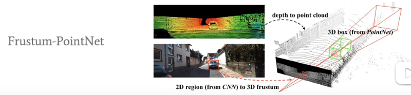

# 基于点云场景的三维物体检测算法及应用

**汇报人:史少帅**

**机构:香港中文大学多媒体实验室**

**研究方向:点云场景下的三维物体检测**

## 1.Introduction to 3D Object Detection from Point Cloud

### 1.1 Introduction

+ Point Cloud (**input**)
  + Unordered sequences of points
  + with shape (N,3):[x,y,z]
+ 3D bounding box (**output**)
  + Localization:(cx,cy,cz)
  + Size: height,width,length
  + Heading direction in bird view俯视图朝向
+ **提取特征的方法**Learning features from point cloud 
  + Point-based:  PointRCNN,STD
  + voxel-based: VoxelNect,SECOND,PointPillar,Part-A2,...

**KITTI数据集上3D物体检测发展的脉络:**

## 1.2 Previous Methods

+ 将点云栅格化,投影到俯视图,再使用2D的方法进行目标检测

会有精度损失

+  2D->3D

先在2D图像上面进行目标检测,得到检测框,再把这个2D框投影到3D点云中,从点云中抠出来一块点云作为候选,然后在这块点云中进行目标检测

缺点:

2D 与 3D完全分离, 2D框作为桥梁

1.很依赖2D的检测结果,如果在图像中没有检测到目标,3D中也会漏检

2.图像存在遮挡:比如说,汽车后面有个行人,在2D中是很难检测出来的,但是3D中是很容易检测到的

# 2.PointRCNN:

**PointRCNN: 3D Object Proposal Generation and Detection from Point Cloud**

+ 第一个two-stage的3D目标检测
+ 第一个anchor-free
+ point-based
+ Codebase: https://github.com/sshaoshuai/PointRCNN

## problems of exited methods

## our motivations

+ 在3D点云中,除了地面,前景点是天然分开的
+ 传统anchor-based的方法,很耗时,耗显存
+ 直接从原始点云中产生3D框,需要先分割

## PointRCNN:RPN

第一个阶段,生成proposals

将原始点云输入PointNet++,得到每一个点的特征向量,包括了content信息

