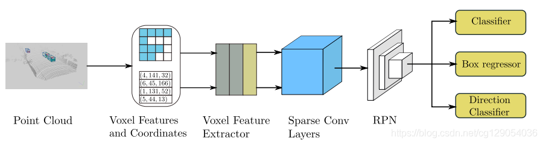
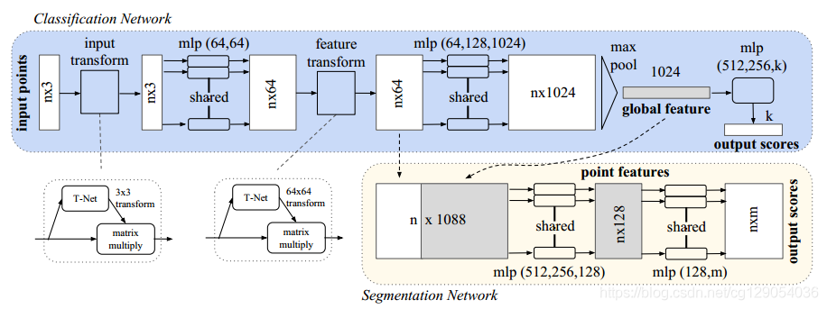

[TOC]

# 1. 3D目标检测概述

[from csdn](https://blog.csdn.net/cg129054036/article/details/107267112)

原CSDN博文是根据github上的开源项目`OpenPCDet`整理而来,使用项目中提供的预训练模型.

实现的3D目标检测算法是`PointPillars`,论文地址:https://arxiv.org/abs/1812.05784,在`Mendeley`中已经阅读过,有笔记,感觉应该多看几遍,==**把流程背熟.**==

使用的激光雷达点云数据集是KITTI数据集

## 1.1 3D目标检测推荐视频

1. `OpenPCDet`[项目作者此前分享的报告 B站](https://www.bilibili.com/video/av89811975?zw)     										   [看了一半]
2.  **[点云3D目标检测算法库OpenPCDet解析与开发实践 智东西](https://apposcmf8kb5033.pc.xiaoe-tech.com/detail/l_5fb8bf9ce4b04db7c0901362/4)**                [看完]

3.  **[PointNet作者亲述90分钟带你了解3D物体检测算法和未来方向 B站](https://player.bilibili.com/player.html?aid=331282171)**  [未看]

## 1.2 3D目标检测现状

激光雷达（`LiDAR`）是使用最为广泛的3D传感器，LiDAR可以生成**稀疏，不规则的点云数据**。

根据点云的表示处理方法不同,检测方法可以分为两类`point-based`和`grid-based`

### 1.2.1 grid-based

由于点云是不规则的，之前的学者通常会对点云进行投影或栅格化处理，转换成规则的`grid`数据格式，然后再使用2D或3D`CNN`处理。

+ `MV3D`（https://arxiv.org/abs/1611.07759）将点云投影到鸟瞰图或前视图上进行处理，然后使用多个预定义的`3D anchors`来生成`3D bounding boxes`。
+ 除了将点云投影到鸟瞰图上，还可以将点云直接转换为3D Voxels格式，然后使用3DCNN来检测，这其中的代表论文有VoxelNet（https://arxiv.org/abs/1711.06396），Second（https://www.mdpi.com/1424-8220/18/10/3337）。

| MV3D         |  |
| ------------ | ------------------------------------------------------------ |
| **VoxelNet** |  |
| **Second**   |  |

以上方法虽然能够高效的生成3D候选方案，但是其目标检测感受野往往是有限的，点云在转换成`grid`时，不可避免的会出现**信息丢失**的情况。

### 1.2.2 point-based

基于Point的方法大多数都是使用`PointNet`（https://arxiv.org/abs/1612.00593）网络进行点云特征学习，这使得网络能有更灵活的**感受野**进行点云特征学习，同时也**保留了点云的原始数据信息**。

这其中的代表论文是`PointRCNN`（https://arxiv.org/abs/1812.04244），这是一个两阶段的目标检测方案，第一阶段通过`PointNet++`网络将点云分为前景点和背景点，然后对每一个前景点生成一个候选方案，第二阶段对前景点及其候选方案进行进一步优化，生成最终的`bounding box`。

| PointNet      |  |
| ------------- | ------------------------------------------------------------ |
| **PointRCNN** |  |

## 1.3 点云3D目标检测开源库

这里引用`PCDet`作者之前分享的文章（https://zhuanlan.zhihu.com/p/152120636）。`PCDet`3D目标检测框架的整体结构设计与优势为：

**数据—模型分离的顶层代码框架设计思想**：

> 与图像处理所不同，不同点云数据集中3D坐标定义与转换往往使研究者很是迷糊。因此，`PCDet`定义了统一的规范化3D坐标表示贯穿整个数据处理与模型计算，从而将**数据模块**与**模型处理模块**完全分离，其优势体现在：
>
> + 研究者在研发不同结构模型时，使用统一标准化的3D坐标系进行各种相关处理（比如计算`loss`、`RoI` `Pooling`和`模型后处理`等），而无需理会不同数据集的坐标规定差异性；
>
> + 研究者在添加新数据集时，只需写少量代码将原始数据转化到标准化坐标定义下，PCDet将自动进行数据增强并适配到各种模型中。
>
>   PCDet数据—模型分离的顶层设计，使得研究者可以轻松适配各种模型到不同的点云3D目标检测数据集上，免去研发模型时迷失在3D坐标转换中的顾虑。


**统一的3D目标检测坐标定义：**

不同的点云数据集在**坐标系**以及**3D框**的定义上往往不一样（KITTI数据集中的camera和LiDAR两个坐标系经常让人混乱），因此在 `PCDet` 中采用了固定的统一点云坐标系，以及更规范的3D检测框定义，贯穿整个数据增强、处理、模型计算以及检测后处理过程。3D检测框的7维信息定义如下：

> 3D bounding box: (x, y, z, dx, dy, dz, heading)

其中，`(x, y, z)`为物体3D框的**几何中心**位置，`(dx, dy, dz)`分别为物体3D框在heading角度为0时沿着`x-y-z`三个方向的长度，heading为物体在俯视图下的**朝向角** (沿着x轴方向为0度角，逆时针x到y角度增加)。

基于 `PCDet` 所采用的标准化3D框定义，再也不用纠结到底是物体3D中心还是物体底部中心；

再也不用纠结物体三维尺寸到底是l-w-h排列还是w-l-h排列；

再也不用纠结heading 0度角到底是哪，到底是顺时针增加还是逆时针增加。

**灵活全面的模块化模型拓扑设计：**

基于下图所示的灵活且全面的模块化设计，在`PCDet`中搭建3D目标检测框架只需要写`config`文件将所需模块定义清楚，然后PCDet将自动根据模块间的拓扑顺序组合为3D目标检测框架，来进行训练和测试。


`PCDet`可以支持目前已有的绝大多数面向LiDAR点云的3D目标检测算法，包括`voxel-based`，`point-based`，`point-voxel hybrid`以及`one-stage/two-stage`等等3D目标检测算法。


# 2. PointPillars网络及工程概述

## 2.1 PointPillars工作原理

>  在`paper_lists.md`中有详细的==阅读笔记==

现在不妨先了解一下`PointPillars`是如何工作的。`PointPillars`整体思路是将3维的点云转成2维的伪图像，然后使用二维卷积网络进行端到端的目标检测，网络结构如下图所示。


下面分别介绍`PointPillars`的三个子网络部分:

**（1）Pillar Feature Net**

`Feature Net`主要负责把点云数据处理成类似图像的数据. 首先将原始点云数据投影到`x-y`平面,得到一个`h x w`的网格,每一个网格就是一个`Pillar`,共有`h x w`个`Pillar`.

原始的点云数据有`(x,y,z,r)`四个维度,r代表点云反射率，论文中将其扩展为9个维度`(x, y, z, r, x_c, y_c, z_c, x_p, y_p)`，带c下标的是柱子中的点相对于柱子中心的偏移位置坐标，带p下标的是点相对于整个大网格中心的全局偏移位置坐标。于是就形成了维度为`（D, P, N）`的张量， 其中`D=9`（不过PCDet实现与论文稍有不同，PCDet扩展成D=10）, N为每个Pillar的采样点数，P为非空的Pillar数目。

然后就是学习点云特征，用一个简化的`PointNet`从`D`维中学出`C`个channel来得到一个`(C, P, N)`的张量。在`Ｎ`这个维度上做`max pooling operation`，得到`(C, P)`的张量．最后得到`(C,H,W)`的伪图像．

**（2）Backbone**

包含两个子网络，一个是自上而下的下采样网络，另一个是上采样网络，具体网络结构可以看本文2.2节。

 **(3）Detection**

检测头使用的是SSD的检测头，关于SSD算法细节可以参考《动手学深度学习》这本书（http://zh.d2l.ai/chapter_computer-vision/ssd.html）。
PointPillars工作原理就介绍这么多，下面将介绍P据github上的开源项目ointPillar工程的整体结构。

## 2.2 PointPillar工程

参考`PCDet`，`PointPillars`各文件组织方式如下，这里暂时只需要对整个工程有个整体印象，后面将逐步完成各文件中的代码：

```
PCDet
├── data
│   ├── velodyne      
│   │   │──000010.bin
├── output            
├── pcdet
│	├── datasets     
│   │   │──kitti & __init__.py & dataset.py
│	├── models        
│   │   │──bbox_heads  & detectors & model_utils & rpn & vfe
│	├── ops           
│   │   │──iou3d_nms & roiaware_pool3d
│	├── utils        
│   │   │──box_coder_utils.py & box_utils.pu & commn_utils.py
│	├── config.py     
├── tools             
│	├── pointpillars.pth & pointpillar.yaml & test.py & test.sh
```

下面给出`PointPillars`的网络结构,主要由三部分组成,网路结构相对也是比较简单的，这可能也是`PointPillars`为何是KITTI数据集上**运算速度最快**的原因。


下面是网络的具体结构:

```
PointPillar(
  (vfe): PillarFeatureNetOld2(
    (pfn_layers): ModuleList(
      (0): PFNLayer(
        (linear): Linear(in_features=10, out_features=64, bias=False)
        (norm): BatchNorm1d(64, eps=0.001, momentum=0.01, affine=True, track_running_stats=True)
      )
    )
  )
  (rpn_net): PointPillarsScatter()
  (rpn_head): RPNV2(
    (blocks): ModuleList(
      (0): Sequential(
        (0): ZeroPad2d(padding=(1, 1, 1, 1), value=0.0)
        (1): Conv2d(64, 64, kernel_size=(3, 3), stride=(2, 2), bias=False)
        (2): BatchNorm2d(64, eps=0.001, momentum=0.01, affine=True, track_running_stats=True)
        (3): ReLU()
        (4): Conv2d(64, 64, kernel_size=(3, 3), stride=(1, 1), padding=(1, 1), bias=False)
        (5): BatchNorm2d(64, eps=0.001, momentum=0.01, affine=True, track_running_stats=True)
        (6): ReLU()
        (7): Conv2d(64, 64, kernel_size=(3, 3), stride=(1, 1), padding=(1, 1), bias=False)
        (8): BatchNorm2d(64, eps=0.001, momentum=0.01, affine=True, track_running_stats=True)
        (9): ReLU()
        (10): Conv2d(64, 64, kernel_size=(3, 3), stride=(1, 1), padding=(1, 1), bias=False)
        (11): BatchNorm2d(64, eps=0.001, momentum=0.01, affine=True, track_running_stats=True)
        (12): ReLU()
      )
      (1): Sequential(
        (0): ZeroPad2d(padding=(1, 1, 1, 1), value=0.0)
        (1): Conv2d(64, 128, kernel_size=(3, 3), stride=(2, 2), bias=False)
        (2): BatchNorm2d(128, eps=0.001, momentum=0.01, affine=True, track_running_stats=True)
        (3): ReLU()
        (4): Conv2d(128, 128, kernel_size=(3, 3), stride=(1, 1), padding=(1, 1), bias=False)
        (5): BatchNorm2d(128, eps=0.001, momentum=0.01, affine=True, track_running_stats=True)
        (6): ReLU()
        (7): Conv2d(128, 128, kernel_size=(3, 3), stride=(1, 1), padding=(1, 1), bias=False)
        (8): BatchNorm2d(128, eps=0.001, momentum=0.01, affine=True, track_running_stats=True)
        (9): ReLU()
        (10): Conv2d(128, 128, kernel_size=(3, 3), stride=(1, 1), padding=(1, 1), bias=False)
        (11): BatchNorm2d(128, eps=0.001, momentum=0.01, affine=True, track_running_stats=True)
        (12): ReLU()
        (13): Conv2d(128, 128, kernel_size=(3, 3), stride=(1, 1), padding=(1, 1), bias=False)
        (14): BatchNorm2d(128, eps=0.001, momentum=0.01, affine=True, track_running_stats=True)
        (15): ReLU()
        (16): Conv2d(128, 128, kernel_size=(3, 3), stride=(1, 1), padding=(1, 1), bias=False)
        (17): BatchNorm2d(128, eps=0.001, momentum=0.01, affine=True, track_running_stats=True)
        (18): ReLU()
      )
      (2): Sequential(
        (0): ZeroPad2d(padding=(1, 1, 1, 1), value=0.0)
        (1): Conv2d(128, 256, kernel_size=(3, 3), stride=(2, 2), bias=False)
        (2): BatchNorm2d(256, eps=0.001, momentum=0.01, affine=True, track_running_stats=True)
        (3): ReLU()
        (4): Conv2d(256, 256, kernel_size=(3, 3), stride=(1, 1), padding=(1, 1), bias=False)
        (5): BatchNorm2d(256, eps=0.001, momentum=0.01, affine=True, track_running_stats=True)
        (6): ReLU()
        (7): Conv2d(256, 256, kernel_size=(3, 3), stride=(1, 1), padding=(1, 1), bias=False)
        (8): BatchNorm2d(256, eps=0.001, momentum=0.01, affine=True, track_running_stats=True)
        (9): ReLU()
        (10): Conv2d(256, 256, kernel_size=(3, 3), stride=(1, 1), padding=(1, 1), bias=False)
        (11): BatchNorm2d(256, eps=0.001, momentum=0.01, affine=True, track_running_stats=True)
        (12): ReLU()
        (13): Conv2d(256, 256, kernel_size=(3, 3), stride=(1, 1), padding=(1, 1), bias=False)
        (14): BatchNorm2d(256, eps=0.001, momentum=0.01, affine=True, track_running_stats=True)
        (15): ReLU()
        (16): Conv2d(256, 256, kernel_size=(3, 3), stride=(1, 1), padding=(1, 1), bias=False)
        (17): BatchNorm2d(256, eps=0.001, momentum=0.01, affine=True, track_running_stats=True)
        (18): ReLU()
      )
    )
    (deblocks): ModuleList(
      (0): Sequential(
        (0): ConvTranspose2d(64, 128, kernel_size=(1, 1), stride=(1, 1), bias=False)
        (1): BatchNorm2d(128, eps=0.001, momentum=0.01, affine=True, track_running_stats=True)
        (2): ReLU()
      )
      (1): Sequential(
        (0): ConvTranspose2d(128, 128, kernel_size=(2, 2), stride=(2, 2), bias=False)
        (1): BatchNorm2d(128, eps=0.001, momentum=0.01, affine=True, track_running_stats=True)
        (2): ReLU()
      )
      (2): Sequential(
        (0): ConvTranspose2d(256, 128, kernel_size=(4, 4), stride=(4, 4), bias=False)
        (1): BatchNorm2d(128, eps=0.001, momentum=0.01, affine=True, track_running_stats=True)
        (2): ReLU()
      )
    )
    (conv_cls): Conv2d(384, 18, kernel_size=(1, 1), stride=(1, 1))
    (conv_box): Conv2d(384, 42, kernel_size=(1, 1), stride=(1, 1))
    (conv_dir_cls): Conv2d(384, 12, kernel_size=(1, 1), stride=(1, 1))
  )
)
```

最后，我们看一下`PointPillar.yaml`配置文件，**配置文件存储着网络具体参数，以及训练和测试参数**，这在后面的代码编写时会多次用到：

```yaml
CLASS_NAMES: ['Car', 'Pedestrian', 'Cyclist']

DATA_CONFIG:
    DATASET: 'KittiDataset'
    DATA_DIR: 'data'
    FOV_POINTS_ONLY: True
    NUM_POINT_FEATURES: {
        'total': 4,
        'use': 4
    }
    POINT_CLOUD_RANGE: [0, -39.68, -3, 69.12, 39.68, 1]
    MASK_POINTS_BY_RANGE: True

    TRAIN:
        INFO_PATH: [
            data/kitti_infos_train.pkl
        ]
        SHUFFLE_POINTS: True
        MAX_NUMBER_OF_VOXELS: 16000

    TEST:
        INFO_PATH: [
            data/kitti_infos_val.pkl
        ]
        SHUFFLE_POINTS: False
        MAX_NUMBER_OF_VOXELS: 40000            

    AUGMENTATION:
        NOISE_PER_OBJECT:
            ENABLED: True
            GT_LOC_NOISE_STD: [1.0, 1.0, 0.1]
            GT_ROT_UNIFORM_NOISE: [-0.78539816, 0.78539816]
        NOISE_GLOBAL_SCENE:
            ENABLED: True
            GLOBAL_ROT_UNIFORM_NOISE: [-0.78539816, 0.78539816]
            GLOBAL_SCALING_UNIFORM_NOISE: [0.95, 1.05]
        DB_SAMPLER:
            ENABLED: True
            DB_INFO_PATH: [
                data/kitti/kitti_dbinfos_train.pkl
            ]
            PREPARE:
                filter_by_difficulty: [-1]
                filter_by_min_points: ['Car:5', 'Pedestrian:5', 'Cyclist:5']
            RATE: 1.0
            SAMPLE_GROUPS: ['Car:15','Pedestrian:10', 'Cyclist:10']
            USE_ROAD_PLANE: True

    VOXEL_GENERATOR:
        MAX_POINTS_PER_VOXEL: 32   
        VOXEL_SIZE: [0.16, 0.16, 4] 


MODEL:
    NAME: PointPillar 
    VFE:
        NAME: PillarFeatureNetOld2
        ARGS: {
            'use_norm': True,
            'num_filters': [64],
            'with_distance': False,
        }

    RPN:
        PARAMS_FIXED: False  # DO NOT USE THIS
        BACKBONE:
            NAME: PointPillarsScatter
            ARGS: {}

        RPN_HEAD:
            NAME: RPNV2
            DOWNSAMPLE_FACTOR: 8
            ARGS: {
                'use_norm': True,
                'concat_input': False,
                'num_input_features': 64,
                'layer_nums': [3, 5, 5],
                'layer_strides': [2, 2, 2],
                'num_filters': [64, 128, 256], 
                'upsample_strides': [1, 2, 4],
                'num_upsample_filters': [128, 128, 128],
                'encode_background_as_zeros': True,

                'use_direction_classifier': True,
                'num_direction_bins': 2,
                'dir_offset': 0.78539,      
                'dir_limit_offset': 0.0,
                'use_binary_dir_classifier': False
            }
            TARGET_CONFIG:
                DOWNSAMPLED_FACTOR: docker2 
                BOX_CODER: ResidualCoder

                REGION_SIMILARITY_FN: nearest_iou_similarity
                SAMPLE_POS_FRACTION: -1.0
                SAMPLE_SIZE: 512         

                ANCHOR_GENERATOR: [
                    {'anchor_range': [0, -40.0, -1.78, 70.4, 40.0, -1.78], 
                     'sizes': [[1.6, 3.9, 1.56]],
                     'rotations': [0, 1.57],
                     'matched_threshold': 0.6,
                     'unmatched_threshold': 0.45,
                     'class_name': 'Car'},
                    {'anchor_range': [0, -40, -0.6, 70.4, 40, -0.6],
                     'sizes': [[0.6, 0.8, 1.73]],
                     'rotations': [0, 1.57],
                     'matched_threshold': 0.5,
                     'unmatched_threshold': 0.35,
                     'class_name': 'Pedestrian'},
                    {'anchor_range': [0, -40, -0.6, 70.4, 40, -0.6],
                     'sizes': [[0.6, 1.76, 1.73]],
                     'rotations': [0, 1.57],
                     'matched_threshold': 0.5,
                     'unmatched_threshold': 0.35,
                     'class_name': 'Cyclist'},
                ]

    RCNN:
        ENABLED: False

    LOSSES:
        RPN_REG_LOSS: smooth-l1
        LOSS_WEIGHTS: {
            'rpn_cls_weight': 1.0,
            'rpn_loc_weight': 2.0,
            'rpn_dir_weight': 0.2,
            'code_weights': [1.0, 1.0, 1.0, 1.0, 1.0, 1.0, 1.0]
        }

    TRAIN:
        SPLIT: train

        OPTIMIZATION:
            OPTIMIZER: adam_onecycle
            LR: 0.003
            WEIGHT_DECAY: 0.01
            MOMENTUM: 0.9

            MOMS: [0.95, 0.85]
            PCT_START: 0.4
            DIV_FACTOR: 10
            DECAY_STEP_LIST: [35, 45]
            LR_DECAY: 0.1
            LR_CLIP: 0.0000001

            LR_WARMUP: False
            WARMUP_EPOCH: 1

            GRAD_NORM_CLIP: 10

    TEST:
        SPLIT: val

        NMS_TYPE: nms_gpu
        MULTI_CLASSES_NMS: False
        NMS_THRESH: 0.01
        SCORE_THRESH: 0.1       
        USE_RAW_SCORE: True      

        NMS_PRE_MAXSIZE_LAST: 4096
        NMS_POST_MAXSIZE_LAST: 500

        RECALL_THRESH_LIST: [0.5, 0.7]

        EVAL_METRIC: kitti

        BOX_FILTER: {
            'USE_IMAGE_AREA_FILTER': True,
            'LIMIT_RANGE': [0, -40, -3.0, 70.4, 40, 3.0]
        }
```

我们也可以看看本工程的代码量，总共有2280行代码，其中对于`CUDA`和`C++`部分，我们使用`PCDet`工程中提供的代码，将重点放在`Python`代码的编写部分

```
-------------------------------------------------------------------------------
Language                     files          blank        comment           code
-------------------------------------------------------------------------------
Python                          22            399            875           1183
CUDA                             2            156             72            525
C++                              2             92             47            226
Markdown                         1             34              0            199
YAML                             1             26              0            146
Bourne Shell                     1              0              0              1
-------------------------------------------------------------------------------
SUM:                            29            707            994           2280
-------------------------------------------------------------------------------
```

**总结**：本文首先对3D目标检测研究现状进行了概述，然后介绍了`PCDet`3D目标检测库，最后对要实现的`PointPillars`工作原理及其工程进行了介绍。在下一篇文章中我们将开始从头编写代码，一步一步实现3D检测模型。

# 3. 点云数据预处理

在图像目标检测中，一般不需要对图像进行预处理操作，直接输入原始图像即可得到最终的检测结果。

但是在点云3D目标检测中，往往需要对点云进行一定的预处理，本文将介绍在`PointPillars`模型中如何对点云进行预处理。

这里的点云数据预处理操作同样也适用其它的基于`Voxels`的3D检测模型中。

## 3.1 配置模型文件config.py

`路径:pcdet/config.py`

在这里我们将首先编写在整个工程中最重要的`config.py`文件，该文件主要包括三个函数。

作用分别是：

1. 加载模型配置文件`pointpillar.yaml`

2. 将模型参数保存在日志文件中

3. 以及解析终端命令修改模型配置参数。

**关于上述三个函数，只需要会使用即可**。首先导入需要的Python库：

```python
from easydict import EasyDict
from pathlib import Path
import yaml
```

### 3.1.1 将模型参数保存在日志文件

这一部分是将整个网络模型的全部参数保存到日志文件中，在模型训练过程中每一个模块的代码往往会修改很多次。

有了日志文件，我们就能很方便地查看每次所修改的地方，如果有疑问的话，可以借助日志文件快速定位问题，代码如下：

```python
def log_config_to_file(cfg, pre='cfg', logger=None):
    for key, val in cfg.items():
        if isinstance(cfg[key], EasyDict):
            logger.info('\n%s.%s = edict()' % (pre, key))
            log_config_to_file(cfg[key], pre=pre+ '.' + key, logger=logger)
            continue
        logger.info('%s.%s: %s' % (pre, key, val))
```

> python基础

> 1.isinstance()
>
> isinstance() 函数来判断一个对象是否是一个已知的类型
>
> isinstance(object, classinfo)
>
> 参数
>
> object -- 实例对象。
>
> classinfo -- 可以是直接或间接类名、基本类型或者由它们组成的元组。

> 2.EasyDict
>
> 可以使得以属性的方式去访问字典的值
>
> ```python
> >>> from easydict import EasyDict as edict
> >>> d = edict({'foo':3, 'bar':{'x':1, 'y':2}})
> >>> d.foo
> 3
> >>> d.bar.x
> 1
>  
> >>> d = edict(foo=3)
> >>> d.foo
> ```

### 3.1.2 加载模型配置文件

下面一个函数是从配置文件`pointpillar.yaml`中加载网络模型参数。

在Python中我们使用字典这种数据类型来存储网络的各种参数，只需要命名好参数名称即可，如测试集，训练集名称，网络各子模块名称，损失函数名称等，在修改时也只需要修改对应参数的变量值即可，这是一个很方便的调参方式。代码如下：

```python
def cfg_from_yaml_file(cfg_file, config):
    with open(cfg_file, 'r') as f:
        try:
            new_config = yaml.load(f, Loader=yaml.FullLoader)
        except:
            new_config = yaml.load(f)

        merge_new_config(config=config, new_config=new_config)

    return config
# 
def merge_new_config(config, new_config):
    if '_BASE_CONFIG_' in new_config:
        with open(new_config['_BASE_CONFIG_'], 'r') as f:
            try:
                yaml_config = yaml.load(f, Loader=yaml.FullLoader)
            except:
                yaml_config = yaml.load(f)
        config.update(EasyDict(yaml_config))

    for key, val in new_config.items():
        if not isinstance(val, dict):
            config[key] = val
            continue
        if key not in config:
            config[key] = EasyDict()
        merge_new_config(config[key], val)

    return config
```

### 3.1.3 解析终端命令修改模型配置参数

除了对模型配置文件`.yaml`进行修改外，也可以在执行时通过终端来修改模型的参数。

这时就要求程序能够获取终端信息，**包括参数名称以及参数值，通常是成对出现**，代码如下

```python
def cfg_from_list(cfg_list, config):
    """Set config keys via list (e.g., from command line)."""
    from ast import literal_eval
    assert len(cfg_list) % 2 == 0
    for k, v in zip(cfg_list[0::2], cfg_list[1::2]):
        key_list = k.split('.')
        d = config
        for subkey in key_list[:-1]:
            assert subkey in d, 'NotFoundKey: %s' % subkey
            d = d[subkey]
        subkey = key_list[-1]
        assert subkey in d, 'NotFoundKey: %s' % subkey
        try:
            value = literal_eval(v)
        except:
            value = v

        if type(value) != type(d[subkey]) and isinstance(d[subkey], EasyDict):
            key_val_list = value.split(',')
            for src in key_val_list:
                cur_key, cur_val = src.split(':')
                val_type = type(d[subkey][cur_key])
                cur_val = val_type(cur_val)
                d[subkey][cur_key] = cur_val
        elif type(value) != type(d[subkey]) and isinstance(d[subkey], list):
            val_list = value.split(',')
            for k, x in enumerate(val_list):
                val_list[k] = type(d[subkey][0])(x)
            d[subkey] = val_list
        else:
            assert type(value) == type(d[subkey]), \
                'type {} does not match original type {}'.format(type(value), type(d[subkey]))
            d[subkey] = value
```

下面我们来定义模型参数配置变量`cfg`，其本身是一个字典，现在我们先定义它的根路径。

至此配置文件代码编写完毕，不妨可以调用`cfg_from_yaml_file`函数加载`yaml`文件看看模型参数加载是否正确。

```python
def parse_config():
    parser = argparse.ArgumentParser(description='arg parser')
    parser.add_argument('--cfg_file', type=str, default='cfgs/kitti_models/pointpillar.yaml', help='specify the config for training')

    args = parser.parse_args()

    cfg_from_yaml_file(args.cfg_file, cfg)

    return args, cfg

def main():
    args,cfg = parse_config()
    print(cfg.DATA_CONFIG.keys())

if __name__ == '__main__':
    main()
```

## 3.2 点云数据预处理

现在我们对`KITTI数据集`进行预处理，最终将其加载到`PyTorch`的`DataLoader`中。

### 3.2.1 DatasetTemplate类

首先是`dataset.py`文件，我们使用Python中的`Class`来对点云数据进行预处理，数据的预处理操作都定义为`Class`的成员函数。

先首先定义一个`DatasetTemplate`类，当做点云数据的一个基类，它继承自Dataset,后面处理其它点云数据集时可以在此基础上进行不同的操作，导入必要的Python库：

```python
import numpy as np
from collections import defaultdict
import torch.utils.data as torch_data
import sys 
sys.path.append('../')
sys.path.append('../../')
from utils import common_utils
from config import cfg

class DatasetTemplate(torch_data.Dataset):
	def __init__(self):
        super().__init__()
```

在`DatasetTemplate`中我们定义两个成员函数，一个是数据准备函数`prepare_data`。

输入的是点云数据帧编号(idx)和原始点云数据(N,3+C1),以字典形式传输,输出为:

+ voxels
+ voxels坐标
+ 每一个voxel中的点数
+ voxel的中心坐标
+ 原始点云数据

输出同样以字典形式输出。

```python
def prepare_data(self, input_dict):
	"""
    :param input_dict:
    	sample_idx: string
        points: (N, 3 + C1)
    :return:
        voxels: (N, max_points_of_each_voxel, 3 + C2), float
        num_points: (N), int
        coordinates: (N, 3), [idx_z, idx_y, idx_x]
        voxel_centers: (N, 3)
        points: (M, 3 + C)
    """
    sample_idx = input_dict['sample_idx']
    points = input_dict['points']
    points = points[:, :cfg.DATA_CONFIG.NUM_POINT_FEATURES['use']]     

    # voxels, coordinates, num_points
    voxels, coordinates, num_points = self.voxel_generator.generate(points, \
                                      max_voxels=cfg.DATA_CONFIG[self.mode].MAX_NUMBER_OF_VOXELS)    
       
    # voxel_centers
    voxel_centers = (coordinates[:, ::-1] + 0.5) * self.voxel_generator.voxel_size \
                    + self.voxel_generator.point_cloud_range[0:3]
    print('voxel_centers.shape is: ', voxel_centers.shape)       # (11719, 3)
    if cfg.DATA_CONFIG.MASK_POINTS_BY_RANGE:
        points = common_utils.mask_points_by_range(points, cfg.DATA_CONFIG.POINT_CLOUD_RANGE)
    
    example = {}

    example.update({'voxels': voxels,
                    'num_points': num_points,
                    'coordinates': coordinates,
                    'voxel_centers': voxel_centers,
                    'points': points})
    
    return example
```

另一个函数是`collate_batch`，作用是在加载数据集时如何选取数据。

```python
@staticmethod
def collate_batch(batch_list, _unused=False):
	example_merged = defaultdict(list)
    for example in batch_list:
        for k, v in example.items():
            example_merged[k].append(v)
    ret = {}
    for key, elems in example_merged.items():
        if key in ['voxels', 'num_points', 'voxel_centers', 'seg_labels', 'part_labels', 'bbox_reg_labels']:
            ret[key] = np.concatenate(elems, axis=0)
        elif key in ['coordinates', 'points']:
            coors = []
            for i, coor in enumerate(elems):
                coor_pad = np.pad(coor, ((0, 0), (1, 0)), mode='constant', constant_values=i)
                coors.append(coor_pad)
            ret[key] = np.concatenate(coors, axis=0)
        elif key in ['gt_boxes']:
            max_gt = 0
            batch_size = elems.__len__()
            for k in range(batch_size):
                max_gt = max(max_gt, elems[k].__len__())
            batch_gt_boxes3d = np.zeros((batch_size, max_gt, elems[0].shape[-1]), dtype=np.float32)
            for k in range(batch_size):
                batch_gt_boxes3d[k, :elems[k].__len__(), :] = elems[k]
            ret[key] = batch_gt_boxes3d
        else:
            ret[key] = np.stack(elems, axis=0)
    ret['batch_size'] = batch_list.__len__()
    return ret
```

### 3.2.2 KittiDataset类

现在我们编写`kitti_dataset.py`，主要目的是创造`KittiDataset`类，首先是导入所需库：

```python
import os
import sys
import pickle 
import copy
import numpy as np
from pathlib import Path 
import torch 
import sys 
sys.path.append('../')
sys.path.append('../../')
from config import cfg 
from spconv.utils import VoxelGenerator
from ..dataset import DatasetTemplate
```

在这里我们首先定义一个`BaseKittiDataset`类，这里初始化只有一个参数，就是点云数据的存储路径`root_path`。

```python
class BaseKittiDataset(DatasetTemplate):
    def __init__(self, root_path):
        super().__init__()
        self.root_path = root_path
```

编写获取点云数据的`get_lidar`函数,`KITTI`中的点云数据是以二进制格式保存的,每个点有4个信息:(x,y,z,r),数据类型为`float32`:

```python
def get_lidar(self, idx):
	lidar_file = os.path.join(self.root_path, 'velodyne', '%06d.bin' % idx)
    assert os.path.exists(lidar_file)
    return np.fromfile(lidar_file, dtype=np.float32).reshape([-1, 4])      
```

此外我们也可以编写函数`get_infos`来获取点云信息，具体为：

```python
def get_infos(self, idx):
	import concurrent.futures as futures

    info = {}
    pc_info = {'num_features':4, 'lidar_idx': idx}
    info['point_cloud'] = pc_info
    return info
```

这里有一个生成最终预测结果的函数，因为模型计算时使用的是GPU，而要保存时需要转化为CPU可访问的数据

预测信息有box尺寸`box3d_lidar`，分值`scores`，目标类型标签`label_preds`，以及点云编号`sample_idx`。

```python
@staticmethod
def generate_prediction_dict(input_dict, index, record_dict):
	# finally generate predictions.
    sample_idx = input_dict['sample_idx'][index] if 'sample_idx' in input_dict else -1
    boxes3d_lidar_preds = record_dict['boxes'].cpu().numpy()

    if boxes3d_lidar_preds.shape[0] == 0:
    	return {'sample_idx': sample_idx}
     
    predictions_dict ={
        'box3d_lidar': boxes3d_lidar_preds,
        'scores': record_dict['scores'].cpu.numpy(),
        'label_preds': record_dict['labels'].cpu().numpy(),
        'sample_idx': sample_idx
    }

    return predictions_dict
```

现在我们就可以创建`KittiDataset`类了，同样初始化时需要设置数据路径，这里我们需要将模式设置为`TEST`：

```python
class KittiDataset(BaseKittiDataset):
    def __init__(self, root_path, logger=None):
        super().__init__(root_path=root_path)

        self.logger = logger
        self.mode = 'TEST'
        self.kitti_infos = []
        self.include_kitti_data(self.mode, logger)
        self.dataset_init(logger)
```

在初始化时，有一个`dataset_init`函数，这个函数是用来生成`voxel_generator`的，使用的库为`Spconv`，在上面的`prepare_data`函数中会使用这个`voxel_generator`，代码如下：

```python
def dataset_init(self, logger):
	voxel_generator_cfg = cfg.DATA_CONFIG.VOXEL_GENERATOR
        
    self.voxel_generator = VoxelGenerator(voxel_size=voxel_generator_cfg.VOXEL_SIZE,
                                          point_cloud_range=cfg.DATA_CONFIG.POINT_CLOUD_RANGE,
                                          max_num_points=voxel_generator_cfg.MAX_POINTS_PER_VOXEL)
```

`include_kitti_data`函数是用来加载`pkl`文件的，我们会将待处理的点云信息存储在`pkl`文件中，这样测试模型时只需使用这一个文件就可以访问全部点云数据了：

```python
def include_kitti_data(self, mode, logger):
	if cfg.LOCAL_RANK == 0 and logger is not None:
		logger.info('Loading KITTI dataset')
        kitti_infos = []

        for info_path in cfg.DATA_CONFIG[mode].INFO_PATH:        
            info_path = cfg.ROOT_DIR / info_path
            with open(info_path, 'rb') as f:
                infos = pickle.load(f)
                kitti_infos.append(infos)
        self.kitti_infos.extend(kitti_infos)

        if cfg.LOCAL_RANK == 0 and logger is not None:
            logger.info('Total samples for KITTI dataset: %d' % (len(kitti_infos)))
```

