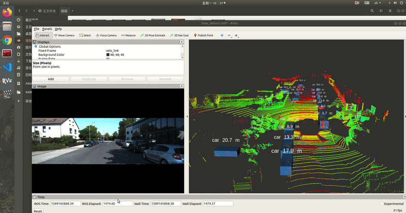

# 基于全卷积神经网络的点云三维目标检测

[from csdn](https://adamshan.blog.csdn.net/article/details/106157761)

**cnn-seg:** 

该模型被集成与**Apollo**的**perception**模块,自从**Apollo 3.0** 开始一直是Apollo用于点云障碍物检测的主力模型,在Apollo 6.0中被**PointPillars**代替

原CSDN博客是在Apollo Perception 模块和Autoware的lidar_apollo_cnn_seg_detect模块的基础上修改的,做了一些改进并且解决了一些bug,希望通过本篇博客,可以实现开头动图的效果,如果能够掌握训练模型的方法就更好了.

## 1.全卷积神经网络介绍

全卷积神经网络使用`卷积层`替换了`卷积神经网络`中的全连接层,

