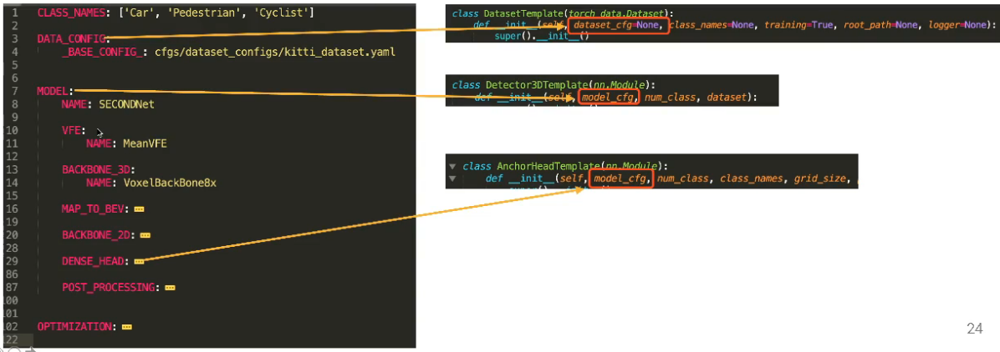

# 点云3D目标检测算法库OpenPCDet解析与开发实践

[视频链接](https://apposcmf8kb5033.pc.xiaoe-tech.com/live_pc/l_5fb8bf9ce4b04db7c0901362)

**主题：点云3D目标检测算法库OpenPCDet解析与开发实践**
**提纲：**
**1、点云3D目标检测的研究背景**
**2、OpenPCDet算法库的框架组成**
**3、开发实践**
**\- PointRCNN，PV-RCNN等多种3D目标检测算法在OpenPCDet上的开发实践**

1没有看,从2开始看的

## 1.架构

主要想法是数据和模型的分离,

先把数据转换成统一的格式,再输入到模型中

## 2.统一的坐标系和3D box

+ **统一的坐标系(前左上)**

  + 
  + x:前(车前进的方向)
  + y:左
  + z:上

+ **统一的3D框**

  

  + $(cx,cy,cz,dx,dy,dz,heading)$

    + $(cx,cy,cz)$ 中心点
    + $(dx,dy,dz)$这个3D框,沿x,y,z轴方向的长度(角度为0时)
    + 不使用传统的长宽高,很容易引起歧义

  + heading

    x轴是0度,朝着y轴是角度增加的方向

## 3.Data flow

进入模型前的数据处理

在`OpenPCDet/pcdet/datasets/dataset.py`中有一个基类`DatasetTemplate`

新添加一个dataset,就继承这个类,根据情况实现画线的三个函数,然后输入prepare_data()处理

+ `__getitem__`函数

  加载点云数据,并转换到统一的坐标系

  dataset中保存的格式是Data_dict:

  points: (N, 3 + C_in)
  gt_boxes: optional, (N, 7 + C) [x, y, z, dx, dy, dz, heading, ...]
  gt_names: optional, (N), string

  或得数据后,首先

+ 收据增强data_dict = **self.data_augmentor**.forward()

  对点云数据还有gt box做一些数据增强

+ **point_feature_encoder**

  对输入的点云数据点进行encoder,输入的点是3+C_in维的,但是不同的网络模型对于输入的点的格式要求不一样,这里就对这些点的属性进行重新定义

+ **data_processor**

  数据预处理,

  把超出范围的数据去除,对点进行采样,把点打乱等

  体素化,或者转到俯视图

+ **collate_batch**

  取出一个batch
  
  points:(N,1+3+C_out)  :  1:新增加的维度,表示batch的序号
  
  gt_boxes:(B,N_max,7+C) :  N_max:因为每一个点云中gt_box个数不一样,表示每一个样本中gt_box的最大值,对于不足的,0补全
  
## 4.模块化设计

  

  

## 5.配置文件

config文件使用yaml文件编写

每一个config文件之间互相不影响

**一些检测器的例子**

/tools/cfgs

**pointpillars:**

## 6.怎样使用自己的数据集格式

1. 继承DatasetTemplate这个类,实现自己的Dataset
2. 重载`self.__getitem_()`函数,加载点云和3D框,并转换到pcdet同样的格式
3. 调用,`self.prepare_data()`函数处理数据
4. 重载`self.generate_prediction_dicts()`函数把预测结果转换到喜欢的格式
5. 重载`self.evaluation()`函数使用自己的评价指标进行评价

## 7.怎么支持更多的models

