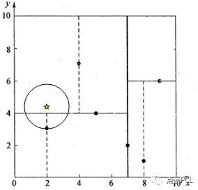
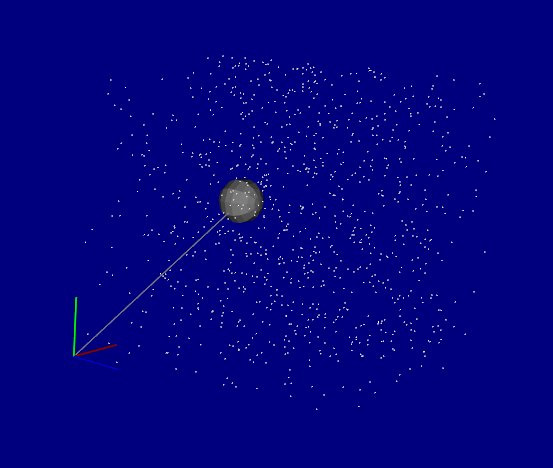

# PCL学习

# 1.PCL简介

## 1.1 PCL介绍

官网：https://pointclouds.org/

GitHub：https://github.com/PointCloudLibrary/pcl

+ 点云数据的处理可以采用获得广泛应用的**Point Cloud Library (点云库，PCL库)。**
+ PCL库是一个最初发布于2013年的开源C++库。它实现了大量点云相关的通用算法和高效的数据管理,**点云获取、滤波、分割、配准、检索、特征提取、识别、追踪、曲面重建、可视化**等

+ 支持多种操作系统平台，可在Windows、Linux、Android、Mac OS X、部分嵌入式实时系统上运行。如果说OpenCV是2D信息获取与处理的技术结晶，那么**PCL在3D信息获取与处理上，就与OpenCV具有同等地位**
+ PCL是BSD授权方式，可以免费进行商业和学术应用。

## 1.2 PCL架构

如图PCL架构图所示，对于3D点云处理来说，PCL完全是一个的模块化的现代C++模板库。

其基于以下第三方库：**Boost、Eigen、FLANN、VTK、CUDA、OpenNI、Qhull**，实现点云相关的**获取、滤波、分割、配准、检索、特征提取、识别、追踪、曲面重建、可视化等。**


我们主要学习的就是里面各种模块，**总体来说16个模块**（下图中有15个，少了recognition），如下：

官网各模块：https://pcl.readthedocs.io/projects/tutorials/en/latest/#

+ [01common](https://github.com/HuangCongQing/pcl-learning/blob/master/01common)
+ [02kdtree k维tree](https://github.com/HuangCongQing/pcl-learning/blob/master/02kdtree)

+ [03octree 八叉树](https://github.com/HuangCongQing/pcl-learning/blob/master/03octree)
+ [04search](https://github.com/HuangCongQing/pcl-learning/blob/master/04search)

+ [05sample consensus 抽样一致性模块](https://github.com/HuangCongQing/pcl-learning/blob/master/05sampleconsensus抽样一致性模块)
+ [06range-images深度图像](https://github.com/HuangCongQing/pcl-learning/blob/master/06range-images深度图像)

+ [07tracking](https://github.com/HuangCongQing/pcl-learning/blob/master/17tracking) （此模块，没有官方示例代码）
+ [08 io 输入输出](https://github.com/HuangCongQing/pcl-learning/blob/master/08IO输入输出)

+ [09 filters 滤波](https://github.com/HuangCongQing/pcl-learning/blob/master/09filters滤波)
+ [10 features 特征](https://github.com/HuangCongQing/pcl-learning/blob/master/10features特征)

+ [11 surface表面](https://github.com/HuangCongQing/pcl-learning/blob/master/11surface表面)
+ [12 segmentation分割](https://github.com/HuangCongQing/pcl-learning/blob/master/12segmentation分割)

+ [13 recognition识别](https://github.com/HuangCongQing/pcl-learning/blob/master/13recognition识别)（下图中没有）
+ [14 registration配准](https://github.com/HuangCongQing/pcl-learning/blob/master/14registration配准)

+ [15 visualization可视化](https://github.com/HuangCongQing/pcl-learning/blob/master/15visualization可视化)
+ [16 keypoints关键点](https://github.com/HuangCongQing/pcl-learning/blob/master/16keypoints关键点)


每个模块都有依赖关系，**依赖关系如下图（可以看出有四层），**最基本的就是最底层的commom模块。

**箭头对应的是依赖关系**，比如第二层的kdtree依赖于common；第四层的registration有四个箭头，分别是sample_consensus, kdtree, common, features。


​																																	官方图


​																													[B站up主](https://space.bilibili.com/504859351/channel/detail?cid=130387)画的更详细的图

# 2.PCL中的点类型

point类型都位于point_types.hpp文件中

/usr/include/pcl-1.7/pcl/impl/point_types.hpp


### 2.1 PointXYZ

**PointXYZ——成员变量：float x,y,z;**

PointXYZ是使用最常见的一个点数据类型，包含三维XYZ坐标信息，这三个浮点数附加一个浮点数来满足存储对齐，

可以通过points[i].data[0]或points[i].x访问点X的坐标值

```C++
union
{
float data[4];  // 附加一个浮点数来满足存储对齐
struct
{
float x;
float y;
float z;
};
};
```

```C++
struct _PointXYZ
  {
    PCL_ADD_POINT4D; // This adds the members x,y,z which can also be accessed using the point (which is float[4])

    EIGEN_MAKE_ALIGNED_OPERATOR_NEW
  };

  PCL_EXPORTS std::ostream& operator << (std::ostream& os, const PointXYZ& p);
  /** \brief A point structure representing Euclidean xyz coordinates. (SSE friendly)
    * \ingroup common
    */
  struct EIGEN_ALIGN16 PointXYZ : public _PointXYZ
  {
    inline PointXYZ (const _PointXYZ &p)
    {
      x = p.x; y = p.y; z = p.z; data[3] = 1.0f;
    }

    inline PointXYZ ()
    {
      x = y = z = 0.0f;
      data[3] = 1.0f;
    }

    inline PointXYZ (float _x, float _y, float _z)
    {
      x = _x; y = _y; z = _z;
      data[3] = 1.0f;
    }

    friend std::ostream& operator << (std::ostream& os, const PointXYZ& p);
    EIGEN_MAKE_ALIGNED_OPERATOR_NEW
  };
```

## 2.2 PointXYZI

**PointXYZI——成员变量：float x,y,z,intensity**

PointXYZI是一个简单的X Y Z坐标加intensity的point类型，是一个单独的结构体，并且满足存储对齐，由于point的大部分操作会把data[4]元素设置成0或1（用于变换），

不能让intensity与XYZ在同一个结构体中，如果这样的话其内容将会被覆盖，

例如：两个点的点积会把第四个元素设置为0，否则点积没有意义，

```C++
union{
float data[4];
struct
{
float x;
float y;
float z;
};
};
union{
struct{
float intensity;
};
float data_c[4];
};
```

## 2.3 PointXYZRGBA

 PointXYZRGBA——成员变量：float x,y,z;uint32_t rgba 除了RGBA信息被包含在一个整型变量中，其他的和PointXYZI类似

```C++
union{
float data[4];
struct
{
float x;
float y;
float z;
};
};
union{
struct{
float rgba;
};
float data_c[4];
};
```

## 2.4 Normal

**Normal——成员变量：float normal[3],curvature;**

另一个常用的数据类型，Normal结构体表示给定点所在样本曲面上的法线方向，以及对应曲率的测量值，

例如访问法向量的第一个坐标可以通过points[i].data_n[0]或者points[i].normal[0]

```C++
union{
float data_n[4]
float normal[3];
struct
{
float normal_x;
float normal_y;
float normal_z;
};
};
union{
struct{
float curvature;
};
float data_c[4];
};
```

## 2.5 PointNormal

**PointNormal——成员变量：float x,y,z;  float normal[3] ,curvature** ; 

PointNormal是存储XYZ数据的point结构体，并且包括了采样点的法线和曲率

```C++
union{
float data[4];
struct
{
float x;
float y;
float z;
};
};

union{
float data_n[4]
float normal[3];
struct
{
float normal_x;
float normal_y;
float normal_z;
};
};
union{
struct{
float curvature;
};
float data_c[4];
};
```

## 2.6 增加自定义的点类型

```C++
#define PCL_NO_PRECOMPILE
 
#ifndef MYPOINTTYPE_H
#define MYPOINTTYPE_H
 
#include <pcl/point_types.h>
 
struct XYZ_CURVA
{
	PCL_ADD_POINT4D;     //XYZ
    float    intensity;                 ///< laser intensity reading
    uint16_t ring;                      ///< laser ring number
	EIGEN_MAKE_ALIGNED_OPERATOR_NEW;     // ensure proper alignment
}EIGEN_ALIGN16;
 
 
POINT_CLOUD_REGISTER_POINT_STRUCT(XYZ_CURVA,// 注册点类型宏
                                  (float, x, x)
                                  (float, y, y)
                                  (float, z, z)
                                  (float, intensity, intensity)
                                  (uint16_t, ring, ring)
	)
 
#endif
```

# 3.PCL的PointCloud类型

PCL的基本数据类型是`PointCloud`，一个`PointCloud`是一个C++的模板类，它包含了以下字段：

+ ```
  width(int)：指定点云数据集的宽度
  ```

  + 对于无组织格式的数据集，width代表了所有点的总数
  + 对于有组织格式的数据集，width代表了一行中的总点数

+ ```
  height(int)：制定点云数据集的高度
  ```

  + 对于无组织格式的数据集，值为1
  + 对于有组织格式的数据集，表示总行数

+ `points(std::vector<PointT>)`：包含所有PointT类型的点的数据列表

# 4.PCL各模块学习

## 4.1 Kd-Tree

k-d树（k-dimensional树的简称），是一种分割k维数据空间的数据结构。主要应用于多维空间关键数据的搜索（如：范围搜索和最近邻搜索）。

K-D树是二进制空间分割树的特殊的情况。用来组织表示K维空间中点的几何，是一种带有其他约束的二分查找树，为了达到目的，通常只在三个维度中进行处理因此所有的kd_tree都将是三维的kd_tree,kd_tree的每一维在指定维度上分开所有的字节点，在树的根部所有子节点是以第一个指定的维度上被分开。

K-D树算法可以分为两大部分，一部分是有关k-d树本身这种数据结构建立的算法(建树)，另一部分是在建立的k-d树上如何进行**最邻近查找**的算法。

先以一个简单直观的实例来介绍k-d树算法。假设有6个二维数据点{（2,3），（5,4），（9,6），（4,7），（8,1），（7,2）}，数据点位于二维空间内（如图1中黑点所示）。

k-d树算法就是要确定图1中这些分割空间的分割线（多维空间即为分割平面，一般为超平面）。下面就要通过一步步展示k-d树是如何确定这些分割线的。


 **构建算法**

k-d树是一个二叉树，每个节点表示一个空间范围。下表给出的是k-d树每个节点中主要包含的数据结构

Node-data就相当于二叉搜索树节点的值,来了一个数据,对应维度的数值就和它相比,比它小是左孩子,比它大是右孩子

range:数据点


从上面对k-d树节点的数据类型的描述可以看出构建k-d树是一个逐级展开的递归过程。下表给出的是构建k-d树的伪代码:


以上述举的实例来看，过程如下：

　　由于此例简单，数据维度只有2维，所以可以简单地给x，y两个方向轴编号为0,1，也即split={0,1}。

　　（1）确定split域的首先该取的值。分别计算x，y方向上数据的方差得知x方向上的方差最大，所以split域值首先取0，也就是x轴方向；

　　（2）确定Node-data的域值。根据x轴方向的值2,5,9,4,8,7排序选出中值为7，所以Node-data = （7,2）。这样，该节点的分割超平面就是通过（7,2）并垂直于split = 0（x轴）的直线x = 7；

　　（3）确定左子空间和右子空间。分割超平面x = 7将整个空间分为两部分，如图2所示。x < =  7的部分为左子空间，包含3个节点{（2,3），（5,4），（4,7）}；另一部分为右子空间，包含2个节点{（9,6），（8,1）}。

​	

如算法所述，k-d树的构建是一个递归的过程。然后对左子空间和右子空间内的数据重复根节点的过程就可以得到下一级子节点（5,4）和（9,6）（也就是左右子空间的'根'节点），同时将空间和数据集进一步细分。如此反复直到空间中只包含一个数据点，如图1所示。最后生成的k-d树如图3所示。


**PCL中k-d树的最邻近查找**

在k-d树中进行数据的查找也是特征匹配的重要环节，其目的是检索在k-d树中与查询点距离最近的数据点。这里先以一个简单的实例来描述最邻近查找的基本思路。

　　星号表示要查询的点（2.1,3.1）。

通过二叉搜索，顺着搜索路径很快就能找到最邻近的近似点，也就是叶子节点（2,3）。而找到的叶子节点并不一定就是最邻近的，最邻近肯定距离查询点更近，应该位于以查询点为圆心且通过叶子节点的圆域内。

为了找到真正的最近邻，还需要进行'回溯'操作：

算法沿搜索路径反向查找是否有距离查询点更近的数据点。

此例中先从（7,2）点开始进行二叉查找，然后到达（5,4），最后到达（2,3），此时搜索路径中的节点为`<（7,2），（5,4），（2,3）>`，首先以（2,3）作为当前最近邻点，计算其到查询点（2.1,3.1）的距离为0.1414，然后回溯到其父节点（5,4），并判断在该父节点的其他子节点空间中是否有距离查询点更近的数据点。以（2.1,3.1）为圆心，以0.1414为半径画圆，如图4所示。**发现该圆并不和超平面y = 4交割**，所以比0.14更小的肯定都在y<4的范围内,因此不用进入（5,4）节点右子空间中去搜索。


再回溯到（7,2），以（2.1,3.1）为圆心，以0.1414为半径的圆更不会与x = 7超平面交割，因此不用进入（7,2）右子空间进行查找。(左节点已经搜索过了)

至此，搜索路径中的节点已经全部回溯完，结束整个搜索，返回最近邻点（2,3），最近距离为0.1414。

一个复杂点的例子,如查找点为（2，4.5）。


同样先进行二叉查找，先从（7,2）查找到（5,4）节点，在进行查找时是由y = 4为分割超平面的，由于查找点为y值为4.5，因此进入右子空间查找到（4,7），

形成搜索路径`<（7,2），（5,4），（4,7）>`，取（4,7）为当前最近邻点，

计算其与目标查找点的距离为3.202。

然后回溯到（5,4），计算其与查找点之间的距离为3.041。以（2，4.5）为圆心，以3.041为半径作圆，如图5所示。可见该圆和y = 4超平面交割，所以需要进入（5,4）左子空间进行查找。

此时需将（2,3）节点加入搜索路径中得`<（7,2），（2,3）>`。回溯至（2,3）叶子节点，（2,3）距离（2,4.5）比（5,4）要近，所以最近邻点更新为（2，3），最近距离更新为1.5。回溯至（7,2），以（2,4.5）为圆心1.5为半径作圆，并不和x = 7分割超平面交割，如图6所示。至此，搜索路径回溯完。返回最近邻点（2,3），最近距离1.5。




k-d树查询算法的伪代码:


上述两次实例表明，当查询点的邻域与分割超平面两侧空间交割时，需要查找另一侧子空间，导致检索过程复杂，效率下降。研究表明N个节点的K维k-d树搜索过程时间复杂度为：$t_{worst}=O(kN^{1-1/k})$。

以上为了介绍方便，讨论的是二维情形。像实际的应用中，如SIFT特征矢量128维，SURF特征矢量64维，维度都比较大，直接利用k-d树快速检索（维数不超过20）的性能急剧下降。假设数据集的维数为D，一般来说要求数据的规模N满足N»2D，才能达到高效的搜索。所以这就引出了一系列对k-d树算法的改进。有待进一步研究学习。

**kd-tree C++实现**

```C++
#include <algorithm>
#include <array>
#include <cmath>
#include <iostream>
#include <random>
#include <vector>

/**
 * Class for representing a point. coordinate_type must be a numeric type.
 */
template<typename coordinate_type, size_t dimensions>
class point {
public:
    point(std::array<coordinate_type, dimensions> c) : coords_(c) {}
    point(std::initializer_list<coordinate_type> list) {
        size_t n = std::min(dimensions, list.size());
        std::copy_n(list.begin(), n, coords_.begin());
    }
    /**
     * Returns the coordinate in the given dimension.
     *
     * @param index dimension index (zero based)
     * @return coordinate in the given dimension
     */
    coordinate_type get(size_t index) const {
        return coords_[index];
    }
    /**
     * Returns the distance squared from this point to another
     * point.
     *
     * @param pt another point
     * @return distance squared from this point to the other point
     */
    double distance(const point& pt) const {
        double dist = 0;
        for (size_t i = 0; i < dimensions; ++i) {
            double d = get(i) - pt.get(i);
            dist += d * d;
        }
        return dist;
    }
private:
    std::array<coordinate_type, dimensions> coords_;
};

template<typename coordinate_type, size_t dimensions>
std::ostream& operator<<(std::ostream& out, const point<coordinate_type, dimensions>& pt) {
    out << '(';
    for (size_t i = 0; i < dimensions; ++i) {
        if (i > 0)
            out << ", ";
        out << pt.get(i);
    }
    out << ')';
    return out;
}

/**
 * C++ k-d tree implementation, based on the C version at rosettacode.org.
 */
template<typename coordinate_type, size_t dimensions>
class kdtree {
public:
    typedef point<coordinate_type, dimensions> point_type;
private:
    struct node {
        node(const point_type& pt) : point_(pt), left_(nullptr), right_(nullptr) {}
        coordinate_type get(size_t index) const {
            return point_.get(index);
        }
        double distance(const point_type& pt) const {
            return point_.distance(pt);
        }
        point_type point_;
        node* left_;
        node* right_;
    };
    node* root_ = nullptr;
    node* best_ = nullptr;
    double best_dist_ = 0;
    size_t visited_ = 0;
    std::vector<node> nodes_;

    struct node_cmp {
        node_cmp(size_t index) : index_(index) {}
        bool operator()(const node& n1, const node& n2) const {
            return n1.point_.get(index_) < n2.point_.get(index_);
        }
        size_t index_;
    };

    node* make_tree(size_t begin, size_t end, size_t index) {
        if (end <= begin)
            return nullptr;
        size_t n = begin + (end - begin)/2;
        auto i = nodes_.begin();
        std::nth_element(i + begin, i + n, i + end, node_cmp(index));
        index = (index + 1) % dimensions;
        nodes_[n].left_ = make_tree(begin, n, index);
        nodes_[n].right_ = make_tree(n + 1, end, index);
        return &nodes_[n];
    }

    void nearest(node* root, const point_type& point, size_t index) {
        if (root == nullptr)
            return;
        ++visited_;
        double d = root->distance(point);
        if (best_ == nullptr || d < best_dist_) {
            best_dist_ = d;
            best_ = root;
        }
        if (best_dist_ == 0)
            return;
        double dx = root->get(index) - point.get(index);
        index = (index + 1) % dimensions;
        nearest(dx > 0 ? root->left_ : root->right_, point, index);
        if (dx * dx >= best_dist_)
            return;
        nearest(dx > 0 ? root->right_ : root->left_, point, index);
    }
public:
    kdtree(const kdtree&) = delete;
    kdtree& operator=(const kdtree&) = delete;
    /**
     * Constructor taking a pair of iterators. Adds each
     * point in the range [begin, end) to the tree.
     *
     * @param begin start of range
     * @param end end of range
     */
    template<typename iterator>
    kdtree(iterator begin, iterator end) : nodes_(begin, end) {
        root_ = make_tree(0, nodes_.size(), 0);
    }
    
    /**
     * Constructor taking a function object that generates
     * points. The function object will be called n times
     * to populate the tree.
     *
     * @param f function that returns a point
     * @param n number of points to add
     */
    template<typename func>
    kdtree(func&& f, size_t n) {
        nodes_.reserve(n);
        for (size_t i = 0; i < n; ++i)
            nodes_.push_back(f());
        root_ = make_tree(0, nodes_.size(), 0);
    }

    /**
     * Returns true if the tree is empty, false otherwise.
     */
    bool empty() const { return nodes_.empty(); }

    /**
     * Returns the number of nodes visited by the last call
     * to nearest().
     */
    size_t visited() const { return visited_; }

    /**
     * Returns the distance between the input point and return value
     * from the last call to nearest().
     */
    double distance() const { return std::sqrt(best_dist_); }

    /**
     * Finds the nearest point in the tree to the given point.
     * It is not valid to call this function if the tree is empty.
     *
     * @param pt a point
     * @return the nearest point in the tree to the given point
     */
    const point_type& nearest(const point_type& pt) {
        if (root_ == nullptr)
            throw std::logic_error("tree is empty");
        best_ = nullptr;
        visited_ = 0;
        best_dist_ = 0;
        nearest(root_, pt, 0);
        return best_->point_;
    }
};

void test_wikipedia() {
    typedef point<int, 2> point2d;
    typedef kdtree<int, 2> tree2d;

    point2d points[] = { { 2, 3 }, { 5, 4 }, { 9, 6 }, { 4, 7 }, { 8, 1 }, { 7, 2 } };

    tree2d tree(std::begin(points), std::end(points));
    point2d n = tree.nearest({ 9, 2 });

    std::cout << "Wikipedia example data:\n";
    std::cout << "nearest point: " << n << '\n';
    std::cout << "distance: " << tree.distance() << '\n';
    std::cout << "nodes visited: " << tree.visited() << '\n';
}

typedef point<double, 3> point3d;
typedef kdtree<double, 3> tree3d;

struct random_point_generator {
    random_point_generator(double min, double max)
        : engine_(std::random_device()()), distribution_(min, max) {}

    point3d operator()() {
        double x = distribution_(engine_);
        double y = distribution_(engine_);
        double z = distribution_(engine_);
        return point3d({x, y, z});
    }

    std::mt19937 engine_;
    std::uniform_real_distribution<double> distribution_;
};

void test_random(size_t count) {
    random_point_generator rpg(0, 1);
    tree3d tree(rpg, count);
    point3d pt(rpg());
    point3d n = tree.nearest(pt);

    std::cout << "Random data (" << count << " points):\n";
    std::cout << "point: " << pt << '\n';
    std::cout << "nearest point: " << n << '\n';
    std::cout << "distance: " << tree.distance() << '\n';
    std::cout << "nodes visited: " << tree.visited() << '\n';
}

int main() {
    try {
        test_wikipedia();
        std::cout << '\n';
        test_random(1000);
        std::cout << '\n';
        test_random(1000000);
    } catch (const std::exception& e) {
        std::cerr << e.what() << '\n';
    }
    return 0;
}
```

```txt
# out:
<pre>
Wikipedia example data:
nearest point: (8, 1)
distance: 1.41421
nodes visited: 3

Random data (1000 points):
point: (0.740311, 0.290258, 0.832057)
nearest point: (0.761247, 0.294663, 0.83404)
distance: 0.0214867
nodes visited: 15

Random data (1000000 points):
point: (0.646712, 0.555327, 0.596551)
nearest point: (0.642795, 0.552513, 0.599618)
distance: 0.00571496
nodes visited: 46
```

+ **PCL kd-tree模块使用**

  PCL中类 pcl::KdTree 是kd-tree数据结构的实现。并且提供基于 FLANN进行快速搜索的一些相关子类与包装类。具体可以参考相应的API。下面给 出2个类的具体用法。

  + pcl::search::KdTree < PointT >

    pcl::search::KdTree 是 `pcl::search::Search<PointT>` 的子 类，是 pcl::KdTree 的包装类。包含(1) k 近邻搜索；(2) 邻域半径搜 索。

    关键成员函数:

    + **设置输入点云**

    ```C++
    virtual void pcl::KdTree<PointT>::setInputCloud	(const PointCloudConstPtr& cloud,
     	 											 const IndicesConstPtr& indices = IndicesConstPtr () 
                                                    )
    ```

     设置输入点云，参数cloud 作为输入点云的共享指针引用，indices为在kd_tree中使用的点对应的索引，如果不设置，则默认使用整个点云填充kd_tree

    + **最近邻搜索**

      ```C++
      virtual int pcl::KdTree<PointT>::nearestKSearch(int index, // 查询点在点云中的下标
                                                        int k,
                                                        std::vector<int> & k_indices,
                                                        std::vector<float> & k_sqr_distances) const
      ```

      纯虚函数，具体实现在其子类KdTreeFLANN中，其用来进行K 领域搜索，*k_sqr_distances* 为搜索完成后每个邻域点与查询点的欧式距离，

    + **radius-based nn search**

      ```C++
      virtual int 
      pcl::KdTree<PointT>::nearestKSearch radiusSearch (int index,
                                                        double radius,
                                                        std::vector<int> &k_indices,
                                                        std::vector<float> &k_sqr_distances, 
                                                        unsigned int max_nn = 0) const
      ```

    + 注意： 搜索结果默认是按照距离point点的距离从近到远排序；如果InputCloud中含 有point点，搜索结果的的第一个点是point本身

    + **实例**

      ```C++
      #include <pcl/point_cloud.h>
      #include <pcl/kdtree/kdtree_flann.h>
      
      #include <iostream>
      #include <vector>
      #include <ctime>
      //#include <pcl/search/kdtree.h>
      //#include <pcl/search/impl/search.hpp>
      #include <pcl/visualization/cloud_viewer.h>
      
      int
      main(int argc, char **argv) {
          // 用系统时间初始化随机种子
          srand(time(NULL));
      
          pcl::PointCloud<pcl::PointXYZ>::Ptr cloud(new pcl::PointCloud<pcl::PointXYZ>);
      
          // 生成点云数据1000个
          cloud->width = 1000;
          cloud->height = 1;  // 1 表示点云为无序点云
          cloud->points.resize(cloud->width * cloud->height);
      
          // 给点云填充数据 0 - 1023
          for (size_t i = 0; i < cloud->points.size(); ++i) {
              cloud->points[i].x = 1024.0f * rand() / (RAND_MAX + 1.0f);
              cloud->points[i].y = 1024.0f * rand() / (RAND_MAX + 1.0f);
              cloud->points[i].z = 1024.0f * rand() / (RAND_MAX + 1.0f);
          }
      
          // 创建KdTree的实现类KdTreeFLANN (Fast Library for Approximate Nearest Neighbor)
          pcl::KdTreeFLANN<pcl::PointXYZ> kdtree;
          // pcl::search::KdTree<pcl::PointXYZ> kdtree;
          // 设置搜索空间，把cloud作为输入
          kdtree.setInputCloud(cloud);
      
          // 初始化一个随机的点，作为查询点
          pcl::PointXYZ searchPoint;
          searchPoint.x = 1024.0f * rand() / (RAND_MAX + 1.0f);
          searchPoint.y = 1024.0f * rand() / (RAND_MAX + 1.0f);
          searchPoint.z = 1024.0f * rand() / (RAND_MAX + 1.0f);
      
          // K nearest neighbor search
          // 方式一：搜索K个最近邻居
      
          // 创建K和两个向量来保存搜索到的数据
          // K = 10 表示搜索10个临近点
          // pointIdxNKNSearch        保存搜索到的临近点的索引
          // pointNKNSquaredDistance  保存对应临近点的距离的平方
          int K = 10;
          std::vector<int> pointIdxNKNSearch(K);           
          std::vector<float> pointNKNSquaredDistance(K);
      
          std::cout << "K nearest neighbor search at (" << searchPoint.x
                    << " " << searchPoint.y
                    << " " << searchPoint.z
                    << ") with K=" << K << std::endl;
      
          if (kdtree.nearestKSearch(searchPoint, K, pointIdxNKNSearch, pointNKNSquaredDistance) > 0) {
              for (size_t i = 0; i < pointIdxNKNSearch.size(); ++i)
                  std::cout << "    " << cloud->points[pointIdxNKNSearch[i]].x
                            << " " << cloud->points[pointIdxNKNSearch[i]].y
                            << " " << cloud->points[pointIdxNKNSearch[i]].z
                            << " (距离平方: " << pointNKNSquaredDistance[i] << ")" << std::endl;
          }
      
          // Neighbors within radius search
          // 方式二：通过指定半径搜索
          std::vector<int> pointIdxRadiusSearch;
          std::vector<float> pointRadiusSquaredDistance;
      
          // 创建一个随机[0,256)的半径值
          float radius = 256.0f * rand() / (RAND_MAX + 1.0f);
      
          std::cout << "Neighbors within radius search at (" << searchPoint.x
                    << " " << searchPoint.y
                    << " " << searchPoint.z
                    << ") with radius=" << radius << std::endl;
      
      
          if (kdtree.radiusSearch(searchPoint, radius, pointIdxRadiusSearch, pointRadiusSquaredDistance) > 0) {
              for (size_t i = 0; i < pointIdxRadiusSearch.size(); ++i)
                  std::cout << "    " << cloud->points[pointIdxRadiusSearch[i]].x
                            << " " << cloud->points[pointIdxRadiusSearch[i]].y
                            << " " << cloud->points[pointIdxRadiusSearch[i]].z
                            << " (距离平方:: " << pointRadiusSquaredDistance[i] << ")" << std::endl;
          }
      
          pcl::visualization::PCLVisualizer viewer("PCL Viewer");
          viewer.setBackgroundColor(0.0, 0.0, 0.5);
          viewer.addPointCloud<pcl::PointXYZ>(cloud, "cloud");
      
          pcl::PointXYZ originPoint(0.0, 0.0, 0.0);
          // 添加从原点到搜索点的线段
          viewer.addLine(originPoint, searchPoint);
          // 添加一个以搜索点为圆心，搜索半径为半径的球体
          viewer.addSphere(searchPoint, radius, "sphere", 0);
          // 添加一个放到200倍后的坐标系
          viewer.addCoordinateSystem(200);
      
          while (!viewer.wasStopped()) {
              viewer.spinOnce();
          }
      
          return 0;
      }
      ```

      + 实现效果：

      

      + **输出结果**

      ```
      K nearest neighbor search at (834.26 469.506 42.1248) with K=10
          811.675 503.8 11.0198 (距离平方: 2653.71)
          831.143 528.575 49.1108 (距离平方: 3547.73)
          895.526 474.046 15.4881 (距离平方: 4483.69)
          800.533 404.722 17.5067 (距离平方: 5940.43)
          883.627 521.055 80.4733 (距离平方: 6565.14)
          812.125 504.955 118.511 (距离平方: 7581.4)
          945.496 505.443 62.8462 (距离平方: 14094.3)
          768.686 368.386 8.52981 (距离平方: 15653.6)
          946.231 536.488 38.1303 (距离平方: 17040.2)
          716.405 516.283 75.6063 (距离平方: 17198.9)
      Neighbors within radius search at (834.26 469.506 42.1248) with radius=89.2612
          811.675 503.8 11.0198 (距离平方:: 2653.71)
          831.143 528.575 49.1108 (距离平方:: 3547.73)
          895.526 474.046 15.4881 (距离平方:: 4483.69)
          800.533 404.722 17.5067 (距离平方:: 5940.43)
          883.627 521.055 80.4733 (距离平方:: 6565.14)
          812.125 504.955 118.511 (距离平方:: 7581.4)
      ```