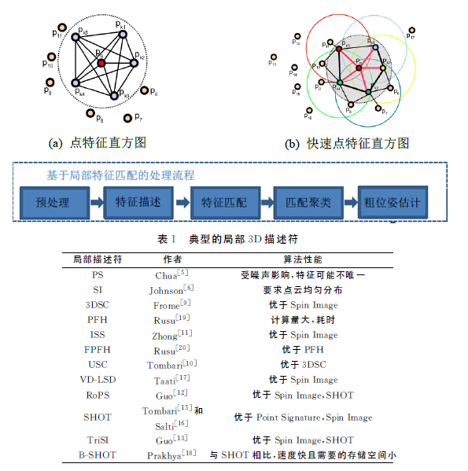
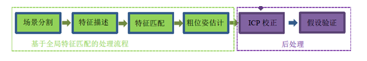
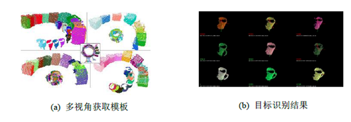

## 三维点云处理方法

https://mp.weixin.qq.com/s/MRbHXaCTlCPxC0ACTvAeaA

目前三维点云数据的获取方法相对快捷，同时三维点云数据的采集不受光照影响，也规避了二维图像遇到的光照、姿态等问题，因此基于点云数据的三维物体识别也引起了人们的重视。

### 一、 位姿估计

三维点云物体识别方法多是通过提取物体的特征点几何属性、形状属性、结构属性或者多种属性的组合等特征进行比对、学习，从而完成物体的识别与分类。

可以分为以下四类方法：

#### 1、基于局部特征的位姿估计

基于局部特征的位姿估计方法主要是通过局部来识别整体。该方法无需对处理数据进行分割，往往通过提取物体的关键点、边缘或者面片等局部特征并进行比对来完成物体的识别。其中，特征提取是物体识别中非常关键的一步，它将直接影响到物体识别系统的性能。基于局部特征的方式对噪声和遮挡有更好的鲁棒性，同时不受颜色和纹理信息缺乏的限制。由于局部特征描述子仅使用参考点邻域信息，所以不对场景进行分割即可处理复杂场景。但是局部特征描述子维度较高，需要消耗更多的内存，同时存在计算复杂度高，实时性差等问题。

点特征直方图(PFH)和快速点特征直方图(FPFH)是Rusu R B等人提出的相对早期的局部特征描述子。**采用统计临近点对夹角的方式构造特征描述子**，这也是局部特征描述子构造的典型方式，在此基础上形成了基于局部特征匹配的目标识别和位姿估计的经典框架，如下图所示。

表１对典型的局部三维描述符进行了总结，并对不同方法的性能进行了比较。

#### **2.基于全局特征的位姿估计方法**

基于全局特征的方法需要从背景中将目标物体分割出来，通过描述和比对三维物体形状中的全部或者最显著的几何特征来完成物体的识别，这类方法被广泛地应用于3D物体的表示匹配和分类中。全局特征将视角作为一个特征，建立多视角下的2.5D 模型特征库，目标识别结果和位姿由这些模板给出，基于全局特征的识别框架如图所示。

这种方式的缺陷是需要对场景进行分割，分割的好坏会直接影响识别定位的结果。

Rusu在FPFH快速点特征直方图描述符的基础上提出视点特征直方图(VFH)，该方法在计算相对法线间的夹角中加入视点信息，可以区分物体的不同位姿，同时保持旋转缩放不变性。Aldom于2011年对视点特征直方图进行扩展，提出聚类视点特征直方图（VVFH）描述符。该方法首先根据曲率值去除噪声点或者边界点，然后利用区域增长的方法对点云物体的光滑区域进行分割，最后计算每一个分割区域的视点特征直方图。

#### **3. 基于点云的位姿估计**

基于点云的目标识别的研究已经有二十年，一个被广泛应用的算法是ICP算法，这种方式需要较好的初始位姿，因而该算法主要用在粗位姿估计之后进行精确的位姿计算。此外针对ICP 算法中的数据采样、快速寻找匹配关系、匹配点筛选以及误差矩阵都有诸多研究。

另一种被广泛用于工业领域的目标识别和位姿估计算法是基于点对特征(PPF-Point Pair Feature)的方法。PPF算法首先计算并存储模型点对特征，通过特征匹配寻找场景点对与模型点对的对应关系，并在相应位置投票，最后根据投票结果计算目标位姿，这是用于工业领域位姿估计效果最佳的算法之一，还有使用边缘点建立点对特征，用以处理多平面目标，并将其扩展至多目标识别。

另外，通过限定点对最小距离，使用区分性和可见概率作为投票权重来提高点对特征区分性，但是限制最小距离的方式会丢失大量模型信息，而且人为设计的投票权重有更多经验性和主观性。

### 二、传统目标检测

#### 1. 基于机器学习的目标识别方法pipline

基于机器学习的物体识别方法通过提取、学习样本的特征，利用分类器模型完成场景中物体的分类与识别。随着计算机视觉技术和认知技术的快速发展，对场景中物体的识别逐渐从对特定物体的识别（如车辆、树木、建筑物等）过渡到对多类物体的识别。

马尔可夫随机场、支持向量机、随机森林和条件随机场等模型的使用增强了场景信息的关联，有效地提高了从场景中识别物体的速度和精度。

### 三、深度学习目标检测

