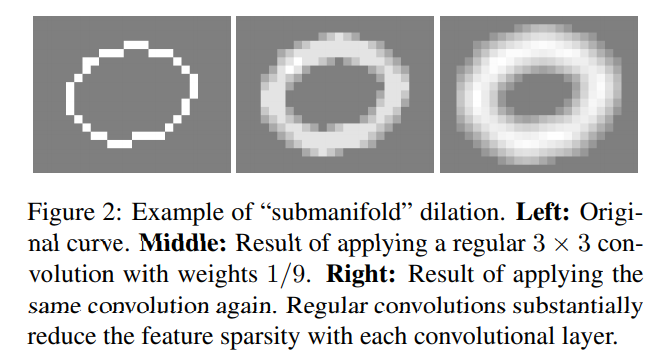
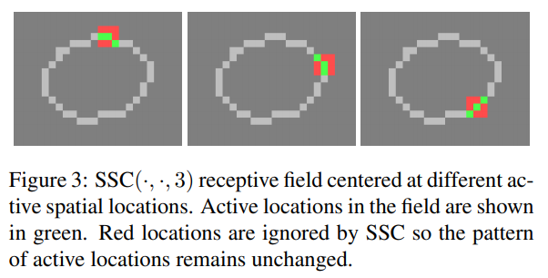
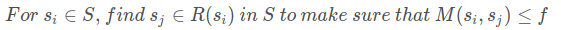
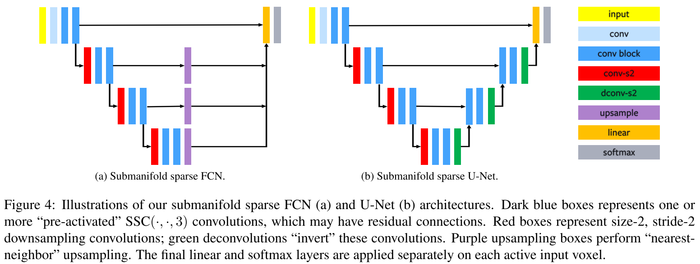

# 稀疏卷积笔记

Pcdet中使用了`spconv`这个库，这个库是处理稀疏卷积的，在SECOND论文中，也使用稀疏卷积代替了VoxelNet的3D卷积。

## 第一篇博客来自[CSDN](https://blog.csdn.net/qq_39732684/article/details/105091886?spm=1001.2014.3001.5506)**流型稀疏卷积**

[==2021/04/06==]

**spconv**对应Facebook在CVPR2018发的一篇文章。文章全名是`3D Semantic Segmentation with Submanifold Sparse Convolutional Networks`。文章核心创新点是提出了==子流形==上的==稀疏卷积层==（对==Submanifold Sparse Convolution==直译，简称为==SSCN==）。别看Submanifold Sparse Convolution这个名字很高大上，其实它只是普通卷积的一种推广，**用于处理稀疏高维数据，比如稀疏点云**。这篇博客主要介绍流形稀疏卷积。我会按照自己的理解去尽可能简单的讲解流形稀疏卷积。

### 1. 提取点云特征的方法

与图像处理一样，点云特征提取方法也分为传统手工设计特征和基于深度学习的方法，这里只关注基于深度学习的方法。

对于二维图像，提取操作主要是做==卷积==。但是对于三维点云，提取特征就变成一个困难的事情，因为三维点云是==稀疏==和==没有结构==的。为了提取具有稀疏结构的点云特征，研究者们想出了很多办法，比如PointNet系列，深度连续卷积，边缘卷积，点云卷积，等等。这里所介绍的流形稀疏卷积就是一种不太一样的方法。

### 2. 普通卷积处理稀疏数据的窘境

普通卷积处理稀疏数据会面临两个窘境：

1. 容易提取到==失真==的特征（从稀疏的数据中提取出稠密的特征）；
2. 产生不必要的计算（普通卷积会重头到尾算一遍，而稀疏数据很多地方是空洞）

**首先是会产生失真：**

以二维空间为例，第一张图是原始的稀疏数据，白点是有值区域，中间是一层卷积层之后，右边是两次卷积之后，以发现，随着卷积层的增加，**原本稀疏的数据会变得越来越稠密**。所以使用普通卷积的深度网络，很可能**从稀疏的数据中学出“稠密”的特征，这种特征会破坏原始数据的稀疏原貌**。从图上看，这个圆环逐渐膨胀，最终变成一个油炸圈。作者称它为“子流形膨胀问题”（submanifold dilation problem）。

**其次是计算量**

先拿2D卷积举个例子。假定2D卷积核的尺寸（Kernel Size）是3，卷积参数步长（Stride）是1。输入特征图通道是m个。输出特征图通道是n个。对一个特征图上的目标像素，做一次卷积操作，需要用到$$3^2*m*n$$次乘法。如果特征图是d维，就需要用到d维卷积核做卷积运算。假设这个卷积核的尺寸和步长跟之前一样。再假定输入输出特征图的通道数不变。那么做一次d维卷积运算，需要用到次$$3^d*m*n$$乘法。可以发现卷积计算复杂度会随着维度变化而做指数级的增长。如果输入特征图在d维空间是稀疏的话，完全没有必要在$$3^d$$空间（指一个边长为3的d维立方块）内遍历所有离散点，只需要考虑$$3^d$$空间那些有值的特征点即可。这就引出了作者的一个定义，即**Active**。在 $3^d$空间内，对应有值特征的点记作Active，而无值特征的点记作Inactive。

### 3. 稀疏卷积

稀疏卷积和普通卷积一样，需要定义卷积核的尺寸$f$以及卷积步长s($f$是奇数),以及输入通道数m和输出通道数n.作者定义**稀疏卷积**符号为$SC(m,n,f,s)$;

通道数就是每一个索引处的value,对于rgb图像,m=3,对于img(u,v),有3个值

和普通卷积一样,稀疏卷积在处理$d$维数据时的感受野是$f^d$,一个边长为f的d维立方块;

假设                   ,输入是$A_1*A_2*...*A_d*m$的张量$T_{in}$;

经过稀疏卷积后,输出是$B_1*B_2*...*B_d*n$的张量$T_{out}$

和普通卷积一样,$A_i$和$B_i$满足:$B_i=\frac{(A_i-f)}{s}+1$,未考虑padding

$A_i$和$B_i$是各个维度的长度,对应二维图像的长宽,三维的长宽高

这些都是稀疏卷积和普通卷积相同的地方,下面是稀疏卷积不一样的地方

**特殊操作一:维护正常卷积计算----空值补零**

假设一个场景,想计算$T_{in}$中的一个元素$t_{in}=T_{in}(a_1,a_2,...,a_d,m_0)$的稀疏卷积值;按照卷积的定义,会提取以$t_{in}$为中心在$f^d$空间内的所有值和$f^d$大小的卷积核做点乘.如果$T_{in}$ 是非常稀疏的，稀疏卷积会把目标位置$t_{in}$ 所在的 $f^d$空间内，**空洞的位置补充为零**。补零后再按照普通卷积的定义做计算。这倒不是什么神奇的操作，一般人都会这么想吧。

**特殊操作二:维护特征稀疏性-----强制清零**

上面的操做没有解决特征失真,本质还是普通的卷积操作;

为了维护输入特征的稀疏性，作者设计了一个子流形稀疏卷积（是对 submanifold sparse convolution的直译），简称为$SC(m,n,f,s)$,$SC(m,n,f)$是$SC(m,n,f,s=1)$的一种改进版.

$SC(m,n,f,s=1)$的输入输出尺寸满足:$B_i=A_i-f+1,i=1,2,...,d$,为了使输入输出尺寸一致,在输入张量上进行Zero Padding,即在d维的每一维前后补充$(f-1)/2$个零,因为f是奇数,所以$(f-1)/2$是整数,那么有:

$B_i=A_i+2*(f-1)/2-f+1=A_i$

这样一来，稀疏卷积输出的张量尺寸和输入张量是一样的（除了通道数）。$T_{out}$会比$T_{in}$更“膨胀”，因为原本零值的地方会受感受野之内有值区域的影响而**卷积出非零值**。为了维护原特征的稀疏性（原本零值的地方卷积后应该还是零值），记$T_{in}$中零值的区域为$D_{zero}$,在$T_{out}$中把$D_{zero}$ 区域的值**重写为零**。这也不是什么神奇的操作，强制清零后，卷积后的特征图和卷积前的特征图是一样稀疏的，维持了submanifold的几何特性（有点强行解释的味道）。

使用子流形稀疏卷积的效果如下图所示,卷积之前是一个环，稀疏卷积之后也是一个环，没改变几何性质.

考虑到零的乘法运算可以不予考虑，那么d维稀疏卷积需要大概$a*m*n$个乘法运算，其中a是感受野内非零值元素的个数。它要比普通卷积的运算复杂度小。因此稀疏卷积解决了普通卷积面临的两个窘境。

**特殊操作三：配套服务----与稀疏卷积相配套的激活池化BN层**

在深度学习中，普通卷积常常和**激活函数**(Activation Functions),**池化层**(Pooling Layers),**BN**(Batch Normalization)配合起来使用，以发挥巨大的作用。对于稀疏卷积而言，是不是也可以和激活函数，池化层，BN配合起来使用呢？作者的回答是肯定的，但是要做一些小小的修改。

首先说**激活函数**。考虑到数据是稀疏的，没必要对空洞位置使用激活函数，所以主要对有值的位置使用激活函数。再说**池化层**。如果是Max Pooling的话，不需要修改。如果是Average Pooling的话，仅计算有值位置的平均值。对于**BN**，也只是对有值区域做正则化的操作。

总之，这些改动都是顺其自然的

### 4.稀疏卷积的计算细节

稀疏卷积的输入是**稀疏**的特征图，输出的也是一个**稀疏**的特征图。因此没有必要用一块完整的内存无差别地存储特征图中全部的值。只需要**存储那些有值的位置**即可。

以输入的稀疏特征图$T_{in}$为例。设稀疏特征图中非零值元素的个数为$a$ 个。作者把稀疏的特征图$T_{in}$编码为一个$a\times {m}$特征矩阵$M_{in}$ 和一个哈希表$H_{in}$(`Hashing Table`，使用哈希表可以快速查找，从稀疏张量建立哈希表，利用了`SparseHash`这个库);

特征矩阵存放着输入特征图中所有非零的特征，$m$表示输入特征图的通道数。哈希表是一个键值对(`Key-Value`)组成的列表。Key指的是特征矩阵的行索引（在0到$a-1$整数范围之内）。Value表示对应元素在$T_{in}$中的索引，是一个d维向量;

>自己的理解,对于三维点云来说,如果先体素化,会有体素坐标,输入一个三维坐标(x,y,z),由哈希函数,计算出这个三维坐标(value)对应的key值,通这个key值在特征矩阵中取出(x,y,z)对应的特征

输出的稀疏特征图$T_{out}$同样编码为$M_{out}$和$H_{out}$;

考虑到**稀疏卷积维护输入特征图的稀疏性**，$H_{out}=H_{in}$;

$M_{out}$是一个$a\times n$的矩阵,n是输出特征图的通道数。$M_{out}$初始化为一个零矩阵;

在行索引上,$M_{out}$和$M_{in}$有着等同的意义。

这样编码还是不够的;以输入的稀疏特征图$T_{in}$为例,设非零值元素的集合$S=\{s_i\}^a_{i=1}$,对于任何一个元素$s_i$,怎样才能知道在$s_i$的感受野内有哪些位置在集合$S$中呢?对于$s_i$,满足这样要求的集合记为$R(s_i)$,设$s_j\in R(s_i)$,那么$s_j$到$s_i$的曼哈顿距离$M(s_i,s_j)$一定是小于等于卷积核的大小f的;

为了找$s_j$,最简单的办法就是遍历剩下的$a-1$个位置去计算曼哈顿距离。这样一个边遍历边计算的过程用到了哈希表（使用哈希表，应该不是用我说的这个最简单的方法找$R(s_i)$，原文貌似没有具体交代，另外我对哈希表也不熟);

而集合$\{R(s_i)\}_{i=1}^a$称之为`rule book`。对于$s_i$,知道$R(s_i)$后，后续操作就是做卷积运算中求积求和的计算了。

### 4.稀疏卷积网络搭建

使用稀疏卷积网络，作者给出`FCN`网络和`U-Net`网络的搭建示意图。输入数据不是点云，而是体素化的点云（那种“我的世界”中的块块，每一个块块有int型的三维坐标）

深蓝色的方框`conv block`是$SSC(\cdot,\cdot,3)$的卷积组合。其他颜色的方框都是平常操作。