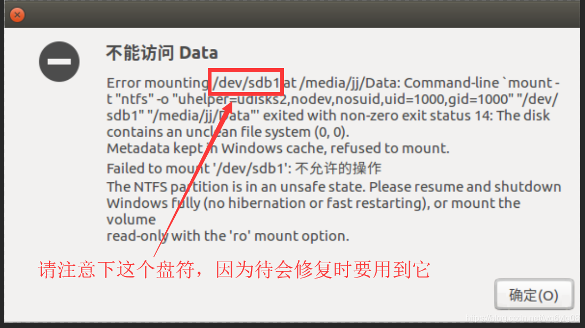
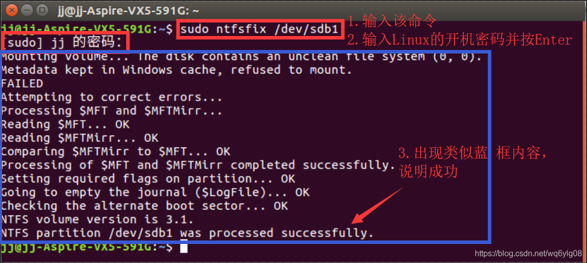
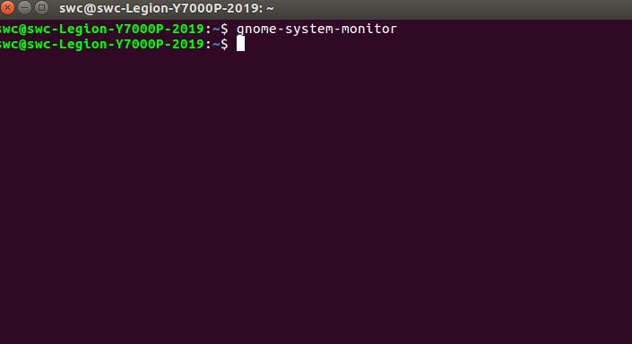
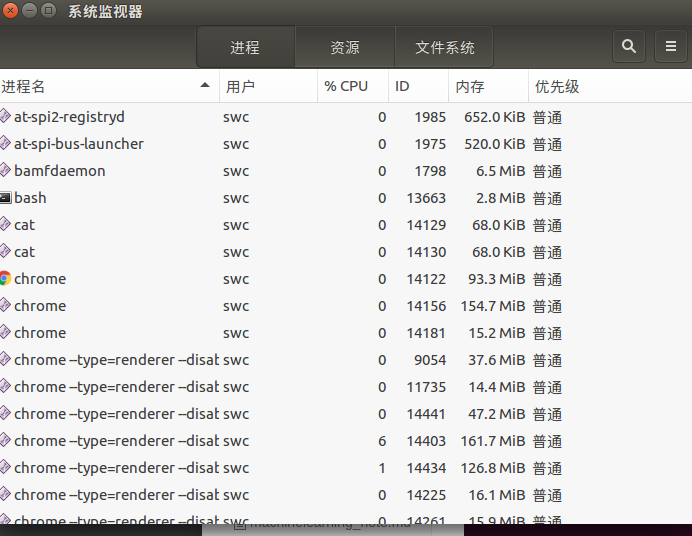
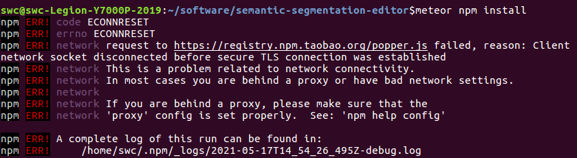
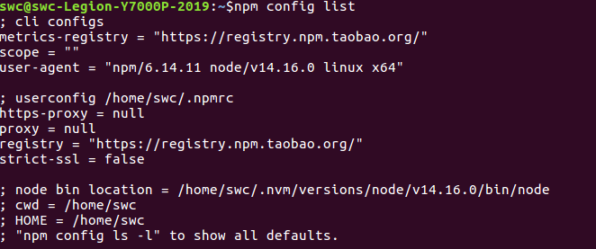
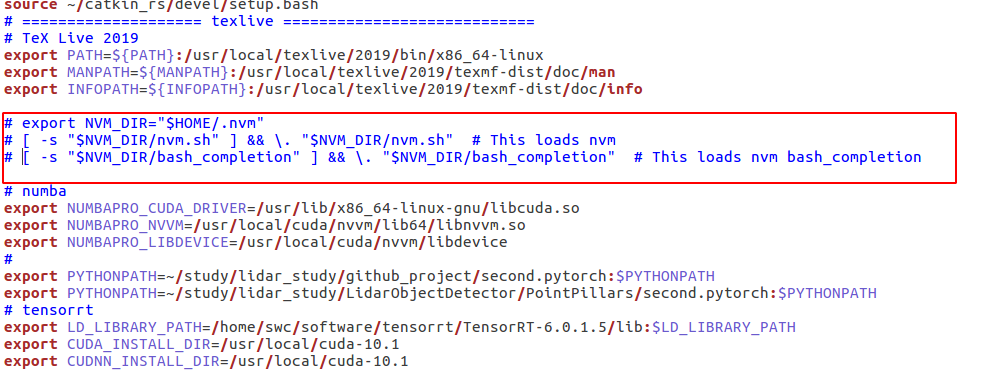
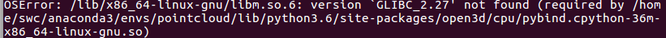
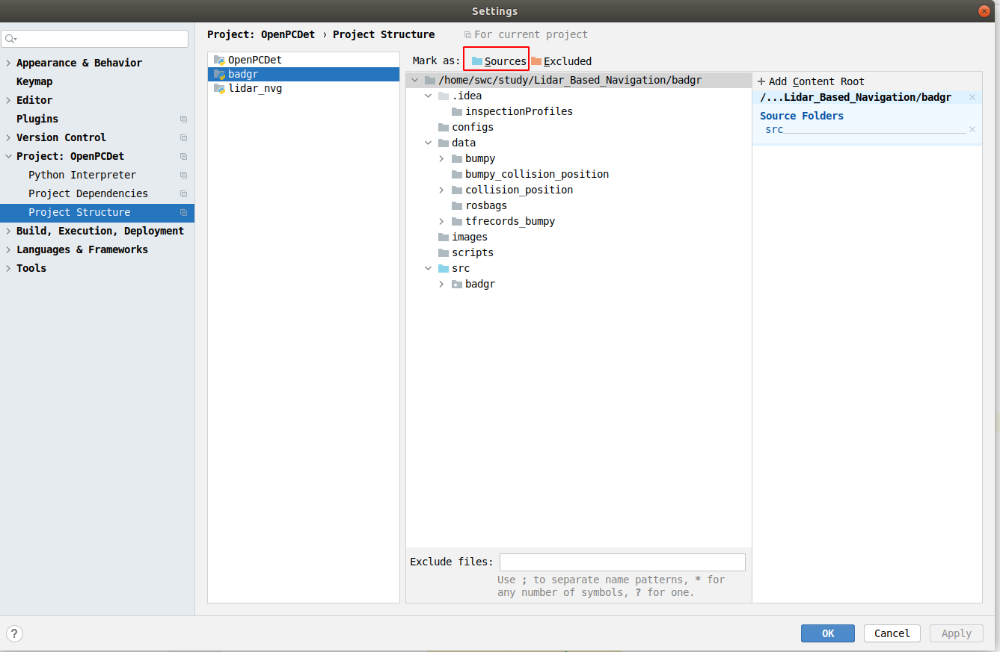
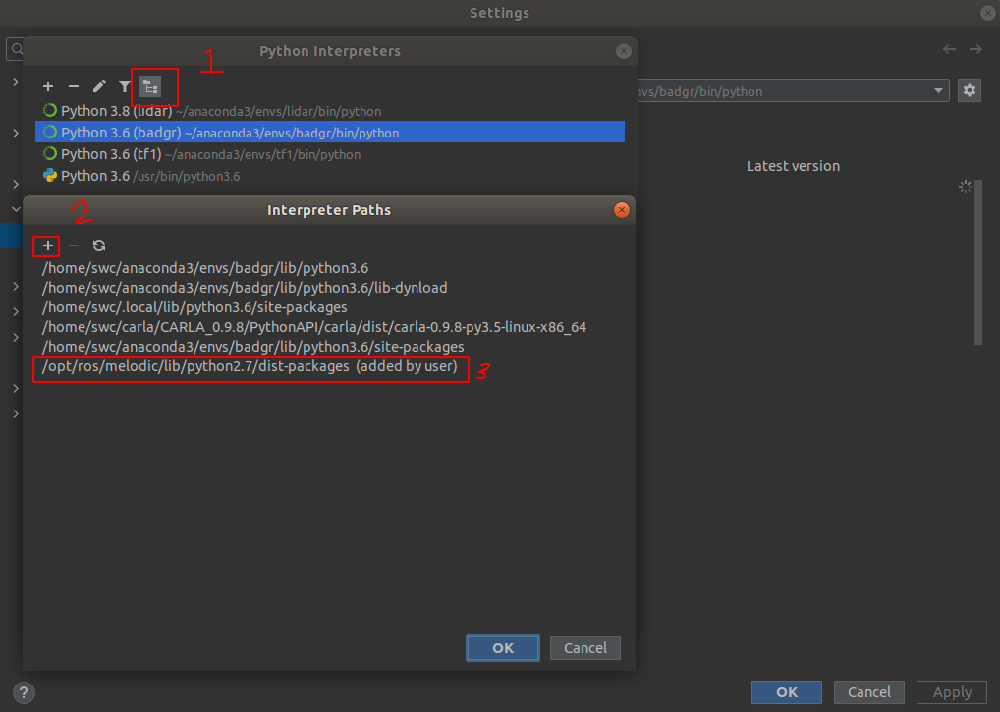

#### 1.无法获得锁 

/var/lib/dpkg/lock-frontend - open (11: 资源暂时不可用)

E: 无法获得锁 /var/lib/dpkg/lock-frontend - open (11: 资源暂时不可用)
E: Unable to acquire the dpkg frontend lock (/var/lib/dpkg/lock-frontend), is another process using it?

解决办法：

```
sudo rm /var/cache/apt/archives/lock 
sudo rm /var/lib/dpkg/lock
```

或者

```
用这个命令查看一下apt-get的相关进程：ps -e | grep apt  
如果显示：

2660 ?        00:00:02 aptd  
2039 ?        00:00:00 update-apt-xapi  
然后执行:

$sudo kill 2660 
$sudo kill 2039  
再试一下。
```

#### 2.安装完conda后，进入终端显示(base)

解决办法：

通过配置`auto_activate_base`关闭自动进入conda基础环境：

 `conda config --set auto_activate_base false` 

想要重新开启就设为true就行了

 `conda config --set auto_activate_base true`

#### 3. ubuntu访问windows盘



解决方法:

+ 1.1在Linux系统中安装`ntfs-3g`
+ 1.2修复挂载错误的相应的分区

还记得上面我叫你记住错误提示框中的盘符/dev/sdb1吗？此时我们修复挂载错误的相应的分区要用这个盘符作为参数，告诉ntfs-3g我们要修复这个磁盘。

在终端中输入命令

`sudo ntfsfix /dev/sdb1`

来修复该挂载错误的分区。因为这个命令时sudo命令，需要权限，所以Linux的终端会出现[sudo]‘用户’的密码：，请输入你的Linux开机密码并按下Enter键，因为Linux保密性高，所以你再输入密码过程中，Linux的终端不会出现任何*密码星形字符，所以不要误以为键盘坏了或其他错误情况，请输入完全部密码按下Enter键即可。


#### 4.文件夹带锁

sudo chmod -R 777 路径(文件夹或文件)

#### 5.qt编译路径问题

```cmake
TARGET=./bin/listener  			# 编译出来的可执行文件名字,文件在cpp文件同目录的bin文件夹下

CONFIG(debug, debug|release) {
    OBJECTS_DIR = ./tmp_Debug	# debug目录在同目录的tmp_Debug目录下
}
CONFIG(release, debug|release) {
    OBJECTS_DIR = ./tmp_Release	# release目录在同目录的tmp_Release目录下
}
```


```C++
//在程序中使用的路径,如果使用相对路径,按照上面这样设置,根目录就在target同级目录
// 相对路径是相对 可执行文件 的路径
sprintf(filename_ALL,"./newF2/neg2/%d_%d.txt",1, 1);
```

#### 6 Ubuntu软件卡死

gnome-system-monitor





选择卡死的进程,结束

#### 7.卸载安装

我们都知道安装软件最简单的方法是apt-get install，但是卸载就不常用了，如何卸载呢？
1.sudo apt-get remove xxxxx
 sudo apt-get autoremove
2.对于用命令sudo aptitude install xxx安装的软件
可以用sudo aptitude remove xxx卸载即可

#### 8.opencv和ros冲突

```sh
from cv2 import *
ImportError: /opt/ros/kinetic/lib/python2.7/dist-packages/cv2.so: undefined symbol: PyCObject_Type
```

解决办法，在使用到opencv的代码，最前面添加一句：

```python
import sys
sys.path.remove('/opt/ros/kinetic/lib/python2.7/dist-packages')
```

#### 9.ros包编译的时候缺少相关的库

如果出现的错误是类似于“ Could not find a packageconfiguration file provided by "xxx_xxx_xxx"”，这说明“xxx_xxx_xxx”这个package未安装，将其安装到你的工作空间即可。

**安装方法有两种：**

1.使用包安装命令直接安装：

```text
sudo apt-get install ros-kinetic-功能包名
```

#### 10.qt图标编辑,加入ros路径

```
图标位置：
/usr/share/applications
```


```bash
[Desktop Entry]
Type=Application
Exec=bash -i -c "/opt/Qt5.12.8/Tools/QtCreator/bin/qtcreator" %F
Name=Qt Creator
GenericName=The IDE of choice for Qt development.
Icon=QtProject-qtcreator
StartupWMClass=qtcreator
Terminal=false
Categories=Development;IDE;Qt;
MimeType=text/x-c++src;text/x-c++hdr;text/x-xsrc;application/x-designer;application/vnd.qt.qmakeprofile;application/vnd.qt.xml.resource;text/x-qml;text/x-qt.qml;text/x-qt.qbs;
```

#### 11.semantic-segmentation-editor安装

```
meteor npm install安装报错

Hostname/IP does not match certificate's altnames: Host: registry.cnpmjs.org. is not in the cert's altnames: DNS:r.cnpmjs.org
第一步 ：

尝试使用   

npm set strict-ssl false   

本人亲测有效，如果报相同的错误可以尝试使用  
npm config set registry http://registry.npmjs.org/
```

```
FetchError: request to http://registry.npmjs.org/popper.js failed, reason: connect ECONNREFUSED 127.0.0.1:8888


```




查看了本机的http和https代理设置：

```
echo $http_proxy
echo $https_proxy
```

查看了npm的配置 `npm config list`:



没有设置代理,设置一下:

```
为npm设置代理
$ npm config set proxy http://server:port
$ npm config set https-proxy http://server:port
```

#### 12.curl报错

curl: (7) Failed to connect to 127.0.0.1 port 8888: Connection refused

```
lsof -i:8888 发现端口未被占用
查看代理：env|grep -i proxy

https_proxy=127.0.0.1:8888
http_proxy=127.0.0.1:8888
socks_proxy=
ftp_proxy=
```

原因是127.0.0.1 port 8888被当作代理占用了，需要关闭。

解决：在终端输入以下命令

```
export http_proxy=''
export https_proxy=''
```

#### 13.Ubuntu安装Node和npm

[Ubuntu安装Node和npm](https://www.cnblogs.com/Hi-blog/p/How-To-Install-Node-And-Npm-On-Ubuntu.html)

**阅读目录**

　　本文简单介绍在Ubuntu上安装最新版本的node和npm。

　　本次试验环境是Ubuntu 18.10。

　　安装nodejs

```
root@ubuntu:~# cat /etc/issue
Ubuntu 18.10 \n \l

root@ubuntu:~# sudo apt install nodejs -y
...
```

　　安装npm

```
# sudo apt install npm -y
```

　　查看当前安装版本

```
root@ubuntu:~# sudo node -v
v8.11.4
root@ubuntu:~# sudo npm -v
5.8.0
```

　　修改npm源，提高下载速度

```
# sudo npm config set registry https://registry.npm.taobao.org
# sudo npm config list　
```

　　升级npm为最新版

```
# sudo npm install npm@latest -g
```

　　安装用于管理node的模块n

```
# sudo npm install -g n
```

　　使用n模块来安装node版本

```
# sudo n latest         # 最新版本
# sudo n stable         # 最新稳定版本
# sudo n lts            # 长期支持版本
```

　　我们选择安装最新版，再次查看安装好的版本。

```
root@ubuntu:~# sudo node -v
v12.4.0
root@ubuntu:~# sudo npm -v
6.9.0
```

#### 14.ubuntu设置代理

在终端下编辑/etc/apt/apt.conf

```bash
# 使用v2ry时
Acquire::http::proxy "http://127.0.0.1:8888/";
Acquire::https::proxy "https://127.0.0.1:8888/";
Acquire::ftp::proxy "ftp://127.0.0.1:8888/";
Acquire::socks::proxy "socks://127.0.0.1:1088/";
```

方法一：

如果只是想临时使用http代理，可以在使用apt-get之前于终端下输入：export http_proxy="http://用户名:密码@代理IP:代理端口"

方法二：（方法一的持久化）

如果希望apt-get与其它应用程序都可以一直使用http代理，可以这样：

在终端下编辑~/.bashrc文件：　　vim ~/.bashrc

在文件末尾添加如下两句：

> export http_proxy=http://用户名:密码@代理地址:代理端口
>  export https_proxy=http://用户名:密码@代理地址:代理端口
>  export no_proxy="127.0.0.1, localhost, *.cnn.com, 192.168.1.10, domain.com:8080"

然后执行下面命令，使环境变量生效

> source ~/.bashrc

方法三：

如果只是希望apt-get使用代理，可以这样：

在终端下编辑/etc/apt/apt.conf加入下面这行，

Acquire::http::Proxy “[http://yourproxyaddress:proxyport](https://link.jianshu.com?t=http%3A%2F%2Fyourproxyaddress%3Aproxyport)”;

保存退出apt.conf。

作者：寂寞杰罗
链接：https://www.jianshu.com/p/f569a404ee0b
来源：简书
著作权归作者所有。商业转载请联系作者获得授权，非商业转载请注明出处。

#### 15.打开终端速度变慢

最近打开终端的速度很慢,终端打开之后,白色光标一直在闪,一直黑色的框框,没有找到问题

偶然间发现是`source ~/.bashrc`速度很慢,就检查了一下`bashrc`文件的内容



将红色框中的内容注释之后,就不卡了

#### 16.GLIBC



这个错误是因为open3d的版本问题,换一个open3d版本解决问题

查看GLIBC版本信息

```bash
ldd --version 
ldd (Ubuntu GLIBC 2.23-0ubuntu11.3) 2.23
Copyright (C) 2016 Free Software Foundation, Inc.
This is free software; see the source for copying conditions.  There is NO
warranty; not even for MERCHANTABILITY or FITNESS FOR A PARTICULAR PURPOSE.
Written by Roland McGrath and Ulrich Drepper.
```

#### 17.pycharm 相对路径问题

转到设置 > 项目 > 项目结构

在此对话框中，单击包含源代码的文件夹，然后单击菜单中的蓝色文件夹，将其记为“源”文件夹。我相信这解决了 Pycharm 中的很多路径问题



#### 18.pycharm检测不到cuda

```bash
# sudo ldconfig /usr/local/cuda-10.0/lib64
sudo ldconfig /usr/local/cuda-10.1/lib64
```

#### 19.快速更换cuda和cudnn

> current version
>
> tf2:
>
> cuda 10.1
>
> cudnn 7.6.5
>
> tf1:
>
> cuda 10.0
>
> cudnn 7.4


已安装cuda10.0 cuda10.1

查看目前cuda版本

`cat /usr/local/cuda/version.txt `

```bash
sudo rm -rf /usr/local/cuda                        #删除之前创建的软链接
sudo ln -s /usr/local/cuda-10.x  /usr/local/cuda   #创建新 cuda 的软链接
```

查看目前cudnn版本

`cat /usr/local/cuda/include/cudnn.h | grep CUDNN_MAJOR -A 2`

```bash
# 1. delete before version
sudo rm -rf /usr/local/cuda/include/cudnn.h
sudo rm -rf /usr/local/cuda/lib64/libcudnn*
# 2. cd cudnn 
# /home/swc/software/install_package/deep_learning
sudo cp include/cudnn.h /usr/local/cuda/include
sudo cp lib64/libcudnn* /usr/local/cuda/lib64
sudo chmod a+r /usr/local/cuda/include/cudnn.h 
sudo chmod a+r /usr/local/cuda-10.x/lib64/libcudnn*
```


```python
# for solving
# Could not create cudnn handle: CUDNN_STATUS_INTERNAL_ERROR
devices = tf.config.experimental.list_physical_devices('GPU')
tf.config.experimental.set_memory_growth(devices[0], True)
```

#### 20.pycharm 检测不到ros

**方法1：**

同**10**解决，但是有时候打开pycharm会卡住，需要重启系统，或者将加载环境那句改回原来的。

`/usr/share/applications/jetbrains-pycharm.desktop`

**方法2（推荐）：**

> https://blog.csdn.net/weixin_38779971/article/details/112798606

首先，我们默认你的rospy等包已经安装好。
一般地，pycharm中使用了conda虚拟环境，如果使用了，那么该问题就出在已安装python包的位置没有被pycharm内的虚拟环境找到。

检查python位置
在终端中输入：

`echo $PYTHONPATH`
得到如下结果：

```
/home/swc/catkin_ws/devel/lib/python2.7/dist-packages:
/opt/ros/melodic/lib/python2.7/dist-packages
```


增加conda环境中project interpreter的解释路径,将ros的python添加进去



#### 21.安装tensorflow与cuda和cudnn版本冲突

conda新建一个虚拟环境，在虚拟环境中使用conda安装cuda和cudnn

使用下面的命令搜索可以安装的cuda，cudnn版本：

`conda search cuda -c conda-forge`

`conda search cudnn -c conda-forge`

使用下面的命令安装：

`conda install cudnn==version -c conda-forge`

如果没有conda安装cuda,安装cudnn会把cuda一起安装

#### 22.pip 加速

`pip install package -i https://pypi.tuna.tsinghua.edu.cn/simple`

