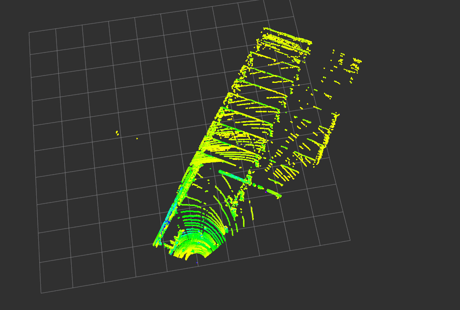
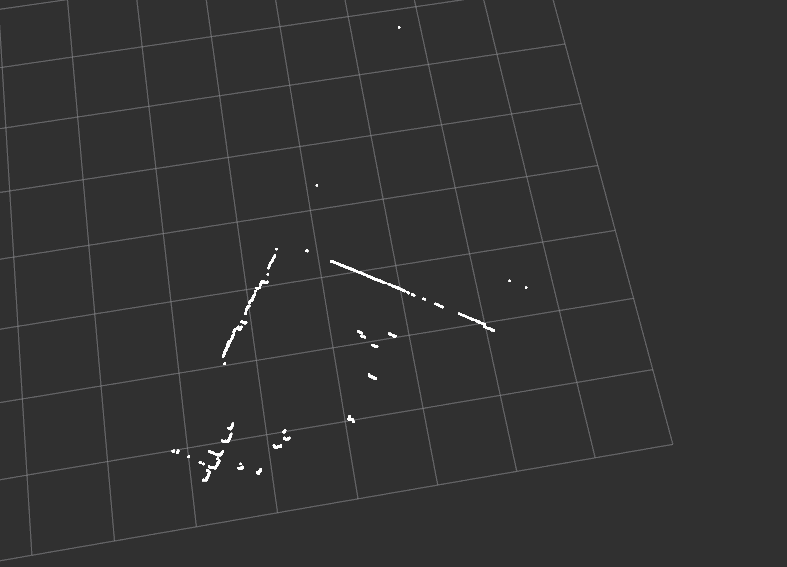

## 如何读取雷达数据

### 0 薛含章：

- 一般ROS稍微简单一些，一般雷达厂家都会把解析程序写好，也就是Rosbag里面的那个消息，然后你需要知道他们的雷达点云格式

- 就跟128线里面那个是分左右存储的，你需要知道点云具体的格式,然后自己写一个代码把点云读出来,

  具体你需要参考这款雷达的说明书

- 是不是需要自己写一个msg文件来定义点云格式,是的，就类似之前的BKTH128

- 我这个代码是把128线雷达消息保存成离线的bin文件，你可参考一下`Rosbag_parse_tutorial.tar.gz` `Rosbag_parse.ini`，但是也不是最原始的消息，这个是处理`BKTH128`的，还需要一个程序把他们厂商提供的消息转换成我们自己的消息

- 那我给你发一个以前我们写的从底层解析雷达数据的代码，这个里面有Velodyne64和何赛Pandora 40两款雷达的解析代码，你可以看看原理， `Lidar40_newReciever.tar.gz` 

  - 主要原理是从UDP socket通讯抓包，然后根据雷达厂商的数据说明对十六进制或者二进制的数据进行解析
  - 解析好以后再填到自己设计的消息中
  - 但现在用的ROS，这一步操作你可以不用做，因为雷达厂商肯定已经提供了ROS版本的雷达解析程序
  - 你需要做的只是将厂商提供的消息接收到之后转存为我们需要的消息格式
  - 相当于把点云从厂商提供的消息里拿出来再按新的格式顺序填入我们的消息里
  - 最后为了方便显示雷达，你可以用我最开始给你的代码把ROS中的点云保存为bin文件，就可以离线一帧一帧的回放

## 1. 学习记录

### 1.1 雷达消息格式

#### ==PointCloud2==

`rfans`和北京雷达发出来的消息格式都是`Type: sensor_msgs/PointCloud2`

+ `sensor_msgs/PointCloud2.msg`

```C++
/*sensor_msgs/PointCloud2.msg*/

// This message holds a collection of N-dimensional points, which may
// contain additional information such as normals, intensity, etc. The
// point data is stored as a binary blob, its layout described by the
// contents of the "fields" array.

// The point cloud data may be organized 2d (image-like) or 1d
// (unordered). Point clouds organized as 2d images may be produced by
// camera depth sensors such as stereo or time-of-flight.

// Time of sensor data acquisition, and the coordinate frame ID (for 3d
// points).
Header header  //文件头

// 2D structure of the point cloud. If the cloud is unordered, height is
// 1 and width is the length of the point cloud.
uint32 height
uint32 width  

// Describes the channels and their layout in the binary data blob.
    // 数据信道数目  一个x就是一路?
PointField[] fields //一个数组,存储PointField结构体 
    /*
    name: "x"
    offset: 0
    datatype: 7
    count: 1
	*/
bool    is_bigendian // Is this data bigendian?
uint32  point_step   // Length of a point in bytes
uint32  row_step     // Length of a row in bytes
uint8[] data         // Actual point data, size is (row_step*height)

bool is_dense       // True if there are no invalid points
```

+ `sensor_msgs/PointField.msg`

```python
# This message holds the description of one point entry in the
# PointCloud2 message format.
# 枚举
uint8 INT8  = 1
uint8 UINT8  = 2
uint8 INT16  = 3
uint8 UINT16 = 4
uint8 INT32  = 5
uint8 UINT32 = 6
uint8 FLOAT32 = 7
uint8 FLOAT64 = 8

string name   # Name of field
uint32 offset  # Offset from start of point struct
uint8 datatype # Datatype enumeration, see above
uint32 count   # How many elements in the field
```


+ 实例

  ```python
  header: 
    seq: 1954
    stamp: 
      secs: 1543839403
      nsecs: 303457955
    frame_id: "/camera_link"
  height: 1
  width: 3356
  fields: 
    - 
      name: "x"
      offset: 0
      datatype: 7
      count: 1
    - 
      name: "y"
      offset: 4
      datatype: 7
      count: 1
    - 
      name: "z"
      offset: 8
      datatype: 7
      count: 1
  is_bigendian: False
  point_step: 16
  row_step: 53696
  data: [243, 105, 181, 61, 113, 63, 18, 62, 79, 139, 223, 62, 0, 0, 128, 63, 217, 45, 176, 61, 166, 17, 40, 62, 233, 48, 224, 62, 0, 0, 128, 63, 15, 88, 219, 61, 238, 156, 155, 61, 34, 39, 243, 62, 0, 0, 128, 63, 137, 50, 
  ...
  一大堆数字
  ...
  63, 33, 238, 211, 61, 83, 228, 201, 191, 169, 171, 142, 64, 0, 0, 128, 63, 7, 157, 189, 61, 150, 12, 197, 191, 135, 133, 142, 64, 0, 0, 128, 63, 148, 26, 170, 61, 220, 82, 192, 191, 172, 28, 142, 64, 0, 0, 128, 63, 148, 26, 170, 61, 180, 221, 187, 191, 172, 28, 142, 64, 0, 0, 128, 63, 241, 151, 172, 61, 248, 184, 211, 191, 39, 49, 144, 64, 0, 0, 128, 63, 241, 151, 172, 61, 27, 51, 207, 191, 39, 49, 144, 64, 0, 0, 128, 63, 241, 151, 172, 61, 56, 110, 203, 191, 39, 49, 144, 64, 0, 0, 128, 63]
  is_dense: True
  
  ```

  看来要把这个消息再转发到,自己写的一个程序,把他们厂商提供的消息转换成我们自己的消息


#### ==BKTH128==

看看`BTKH128`发的什么格式的消息

`$ rostopic info /BKTH128`
`Type: module4/BKTH_128`

```C++
/*BKTH_128.msg*/
//每条线上面最多有多少个点
ladar128[1100] ringL
ladar128[1100] ringR
#int32 myCount
float64 time_stamp
```

```C++
/*ladar128*/
//最高线数
pointInfo[64] line
```

```C++
/*pointInfo*/
//每个雷达点的格式
int32 x
int32 y
int32 z
uint8 Intensity
```

#### ==LaserScan==

此外，还有**LaserScan**格式的点云

+ sensor_msgs/LaserScan

```bash
# sensor_msgs/LaserScan.msg
# Single scan from a planar laser range-finder
#
# If you have another ranging device with different behavior (e.g. a sonar
# array), please find or create a different message, since applications
# will make fairly laser-specific assumptions about this data

Header header            # timestamp in the header is the acquisition time of 
                         # the first ray in the scan.
                         #
                         # in frame frame_id, angles are measured around 
                         # the positive Z axis (counterclockwise, if Z is up)
                         # with zero angle being forward along the x axis
                         
float32 angle_min        # start angle of the scan [rad]
float32 angle_max        # end angle of the scan [rad]
float32 angle_increment  # angular distance between measurements [rad]

float32 time_increment   # time between measurements [seconds] - if your scanner
                         # is moving, this will be used in interpolating position
                         # of 3d points
float32 scan_time        # time between scans [seconds]

float32 range_min        # minimum range value [m]  距离最小值(m)
float32 range_max        # maximum range value [m]	距离最大值(m)

# 一圈360个点
float32[] ranges         # range data [m] (Note: values < range_min or > range_max should be discarded)
float32[] intensities    # intensity data [device-specific units].  If your
                         # device does not provide intensities, please leave
                         # the array empty.
```

+ 实例

```bash
header: 
  seq: 101732
  stamp: 
    secs: 1487324446
    nsecs: 379890600
  frame_id: laser
angle_min: -3.12413907051
angle_max: 3.14159274101
angle_increment: 0.0174532923847
time_increment: 1.55012827463e-07
scan_time: 5.56496015633e-05
range_min: 0.15000000596
range_max: 8.0
ranges: [inf, inf, 5.64900016784668, 2.875999927520752, inf, 5.743000030517578, inf, inf, inf, inf, inf, inf, inf,..........,inf]

intensities: [0.0,0.0, 0.0, 0.0, 0.0, 0.0, 0.0, 0.0, 0.0, 0.0, 0.0, 0.0, 0.0, 0.0, 0.0, 0.0, .....,47.0, 0.0]
```

#### ==MultiEchoLaserScan==

+ sensor_msgs/MultiEchoLaserScan.msg

```sh
# Single scan from a multi-echo planar laser range-finder
#
# If you have another ranging device with different behavior (e.g. a sonar
# array), please find or create a different message, since applications
# will make fairly laser-specific assumptions about this data

Header header            # timestamp in the header is the acquisition time of 
                         # the first ray in the scan.
                         #
                         # in frame frame_id, angles are measured around 
                         # the positive Z axis (counterclockwise, if Z is up)
                         # with zero angle being forward along the x axis
                         
float32 angle_min        # start angle of the scan [rad]
float32 angle_max        # end angle of the scan [rad]
float32 angle_increment  # angular distance between measurements [rad]

float32 time_increment   # time between measurements [seconds] - if your scanner
                         # is moving, this will be used in interpolating position
                         # of 3d points
float32 scan_time        # time between scans [seconds]

float32 range_min        # minimum range value [m]
float32 range_max        # maximum range value [m]

LaserEcho[] ranges       # range data [m] (Note: NaNs, values < range_min or > range_max should be discarded)
                         # +Inf measurements are out of range
                         # -Inf measurements are too close to determine exact distance.
LaserEcho[] intensities  # intensity data [device-specific units].  If your
                         # device does not provide intensities, please leave
                         # the array empty.
```

+ sensor_msgs/LaserEcho.msg

```sh
# This message is a submessage of MultiEchoLaserScan and is not intended
# to be used separately.

float32[] echoes  # Multiple values of ranges or intensities.
                  # Each array represents data from the same angle increment.
```


### 1.2 头文件的生成

`devel/include/module4/*.h`是由`*.msg`文件编译出来的,有的`msg`文件之间互有关联

每个`.msg`文件可以理解为一个结构体,结构体名字就是文件名

[]数组都是动态数组vector<T>


### 1.3 原始点云数据收发

#### 1.3.1 点云数据发送

##### ==pointcloud==

关于发送节点，只需要声明头文件：

`#include <sensor_msgs/PointCloud.h>`

+ `sensor_msgs/PointCloud.msg`

```python
# This message holds a collection of 3d points, plus optional additional
# information about each point.

# Time of sensor data acquisition, coordinate frame ID.
Header header

# Array of 3d points. Each Point32 should be interpreted as a 3d point
# in the frame given in the header.
geometry_msgs/Point32[] points

# Each channel should have the same number of elements as points array,
# and the data in each channel should correspond 1:1 with each point.
# Channel names in common practice are listed in ChannelFloat32.msg.
# 通道数据,比如intensity 长度要和points数组一致,而且要点与点之间一致,一般是除了xyz之外增加的信道
ChannelFloat32[] channels
```

+ `sensor_msgs/ChannelFloat32.msg`

```python
# This message is used by the PointCloud message to hold optional data
# associated with each point in the cloud. The length of the values
# array should be the same as the length of the points array in the
# PointCloud, and each value should be associated with the corresponding
# point.

# Channel names in existing practice include:
#   "u", "v" - row and column (respectively) in the left stereo image.
#              This is opposite to usual conventions but remains for
#              historical reasons. The newer PointCloud2 message has no
#              such problem.
#   "rgb" - For point clouds produced by color stereo cameras. uint8
#           (R,G,B) values packed into the least significant 24 bits,
#           in order.
#   "intensity" - laser or pixel intensity.
#   "distance"

# The channel name should give semantics of the channel (e.g.
# "intensity" instead of "value").
string name

# The values array should be 1-1 with the elements of the associated
# PointCloud.
float32[] values
```

定义消息发布者：

`ros::Publisher cloud_pub = n.advertise<sensor_msgs::PointCloud>("cloud", 50);`

然后在循环中将消息发布出去即可：

```C++
//将数据通过消息发送出去
sensor_msgs::PointCloud cloud;
cloud.header.stamp = ros::Time::now();
cloud.header.frame_id = "sensor_frame";//帧id
cloud.points.resize(LINE*CIRCLEPT);
cloud.channels.resize(2);//设置增加通道数
cloud.channels[0].name = "intensity";//增加反射强度信道，并设置其大小，使与点云数量相匹配
cloud.channels[0].values.resize(LINE*CIRCLEPT);
cloud.channels[1].name = "distance";//增加距离信道，并设置其大小，使与点云数量相匹配
cloud.channels[1].values.resize(LINE*CIRCLEPT);
int i=0;
for (int l = 0; l < LINE; l++)
	for (int c = 0; c < CIRCLEPT; c++)
	{
		cloud.points[i].x = mdecoder.mpointcloud[l][c].x;
		cloud.points[i].y = mdecoder.mpointcloud[l][c].y;
		cloud.points[i].z = mdecoder.mpointcloud[l][c].z;
		cloud.channels[0].values[i] = mdecoder.mpointcloud[l][c].r;//设置反射强度
		cloud.channels[1].values[i] = mdecoder.mpointcloud[l][c].d;
		i++;
	}
cloud_pub.publish(cloud);
```

 有三点需要注意：

 1. `frame_id`与`rviz`的`Fixed Frame`相对应，设置成什么在`rviz`中就应该做出相应设置。
 2. 结构体中只有x，y，z三个值，如果需要发布的信息中还有反射强度和距离等值，需要利用channels来进行。写法参考上面代码，按照上面写法，可以在rviz上看到反射强度的区别。
 3. 如果需要发送有序点云，则在点云结构体赋值的时候按顺序进行即可，无需其他操作。

**点云数据接收**

**对于`sensor_msgs/PointCloud`**
同样需要包含头文件：

`#include <sensor_msgs/PointCloud.h>`

订阅消息节点：

`ros::Subscriber sub = n.subscribe ("cloud", 1, getcloud);//订阅cloud节点`

定义回调函数：

```C++
//回调函数
void getcloud (const sensor_msgs::PointCloudConstPtr& clouddata)
{
	//其中i为索引值，如下直接通过索引取得接收到的数据对象
	my_x = clouddata->points[i].x;
	my_y = clouddata->points[i].y;
	my_z = clouddata->points[i].z;
	my_intensity = clouddata->channels[0].values[i];
	my_distance = clouddata->channels[1].values[i]
}
```

如果发送过来的点云是按顺序赋值的，则取的时候也按照同样的顺序获取即可获得有序点云。

**对于`sensor_msgs/PointCloud2`**
有部分雷达驱动给的节点是`sensor_msgs/PointCloud2`格式的，读取的时候则需要先做转换。

包含头文件

`#include <sensor_msgs/PointCloud2.h>`
`#include <sensor_msgs/point_cloud_conversion.h>`

之后将`PointCloud2`先转为`PointCloud`再以该形式进行处理即可。

代码如下(回调函数) 

```C++
void getcloud(const sensor_msgs::PointCloud2 &msg)
{
    sensor_msgs::PointCloud clouddata;
	sensor_msgs::convertPointCloud2ToPointCloud(msg, clouddata);
	sensor_msgs::PointCloud cloud;
    cloud.header.stamp = ros::Time::now();
    cloud.header.frame_id = "PERCEPTION2020"; //帧id
    cloud.points.resize(clouddata.points.size());
    cloud.channels.resize(1);             //设置增加通道数
    cloud.channels[0].name = "intensity"; //增加反射强度信道，并设置其大小，使与点云数量相匹配
    cloud.channels[0].values.resize(clouddata.points.size());

    for (int i = 0; i < clouddata.points.size(); i++)
    {
        cloud.points[i].x = clouddata.points[i].x;
        cloud.points[i].y = clouddata.points[i].y;
      	cloud.points[i].z = clouddata.points[i].z;
        cloud.channels[0].values[i] = clouddata.channels[0].values[i];    //设置反射强度
    }
   pub->publish(cloud);

}
```

另外，`sensor_msgs/PointCloud2`格式可以直接获得`pcd`的点云帧数据。

查看bag包信息：

`rosbag info xxx.bag`

将bag包中的点云转为`pcd`格式

`rosrun pcl_ros bag_to_pcd xxx.bag /rfans_driver/rfans_points pcd`

最后一个参数为输出文件的文件夹名称，没有则会被创建。倒数第二个参数为话题名称。
不过用这个命令转出来的PCD文件是二进制形式的，而且Windows的PCLViewer无法读取，原因暂时不明


##### ==LaserScan==

原始数据格式:

```sh
# Single scan from a planar laser range-finder
#
# If you have another ranging device with different behavior (e.g. a sonar
# array), please find or create a different message, since applications
# will make fairly laser-specific assumptions about this data

Header header            # timestamp in the header is the acquisition time of 
                         # the first ray in the scan.
                         #
                         # in frame frame_id, angles are measured around 
                         # the positive Z axis (counterclockwise, if Z is up)
                         # with zero angle being forward along the x axis
                         
float32 angle_min        # start angle of the scan [rad]
float32 angle_max        # end angle of the scan [rad]
float32 angle_increment  # angular distance between measurements [rad]

float32 time_increment   # time between measurements [seconds] - if your scanner
                         # is moving, this will be used in interpolating position
                         # of 3d points
float32 scan_time        # time between scans [seconds]

float32 range_min        # minimum range value [m]
float32 range_max        # maximum range value [m]

float32[] ranges         # range data [m] (Note: values < range_min or > range_max should be discarded)
float32[] intensities    # intensity data [device-specific units].  If your
                         # device does not provide intensities, please leave
                         # the array empty.
```


**数据发布**

```C++
#include <ros/ros.h>
#include <sensor_msgs/LaserScan.h>
 
int main(int argc, char** argv){
 
  ros::init(argc, argv, "laser_scan_publisher");
  ros::NodeHandle n;
 
  ros::Publisher scan_pub = n.advertise<sensor_msgs::LaserScan>("scan", 50);
 
  unsigned int num_readings = 1000;
  double laser_frequency = 50;
  double ranges[num_readings];
  double intensities[num_readings];
  int count = 0;
  ros::Rate r(10.0);
 
  while(n.ok())
  {
    //generate some fake data for our laser scan
    for(unsigned int i = 0; i < num_readings; ++i)
    {
      ranges[i] = count;
      intensities[i] = 100 + count;
    }
 
    ros::Time scan_time = ros::Time::now();
 
    //populate the LaserScan message
    sensor_msgs::LaserScan scan;
    scan.header.stamp = scan_time;
    scan.header.frame_id = "laser_frame";
    scan.angle_min = -1.57;           //雷达扫描起始角度;
    scan.angle_max = 1.57;            //雷达扫描结束角度;
    scan.angle_increment = 3.14 / num_readings;     //水平角度分辨率;
    scan.time_increment = (1 / laser_frequency) / (num_readings);   //相邻点时间间隔
    scan.range_min = 0.0;            //雷达有效测量最小值;
    scan.range_max = 100.0;          //雷达有效测量最大值;
    scan.ranges.resize(num_readings);   // num_readings = 扫描角 / 角度分辨率;根据雷达参数计算;
    scan.intensities.resize(num_readings);
    //实际中，距离值根据激光雷达传感器测得;
    for(unsigned int i = 0; i < num_readings; ++i)
    {
      scan.ranges[i] = ranges[i];
      scan.intensities[i] = intensities[i];
    }
    scan_pub.publish(scan);
 
    r.sleep();
  }
}
```

**数据接收**

```C++
#include "ros/ros.h"
#include "sensor_msgs/LaserScan.h"

#include <iostream>
#include <vector>
#include <cmath>

using namespace std;

ros::Subscriber sub;

void callback(const sensor_msgs::LaserScan::ConstPtr &msg)
{
    std::vector<float> ranges = msg->ranges;

    //transform to xy
    for(int i = 0;i < ranges.size();++i)
    {
        double angle = msg->angle_min + i * msg->angle_increment;
        double X = ranges[i] * cos(angle);
        double Y = ranges[i] * sin(angle);
        float intensity = msg->intensities[i];
    }
}

int main(int argc, char *argv[])
{
    ros::init(argc, argv,"scan_receiver");
    ros::NodeHandle nh;
    sub = nh.subscribe("/laser_sender",1,callback);
    ros::Rate loop_rate(100);
    while(ros::ok)
    {
        ros::spinOnce();

        loop_rate.sleep();
    }
    return 0;
}
```

**pointcloud2转为laserscan**

```C++
sensor_msgs::LaserScan PointCloudToLaserscan(pcl::PointCloud<pcl::PointXYZI>& _pointcloud)
{
  float angle_min, angle_max, range_min, range_max, angle_increment;
  
  //需要自行调整的参数
  angle_min = -3.14159;
  angle_max =  3.14159;
  range_min = 0.5;
  range_max = 20;
  //角度分辨率，分辨率越小，转换后的误差越小
  angle_increment = 0.005;

  //计算扫描点个数
  unsigned int beam_size = ceil((angle_max - angle_min) / angle_increment);

  sensor_msgs::LaserScan output;
  output.header.stamp = ros::Time::now();
  output.header.frame_id = "laser";
  output.angle_min = angle_min;
  output.angle_max = angle_max;
  output.range_min = range_min;
  output.range_max = range_max;
  output.angle_increment = angle_increment;
  output.time_increment = 0.0;
  output.scan_time = 0.0;
  
  //先将所有数据用nan填充
  output.ranges.assign(beam_size, std::numeric_limits<float>::quiet_NaN());
  output.intensities.assign(beam_size, std::numeric_limits<float>::quiet_NaN());

  for (auto point : _pointcloud.points)
  {
    float range = hypot(point.x, point.y);
    float angle = atan2(point.y, point.x);
    int index = (int)((angle - output.angle_min) / output.angle_increment);
    if (index >= 0 && index < beam_size)
    {
      //如果当前内容为nan，则直接赋值
      if (isnan(output.ranges[index]))
      {
        output.ranges[index] = range;
      }
      //否则，只有距离小于当前值时，才可以重新赋值
      else
      {
        if (range < output.ranges[index])
        {
          output.ranges[index] = range;
        }
      }
      output.intensities[index] = point.intensity;
    }
  }
  return output;
}
```

**laserscan转为pointcloud2**

```C++
void LaserScanToPointCloud(sensor_msgs::LaserScan::ConstPtr _laser_scan, pcl::PointCloud<pcl::PointXYZI>& _pointcloud)
{
  _pointcloud.clear();
  pcl::PointXYZI newPoint;
  newPoint.z = 0.0;
  double newPointAngle;

  int beamNum = _laser_scan->ranges.size();
  for (int i = 0; i < beamNum; i++)
  {
      newPointAngle = _laser_scan->angle_min + _laser_scan->angle_increment * i;
      newPoint.x = _laser_scan->ranges[i] * cos(newPointAngle);
      newPoint.y = _laser_scan->ranges[i] * sin(newPointAngle);
      newPoint.intensity = _laser_scan->intensities[i];
      _pointcloud.push_back(newPoint);
  }
}

```

有一个专门的**ROS包**可以完成上述任务，而且很高效

将3d激光雷达转换成2d雷达，有两种方式：一种是只使用3d雷达中的一条扫描线，另一种是将多条扫描线合成一条2d雷达扫描线。使用**pointcloud_to_laserscan**包可以很方便地实现第二种办法，第二种方法因为使用了多条扫描线，因此可以输出更高质量的2d雷达数据。

已下载这个ROS包，放在`/home/swc/catkin_ws/src/pointcloud_to_laserscan`，已经编译；


更改源码,把frame_id改为了"laser_link"

/home/swc/catkin_ws/src/pointcloud_to_laserscan/src/pointcloud_to_laserscan_nodelet.cpp


**使用方法：**

```sh
roslaunch pointcloud_to_laserscan point2laser.launch 
```

修改launch文件：

```xml
<launch>
    
    <arg name="camera" default="camera" />

    <!-- start sensor-->
    <include file="$(find openni2_launch)/launch/openni2.launch">
        <arg name="camera" default="$(arg camera)"/>
    </include>
    
    <!-- run pointcloud_to_laserscan node -->
    <node pkg="pointcloud_to_laserscan" type="pointcloud_to_laserscan_node" name="pointcloud_to_laserscan">

        <remap from="cloud_in" to="/rslidar_points"/>   # 第二个改为本地雷达的话题名称
        
        <rosparam>
            # target_frame: rslidar # Leave disabled to output scan in pointcloud frame
            transform_tolerance: 0.01
            min_height: -0.4
            max_height: 1.0

            angle_min: -3.1415926 # -M_PI
            angle_max: 3.1415926 # M_PI
            angle_increment: 0.003 # 0.17degree
            scan_time: 0.1
            range_min: 0.2
            range_max: 100
            use_inf: true
            inf_epsilon: 1.0

            # Concurrency level, affects number of pointclouds queued for processing and number of threads used
            # 0 : Detect number of cores
            # 1 : Single threaded
            # 2->inf : Parallelism level
            concurrency_level: 1
        </rosparam>

    </node>

</launch>

```

原点云：



转换成的laserscan：




**多个laserscan合并为一个:**

使用ira_laser_tools(已编译)

roslaunch ira_laser_tools laserscan_multi_merger.launch 

### 1.4 转发`pointcloud2`消息

```C++
#include "ros/ros.h"
#include "sensor_msgs/PointCloud2.h"
#include "sensor_msgs/PointCloud.h"
#include "sensor_msgs/PointField.h"
#include "sensor_msgs/point_cloud_conversion.h"

#include <iostream>

using namespace std;


ros::Publisher pub;
ros::Subscriber sub;

void getcloud(const sensor_msgs::PointCloud2 &msg)
{
    sensor_msgs::PointCloud clouddata;
    sensor_msgs::convertPointCloud2ToPointCloud(msg, clouddata);

    sensor_msgs::PointCloud cloud;
    cloud.header.stamp = ros::Time::now();
    cloud.header.frame_id = "PERCEPTION2020"; //帧id
    cloud.points.resize(clouddata.points.size());
    cloud.channels.resize(1);             //设置增加通道数
    cloud.channels[0].name = "intensity"; //增加反射强度信道，并设置其大小，使与点云数量相匹配
    cloud.channels[0].values.resize(clouddata.points.size());

    for (int i = 0; i < clouddata.points.size(); i++)
    {
        cloud.points[i].x = clouddata.points[i].x;
        cloud.points[i].y = clouddata.points[i].y;
        cloud.points[i].z = clouddata.points[i].z;
        cloud.channels[0].values[i] = clouddata.channels[0].values[i];    //设置反射强度
    }
    //查看每一个channel的内容,目前只能一个一个试,并不能确定channels有几个
    ROS_INFO((clouddata.channels[0].name).c_str());
    ROS_INFO((clouddata.channels[1].name).c_str());
    ROS_INFO((clouddata.channels[2].name).c_str());
    ROS_INFO((clouddata.channels[3].name).c_str());
    ROS_INFO((clouddata.channels[4].name).c_str());
    ROS_INFO((clouddata.channels[5].name).c_str());
    ROS_INFO((clouddata.channels[6].name).c_str());
    pub.publish(cloud);
    ROS_INFO("publish  success");
}

int main(int argc, char *argv[])
{
    ros::init(argc,argv,"lidar_receiver");
    ros::NodeHandle nh;
    pub = nh.advertise<sensor_msgs::PointCloud>("send_pointcloud",100);
    sub = nh.subscribe("/rfans_driver/rfans_points",1,getcloud);
    ros::Rate loop_rate(1000);//1000
    while(ros::ok())
    {
        ros::spinOnce();

        loop_rate.sleep();
    }
    return 0;
}
```


**北科天汇128线:**

**channels:**

```
0 mirrorid
1 intensity
2 laserid
3 timeflag
4 hangle
5 pulseWidth
6 range
```

**北京雷达:**

**channels:**

```
0 rgb
1 avg_int
2 vel
3 radius
4 theta
5 phi
6 w
7 h
8 point_moving
9 point_in_vel_window
10 v0
```

### 1.5 点云坐标系相关

| 原始点云(`sensor_msgs/pointcloud2`) | `BKTH128`               |
| ----------------------------------- | ----------------------- |
| `o.x`                               | `B.x   =    -o.y * 100` |
| `o.y`                               | `B.y   =    o.x * 100`  |
| `o.z`                               | `B.z   =    o.z * 100`  |
| x:前方           y:左侧             | y:前方           x:右侧 |

标准的雷达坐标系,X方向是朝正前的

规划人员用的障碍物地图,朝前:y    朝右: x

这样调整雷达点云的方向,就是为了和障碍物地图重合,不容易搞错.


### 1.6 雷达安装 连接

TODO

### 1.7 修改镭神雷达驱动


## 2.车上常用的结构体

接收:BKTH

发布:localgrid

### 2.1 localgrid.msg

```C++
// localgrid
localcell[125000] localgrid_map
```

```bash
uint8 point_num
#  0 (traversable),1 (positive ob), 2(negative ob), 3(unknown)
uint8 property
int16 min_z
int16 max_z
```

