### ==**2021/04/06**==

1.读了SECOND和VoxelNET的相关内容

2.准备先跑通SECOND,再去看PointPiiars,因为它们绝大部分是相同的,已经开始看SECOND了.

3.准备数据部分,如果想用自己的数据训练测试,改这里

==TODO==

1.看PointPillars相关内容,继续调试代码

2.配置另外两辆车上面的雷达程序

### ==**2021/04/07**==

1.调试履带车雷达,已装好驱动,地面分割已部署成功,前后补盲雷达安装误差较大,需要标定:

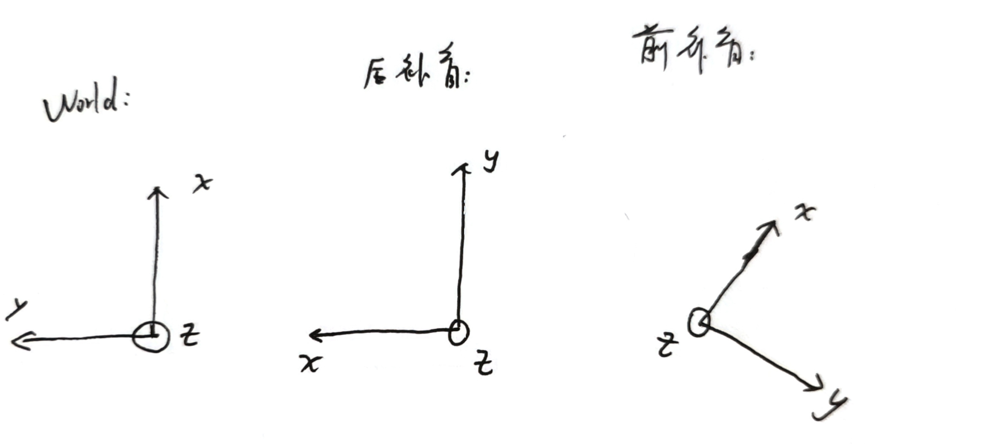

后补盲:绕z轴-90度,绕x轴180度,已完成

前补盲:比较麻烦,先在config文件中粗标,已完成

再用对墙标精标,

最后用`ICP`把前补盲 标到 主雷达上;

2.地面分割程序已加入心跳信号,已更新gitee;

存在的问题:

1.履带车雷达盲区未测试

2.未测试标定

04/08计划:

1.完成履带车雷达标定;

2.测试雷达盲区

### ==**2021/04/08**==

1.完成履带车主雷达标定;

2.使用ICP完成两辆车前补盲雷达和主雷达之间的标定;

3.两辆车已采集负障碍雷达数据

04/09计划:

1.阅读PointPillars的python实现,学习TensorRT的使用

2.分析三个雷达时间戳差距,分析是否有进一步时间同步的需要

2.配合薛含章师兄进行负障碍检测;

### ==**2021/04/09**==

1.履带车雷达程序更新,八轮车未更新,gitee更新两辆车的雷达标定和盲区数据;

2.使用ros自带的时间同步进行多雷达数据的时间同步:

八轮车:

​			前后补盲雷达时间间隔在10ms以内;

​			主雷达比补盲雷达时间要早30-40ms

履带车:

​			未测试

关于三个雷达之间的时间戳,要多测试几次,确定时间先后顺序是否有规律

> 使用rqt_bag your_bag_name.bag 可以以界面的形式查看bag包中各话题的时间戳情况

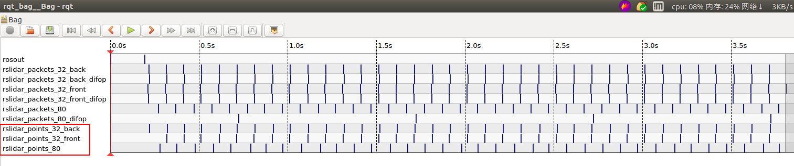

3.已跑通PiontPillars开源代码的训练部分,未测试;

**遗留问题:**

`04/08`采集的负障碍雷达数据,只有前补盲雷达数据,没有80线主雷达数据.

**原因:**

在采集的时候有警告提醒

`[ WARN] [1554260241.161152134]: rosbag record buffer exceeded.  Dropping oldest queued message.` 

**解决方法:**

提高rosbag的缓存空间:

`rosbag record  -b num /topic`

```
image-20200715212923389rosbag record -b SIZE, --buffsize=SIZE

Use an internal buffer of SIZE MB (Default: 256, 0 = infinite). This is the message queue of the recorder object, before messages are being passed on to the bag. Lowering this value might result in messages being dropped before they reach the recording process.
```

指令如上所示，rosbag 中加入`-b num` ，即为将缓存空间设置成num大小MB,设置为4096,测试中未出现警告提醒;


04/10计划:

1.继续测试两辆车的雷达时间戳间隔;

2.方仓医院动态障碍物检测程序移植上车,调出第一版参数;

3.使用小数据集训练PointPillars,得到模型后去跑预测代码,先把整个流程跑通;

### ==**2021/04/10**==

1.直接录制ros点云数据,数据量太大,解决掉丢包的问题后,还有保存bag包过程时间太长的问题,实测保存2分钟的未丢包数据,30分钟后bag包仍然是active状态,根据雷达驱动说明文档中的教程,改为录制ros packet信息,需要录制以下ros消息:

```
/rslidar_packets_32_back
/rslidar_packets_32_back_difop
/rslidar_packets_32_front
/rslidar_packets_32_front_difop
/rslidar_packets_80
/rslidar_packets_80_difop
```

已将录制命令写进脚本`record_packet.sh`中:

```sh
#!/bin/bash
rosbag record /rslidar_packets_32_back /rslidar_packets_32_back_difop /rslidar_packets_32_front /rslidar_packets_32_front_difop /rslidar_packets_80 /rslidar_packets_80_difop -O $1 --bz2
```

使用方法:

`sh ./record_packet.sh bag_name`

如果想要回放,需要在本地安装rs雷达驱动,`config`文件已经写好,可以直接copy使用,若希望启用坐标变换的功能，在编译程序时需要将```ENABLE_TRANSFORM```选项设置为```ON```.

- 直接编译

  ```bash
  cmake -DENABLE_TRANSFORM=ON ..
  make -j4
  ```

- ROS

  ```bash
  catkin_make -DENABLE_TRANSFORM=ON
  ```

2.

雷达驱动,已加入心跳信号:`/rslidar_sdk/src/adapter/point_cloud_ros_adapter.hpp`

ros消息类型为:`std_msgs::UInt8`

ros消息topic为:`lidar_topic+"_HeartBeat"`,比如:`/rslidar_points_80_HeartBeat`

3.时间戳测试:

+ 八轮车:稳定image-20200715212923389

```txt
1618018677174.494141 1618018677213.178711 1618018677213.232178 38.684570 38.738037
1618018677274.941406 1618018677313.176270 1618018677313.220459 38.234863 38.279053
1618018677374.480469 1618018677413.104980 1618018677413.190430 38.624512 38.709961
1618018677474.893799 1618018677513.059814 1618018677513.113281 38.166016 38.219482
1618018677574.442871 1618018677613.018066 1618018677613.026855 38.575195 38.583984
...
```

+ 履带车:第一次测试:

  使用ros自带的时间同步工具,main先到,补盲雷达后到

```txt
1618021614763.164551 1618021614797.686768 1618021614775.266846 34.522217 12.102295
1618021614862.600830 1618021614897.647705 1618021614875.218018 35.046875 12.617188
1618021614963.141846 1618021614997.568359 1618021614975.158203 34.426514 12.016357
1618021615062.974854 1618021615097.544922 1618021615075.090576 34.570068 12.115723
1618021615162.904297 1618021615197.493408 1618021615175.104004 34.589111 12.199707
1618021615262.843262 1618021615297.492432 1618021615275.074219 34.649170 12.230957
1618021615362.868652 1618021615397.345947 1618021615375.707520 34.477295 12.838867
1618021615462.933594 1618021615497.294922 1618021615475.573975 34.361328 12.640381
1618021615563.078125 1618021615598.005371 1618021615575.684814 34.927246 12.606689
1618021615663.236084 1618021615697.865723 1618021615675.505127 34.629639 12.269043
.....
```

+ 再测试几次后,将主程序的雷达接收程序的时间同步方式改为ros自带的同步方式;

3.已将方仓医院动态障碍物检测程序移植到目前的雷达上面,可以检测动态行人,对于动态车辆还需要调参数

04/11计划:

1.继续统计两辆车的雷达时间戳情况;

2.优化动态障碍物检测程序,目前算法耗时较多,且容易出现虚警,目前打算先对点云进行聚类,再分析运动状态;

3.继续看PointPillars代码实现;

### ==**2021/04/11**==

1.更该雷达驱动心跳为一个,ros话题名为:`HeartBeat_1`

`/home/swc/study/lidar_study/2021_C1/c1_-swc/src/rslidar_sdk/src/manager/adapter_manager.cpp`

line46

image-20200715212923389line281

`/home/swc/study/lidar_study/2021_C1/c1_-swc/src/rslidar_sdk/node/rslidar_sdk_node.cpp`

line88

2.时间戳测试:

+ 八轮车:稳定

```
=========main======  =======front========  =======back=======  ==f-m===  ==b-m===
1618113776783.833008 1618113776828.398682 1618113776826.950439 44.565674 43.117432
1618113776883.475830 1618113776928.396973 1618113776927.687500 44.921143 44.211670
1618113776983.321289 1618113777028.320312 1618113777027.547363 44.999023 44.226074
1618113777082.548584 1618113777128.397217 1618113777127.444336 45.848633 44.895752
1618113777182.454590 1618113777228.153076 1618113777227.605469 45.698486 45.150879
1618113777282.440674 1618113777327.914307 1618113777327.355957 45.473633 44.915283
1618113777382.401367 1618113777427.883057 1618113777427.381836 45.481689 44.980469
1618113777482.379639 1618113777527.762451 1618113777527.387939 45.382812 45.008301
1618113777582.321289 1618113777628.143311 1618113777627.552002 45.822021 45.230713
1618113777683.143799 1618113777727.688477 1618113777727.074951 44.544678 43.931152
1618113777782.819336 1618113777828.337402 1618113777827.046631 45.518066 44.227295
...
```

+ 履带车

```
=========main======  =======front========  =======back=======  ==f-m===  ==b-m===
1618113525170.936523 1618113525187.156738 1618113525169.385986 16.220215 -1.550537
1618113525270.096680 1618113525286.823975 1618113525269.204346 16.727295 -0.892334
1618113525370.058838 1618113525386.802246 1618113525369.797607 16.743408 -0.261230
1618113525470.090088 1618113525486.758545 1618113525469.707520 16.668457 -0.382568
1618113525570.590332 1618113525586.946045 1618113525569.897461 16.355713 -0.692871
1618113525670.445312 1618113525686.978760 1618113525669.737549 16.533447 -0.707764
1618113525769.743652 1618113525786.600342 1618113525769.713867 16.856689 -0.029785
1618113525870.167725 1618113525886.555176 1618113525869.765137 16.387451 -0.402588
1618113525970.373535 1618113525986.528320 1618113525969.733398 16.154785 -0.640137
1618113526070.017578 1618113526086.446533 1618113526069.468994 16.428955 -0.548584
.....
```

目前三天的测试结果,通过ros自带的时间同步函数,三个雷达时间戳较为接近

### ==2021/04/12==

1.程序ros协议更新;

消息类型和话题名全部和颜丹发的doc文档一致

2.时间戳统计:

+ 八轮车:稳定

```
=========main======  =======front========  =======back=======  ==f-m===  ==b-m===
1618207767838.990479 1618207767876.688721 1618207767875.892334 37.698242 36.901855
1618207767938.619141 1618207767976.624756 1618207767975.808594 38.005615 37.189453
1618207768038.858154 1618207768076.553711 1618207768075.789551 37.695557 36.931396
1618207768138.031982 1618207768176.458252 1618207768175.657227 38.426270 37.625244
1618207768238.711670 1618207768276.444824 1618207768275.647217 37.733154 36.935547
1618207768337.972900 1618207768376.371582 1618207768375.555664 38.398682 37.582764
1618207768438.030518 1618207768476.347656 1618207768476.277344 38.317139 38.246826
1618207768538.199707 1618207768576.967041 1618207768576.384521 38.767334 38.184814
1618207768637.559570 1618207768676.210938 1618207768676.323486 38.651367 38.763916
1618207768739.274414 1618207768776.873535 1618207768776.348389 37.599121 37.073975
1618207768839.106201 1618207768876.773438 1618207768876.006104 37.667236 36.899902
1618207768939.209473 1618207768976.787598 1618207768975.945068 37.578125 36.735596
1618207769038.988037 1618207769076.711426 1618207769075.913818 37.723389 36.925781
1618207769139.004395 1618207769176.637939 1618207769175.820068 37.633545 36.815674
```

+ 履带车:稳定

```
=========main======  =======front========  =======back=======  ==f-m===  ==b-m===
1618208180290.032471 1618208180304.335205 1618208180287.665527 14.302734 -2.366943
1618208180389.599854 1618208180404.178223 1618208180387.557129 14.578369 -2.042725
1618208180488.691162 1618208180504.348633 1618208180487.477051 15.657471 -1.214111
1618208180588.599365 1618208180604.041504 1618208180587.899170 15.442139 -0.700195
1618208180689.299316 1618208180704.116699 1618208180687.967041 14.817383 -1.332275
1618208180788.274658 1618208180804.112549 1618208180787.793213 15.837891 -0.481445
1618208180888.606934 1618208180904.107422 1618208180887.726318 15.500488 -0.880615
1618208180988.938477 1618208181003.838379 1618208180987.701660 14.899902 -1.236816
1618208181089.215820 1618208181104.441650 1618208181087.652832 15.225830 -1.562988
1618208181189.396484 1618208181204.360840 1618208181187.640381 14.964355 -1.756104
1618208181289.520752 1618208181304.284912 1618208181287.594727 14.764160 -1.926025
1618208181389.715088 1618208181404.515381 1618208181387.659424 14.800293 -2.055664
1618208181489.590576 1618208181504.538818 1618208181487.527344 14.948242 -2.063232
1618208181589.841309 1618208181604.280029 1618208181587.637695 14.438721 -2.203613
1618208181690.157715 1618208181704.201660 1618208181687.672607 14.043945 -2.485107
1618208181789.930908 1618208181804.187500 1618208181787.588867 14.256592 -2.342041
1618208181889.051270 1618208181904.143066 1618208181887.555176 15.091797 -1.496094
```

根据目前三天对雷达时间戳的统计,使用ros自带的时间同步函数,可以很好的完成时间同步功能,三个雷达消息的时间差在50ms之内,而且没有丢帧现象发生;

继续评估,如果一星期的统计信息都很稳定,就使用ros自带的时间同步函数替代原来的时间同步策略;

3.遇到的问题

履带车测试时,雷达正障碍图中有虚警,经排查是由于雷达驱动config文件中坐标转换的相关参数使用了八轮车的参数导致的,现在在雷达驱动中对两种车的配置参数都放了备份,防止用错参数.

4.已将正障碍物聚类(rbnn聚类)加入到雷达感知程序,未和动态障碍物检测程序融合;

04/13计划:

1.阅读apollo中动态目标检测的代码,和目前在用的算法进行比较;

2.继续优化目前的动态障碍物检测算法,减少虚警和运行时间;

3.继续阅读车辆检测算法;

### ==2021/04/13==

1.时间戳统计

+ 八轮车:稳定

```
1618297041955.2 1618297041997.0 1618297041996.9 41.8 41.7
1618297042054.9 1618297042097.0 1618297042097.6 42.2 42.7
1618297042155.3 1618297042196.9 1618297042197.5 41.6 42.2
1618297042254.9 1618297042296.8 1618297042297.5 42.0 42.7
1618297042355.4 1618297042396.8 1618297042397.4 41.4 42.0
1618297042454.9 1618297042496.7 1618297042497.4 41.8 42.5
1618297042555.4 1618297042596.7 1618297042597.4 41.2 41.9
1618297042656.1 1618297042696.6 1618297042697.3 40.5 41.3
1618297042755.0 1618297042796.6 1618297042797.2 41.6 42.2
```

+ 履带车:稳定

```
1618297669711.5 1618297669662.9 1618297669641.4 -48.6 -70.1
1618297669811.6 1618297669862.6 1618297669841.9 51.0 30.2
1618297669912.3 1618297669962.8 1618297669942.0 50.5 29.7
1618297670111.5 1618297670162.4 1618297670141.7 50.9 30.2
1618297670212.1 1618297670262.3 1618297670241.6 50.2 29.6
1618297670311.6 1618297670362.9 1618297670341.6 51.4 30.0
1618297670511.6 1618297670563.1 1618297670541.6 51.5 30.0
1618297670611.4 1618297670663.0 1618297670641.4 51.6 30.0
1618297670711.5 1618297670762.9 1618297670741.4 51.3 29.9
1618297670811.2 1618297670862.7 1618297670841.3 51.5 30.1
```

### ==2021/04/14==

1.时间戳统计

+ 八轮车:稳定

```
1618392046973.5 1618392047016.2 1618392047019.1 42.7 45.6
1618392047073.3 1618392047116.1 1618392047119.1 42.8 45.8
1618392047173.3 1618392047216.7 1618392047219.0 43.4 45.7
1618392047272.3 1618392047316.7 1618392047319.0 44.3 46.7
1618392047372.7 1618392047416.7 1618392047419.6 44.0 46.9
1618392047472.2 1618392047516.6 1618392047519.5 44.5 47.4
1618392047573.1 1618392047616.6 1618392047619.5 43.5 46.4
1618392047672.0 1618392047716.5 1618392047719.5 44.5 47.5
```

+ 履带车

```
1618391856424.8 1618391856417.3 1618391856392.0 -7.5 -32.8
1618391856524.9 1618391856518.8 1618391856492.0 -6.0 -32.9
1618391856624.9 1618391856617.7 1618391856591.9 -7.2 -33.0
1618391856724.2 1618391856717.5 1618391856691.9 -6.6 -32.3
1618391856828.7 1618391856819.1 1618391856791.8 -9.5 -36.8
1618391856924.9 1618391856917.7 1618391856891.8 -7.2 -33.1
1618391857025.4 1618391857017.2 1618391856991.7 -8.2 -33.7
1618391857124.7 1618391857117.2 1618391857091.7 -7.6 -33.0
```

2.RBNN聚类测试

每帧耗时小于20ms,结果比较稳定

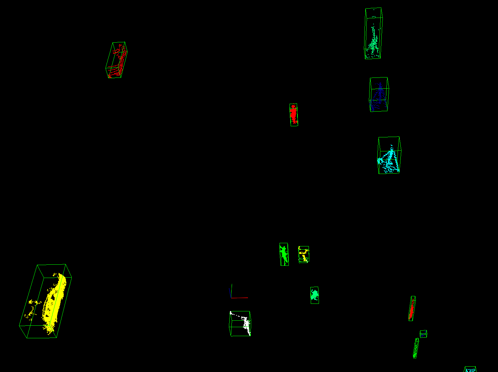

04/15计划:

1.跟车程序调试


### **==2021/04/20==**
1.相机标定

已完成无需标定板进行世界坐标系到图像坐标系的转换功能;

输入至少四对 世界坐标系 和 图像坐标系的对应点,即可完成标定;

注意:选取点的范围要尽可能覆盖在图像中的感兴趣区域,选的点越多,精度越高

2.车辆检测

使用1000帧数据训练车辆检测`Adaboost`模型,进行简单测试,基本上可以检测出履带车;

后续计划:

1.检测出车辆之后进行卡尔曼滤波跟踪,实现动态障碍物检测功能,与王黎师兄方法进行对比;

2.继续加入更多训练数据,完善车辆检测模型

3.编写融合程序;


### ==2021/04/21==

1.车辆检测

使用2000帧数据训练出来的数据进行测试,结果如下:

+ 车屁股

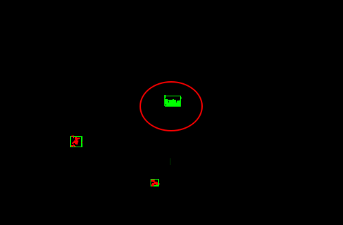

+ 车身

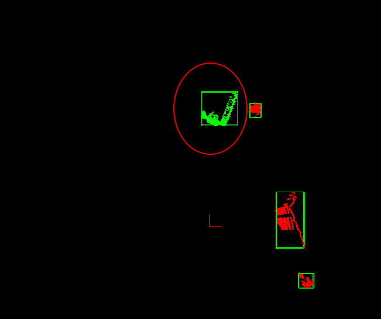

存在的问题:

+ 训练数据不足,导致虚警和漏检,需要更多数据训练
+ 为了减少标记点云数据的工作量,对聚类后的点云簇先进行了一次滤波,把一些明显不是车辆的点云去除,由于聚类算法的局限性,当车辆和其他物体距离过近时,会把它们聚为一类,这就直接被滤去了,导致无法检测到,目前想到的解决办法是,利用上一帧的检测3D框,使用滑窗法检测本帧中的车辆
+ 由于视角和遮挡问题,车辆有时会由车屁股变为车身,造成状态波动

2.动态检测物跟踪

已完成卡尔曼滤波类的实现,进行了简单测试,但是没有和检测程序融合


04/22计划

1.将卡尔曼滤波融入到动态障碍物检测中

2.继续标记点云数据

### ==2021/04/22==

1.写卡尔曼滤波跟踪程序

经过分析跟车的过程,发现这并不是简单的单目标跟踪任务,使用运动模型对上一帧检测到的车辆进行运动状态预测没有问题,但是使用检测到的车辆对车辆状态进行update时,会出现漏检和虚警,就变成了多目标的前后匹配问题,还在构思代码逻辑结构.

2.通过车辆之间的通信可以或得其他车辆的GPS坐标,进而获得车体坐标系下的坐标,具体怎么用这个信息还没有想好,可以把这个位置信息当做观测信息,当车辆检测出现漏检时,更新卡尔曼预测值.


04/23计划

1.构思代码结构,争取写出针对单目标的初版程序,后期再加入多目标的前后帧匹配.


### ==2021/04/23==

1.梳理卡尔曼滤波车辆跟踪程序结构

当前帧车辆检测的结果为`Objects`,将`Objects`信息输入跟踪程序:

- Step1.预处理

  把每一个`Object`里面的中心，重心的坐标系从车体坐标系转换为全局坐标系;

- Step2. 构建跟踪物体

  将坐标转换完的`Object`添加速度,加速度等状态信息,封装成`TrackedObject`，加入跟踪列表`Tracks`

- Step3. 预测

  卡尔曼滤波`Predict`阶段，对正处于跟踪列表中的跟踪物体进行当前时刻重心位置、速度的预测

- Step4. 使用当前检测到的`Object`，去和跟踪列表中的物体(状态已预测过)进行匹配

  有三种情况:

  + `<Object,TrackedObject>`成功匹配，使用与`TrackedObject`成功匹配的`object`作为观测信息,进行卡尔曼滤波的`Update`阶段, 更新状态
  + `<None,TrackedObject>`,上一帧的跟踪物体,在当前帧没有对应的Object，将其标记为丢失,仍然参与后续的匹配,跟踪时长age-1
  + `<Object,None>`,当前帧物体之前没有被跟踪过,创建新的`TrackedObject`，加入跟踪列表

  - 删除丢失的跟踪目标: 删除丢失时间过长的跟踪

+ step 5

  输出动态信息


2.新采集了一段跟车数据,由于卡尔曼滤波需要调节参数,录了前车的速度和gps,localpose信息,把跟踪结果与之对比,方便调节参数.


04/24计划

1.写跟踪程序

2.标记八轮车的车辆检测模型数据

### ==2021/04/24==

1.完成第一版跟踪程序的编写

在第一版程序中,卡尔曼滤波的观测信息仅有检测到的车辆位置,状态转移噪声Q和测量噪声R维数调参

使用第一次录的跟车数据测试,结果:

+ 前车位置

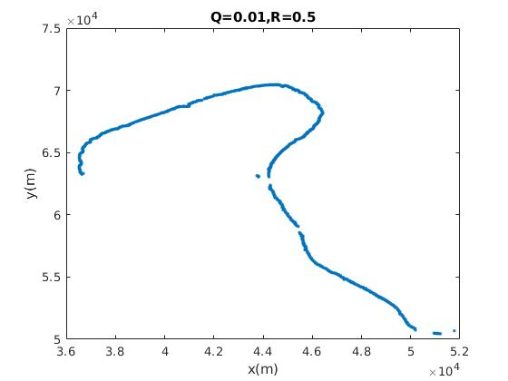

+ 前车速度

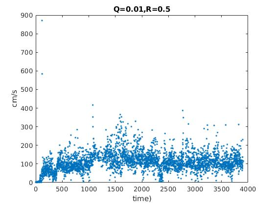

+ 前车方向

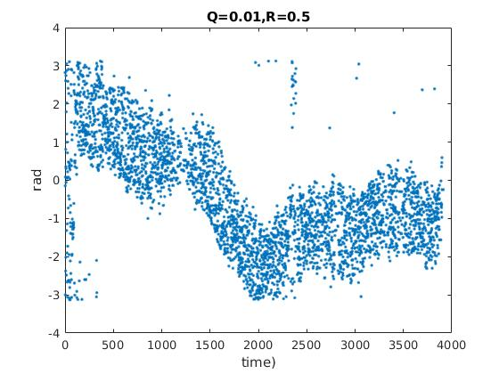

2.存在的问题:

+ 由于没有利用前后帧信息计算前车运动速度和加速度,卡尔曼滤波估计的速度信息波动比较大
+ 目标丢失后,重新初始化的逻辑还需要改进


后续计划:

1.利用前后帧信息,计算前车的速度和加速度,使卡尔曼滤波的结果更加稳定

2.构思融合前车GPS信息程序架构

### ==2021/04/26==

1.标记新的跟车数据,发现一个问题:

八轮车的车尾比较平,在点云中的样子就像是一面墙

有时候只能看到车尾,有时候可以看到整个八轮车,不同视角下形状差异很大,为了确保分类模型的准确性,先用一个模型去分类测试一下效果,如果效果不好,车尾和整个车身用两个模型去分类,增加模型准确性.


| 车尾                                                         | 车身 |
| ------------------------------------------------------------ | ---- |
| 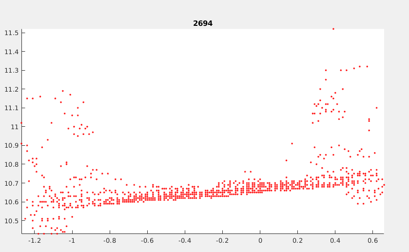 |      |
| 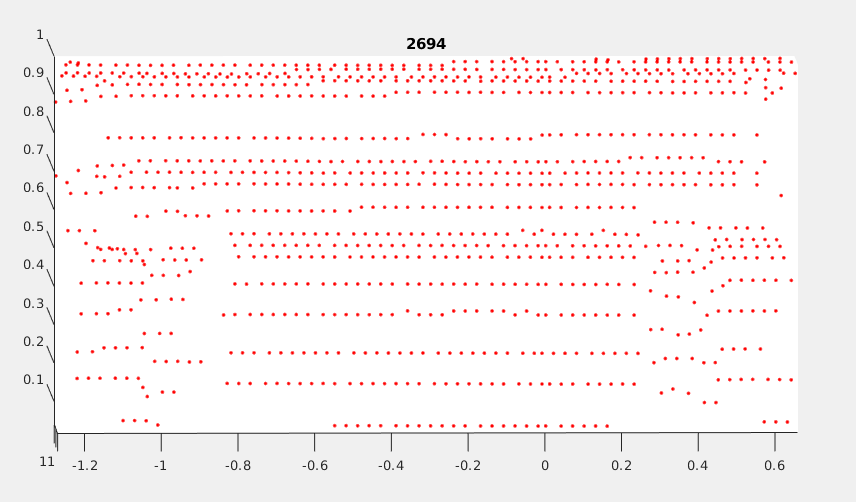 |      |
|                                                              |      |

2.卡尔曼滤波跟踪测试

由于前车没有录制数据,使用后车的localpose数据作为真值,对比结果

|      |                           滤波输出                           | 真值                                                     |
| :--: | :----------------------------------------------------------: | -------------------------------------------------------- |
| 位置 |    | 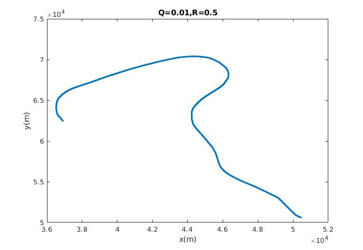   |
| 方向 |  | 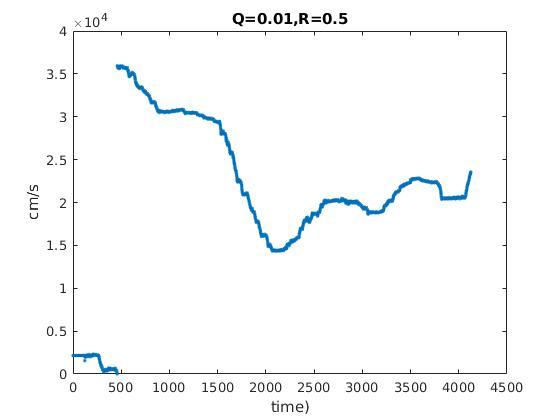 |
| 速度 |                  |                                                          |

想法:

位置观测应该挺准的,应该主要估计速度


### ==2021/04/28==

1.融合程序已完成地面分割结果,动态信息以及运动目标实例信息的融合

2.车辆检测以及跟踪程序中加入前车GPS约束,加入GPS约束后的检测跟踪策略:

+ 检测:

  根据前车的大致位置,在原始点云中,划取一块区域,只在这个区域内进行车辆检测

+ 跟踪:

  由于GPS可能不准,只在检测不到前车的情况下,将前车GPS信息作为观测更新卡尔曼滤波器状态.

+ 初始化策略:

```
初始化策略: 假设初始化时 前车与本车距离很近
1.没有检测到前车->使用gps初始化
2.检测到一个目标->判断其与gps(如果有gps,否则本车)的距离,如果小于th,用其坐标初始化,否则->使用gps初始化
3.如果检测到多个目标->找到距离gps(如果有gps,否则本车)最近的目标->如果距离小于th,用其坐标初始化,否则->使用gps初始化
```

+ 寻找观测策略

```
寻找观测策略:
1.没有检测到前车->检测观测失败->如果有gps,使用gps观测->否则,观测失败
2.检测到一个目标->判断其与上一帧跟踪结果预测后的距离,如果小于阈值,认为观测成功,否则失败->如果有gps,使用gps观测->否则,观测失败
3.如果检测到多个目标->找到距离上一帧最近的目标->判断其与上一帧跟踪结果预测后的距离,如果小于阈值,认为观测成功,否则失败->如果有gps,使用gps观测->否则,观测失败
```

### ==2021/04/29==

1.怎样使用GPS信号

​		由于localpose有累积误差,不能将gps坐标直接投到localpose上,需要计算前车gps和本车gps之间的相对位置,然后再推算前车的localpose

这里的gps坐标一定要转成高斯坐标

2.极值测试

​		八轮车看履带车 距离雷达1.3m才可以检测到

3.去除粉尘

​		利用粉尘的内部动态特性,做**非刚体检测**


### ==五月份计划:==

1.融合程序最后要发出来两张图:

+ 静态正障碍图,在这张图里面,要把动态物体去掉
+ EntityMap

2.静态正障碍物图需要融合序贯信息,增加稳定性,建立局部占据栅格地图

3.跟车稳定性测试,车辆检测的范围,测试粉尘的影响,怎样去除粉尘

4.正障碍图中,悬崖的检测

5.读取档位信息,前进档时,只用前面雷达,后退档时,才用后面雷达

6.无模型运动目标检测[王黎]


### ==2021/05/09==

1.履带车 前补盲雷达和主雷达 标定完成

2.


2021/05/10计划

1.测试履带车 后补盲雷达

2.测试车辆检测 距离范围  各种角度

### ==2021/05/10==

1.加入档位信息判断,只有在倒车时,才启用后方补盲雷达

2.更新`trackmode`消息,加入要跟踪的车辆id号[暂定这样的格式]

```
uint8 id
int32 mode	# 0-->no tracking target   
            # 1-->pedestrian tracking
            # 2-->vehicle tracking
```

3.跟踪程序中,已融合GPS输入信息,未测试GPS信息可信度;

4.完善动态障碍物表示方法,需要计算动态障碍物的2Dxy平面凸包;


后续计划

1.测试履带车 后补盲雷达

2.测试车辆检测 距离范围  各种角度

3.测试车辆间通信接收到的GPS信号准确性,稳定性

4.写计算动态障碍物的2D凸包程序


存在的问题:

1.位置估计时,取的是检测到的车辆点云质心,但是由于视角的关系,检测到的车辆可能只是车尾,或者车体一侧,点云质心位置并不是实际车辆的位置,于此同时,检测到	的点云从车尾变成车身时,点云质心位置会发生突变,导致位置,速度估计不准;

​	所以应该估计出实际的车辆2D框/3D框,提供框的先验值,==同时估计框的长度和宽度.==

2.粉尘和草对于障碍物检测的影响.

+ 先地面分割,如果有连成一片的障碍物,很有可能是草丛

  一般的障碍物在雷达扫描射线上(某个扫描角度)会有遮挡,而草丛会有连成一片的形状,根据这个特征来识别草丛?

+ 动态场景建模去除粉尘

动态场景建模:

eg:

室内静置的相机,场景中有运动的行人,只要前后两帧图像相减,就能得到运动的像素点

如果是室外静置,有些背景也会发生运动,比如随风飘动的树叶,如果依靠前后帧相减,树叶飘动的地方也会被识别为运动的像素点,实际上这些是背景,这些被识别为"动态"的背景,有一定的变化规律在里面,这些像素点在绿色(树叶),蓝色(天空),黑色(树干)之间反复变换,闪动,而真正运动的目标不会发生这种闪动现象,利用这种规律可以把虚警去掉,

粉尘 也有 类似 树叶这种飘动的规律?

利用频域信息?


### ==2021/05/20==

1.复现了CNN-based Lidar Point Cloud De-Noising in Adverse Weather的网络,使用校内采集的烟雾数据,由于标注非常耗时,只用了100帧数据,效果不是很好,只是跑通了流程,通过实现这个网络,我感觉要想使用深度学习模型,需要大量的数据,很有可能换个雷达就不能用了,所以还是想用模型驱动的方法去尝试去粉尘,使用ray casting的方法将点云栅格图或者体素分为占据等状态,通过检测状态的变化检测粉尘

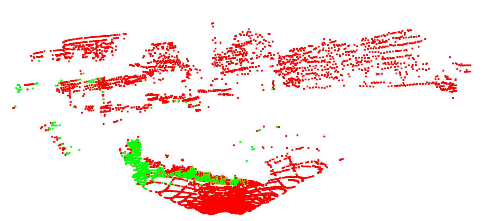

2.车辆跟踪,测试了gps车间通信,在gps信号好的时候,前车位置很稳定,在车辆检测后,打算先找到实际车辆框的短边,用短边的中心作为车辆检测的结果


### ==2021/05/21==

粉尘特征:

1.xy平面下

2.front视角

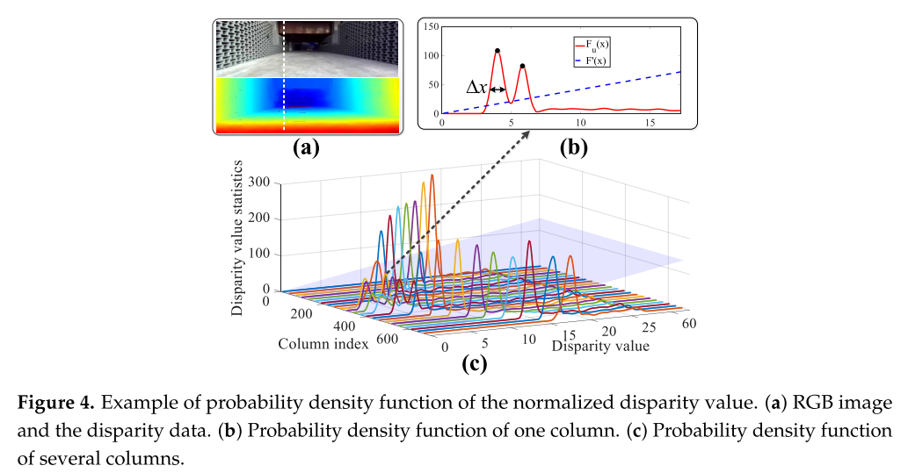

刚体形状固定,它的range应该变化不大


把每一列 range 画出来分析


### ==2021/05/22==

问题:

1.DynamicObjectjection程序内存泄漏,原因

在循环里面使用了指针 input_cloud,没有释放

```C++
for(int i=0;i<seg_num;++i) {
    if(rbnn_cluster_result_[i].car_likelihood < -5)
        continue;
    // NOTE(swc):提取凸包
    pcl::PointCloud<pcl::PointXYZ>::Ptr input_cloud(new pcl::PointCloud<pcl::PointXYZ>)
    // ....
}
```

正确用法是,在类变量声明:

```C++
pcl::PointCloud<pcl::PointXYZ>::Ptr input_cloud_;
```

在构造函数中使用冒号表达式初始化(==pcl的指针初始化==):

或者使用智能指针初始化

```C++
DynamicObjectDetection::DynamicObjectDetection(ros::NodeHandle& nh): input_cloud_(new pcl::PointCloud<pcl::PointXYZ>))
{
 // ...
}
// or:
input_cloud_ = boost::shared_ptr<pcl::PointCloud<pcl::PointXYZ> >(new pcl::PointCloud<pcl::PointXYZ>);
```

2.地面分割程序的preprocess()函数耗时有时候会突然跳到200-500ms,原因还未知,可能是因为`问题1`内存泄露占用了大量内存的原因,

问题1解决后,还未出现耗时增加情况


### ==2021/05/23==

后续任务

通过方向盘遥控前车前进，后车能够根据雷达检测结果与车联位姿信息，识别并能稳定跟随前车行驶，并在行驶过程中避障

1.测试车辆检测结果和车联信息 之间的误差

2.不能完全依赖某一个信息源

​	根据gps信息对点云进行低通滤波,不可取,这样就完全信任gps信号了


### ==2021/05/24==

1.采集了一段跟车数据

2.完成二维ray-casting


### ==2021/05/25==

问题:

0524录制的履带车跟八轮车的数据,八轮车发来的gps数据有问题,x,y正负好像反了

解决:

输入自身gps坐标时,角度转弧度时,除法没有转成double类型,导致一直是0或者3.14

```C++
void DynamicObjectDetection::set_self_gps(C1::insMsg::Ptr &input_self_gps)
{
    self_gps_flag_ = true;
    input_self_gps_.x     = input_self_gps->gaussPos[0];
    input_self_gps_.y     = input_self_gps->gaussPos[1];
    // 0.01 deg -> rad
    // input_self_gps_.theta = input_self_gps->azimuth / 18000 * PI;
    input_self_gps_.theta = input_self_gps->azimuth / 18000.0 * PI;
}
```


### ==2021/05/29==

1.卡尔曼滤波器的转移矩阵`F`中的`delta_t`由100ms左右,将其除以100,值缩小到1附近,滤波效果变好很多,速度和方向都收敛了

2.发现一个问题:

```C++
global_diff = tracked_objects[0].global_position_ - other_localpose_measurement;

std::cout << "this_position " << tracked_objects[0].global_position_.transpose()
		  << " gps_position " << other_localpose_measurement.transpose() << std::endl;
```

`tracked_objects[0].global_position_.transpose()`有时候会是`nan`

有时候会是特别大的值

原因: `seg`中没有对`centerx`这三个值进行初始化,导致其初始值可能不是0

```C++
struct seg {
    // ...
    float centerx;
    float centery;
    float centerz;
	// ...
    seg() {
        centerx = 0;
        centery = 0;
        centerz = 0;
        // ..
    }
};
```

### ==2021/05/30==