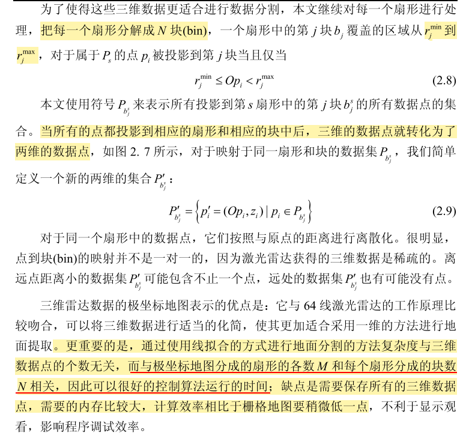

# 1.地面分割

## 1.1 三维雷达数据表示

### 1.1.1 基于栅格地图的表示

#### 1.1.1.1 均值高度图

​		均值高度图为高度图的一种具体的表现形式，是一种紧凑的 2.5 维表示，它由一系列两维的栅格组成，将一帧激光雷达数据==垂直==投影到栅格地图中后，==每一个栅格只保留一个值==——所有投影到同一个栅格中的激光雷达返回值的平均值，这样只对第三维高度进行了部分建模。每一个栅格只有两个状态——障碍物和非障碍物。

​		如果想用均值高度图来进行障碍物检测,可以用阈值来确定,如果平均高度大于阈值,就认为是障碍物,否则认为是地面,

​		均值高度图的==优点==是可以滤除噪声,的干扰获得平滑的表面，不会出现比较尖锐的障碍，适合表示地面模型。==缺点==是 不能表示悬挂结构(overhanging structures)，不能进行三维数据分割,对于比较大的坡度也会识别为障碍物.

#### 1.1.1.2 最大最小值高度图

​		在最大最小值高度图中地面被建模为一系列的栅格，这些栅格仅包含两个值——所有投影到同一栅格中的激光雷达返回值的最大值和最小值。

​		这种表示方法的

==优点==是避免了采用均值对栅格中的障碍物的高度进行近似，而是 直接对最大最小值进行处理，计算的效率比较高，在城市环境中能够取得很好的 表示效果；

==缺点:==但是相对于均值高度图，其对噪声的敏感性比较高，仍然不能处理悬挂结构和进行三维数据分割,对较大坡度的路面鲁棒性也不好.

#### 1.1.1.3 多尺度高度图

​		多尺度高度图是用于处理悬挂和垂直结构的高度图的一种变种.

一般的多尺度高度图可以通过两种方法来构建，一种是直接的三维数据点， 另一种是将多个多尺度高度图组合而成，假设给定一个三维的点集合

#### 1.1.1.4 其它基于栅格的方法

为了区分软的障碍物和硬的障碍物提出了测定体积的**密度地图**(Volumetric Density Map)

该方法将外部环境分解为一系列的三维像素，**统计每一个三维像素被激光雷达光 束击中和被穿过的的条数，它们之间的比例关系可以反映障碍物的质地**，该方法 不能处理悬挂物体且不能进行三维数据分割

### 1.1.2 基于极坐标地图的表示

极坐标栅格地图表示主要是根据三维激光雷达的工作原理提出的一种地图表示方式，==该方法可以在一定程度上克服随着距离的增加，激光雷达的返回点变得的越来越稀疏所带来的数据分布不均匀的问题==.

​		为了让三维数据更适合进行数据分割,对每一个扇形继续处理,把每一个扇形==根据距离==分解成N块(bin),

## 1.2 基于单个栅格的地面分割

​        该方法要求保留每个栅格中激光雷达返回值的**最大最小高度值**，并且计算每 一个栅格中的**高度差**。当栅格中的**高度差小于预先定义的阈值T** 时，这个栅格属 于地面，否则该栅格属于障碍物.

​		对于阻塞的栅格，直接采用栅格的最大最小高 度值计算高度差并不能真实的反映栅格中障碍物的高度；对于 阻塞的栅格，寻找离该栅格最近的属于地面的栅格，用其最小值近似为该栅格的 最小值，该栅格的最大高度值保持不变，然后用更新后的最大最小高度值计算该 栅格的高度差，对该栅格的属性进行评价

​		**这个约束**,只能寻找平面,车顶这类平面也会被识别为地面,同时也要对平均高度进行约束,但是也无法应对大坡面的情况,也不能处理悬挂物和负障碍

## 1.3 基于分块直线拟合的地面分割

将激光雷达数据采用 极坐标栅格地图 表示后,这些数据投影到了一系列的扇形$S_s$中,可以采用从每一个扇形$S_s$中==提取直线==的算法进行地面分割.

因为每一个扇形中的点都已经按照距离无人车的远近进行了==排序==,可以采用简单高效的增量算法进行地面分割,

地面模型为$y=mx+b$,该模型必须满足以下约束:

对于某一个扇形$S_s$中的点,提取直线$L_s=(m_i,b_i)$的算法伪代码如下所示:

$P_{b_i^s}'$表示扇形$S_s$中第$i$块中高度值最小的点

**fitline**:使用最小二乘 进行直线拟合

$P_l$:	表示已经拟合的点

line4-line5 : 因为至少有两个点才能拟合一条直线,所以当$|P_l|>=2$时,才开始拟合直线

核心思想是:

先用几个点拟合出一条直线,然后,不断往模型中增量增加点,如果增加后的数据拟合出来的直线不符合要求,先把之前拟合出来的结果存储起来，

从这个点开始重新拟合直线

最后输出各段直线的斜率和截距；

分段直线拟合完成之后：

## 1.4 基于面拟合的地面分割

对于城市环境，可以假设地面是一个平面，在这种假设下地面分割算法可以简化为平面拟合算法;

## 1.5 地面分割方法优缺点分析

## 1.6 分块高斯过程回归地面分割

本文所面向的环境主要是城市环境和稍有起伏 的越野环境，所以路面模型**必须既适应城市的平坦道路，也必须适应上下起伏的 越野道路**，

同时为了达到**实时处理**这一基本要求，**本文将分块拟合的思想和高斯过程回归模型结合起来**，

提出了一种基于分块高斯过程回归的地面分割算法，

该方法既克服了在极坐标栅格地图中采用直线拟合算法进行地面分割不能很好地描 述起伏路面的缺点，

又克服了采用二维的高斯过程回归进行面分割计算量大的劣势，大大提高了计算效率，能够很好的满足自主车导航的实时性要求。

### 1.6.1 高斯过程回归模型

首先介绍了目前基于激光雷达进行路面分割 的最新研究进展，通过对比分析了各种方法的优缺点，在此基础上介绍了本文提 出的**分块高斯过程回归地面分割算法**，该方法融合了极坐标栅格地图分块处理和==**一维高斯过程回归曲线拟合**==的思想，实验证明本文算法在满足自主车实时性要求 的同时能够获得很好的地面分割结果

对于高斯过程回归的具体原理介绍和应用见[高斯过程回归](高斯过程回归.md)

### 1.6.2 分块高斯过程回归的地面分割

高斯过程回归算法主要针对稀疏的三维数据,用于对连续地面进行概率估计的一种迭代方法,该算法主要包含两个部分:

高斯过程概率模型和**增量采样一致算法**

因为使用高斯过程回归对地面进行分割要求所有的种子点必须属于地面点,

但是每一片扇区$PG_i$中的点是扇区内高度值最小的点,有可能是路面点,也有可能是障碍物上的点,所以采用高斯过程进行地面分割要求该算法有剔除属于障碍物上点的能力又必须具备对属于地面上的点进行建模的能力;

最常用的具有外部数据拒绝能力的算法是RANSAC算法,该方法随着模型的复杂化,它需要的属于内部的数据逐渐增加,这将导致RANSAC算法的效率变低.

对于复杂的高斯过程,采用RANSAC算法显然不能满足要求,针对高斯过程回归和RANSAC算法不好融合的情况，Douillard 等人在 RANSAC 基础上提 出了 INSAC 算法,

INSAC和RANSAC算法最大的不同在于:

INSAC算法在待拟合的数据中首先选择最有可能的内部点作为种子点集,并以这些点作为训练样本迭代训练概率模型,而RANSAC总是随机选择种子点进行迭代.

将高斯过程回归算法和INSAC算法融合在一起可以使高斯过程回归具备提出障碍点的能力，同时具备对地面点进行建模的能力。

一帧三维激光雷达数据采用分块高斯过程回归进行地面分割的算法如下图所示:

图 3. 3 所示算法为一帧三维激光雷达数据进行地面分割的全过程，该算法输 入为车体坐标系中一帧三维激光雷达数据，输出为每一片扇形中的高斯过程模型以及带有标记属性的激光雷达数据点;

该算法主要包含5步:

> 1. 三维激光雷达数据的极坐标栅格地图表示
>
> 2. 初始种子点选择
> 3. 高斯过程回归训练地面模型
> 4. 地面点评价
> 5. 第$i$片扇区中的所有数据点$P_i$分割

**1.三维激光雷达数据的极坐标栅格地图表示**

伪代码中第一行

**2.初始种子点选择**

对应与伪代码中的$S_{new}=seed(PG_i,B,T_z)$

使用seed函数计算每一个扇形中$PG_i$中可能性最大的点作为种子点,方法很简单,选择车辆周围$B$米范围内,$z$坐标小于预先设定的阈值$T_z$的点作为属于地面的种子点,这里使用了点的绝对高度作为评价指标,对激光雷达外参标定的精度有一定要求,必须事先知道雷达的安装高度,然后激光雷达的z轴加上这个高度偏置之后,理想的水平地面高度值是0,一般情况下$B=25$左右

**3.高斯过程回归训练地面模型**

对应于$GPmodel=regression(GPmodel,s_p)$函数

$s_p$为训练高斯过程的种子点,使用RBF核函数计算种子点之间的协方差矩阵$K(X,X)$,这是一个一维高斯过程,因为只拟合z值曲线,而且每一个块内的种子点不会很多,计算效率很快.

**4.地面点评价**

对应$s_{new}=eval(GPmodel,test,t_{data},t_{model})$

$test$就是除了种子点以外的点,对于每一个测试点$x_*\in test$,分别计算$K(x_*,x_*)$和$K(X,x_*)$

通过公式(3.6)计算出$x_*$处的均值和协方差,

INSAC 算法使用概率模型来估计预测的不确定性，算法中的参数$t_{model}$定义了测试点$x_*$的方差的阈值，

参数$t_{data}$定义了测试点$x_*$到它的预测均值$\bar f_*$的归一化的接近程度,在给定$x_*$处的预测方差$V(f_*)$和噪声方差的前提下,可以用马氏距离的一个变种来评价这一接近程度,定义如下两个约束:

图 3. 4 显示了在不同环境中两片扇形中集合$PG_i$ 采用高斯过程回归算法进行地面分割的结果，图中红色的圆圈代表初始选择的地面种子点，绿色的圆圈代表 经过地面点评价后获得的地面种子点，蓝色曲线代表拟合的地面，孤立的蓝色点表示集合$PG_i$中的障碍点，上面一幅图是校园内含有坡度场景中的一片扇形，通过 高斯过程回归算法能够很好地描述地面变化情况，前半部分是一个近似的直道， 后半部分出现一个 5 度左右的坡道；下面一幅图是在校园内，绿化带将道路和广 场隔开的场景中的一片扇形，中间 15 到 20 米的蓝色障碍点能够很好的反映出这 一点，在隔离带的两边都比较平坦，最终结果能够很好地描述这一地面特性。

**5.第$i$片扇区中的所有数据点$P_i$分割**

对应12-14行,对同一个扇形中的每一个块中的点进行分类是否为地面点

获得近似高度,在判断时, 认为每个bin中地面的高度是不变的(取一个均值)

就是一个插值的过程,获得bin中心点的地面高度近似值,如果输入一个向量,就和原理介绍文件中的一样了;

极坐标的问题：

因为通常规划需要的地图是`m x n`的，m代表横向距离，一般是20m，n代表纵向距离，一般是100m

而且很多雷达的视野也是这样，横向视野小，纵向视野大，

这样进行极坐标栅格化的时候，0度附近的栅格中的点会很少，影响地面分割的效果，造成障碍物虚警：

所以需要多帧融合，去掉这些虚警

# 2.负障碍的检测

# 3.悬挂物的检测

