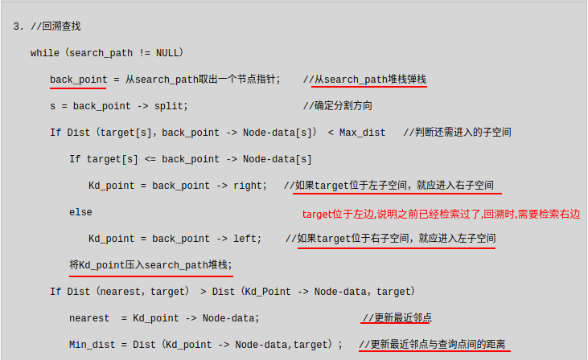

## 1.kd树的原理和实现

**建树&NN search 伪代码**

Node-data就相当于二叉搜索树节点的值,来了一个数据,对应维度的数值就和它相比,比它小是左孩子,比它大是右孩子

range:数据点集?

从上面对k-d树节点的数据类型的描述可以看出构建k-d树是一个逐级展开的递归过程。下表给出的是构建k-d树的伪代码:

k-d树查询算法的伪代码:

上述两次实例表明，当查询点的邻域与分割超平面两侧空间交割时，需要查找另一侧子空间，导致检索过程复杂，效率下降。研究表明N个节点的K维k-d树搜索过程时间复杂度为：$t_{worst}=O(kN^{1-1/k})$。

以上为了介绍方便，讨论的是二维情形。像实际的应用中，如SIFT特征矢量128维，SURF特征矢量64维，维度都比较大，直接利用k-d树快速检索（维数不超过20）的性能急剧下降。假设数据集的维数为D，一般来说要求数据的规模N满足N»2D，才能达到高效的搜索。所以这就引出了一系列对k-d树算法的改进。有待进一步研究学习。

