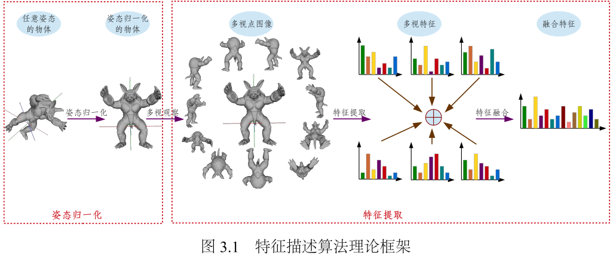
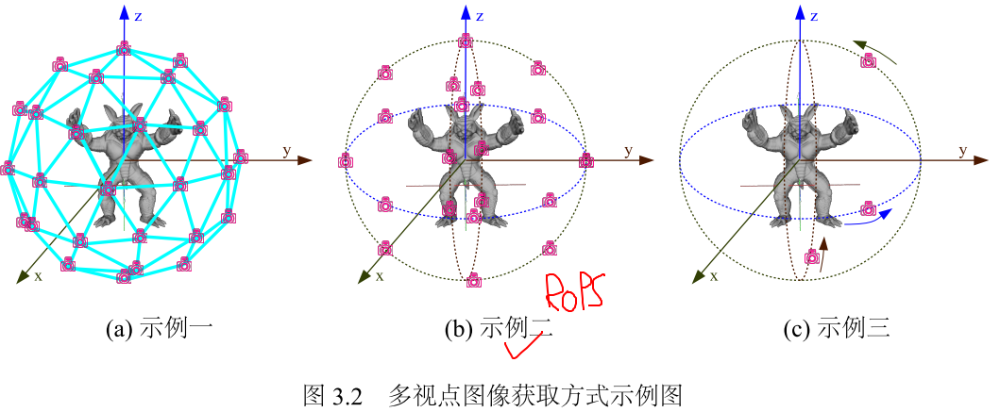
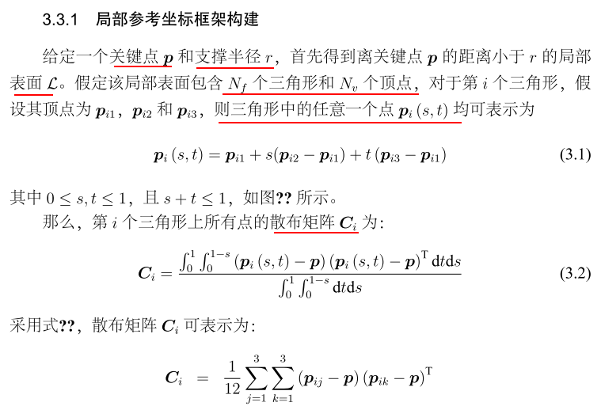
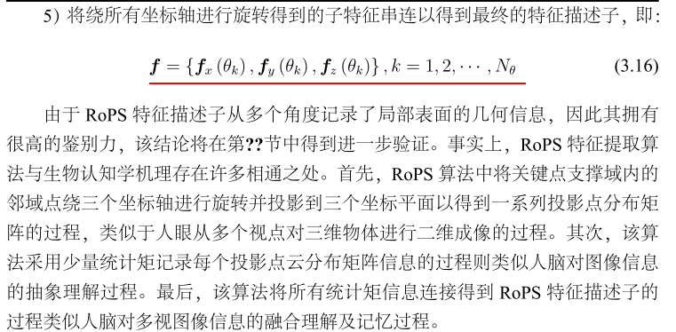

# 0.概述

现有的特征提取算法可以分为全局特征和局部特征两种

+ 全局特征

  使用点云中所有点的几何信息构建得到,典型代表有 三维矩,形状分布等

  全局特征对遮挡及背景干扰十分敏感,因此主要应用于三维形状检索等不存在遮挡及背景干扰的场合

+ 局部特征

  局部特征描述子采用关键点支撑域内的局部几何信息构建描述向量,对遮挡及背景干扰非常稳健.

# 1.行人检测使用的特征

**特征1-3** 描述了样本点云的基本情况

**特征4**     是协方差矩阵$C$,由六个独立向量组成?

**特征5**    协方差矩阵的特征值,按照从大到小排列,表示样本点云在各个方向分布的权重大小

**特征6**    惯性张量矩阵$I$,可以较为**稳定的描述点云的整体分布**

**特征7**     旋转投影统计特征(RoPS),是对样本点云进行投影并转化为一维和二维的统计量,再通过旋转在多视角下分析点云的特性.

Rotational projection statistics

**旋转投影统计特征的优点:**

+ 具有旋转平移不变性
+ 抗干扰

**旋转投影统计量**:

目前在用的组合特征之一,是电科一位博士的成果

现有算法要么鉴别力不高， 要么对噪声、分辨率变化、遮挡、背景干扰、网格孔洞以及拓扑变化等干扰十分敏感。

针对此，本文提出了两种高鉴别力且稳健的局部特征描述子，即 RoPS 及 TriSI 特征描述子.

**算法框架**

包括局部表面姿态归一化,视点设置,二维图像生成,二维图像特征提取以及多视角特征融合;

RoPS 和 TriSI 是该理论框架的两个具体实现，二者采用了相同的局部表 面姿态归一化算法(LRF),不同的视点设置方案、不同的二维图像生成方式以及不同的二维图像特征提取方 法，但二者均获得了优异的性能，从而表明了该理论框架的有效性

+ **LRF的建立**

  

  

+ **特征生成**

  

最后生成的特征维数:

feature size = number_of_rotations * number_of_axis_to_rotate_around * number_of_projections * number_of_central_moments

=$3\times3\times3\times5$(经验证最好的数值)

=135

**会计算四个中心矩:**

m=1,n=1

m=2,n=1

m=1,n=2

m=2,n=2

