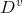
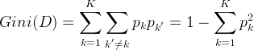
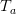

# AdaBoost 分类器

## 0.概述

AdaBoost 是一种由 Freund 和 Schapire提出的**自适应**机器学习算法，其可以将其他分类器算法作为弱分类器，通过对弱分类器的输出进行加权求和得到最终的强分类器输出，可用于提高算法性能。

AdaBoost 是一个**不断迭代**的过程，每次迭代都会增加一个新的分类器。

**其自适应的特点在于本轮被分错的样本在下一次迭代时的权重会增加，而正确分类样本的权重会减少**。

在设计分类器时，算法将选取使误差率最小的阈值，因此误差率会不断降低，**当误差率达到设定的条件时迭代结束**。

该算法的流程及原理如下所示。

1. 给定训练样本集 S，假设两分类问题，样本标记为{1, -1}，T为预设的训练最大循环次数

2. 初始化样本权重，对每一个样本赋予相同的初始权重$w=\frac{1}{N}$,其中$N$为样本总数

3. 循环迭代：

   （1）使用权重为$W^m$的分类样本集训练弱分类器，$m$表示迭代次数，弱分类器可以由任意的分类器算法构成

   （2）计算弱分类器的错误率

   ​	

   ​	其中，$\omega^m_n$为第$m$个分类器对应的第$n$个样本的权重，$y_m$是第$m$个分类器

   ​	(3) 选取合适的分类阈值,使得分类器的样本误差率最小;

   ​	(4) 计算该分类器的权重$\alpha$:

   	

   ​	 (5)  更新样本权重：

   ​		使分类正确的样本的权重减小，增大分类错误样本的权重。

   ​		通过多个弱分类器的加权和构建最终的强分类器。

   ​		

   ​		

**Boosting**

Boosting的核心思想是**串行地训练一系列前后依赖的同类模型**,即后一个模型用来对前一个模型的输出结果进行纠正,Boosting算法是可以将弱学习器提升为强学习的算法.

学习过程是:

先从初始训练集训练出一个基学习器,再根据基学习器的表现对训练样本进行调整,使得先前基学习器做错的训练样本在后续受到更多关注,然后基于调整后的样本分布来训练下一个基学习器;

如此重复迭代,直到基学习器的个数达到指定的个数T或者分类误差小于给定阈值,最终把这些基学习器进行结合;

**三种集成学习方法:**

1. **Bagging:减少 variance**
2. **boosting: 减少 bias**
3. **stacking:增强预测效果**

## 1.决策树

### 1.1 决策树概念

**顾名思义，决策树就是一棵树，一颗决策树包含一个根节点、若干个内部结点和若干个叶结点；叶结点对应于决策结果，其他每个结点则对应于一个属性测试；**

**每个结点包含的样本集合根据属性测试的结果被划分到子结点中；根结点包含样本全集，从根结点到每个叶子结点的路径对应了一个判定测试序列。下面直接上个图，让大家看下决策树是怎样决策的（以二元分类为例），图中红线表示给定一个样例（表中数据）决策树的决策过程：**

### 1.2 决策树构建过程

#### 1.2.1 信息增益

决策树学习的关键在于如何选择最优的划分属性，所谓的最优划分属性，对于二元分类而言，就是尽量使划分的样本属于同一类别，即“**纯度**”最高的属性。那么如何来度量特征（features）的纯度，这时候就要用到“**信息熵**（information entropy）”。先来看看信息熵的定义：假如当前样本集D中第k类样本所占的比例为
,为类别的总数,对于二分类来说,K=2,则样本集的信息熵为:

的值越小，则D的纯度越高。

（这个公式也决定了信息增益的一个缺点：即信息增益对可取值数目多的特征有偏好（即该属性能取得值越多，信息增益，越偏向这个），因为特征可取的值越多，会导致“纯度”越大，即ent（D）会很小，如果一个特征的离散个数与样本数相等，那么Ent（D）值会为0）

再来看一个概念**信息增益**（information gain），假定离散属性  有 个可能的取值，

如果使用特征  来对数据集D进行划分，则会产生V个分支结点(类似多叉树), 其中第v（小v）个结点包含了数据集D中所有在特征  上取值为 的样本总数,记为。因此可以根据上面信息熵的公式计算出信息熵，再考虑到不同的分支结点所包含的样本数量不同，给分支节点赋予权重，即样本数越多的分支节点的影响越大,因此，能够计算出特征  对样本集D进行划分所获得的“信息增益”:

一般而言，信息增益越大，则表示使用特征 对数据集划分所获得的“纯度提升”越大。所以信息增益可以用于决策树划分属性的选择，**其实就是选择信息增益最大的属性**，**ID3算法就是采用的信息增益来划分属性;**

**下面来举个例子说明具体是怎样操作的，只贴公式没多大意义，还是有不利于大家理解。举例子用的数据集为：**

**显然该数据集包含17个样本，类别为二元的，即。则，正例（类别为1的样本）占的比例为：，反例（类别为0的样本）占的比例为：。根据信息熵的公式能够计算出数据集D的信息熵为：**

**从数据集中能够看出特征集为：{色泽、根蒂、敲声、纹理、脐部、触感}。下面我们来计算每个特征的信息增益.**

**先看“色泽”，它有三个可能的离值：{青绿、乌黑、浅白}，若使用“色泽”对数据集D进行划分，则可得到3个子集，分别为：** **（色泽=青绿）、** **（色泽=乌黑）、** **（色泽=浅白）。**

**** **共包含6个样本{1，4，6，10，13，17}** **，其中正例占** **，反例占** **。** **包含6个样本{2，3，7，8，9，15}** *，*。包含了5个样本{5，11，12，14，16}，其中正例占，反例占。因此，可以计算出用“色泽”划分之后所获得的3个分支结点的信息熵为:

**因此，特征“色泽”的信息增益为：**

**同理可以计算出其他特征的信息增益：**

**比较发现，特征“纹理”的信息增益最大，于是它被选为划分属性。因此可得：**

**第二步、继续对上图中每个分支进行划分，以上图中第一个分支结点{“纹理=清晰”}为例，对这个结点进行划分，设该结点的样本集 {1，2，3，4，5，6，8，10，15}，共9个样本，可用特征集合为{色泽，根蒂，敲声，脐部，触感}，因此基于  能够计算出各个特征的信息增益：**

**比较发现，“根蒂”、“脐部”、“触感”这3个属性均取得了最大的信息增益，可以随机选择其中之一作为划分属性（不防选择“根蒂”）。因此可得：**

**第三步,继续对上图中的每个分支结点递归的进行划分，以上图中的结点{“根蒂=蜷缩”}为例，设该结点的样本集为{1，2，3，4，5}，共5个样本，但这5个样本的class label均为“好瓜”，因此当前结点包含的样本全部属于同一类别无需划分，将当前结点标记为C类（在这个例子中为“好瓜”）叶节点，递归返回。因此上图变为：**

**第四步，接下来对上图中结点{“根蒂=稍蜷”}进行划分，该点的样本集为 {6，8，15}，共有三个样本。可用特征集为{色泽，敲声，脐部，触感}，同样可以基于 计算出各个特征的信息增益，计算过程如下（\**写的比较详细，方便大家弄懂\**）：**

**不妨选择“色泽”属性作为划分属性，则可得到：**

继续递归的进行，看“色泽=青绿”这个节点，只包含一个样本，无需再划分了，直接把当前结点标记为叶节点，类别为当前样本的类别，即好瓜。递归返回。然后对递归的对“色泽=乌黑”这个节点进行划分，就不再累述了。说下“色泽=浅白”这个节点，等到递归的深度处理完“色泽=乌黑”分支后，**返回来处理“色泽=浅白”这个节点，因为当前结点包含的样本集为空集，不能划分，对应的处理措施为：将其设置为叶节点，类别为设置为其父节点（根蒂=稍蜷）所含样本最多的类别，“根蒂=稍蜷”包含{6,8,15}三个样本，6,8为正样本，15为负样本，因此“色泽=浅白”结点的类别为正（好瓜）**。最终，得到的决策树如下图所示：

说了这么多，下面就来看看用决策树算法跑出来的效果，本人主要用weka的**ID3算法（使用的信息增益**），以供大家参看，后面还会放出自己实现的版本，后面再说。

但信息增益有个缺点就是**对可取数值多的属性有偏好**，举个例子讲，还是考虑西瓜数据集，如果我们把“编号”这一列当做属性也考虑在内，那么可以计算出它的信息增益为0.998，远远大于其他的候选属性，因为“编号”有17个可取的数值，产生17个分支，**每个分支结点仅包含一个样本，显然这些分支结点的纯度最大**。**但是，这样的决策树不具有任何泛化能力**。还是拿西瓜数据集2.0来测试下，如果考虑编号这一属性，看看ID3算法会生成一颗什么样的决策树：

显然是生成了一颗含有17个结点的树，这棵树没有任何的泛化能力，这也是ID3算法的一个缺点

由于ID3算法的缺点，Quinlan后来又提出了对ID3算法的改进C4.5算法（在weka中为J48），**C4.5使用了信息增益率来构造决策树，此外C4.5为了避免过拟合，还提供了剪枝的功能。C4.5还能够处理连续值与缺失值。**剪枝与连续值和缺失值的处理在下一篇博客中再介绍。先来看看信息增益率:

#### 1.2.1 信息增益率

**信息增益比的定义为：**

**
**

**其中：**

****

** 称为属性  的“固有值"，属性  的可能取值数目越多（即V越大），则的值通常会越大**

**例如还是对西瓜数据集，IV(触感）=0.874(v=2)，IV(色泽)=1.580（V=3），IV（编号）=4.088（V=17）**

但增益率也可能产生一个问题就是，**对可取数值数目较少的属性有所偏好**。因此，C4.5算法**并不是直接选择使用增益率最大的候选划分属性**，而是使用了一个启发式算法：**先从候选划分属性中找出==信息增益==高于平均水平的属性，再从中选择==信息增益率最高==的**。来看看C4.5在西瓜数据集上构造的决策树

#### 1.2.2 基尼指数

**基尼指数（Gini index）也可以用于选择划分特征，像CART（classification and regression tree）决策树（分类和回归都可以用）就是使用基尼指数来选择划分特征。基尼值可表示为：**

****

**反应了从数据集D中随机抽取两个样本，其类别标记不一致的概率，因此， 越小，则数据集D的纯度越高。则属性  的基尼指数定义为：**

**所以在候选属性集合中，选择那个使得划分后基尼指数最小的属性作为最优划分属性。**

### 1.3 决策数处理连续值

 因为连续属性的可取值数目不再有限，因此不能像前面处理离散属性枚举离散属性取值来对结点进行划分。因此需要连续属性离散化，**常用的离散化策略是二分法**，这个技术也是C4.5中采用的策略。下面来具体介绍下，如何采用二分法对连续属性离散化：

下面举个具体的例子，来看看到底是怎样划分的。给定数据集如下（数据集来自周志华《机器学习》，我已经把数据集放到github上了，地址为：[西瓜数据集3.0](https://github.com/tz28/machine-learning/blob/master/西瓜数据集3.0.txt)）：

对于数据集中的属性“密度”，决策树开始学习时，根节点包含的17个训练样本在该属性上取值均不同。我们先把“密度”这些值从小到大排序：

根据上面计算 的公式，可得：

下面开始计算*t* 取不同值时的信息增益：

再由第一篇博客中[决策树（一）](http://blog.csdn.net/u012328159/article/details/70184415)计算得到的各属性的信息增益值：

比较能够知道纹理的信息增益值最大，因此，“纹理”被选作根节点划分属性，下面只要重复上述过程递归的进行，就能构造出一颗决策树：

**有一点需要注意的是：与离散属性不同，若当前结点划分属性为连续属性，该属性还可作为其后代结点的划分属性。** 如下图所示的一颗决策树，“含糖率”这个属性在根节点用了一次，后代结点也用了一次，只是两次划分点取值不同。

## 2.matlab训练方法

matlab工具箱的使用

