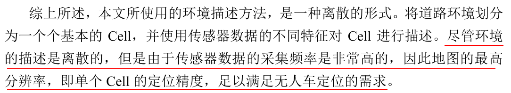
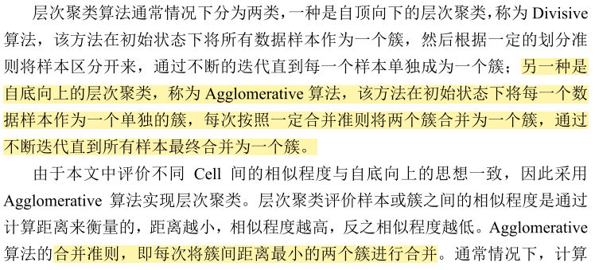

## 1.出发点

在无人驾驶领域，地图的构建与基于地图的定位是最为重要的子模块之一，其对于无人车的路径规划等任务具有重要意义;

常用的定位方法有:

1. GNSS+INS 组合导航  GNSS 信号受到干扰和 遮蔽时，仅仅利用 INS 会有累积误差

2. SLAM             具有累积误差，需要闭环检测消除，不适合长时间 大范围的精确定位

3. 高精度地图     

   是当前主流的定位方式，但是 高精度地图往往具有较高的构建难度和存储成本，且在使用时难度较大，在空旷 或极为相似的环境下定位鲁棒性较差

在长期的实践中可知，在复杂的环境下，如城市、校园，由于环境中的物体较多，可以提取的纹理、结构特征丰富，此时利用高精度地图可以实现高精度的定 位，而在简单单调的环境下，如隧道、空旷的地面，环境中特征相应比较单一， 此时利用高精度地图也不能精确定位，相反会由于精度不够而影响系统的可靠性。 

因此，能否使无人车具有一定的环境理解能力，可以根据环境的复杂程度实现不同精度的定位，从而实现高可靠性的定位和导航，是本文的研究目标。 综上所述，本文研究并提出了一种新型的地图创建定位方法，该方法可以根据环境的复杂程度实现可变分辨率的定位，同时该方法的构建和维护非常简单，地图存储量较小。

让无人车具备一定的环境感知能力,像人一样去定位,人脑定位时并不需要一个高精度的地图,也不知道自己精确的位置信息,随着观察信息的增加,人对自己的位置信息是由粗到细的,比如说,看到了一个国金中心的IFS标志,知道自己在国金附近,但是不知道自己在哪个城市,继续观察,发现一家茶颜悦色,知道自己在长沙的国金附近,然后再增加其他信息,一步一步缩小自己的定位范围;

我们希望无人车,也可以具备这样的由粗到细的定位能力,在算法无法确定自己的准确位置时,就输出一个大概范围,当算法可以确定自己的准确位置时,就输出一个比较小的定位范围,再加上配套的导航规划算法,就可以克服传统slam建图定位的一些缺点,传统的slam建图输出只是一个坐标值,当环境发生变化或者在特征单一的地方,比如走廊,定位会出现比较大的误差,对后续的导航规划产生比较严重的影响;

## 2.地图构建

### 2.1 环境表示

为了实现可变分辨率的地图描述，构建的地图需要随着场景的复杂程度自适应选择定位的分辨率。即根据从环境中提取的特征的相似程度，将环境划分为不同大小的区域。

不仅如此，在无人车使用该地图进行定位时，由于传感器数据的不断变化，提取的特征也不断的变化，相同的环境被划分的区域也是不断的变化。

环境简单的地方,特征相同,分辨率低;    ----- 直线行驶

环境复杂的地方,特征方差大,分辨率高  ----- 路口

### 2.2 可变分辨率地图构建框架

在定义好环境的描述方式之后，使用地图进行定位的方法也需要随之确定。

**因为地图单元是离散的，所以使用本文所提出的地图进行定位的问题实际上是一种 分类问题**。

在定位时，提取当前帧数据的特征，并评价其与地图 Cell 的相似度确定定位的范围。

由于不同特征的相似程度是不同的，因此不同特征的定位范围也有所不同，**通过构建多种特征的分类器，将定位结果求交集**，可以得到更加精确的定位结果。

#### 2.2.1 决策树结构的建立

由上文所述，当前帧的数据特征与地图 Cell 的特征的相似程度是决定地图分辨率的重要因素，为了实现可变分辨率，分类器需要在不同层次上对当前帧数据进行分类，即当前帧的特征易于区分时，定位精度较高，此时对应的地图分辨率更加精细，定位的区域包含的 Cell 单元少，否则，定位精度较低，定位区域包含 的 Cell 单元较多。因此，本文采用**层次聚类**的方法在不同层次上描述各个 Cell 之 间的相似程度。

层次聚类的合并算法通过计算两类数据点间的相似性，对所有数据点中最为相似的两个数据点进行组合，并反复迭代这一过程。简单的说层次聚类的合并算法是通过计算每一个类别的数据点与所有数据点之间的距离来确定它们之间的相似性，距离越小，相似度越高。并将距离最近的两个数据点或类别进行组合，生成聚类树.

后面的工作就是不断的重复计算数据点与数据点，数据点与组合数据点间的距离。

类间数据距离的计算方法;

### 2.2.2  决策树分类器的训练及分类方法

#### 1.训练方法

正如上节所述，构建的树状结构在不同尺度上描述特征的相似程度，

为了实现多分辨率的定位，则需要对测试样本特征**由粗到精**的进行决策，即根据特征的相似程度，逐**步从大范围缩小到小范围**。对应到树状结构上，测试样本特征应该按 照从根节点到叶子节点的索引顺序评价相似程度，直到难以区分其与剩余 Cell 特征的差别。**因此，需要在树状结构的根节点和每一个分支节点上训练一个分类器。**

在构建的树状结构上，每一个分支节点都包含**两个子节点**，因此评价测试样本特征与子节点的相似程度的问题就转变为一个二分类的分类器在分类时的置信度 问题。**对于每一个分支节点和根节点，训练一个二分类的分类器，是训练决策树 的关键**。

对于有$l$个叶子节点的层次聚类,因为每一次合并,都会多一个分支节点,所以到合并成一个根节点时,合并了$l-1$次,所以共有$l-1$个分支节点(包括根节点)

#### 2.分类方法

### 2.2.3 特征提取方法及地图构建

#### 1.特征提取

这样的分割方法无法适应大角度的旋转,如果采集数据时是A->B,定位是B->A,那么就会定位失败,后期,把分割方法改成了由内而外的一个一个环,这样可以适应旋转

#### 2.地图构建

在完成对所需特征的提取之后，对这些特征构建对应的决策树分类器，并保存所有的决策树结构，将树的节点和训练的 SVM分类器一一对应，以及将GNSS 坐 标信息与地图Cell 一一对应，整个地图的构建就基本完成

## 3.地图定位

### 3.1 定位框架

### 3.2 定位算法

#### 3.2.1 序贯位置关系约束

#### 3.2.2 自适应定位算法

#### 3.2.3 基于卡尔曼滤波的自适应定位算法

由于无人驾驶汽车在行驶过程中，其自身状态（位置、速度）可以认为是一个 线性系统，因此可以利用卡尔曼滤波[46]算法进一步优化定位算法输出结果，使定 位结果进一步稳定;

## 4.定位结果

平均误差小于2m