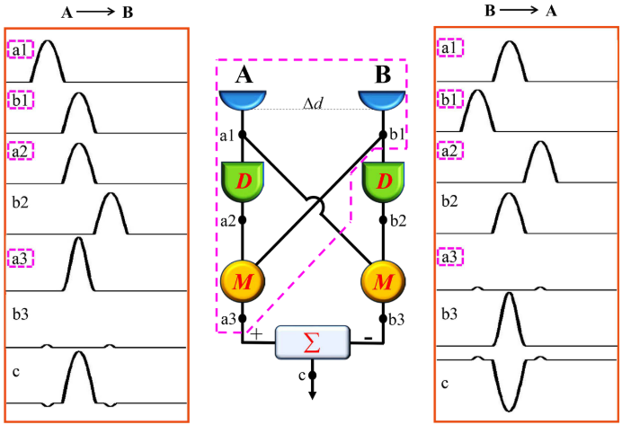

# EMD-Based Motion Detection

## 1.Elementary Motion Detector Theory

初级运动检测器elementary motion detector

生物视觉系统为了检测运动目标， 需要确定目标在不同时刻的位置。然而， 执行这样的感官任务具有很大的挑战性。通过对多种动物视觉敏感神经元结构的研究发现，果蝇并不需要确定目标的位置， 通过**检测局部运动即可检测出视野中的运动目标**。

在过去的几十年里，研究者们从不同角度提出了描述生物视觉的运动检测模型。模型均通过视网膜上的局部信号检测目标的位置和运动方向， 不需要进行更高层次的视觉分析。在众多模型中，比较经典的是梯度检测模型、运动能量检测模型，以及**初级运动检测模型**

无模型动态目标跟踪.assets/image-20210808100637248.png)

如上图所示,EMD由两个镜像对称的子单元构成,子单元的输入端为光感受器,两个感受器空间相邻(模拟复眼),设空间距离为$\Delta\phi$,分别接收输入信号$X1$和$X2$,经延迟时间$\Delta t$后与相邻单元的输入信号相乘再取插值,得到EMD模型的输出信号$Y$,

输出信号一般含有两个分量:固定分量和是变分量:

固定分量通过输出信号的**符号**来表示**输入激励的运动方向**,

时变分量与输入调制信号的强度有关,不包含任何与运动有关的分量,由于局部调制信号强度与相邻信号相比较进行了相移，使得当周围探测器的信号经空间累积后局部信号中的时变分量将被抵消。

EMD的核心计算是**延迟**和**比较机制**。
将一个光感受器测得的亮度信号通过低通滤波进行时间延迟,并通过乘法运算将延迟后的信号 与一个临近 的感受
器在该时刻的信号进行 比较 。对上述操作以镜对称 的方式进行两次 ，并将两个子单元的输出信号相减 ，从而产生一个具有全 向选择性 的响应 .

比如说:

当目标从左向右运动时,左边的光感受器先接收到信号产生响应,右边的光感受器后产生响应;左边感受器产生的响应通过适当延迟,可以与右边后产生的响应相匹配,再通过乘法器后产生一个更强的响应;

同理,当目标从右向左运动时,此模型也能在乘法器后输出一个更强 的响应 。

最后的减器将决定目标的运动方向，如果输出响应是正就说明目标是向右运动 ，反之，输出响应是负就说明目标是向左运动.

假设一个移动的光点依次通过相邻的接收器A和B,A把光信号延迟一定时间,使其与B通道的信号相遇,将这两个信号相乘将产生一个较大的输出响应;假如光点从B移动到A,那么A通道延迟后与B通道不会相遇,输出响应就是0;在实践中，它通常是一个很小的值。这样，两个运动方向就清晰地分开了。

为了提高方向选择的精确性,EMD通常是一对镜像的通道,最后把两个通道的结果相减得到最终结果,这样，两个相反运动的响应大小相等，符号相反,就像上图,左边A->B,输出为正,右边B->A,输出为负;

## 2.Preprocessing

输入:

1. 激光雷达点云数据
2. IMU+轮速里程计

首先进行地面分割,保留地面之上的障碍物,对地物进行直角坐标系栅格化,得到两张BEV

1. 占据图,只要一个栅格中有点,就标记为被占据(值为1)
2. 平均高度图

根据IMU和轮速里程计的信息,可以得到每一帧点云的全局坐标

在$t-1$的一个点的雷达坐标系坐标$P_{t-1}=[x,y,z,1]^T$,把它投影到$t$时刻的雷达坐标系中

$P_{t-1}'=T_t^{-1}T_{t-1}P_{t-1}$

$T_t^{-1}\ T_{t-1}$分别表示两个时刻从雷达坐标系到全局坐标系的转移矩阵

首先从雷达坐标系转移到全局坐标系,再从全局坐标系转移到雷达坐标系

## 3.Motion Detection

由粗到细的检测策略,分为两个阶段:

1. 快速搜索
2. 精确匹配

不同于论文中的做法,这里对代码中的做法进行说明:

### 3.1 快速搜索

对占据BEV进行联通滤波,然后进行膨胀腐蚀,把一些由于雷达噪声造成的空洞去掉,然后对连通域进行分析

对于特别小,特别大或者其他明显不是物体的连通域,给去掉,控制滤波的参数需要仔细调整,直到BEV中无关的杂物尽量被去除,关心的运动目标不会丢失

### 3.2 精确匹配

在已经滤波的当前时刻$t$的BEV上的每一个被占据点$(i,j)$上取一个$m\times m$的patch作为计算单元,

把$t-1$时刻的BEV投影到$t$时刻,然后定义一个搜索半径$R$,在$t-1$时刻的BEV的$(i,j)$半径R范围的每一个点都取一个$m\times m$的patch,然后计算$t$时刻的patch和$t-1$时刻每一个搜索半径内的patch的得分,占据图一个得分,平均高度图一个得分,取加权平均分为最终的匹配得分,选择得分最大的作为一个匹配$(x',y')$

占据得分:两个patch之间点乘,patch越匹配,得分越高

高度得分:两个patch相减,取绝对值再求和,最后归一化,patch越匹配,得分越低,取倒数

无模型动态目标跟踪.assets/image-20210808164404243.png)

$(x',y')$和$(i,j)$之间的距离就是$\Delta t$内当前栅格移动的距离,当大于设定的阈值时,就认为是运动点;

对所有运动点做聚类,从原图中找到moving对应的连通域,将检测结果投影到原始栅格图上

上述方向可以把所有的运动目标都检测出来,也可以筛选运动目标的运动方向,比如,如果只关心纵向运动目标,搜索范围设置为纵向;

对于速度比较慢的物体,可以增加采样间隔,每三帧做一次匹配

