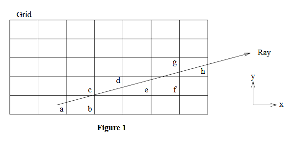
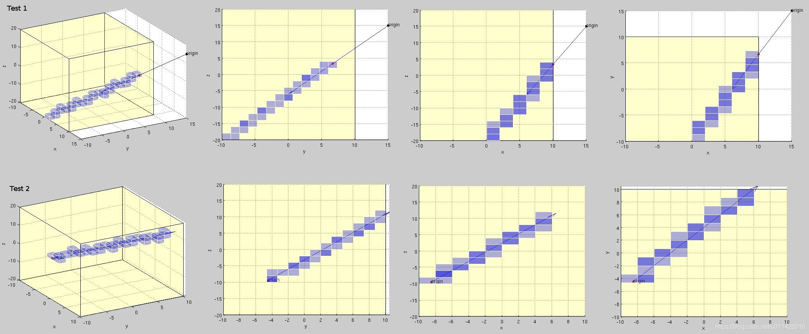
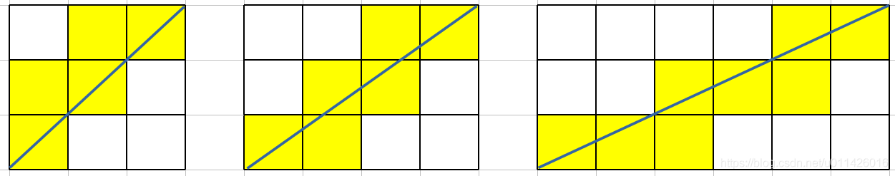
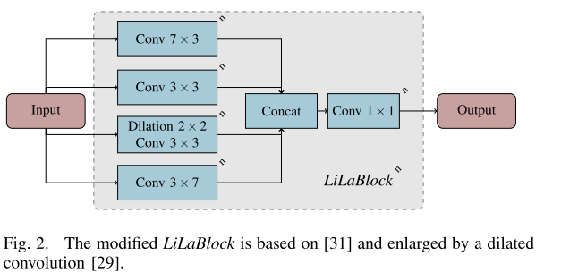
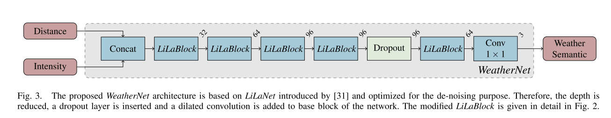

## 1.八叉树的原理和实现,octomap库的使用


## 2.ray-casting  -- 遮挡属性

通过对点云中沙尘障碍物的分析,发现激光束会穿过沙尘,打到被沙尘遮挡的物体,而一般的障碍物不会被激光穿过,所以可以将三维点云体素化,表示为一个个的小立方体,统计每一个三维体素被激光雷达光 束击中和被穿过的的条数，它们之间的比例关系可以反映障碍物的质地,是硬质的还是软质的;

这就需要确定哪些体素是被激光穿过的,而哪些是被击中的,在一些二维占据栅格地图的构建中,经常需要统计这些信息,激光点所在的栅格被标记为占据,从激光源到激光扫描点之间的栅格被标记为空闲,可以使用==光线追踪==的方法来做:

**1987年的论文 A Fast Voxel Traversal Algorithm for Ray Tracing**



从上图可以知道，为了正确地遍历网格，遍历算法必须按顺序访问体素a、b、c、d、e、f、g和h。

射线的方程为向量u加上t乘以向量v(t≥0)。新的遍历算法将射线分解为t段间隔，每个间隔一个体素。我们从射线原点开始，以间隔顺序访问每一个体素。

文章主要解决的问题为：

**在一个空间体素模型中，已知起点和终点，求光线从起点到终点经过的所有体素**。

如下图所示：要求路径尽可能平滑，跟直线DDA算法的输出确实非常相似。



作者这篇论文对传统DDA进行了改进，同时避免了复杂的相交操作。

我们以二维为例，已知起点 start 和终点 End， 实际就确定了**光线的方向**，那么如何确定路径上依次通过那些体素呢？

**问题形式化定义:**

已知起点 $P_0=(x_0,y_0)$,和终点$P_1=(x_1,y_1)$,

> 假设射线ray在一秒之内,可以从起点移动到终点

那么光线的方向可定义为 $\vec v=P_1-P_0=(x_1-x_0,y_1-y_0)$,也就是x轴和y轴方向的速度

那么给定参数$t\in[0,1]$，那么$P=P_0+t\vec v$就可以表示线段$P_0P_1$上的所有点,

我们并不是要求这些连续的点,而是要求这条线段经过的所有体素,（为了方便描述，假设体素边长为1，且所有光线 $P_0.x < P_1.x ，P_0.y < P_1.y$,其他情况可以扩展)


文章是这样说的：

> Next, we determine the value of t at which the ray crosses the first vertical voxel boundary and store it in variable tMaxX. We perform a similar computation in y and store the result in tMaxY. Theminimum of these two values will indicate how much we can travel along the ray and still remain in thecurrent voxel.

就是说我们从起点开始沿着光线方向$\vec{v} $,分别计算水平方向穿过一个体素边长和竖直穿过一个体素边长的$t$值,这里分别记为$tMaxX$和$tMaxY$

$tMaxX=1/\vec v.x=1/(x_1-x_0)$

$tMaxY=1/\vec v.y=1/(y_1-y_0)$

（这里将向量$\vec{v}$和$t$当成速度和时间其实也非常直观）

很显然,如果$tMaxX<tMaxY$,水平方向经过的时间更少,光线先经过水平一个格子,光线先穿过右侧的垂直边界

反过来,如果$tMaxX>tMaxY$,竖直方向经过的时间更少,光线先经过竖直一个格子,光线先穿过上方的水平边界

**伪代码:**

tMaxX,tMaxY初始化为穿过一个体素的值,在迭代中逐渐递增，分别代表穿过竖直边界和水平边界的时间

tDeltaX,tDeltaY 就是 穿过一个体素的值;

每当穿过一个边界,对应的tMax就加上对应的tDelta,表示下一次经过这个边界的时间

```C++
loop{
	if(tMaxX < tMaxY) {		     // 水平方向经过的时间更少,先进入水平方向的体素
		tMaxX = tMaxX + tDeltaX; // 水平方向时间自增,竖直方向保持不变
		X = X + stepX;			 // 水平方向体素坐标自增,竖直方向保持不变
    } else  {
        tMaxY= tMaxY + tDeltaY;
        Y= Y + stepY;
    }
    NextVoxel(X,Y);
}
```

小例子:

我们以上图中间的情况为例，迭代计算一下这个过程：

已知:起点P0(0,0) 终点P1(3,2),那么速度向量v=(3,2)

tMaxX = 1/3 ,当时间t=1/3时,光线穿过了右侧的竖直边界

tMaxY = 1/2, 当时间t=1/2时,光线穿过了上方的水平边界

因此,首先进入右边坐标为(0,1)的体素,

同时,我们消耗了1/3的时间,tDeltaX=1/3下次再跟竖直边界相交时间为tx = 1/3+1/3=2/3

光线慢慢向前移动,下一个时间点是1/2,因为1/2<2/3,所以先跟上方的体素相交,因此,进入上方坐标为(1,1)的体素,

同时记录光线下次和水平边界相交的时间为ty = 1/2+1/2 = 1;

接下来,继续比较,tx<ty,下一个经过的体素是(1,2),

同时记录下一次经过竖直边界的时间:tx = tx + 1/3 = 1;

接下来,继续比较,tx=ty,约定取上方的体素(2,2),

同时记录下一次经过水平边界的时间ty=ty+1/2 = 3/2;

接下来,继续比较,tx<ty,取右方的体素(3,2),

同时记录下一次经过竖直边界的时间tx=tx+1/3 = 4/3;

到达目的,迭代结束,

因此,经过的所有体素为 {(0,0),(1,0),(1,1),(2,1),(2,2),(3,2)}

```cpp
list= NIL; 
do {
if(tMaxX < tMaxY) { 
    if(tMaxX < tMaxZ) { 
        X= X + stepX; 
        if(X == justOutX) 
            return(NIL); /* outside grid */ 
        tMaxX= tMaxX + tDeltaX;
    } else {
        Z= Z + stepZ; 
        if(Z == justOutZ) 
            return(NIL);
		tMaxZ= tMaxZ + tDeltaZ; 
    } 
} else { 
    if(tMaxY < tMaxZ) { 
        Y= Y + stepY; 
        if(Y == justOutY) 
            return(NIL);
		tMaxY= tMaxY + tDeltaY; 
    } else {
		Z= Z + stepZ; 
        if(Z == justOutZ) 
            return(NIL);
		tMaxZ= tMaxZ + tDeltaZ; 
    } 
} 
    list= ObjectList[X][Y][Z];
} while(list == NIL); 
return(list);
```

**源代码:**

```C++
#include <cfloat>
#include <vector>
#include <iostream>
#include <Eigen/Core>

using namespace std;
double _bin_size = 1;
/**
 * @brief returns all the voxels that are traversed by a ray going from start to end
 * @param start : continous world position where the ray starts
 * @param end   : continous world position where the ray end
 * @return vector of voxel ids hit by the ray in temporal order
 *
 * J. Amanatides, A. Woo. A Fast Voxel Traversal Algorithm for Ray Tracing. Eurographics '87
 */

vector<Eigen::Vector3i> voxel_traversal(Eigen::Vector3d ray_start, Eigen::Vector3d ray_end) {
  vector<Eigen::Vector3i> visited_voxels;
  //起始体素的位置
  Eigen::Vector3i current_voxel(floor(ray_start[0]/_bin_size),
                                floor(ray_start[1]/_bin_size),
                                floor(ray_start[2]/_bin_size));
  //终止体素的位置
  Eigen::Vector3i last_voxel(floor(ray_end[0]/_bin_size),
                             floor(ray_end[1]/_bin_size),
                             floor(ray_end[2]/_bin_size));
  //光线方向向量
  Eigen::Vector3d ray = ray_end-ray_start;

  //光线从起点的前进方向
  double stepX = (ray[0] >= 0) ? 1:-1; 
  double stepY = (ray[1] >= 0) ? 1:-1; 
  double stepZ = (ray[2] >= 0) ? 1:-1; 

  //光线方向的下一个边界（x,y,z方向）
  double next_voxel_boundary_x = (current_voxel[0]+stepX)*_bin_size;
  double next_voxel_boundary_y = (current_voxel[1]+stepY)*_bin_size;
  double next_voxel_boundary_z = (current_voxel[2]+stepZ)*_bin_size;

  //tMaxX： 从起点开始，第一次跟下一个X方向的边界相交的时间(如果没有交点，时间设为无穷大)
  double tMaxX = (ray[0]!=0) ? (next_voxel_boundary_x - ray_start[0])/ray[0] : DBL_MAX; //
  double tMaxY = (ray[1]!=0) ? (next_voxel_boundary_y - ray_start[1])/ray[1] : DBL_MAX; //
  double tMaxZ = (ray[2]!=0) ? (next_voxel_boundary_z - ray_start[2])/ray[2] : DBL_MAX; //

  // tDeltaX, tDeltaY, tDeltaZ --
  // how far along the ray we must move for the horizontal component to equal the width of a voxel
  // the direction in which we traverse the grid
  // can only be FLT_MAX if we never go in that direction
  double tDeltaX = (ray[0]!=0) ? _bin_size/ray[0]*stepX : DBL_MAX;
  double tDeltaY = (ray[1]!=0) ? _bin_size/ray[1]*stepY : DBL_MAX;
  double tDeltaZ = (ray[2]!=0) ? _bin_size/ray[2]*stepZ : DBL_MAX;

  Eigen::Vector3i diff(0,0,0);
  bool neg_ray=false;
  if (current_voxel[0]!=last_voxel[0] && ray[0]<0) { diff[0]--; neg_ray=true; }
  if (current_voxel[1]!=last_voxel[1] && ray[1]<0) { diff[1]--; neg_ray=true; }
  if (current_voxel[2]!=last_voxel[2] && ray[2]<0) { diff[2]--; neg_ray=true; }
  visited_voxels.push_back(current_voxel);
  if (neg_ray) {
    current_voxel+=diff;
    visited_voxels.push_back(current_voxel);
  }
  double tx = tMaxX, ty = tMaxY, tz = tMaxZ;
  while(last_voxel != current_voxel) {
    if (tx < ty) {
      if (tx < tz) {  current_voxel[0] += stepX; tx += tDeltaX;} 
      else { current_voxel[2] += stepZ; tz += tDeltaZ; }
    } 
    else {
      if (ty < tz) { current_voxel[1] += stepY; ty += tDeltaY;} 
      else { current_voxel[2] += stepZ; tz += tDeltaZ; }
    }
    visited_voxels.push_back(current_voxel);
  }
  return visited_voxels;
}

int main () {
  Eigen::Vector3d ray_start(1,1,0);
  Eigen::Vector3d ray_end(0,0,0);
  cout << "Voxel size: " << _bin_size << endl;
  cout << "Starting position: " << ray_start.transpose() << endl;
  cout << "Ending position: " << ray_end.transpose() << endl;
  cout << "Voxel ID's from start to end:" << endl;
  vector<Eigen::Vector3i> ids = voxel_traversal(ray_start,ray_end);

  for (int i = 0; i < ids.size(); i++) {
    cout << "> " << ids[i].transpose() << endl;
  }
  cout << "Total number of traversed voxels: " << ids.size() << endl;
  return 0;
}
```


## 3.normal空间 的 直方图


噪点很多


## 4.基于深度学习的方法

**基于LiLaNet**





