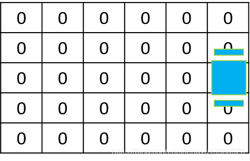

# 静态二值贝叶斯滤波器

[TOC]

# 1.前言

概率机器人4.2节

机器人学中的一些特定问题可以描述成**二值状态的状态估计问题**，这类问题通常都是由一类称为**二值贝叶斯滤波器** ***binary Bayes filter*** 来解决的。

+ 如果通过传感器对一个环境中**固定状态**进行评估，该状态为二值状态（例如判断一扇门的开关状态），那么就需要用到**二值贝叶斯滤波**

+ 另一种静态二值贝叶斯滤波器的例子就是**占用栅格地图occupancy grid maps**

参考资料:

> [Fengyu19930920的CSDN博客](https://blog.csdn.net/fengyu19930920/article/details/109112008)
>
> [无处不在的小土的个人博客](https://gaoyichao.com/Xiaotu/?book=probabilistic_robotics&title=pr_chapter9)

# 2.二值贝叶斯滤波

## 2.1 理论基础

+ 对于一个二值静态状态,即该状态不随时间变化，而且只有两个可能的值，那么置信度函数可以写成:

$$
bel_t(x)=p(x|z_{1:t},u_{1:t})=p(x|z_{1:t})
$$

+ 二值状态分别为$x,\bar x$, 相应的置信度满足
  $$
  bel_t(x)=1-bel_t(\bar x)
  $$

+ 二值贝叶斯滤波可以应用`离散贝叶斯滤波`计算,分别比较两种情况的概率,概率较大的状态即为当前状态值

+ 但是对于这种只有两种状态的**二值状态**,有一个更加巧妙和便捷的方法来**估计它的当前状态**,那就是对这两个状态的**概率做比后取对数**得到$l(x)$(对数几率),通过判断这个数值的大小,也可以比较出这两种状态的概率大小，对数几率大于0，更有可能是x，小于0更有可能是非x；

  + 这样做的好处还有,$l(x)$的值域是$-\infty,+\infty$,避免了概率值在0,1附近的**截断问题**, 有可能更新过程中概率值`<0`或者`>1`,这样的值都会截断成0,1,可能会影响后面的计算

  + 有了对数几率表示的置信度，**置信度的更新也更加方便**
    
  + $l_t=l_{t-1}+log\frac{p(x|z_t)}{1-p(x|z_t)}-log\frac{p(x)}{1-p(x)}$
    
  + 即当观测到当前时刻的状态的对数几率后，把它与上一帧的对数几率叠加，得到当前时刻的对数几率，初始时刻认为$p(x)=0.5$,那么$l_0=0$
    
  + 置信度的更新就是一个简单的叠加过程
    
  + 从对数几率中恢复出概率值
    $$
    \frac{p(x)}{p(\bar x)}=\frac{p(x)}{1-p(x)}
    \\ \downarrow 取对数\\
    l(x):=log\frac{p(x)}{1-p(x)}
    $$


+ **工程实现**

  在实际比赛时，由IMU和轮速里程计提供车辆的全局位姿信息，由于IMU和轮速里程计都存在累积误差的问题，随着时间的增长，提供的全局位姿信息会越来越不准确，但是在一个时间窗口内它提供的帧间位姿是比较准确的，所以只对一个时间窗口内的数据进行多帧累积，目前使用了10帧数据进行累积；

  具体的使用一个双端队列存储每一帧的占据地图信息，包括每一个栅格的全局和局部坐标，以及占据状态，就是对数几率，首先是地图初始化的过程，先向队列中压入9帧数据，从第10帧开始融合前9帧数据，生成稳定输出，第11帧数据来到之后，先把双端队列的头部元素（第一帧）弹出，对数几率减去弹出帧对应的占据状态，在加上新观测到的第11帧数据，依次类推，按照这个规律处理后面的占据信息，完成时间窗口内的多帧占据信息融合。

## 2.2 算法流程

+ 下面是二值贝叶斯滤波方法的更新过程:
  $$
  \begin{equation}
  \begin{aligned}
  &1:Algorithm\ binary\_Bayes\_filter(l_{t-1},z_t):
  \\&2:  l_t=l_{t-1}+log\frac{p(x|z_t)}{1-p(x|z_t)}-log\frac{p(x)}{1-p(x)}
  \\&3: return \ l_t
  \end{aligned}
  \end{equation}
  $$

  + 可以看出算法十分简单,只有一条公式
  + 具体公式如何得到了,见下文推导

+ 这里用到了一个概率$p(x|z_t)$, 

  它被称为**逆测量模型(inverse measurement model)**;

  相反$p(z_t|x)$被称为**测量模型或传感器模型(measurement model)**

  + 逆测量模型是测量$z_t$函数的概率分布
  + 逆测量模型一般用在传感器模型比较复杂的情况
  + 例如:**从图片中判断一扇门是开启还是关闭状态**
    1. 这个状态十分简单,但是测量空间很大
    2. 已知测量图片,判断门的状态,就是逆测量模型$p(x|z_t)$,这个通过合适的算法十分容易获得
    3. 但是已知门的状态,求含有这扇门的图片的概率分布(测量模型),$p(z_t|x)$,就很难

+ 已知对数几率$l(x)$,从中恢复置信度$bel_t(x)$也很简单
  $$
  l(x)=log\frac{p(x)}{1-p(x)}
  \\ \downarrow \\
  p(x)=1-\frac{1}{1+exp(l(x))}
  $$
  

## 2.3 重要公式推导

+ 从算法流程图中可以看出,二值贝叶斯滤波仅有一条更新公式
  $$
  l_t=l_{t-1}+log\frac{p(x|z_t)}{1-p(x|z_t)}-log\frac{p(x)}{1-p(x)}
  $$
  
+ $l_t$:当前状态,$l_{t-1}$:上一帧状态

+ 推导过程

+ 第一行到第二行 没看懂........


+ 终于得出二值贝叶斯算法中更新公式，那么具体怎么使用呢？ 我们用下一节的**占据栅格地图**（occupancy grid mapping）为例子给大家讲解如何使用。

# 3. 实例：占据栅格地图

+ 占据栅格地图应用在地图构建上**,标识出哪些地方有障碍物,哪些地方是空闲的**
+ 这与二值贝叶斯滤波的应用条件十分吻合

  1. 地图中各点的真实状态是不变的(如果有运动目标呢?)
  2. 地图的每一个栅格仅有两种状态(占据或者空闲),符合二值性
+ 占据地图算法是根据机器人位姿$x$和传感器测量数据$z$,计算地图$m$的**后验概率**$p(m|x_{1:t},z_{1:t})$
+ 一般把地图平面分割成若干个栅格$m={m_i}$, 估计每一个栅格的状态
  + 约定$p(m_i=1)=p(m_i)$为栅格被占据的概率
  + $p(m_i=0)$为栅格是空闲的概率
+ 那么计算整体地图$m$的后验概率$p(m|x_{1:t},z_{1:t})$可以转化为估计每一个栅格的后验概率$p(m_i|x_{1:t},z_{1:t})$

$$
p(m|x_{1:t},z_{1:t}) = \prod_i p(m_i|x_{1:t},z_{1:t})
$$

+ 每一个栅格都有二值性,可以使用二值贝叶斯滤波算法

$$
\begin{equation}
\begin{aligned}
&1:Algorithm\ binary\_Bayes\_filter(l_{t-1},z_t):
\\&2:  l_t=l_{t-1}+log\frac{p(x|z_t)}{1-p(x|z_t)}-log\frac{p(x)}{1-p(x)}
\\&3: return \ l_t
\end{aligned}
\end{equation}
$$

+ 上述算法是估计单一栅格被占据的概率,但是占据栅格地图的实例中要估计多个栅格的概率,所以对上述算法做简单修改
  1. **line 4**: 对于传感器探测到的栅格，我们通过二值贝叶斯滤波算法更新改状态
  2. **line 6:** 对于传感器没有探测到的栅格，该栅格的状态保持不变


+ 上述算法中相关的计算公式

$$
l_{t,i}=log\frac{p(m_i|z_{1:t},x_{1:t})}{1-p(m_i|z_{1:t},x_{1:t})}\\
l_0=log\frac{p(m_i=1)}{p(m_i=0)}=log\frac{p(m_i)}{1-p(m_i)}\\
inverse\_sensor\_model(m_i,x_t,z_t)=log\frac{p(m_i|z_t,x_t)}{1-p(m_i|z_t,x_t)}
$$

+ 那么,二值贝叶斯滤波算法的更新公式为:

  + **注意:**这里的$x_t$是当前机器人的位姿,不是要估计的状态

  + **注意:**这里要估计的状态的$m_i$,相当于二值贝叶斯滤波中的$x_t$
    $$
    l_{t,i}=l_{t-1,i}+log\frac{p(m_i|z_t,x_t)}{1-p(m_i|z_t,x_t)}-\frac{p(m_i)}{1-p(m_i)}
    $$

+ 下面我们一起进行一个简单的占据栅格地图的实例计算：这里参考[占据栅格地图](https://zhuanlan.zhihu.com/p/21738718)

  + 初始时刻机器人对外界一无所知
  + 每次通过激光雷达探测外界环境，从探索数据中计算检测到的栅格状态的概率
  + 对于探测到的栅格有障碍物和无障碍物的正确率均为90%

+ **t=0**: 机器人对外界环境一无所知,所以$p(m_i=0)=p(m_i=1)=0.5$  (先验)
  $$
  l_0=log\frac{p(m_i=1)}{p(m_i=0)}=log\frac{0.5}{0.5}=0
  $$
  

(最右边蓝色是雷达位置)

+ **t=1:**激光雷达进行探测

+ 

  + 图中红色线经过的栅格为探测到的栅格，也就是需要更新概率的栅格

  + 图中绿色方块被检查出有障碍物，将激光反射回去，其余被检查的栅格无障碍物

  + 根据探测到的数据进行状态更新

    + 下面的$l_t$表示被占据的概率,只要观测到了障碍物,$p(m_i)=0.9$,在激光雷达和障碍物之间的栅格就是空闲,$p(m_i)=0.1$

    + 有障碍物的栅格:
      $$
      \begin{equation}
      \begin{aligned}
      l_{1,i}&=l_{0,i}+log\frac{p(m_i|z_t,x_t)}{1-p(m_i|z_t,x_t)}-l_0\\
      &=0+log\frac{0.9}{1-0.9}-0\\
      &=2.2
      \end{aligned}
      \end{equation}
      $$

    + 空闲的栅格
      $$
      \begin{equation}
      \begin{aligned}
      l_{1,i}&=l_{0,i}+log\frac{p(m_i|z_t,x_t)}{1-p(m_i|z_t,x_t)}-l_0\\
      &=0+log\frac{0.1}{1-0.1}-0\\
      &=-2.2
      \end{aligned}
      \end{equation}
      $$

    + 没有探测到的栅格

      ​		
      $$
      l_{1,i}=l_{0,i}
      $$
      

+ **t=2:**根据探测到的数据进行状态更新

  
  + 有障碍物的栅格:
    $$
    \begin{equation}
    \begin{aligned}
    l_{2,i}&=l_{1,i}+log\frac{p(m_i|z_t,x_t)}{1-p(m_i|z_t,x_t)}-l_0\\
    &=0+log\frac{0.9}{1-0.9}-0\\
    &=2.2
    \end{aligned}
    \end{equation}
    $$

  + 空闲的栅格:

    + 上一帧 未知

    $$
    \begin{equation}
    \begin{aligned}
    l_{2,i}&=l_{1,i}+log\frac{p(m_i|z_t,x_t)}{1-p(m_i|z_t,x_t)}-l_0\\
    &=0+log\frac{0.1}{1-0.1}-0\\
    &=-2.2
    \end{aligned}
    \end{equation}
    $$

    + 上一帧 空闲

    ​		
    $$
    \begin{equation}
    \begin{aligned}
    l_{2,i}&=l_{1,i}+log\frac{p(m_i|z_t,x_t)}{1-p(m_i|z_t,x_t)}-l_0\\
    &=-2.2+log\frac{0.1}{1-0.1}-0\\
    &=-4.4
    \end{aligned}
    \end{equation}
    $$
    

+ ***t*=3,4...：同理**

# 4.占据栅格地图如何解决动态障碍物

## 占据栅格地图

在2D点云中，占据概率栅格地图比较常用。一般的概率更新形式有贝叶斯更新，Crartographer中用的就是这种。在别的论文中也看到了其他的更新形式。
对于SLAM而言，动态障碍物的影响体现在匹配和建图两个部分，采用占据栅格地图，可以减少动态障碍物在建图上的体现，但是在匹配时，当前帧的动态障碍物仍然存在，对匹配影响很大。

## 更改概率更新形式（减少对匹配影响）

IMU-Assisted 2D SLAM Method for Low-Texture and Dynamic Environments

2018 sci 北京交通大学

下图为2D占据栅格地图，-1代表empty,1代表occupied,0代表unknown area


栅格概率更新公式


两种情况下更新栅格：

1. **激光击中栅格**

Lomas=0.3


如果此栅格上一时刻之前都是free，这一时刻突然击中，代表是动态栅格，限制更新。

问题：如果最初时刻是free(-1),那么以后就不会改变。如果最初是unknown(0),之后被检测为free，再被检测为occupied，就会变。

2. **激光通过栅格**


如果此栅格上一时刻之前都是occupied，这一时刻检测被free。代表动态障碍物离开，立即更新为静态

两种方法比较：
前三幅图中，上述方法。
传统方法（下面三幅图）中看出：从左到右，连续三帧，移动物体会在地图上留下trajectory，影响帧与帧间的匹配。

## cartography中remove moving object（减少对建图影响）

cartographer中在建图后比较每个栅格被击中和被路过的次数来判断动静态栅格
在**assets_writer_backpack_3d.lua**文件中**voxel_filter_and_remove_moving_objects**选项，可以用来配置Voxel过滤数据并仅传递我们认为在非运动对象上的点。

筛选出hit>0的voxel
计算路过这些voxel的rays次数
比较rays和hits数目关系

先获取miss_per_hit_limit的值，默认3

算法

```
for each
point in PointBatch

       Find the voxel 

++voxel.hits

for each
point in Point Batch

       For each voxel from orign to point

              If voxel.hits>0:

++voxel.rays

for each
point in Point Batch

       For each voxel from orign to point

              If voxel.rays>=miss_per_hit_limit*voxel.hits

                     remove voxel 
```

三个函数（cartographer/cartographer/io/OutlierRemivingPointsProcessor.cpp

```cpp
1 void ProcessInPhaseOne(const PointsBatch& batch);
//计算每个voxel的hit数目

void
OutlierRemovingPointsProcessor::ProcessInPhaseOne(

    const PointsBatch& batch) {
    

  for (size_t i = 0; i <
batch.points.size(); ++i) {
    //遍历每个点，更新点对应的voxel的hit.几个点落入一个voxel,hit就加上

   
++voxels_.mutable_value(voxels_.GetCellIndex(batch.points[i].position))

          ->hits;

  }
}

2 void ProcessInPhaseTwo(const PointsBatch& batch);

//计算pass through这些voxel中rays数目（只对于hit>0的voxel计算）

void OutlierRemovingPointsProcessor::ProcessInPhaseTwo(

    const PointsBatch& batch) {
    

  for (size_t i = 0; i <
batch.points.size(); ++i) {
    //遍历每个点

    const Eigen::Vector3f delta =
batch.points[i].position - batch.origin;

    const float length = delta.norm();

    for (float x = 0; x < length; x +=
voxel_size_) {
    //遍历起点到点每个栅格

      const Eigen::Array3i index =

          voxels_.GetCellIndex(batch.origin +
(x / length) * delta);

      if (voxels_.value(index).hits > 0) {
    //如果栅格之前的hit>0，那么就更新ray

       
++voxels_.mutable_value(index)->rays;
      }
    }
  }
}

3 void ProcessInPhaseThree((std::unique_ptr<PointsBatch> batch);

//保留inliers,过滤outliers。如果hit所在的voxel的hit-to-ray值很高，那么就是inlier

 

void
OutlierRemovingPointsProcessor::ProcessInPhaseThree(

    std::unique_ptr<PointsBatch> batch) {
    

  absl::flat_hash_set<int> to_remove;

  for (size_t i = 0; i <
batch->points.size(); ++i) {
    //遍历每个点

    const VoxelData voxel =

       
voxels_.value(voxels_.GetCellIndex(batch->points[i].position));

    if (!(voxel.rays < miss_per_hit_limit_ *
voxel.hits)) {
    //如果点的rays>3*hits那么就认为是动态障碍物

      to_remove.insert(i);

    }

  }

  RemovePoints(to_remove, batch.get());

  next_->Process(std::move(batch));

}
```

（用于建图完成之后）

## 去除当前帧动态障碍物(减少对匹配和建图影响)

Online localization and mapping with moving object tracking in dynamic outdoor environments
2007 IEEE

1. 总结：
   这篇文章中提出了一种SLAM算法，该算法可从装有激光传感器和里程计的移动车辆在动态室外环境中检测和跟踪移动物体（DATMO）。 为了从里程计信息中中校正车辆位置，引入了增量扫描匹配方法，该方法可以在动态室外环境中可靠地工作。
   在估计好车辆位置之后，周围地图将逐步更新，并且在没有先验目标知识的情况下检测到运动物体。 最后使用GlobalNearestNeighborhood（GNN）方法对检测到的运动对象进行跟踪。
2. 创建贝叶斯占据栅格地图，并基于此进行scan matching
   直接对点云进行ICP来校正传感器误差并不准确，因为环境有很多动态物体。作者提出可以把匹配问题看成一个最大似然问题。在这种方法下，给定潜在的车辆动力学约束，通过与过去根据所有观察结果构建的局部网格图进行比较，而不是仅与之前的一次扫描进行比较，即可校正当前扫描的位置。
   

zt = {z1 t,…,zK t } k个激光束，xt:t时刻车辆pose,ut:t时刻车辆速度 ，Mt-1是t-1时刻的占据栅格地图。等式（2）中，前者是观测模型，后者是运动模型。如何求解等式作者采用了Hill climbing strategy

1. 障碍物检测与跟踪

两种方式检测动态障碍物：

（1） 基于局部网格图中观察到的free-cell和occ-cell之间的不一致。 如果在先前被视为free的位置上检测到物体，则该物体为移动物体。如果在先前占据的位置观察到物体，则该物体可能是静态的。
如果某个对象出现在以前未观察到的位置，那么我们就无法对这个对象做出判断

（2） 过去检测到的运动物体的信息。如果有许多移动物体通过某个区域，那么出现在该区域中的任何物体都应被识别为潜在的移动物体。因此，除了前一节所述的SLAM构造的局部静态图M外，还创建了局部动态网格图D以存储有关先前检测到的运动对象的信息。动态图的pose，大小和分辨率与静态图相同。每个动态网格单元存储一个值，该值指示在该单元位置已观察到移动物体的观察次数。


（3） 运动物体检测过程分两个步，第一步是检测可能的动态对象。给定新的激光扫描z，校正后的车辆位置以及由SLAM计算的局部静态图M和包含有关先前检测到的移动物体的信息的动态图D，单个测量zk的状态可分为以下三种类型之一：


第二步是在确定动态测量之后，然后通过将这些光束的端点聚集到单独的组中来识别移动的对象，每个组代表一个对象。
如果两个点之间的距离小于0.3 m，则认为这两个点属于同一对象。

PS：地图更新过程利用了移动物体检测步骤的结果。检测为动态的测量不会用于更新SLAM中的地图。对于未知的测量，我们将先验地假设它们是静态的，直到后面的证据出现为止。这将有助于消除虚假物体并得到更好的地图。

1. 总结

本文将SLAM和DATMO结合，建图过程如下:
t-1时刻的占据栅格地图Mt-1,—>位姿估计得到Xt —>将t时刻点云与Mt-1对比，得到动态障碍物栅格，更新D（检测到的移动物体的信息的动态图）—>更新Mt

## 后话

才疏学浅，有问题请大家即使指出：）