# 高斯过程回归Gaussian Process

[TOC]

学习资料:

> [B站机器学习-白板推导系列(二十)-高斯过程GP(Gaussian Process)](https://www.bilibili.com/video/BV1db411c72Q?p=1)
>
> [github_1](https://github.com/wegatron/gaussian_process_ground_seg)

## 高斯过程的理解

1. 高斯过程(Gaussian process)是概率论和统计学中的一个重要概念,它同时也被认为是一种机器学习算法

2. GP是一种强大的模型,它可以用来表示函数的**分布情况**,当前,机器学习的常见做法是把**函数参数化**,然后用产生的参数建模来规避分布表示(如线性回归的权重),但GP不同,它直接对函数建模生成非参数模型.

   由此产生的一个突出优势就是它不仅能模拟任何黑盒函数,还能模拟不确定性.这种不确定性的量化是十分重要的,如当我们被允许请求更多数据时,依靠高斯过程,我们能探索最不可能实现高效训练的数据区域

3. 针对机器学习的高斯过程(Gaussian Processes for Machine Learning,即 GPML)是一个通用的监督学习方法,主要设计用来解决回归问题,GPML也可以理解为基本最小二乘线性回归的一种扩展;

​		当涉及丰富的建模可能性和大量随机参数时，高斯过程十分简单易用。


+ **高斯分布从一维扩展到多维再到无限维度, 则称为高斯过程.** 

  

每一个维度上的值都属于一个高斯分布, 不同维度之间有相互联系(通过kernel/协方差来表示). 一个数据就是此高斯过程的一次采样.

+ **一个例子**

  横轴是时间轴t(连续值)

  $t_1,t_2,t_3,t_4,t_5$分别对应一个随机变量$\xi_i$

  对于$\{\xi_t \}_{t\in T}$,T是连续域,**这就是一个随机过程**(**随机过程**是[随机变量](https://zh.wikipedia.org/wiki/随机变量)的[集合](https://zh.wikipedia.org/wiki/集合))

  如果$\forall \ n\in N^+,t_1,t_2,...,t_n \in T$

  能够使得$\{\xi_{t1}, \xi_{t2},...,\xi_{tn}\}$这个高维随机变量符合一个高维高斯分布,

  那么$\{\xi_t \}_{t\in T}$就是一个**高斯过程**

 

如上图所示,一个简单例子

假设横轴表示人的一生的$T=[0,100]$连续区间

对于每一个时刻,$t \in T,\xi_t\sim N(\mu_t,\sigma_t^2)$,这个高斯随机变量的物理意义是这个人在t的表现:(0,100)分

假设在$t=0$是,这个人的一生基本上确定了,即,对于t>0的每一个时刻,$\mu_t,\sigma_t^2$已经确定了

描述这个人的表现,采样之后的蓝色线段是GP的一个样本,

假设有个平行宇宙,再采样一次,红色是GP的另一个样本

每一个采样点都是一个高斯分布

**一个高斯过程可以完全由它的均值和协方差(核函数)决定**

$GP(m(t),k(s,t))$

$m(t)=E[\xi_t]$

$k(s,t)=E[(\xi_s-E[\xi_s])(\xi_t-E[\xi_t])]$


**高斯过程也可以理解为插值:**

1. 对于函数$f(x)$, 每一次从不同$x$处观察$f(x)$都可以作为一个随机变量来看待, 它们都服从和一个$x$无关的高斯随机分布.
2. 对于任意两个$x, x'$, 我们认为$x$和$x'$的距离决定了他们之间的相关性.

从而, 例如 $x=1, 2, 3$ 均得到了数据, 那么我们要推测$x=4$处的数据分布, 就可以通过它和前三个数据的相关性, 来找到一个合理的bound.

### 一元高斯分布

我们从最简单最常见的一元高斯分布开始，其概率密度函数为 $$ p(x) = \frac{1}{\sigma\sqrt{2\pi}}\mathrm{exp}(-\frac{(x-\mu)^2}{2\sigma^2}) \tag{1} $$

其中 $\mu$ 和 $\sigma$ 分别表示均值和方差，这个概率密度函数曲线画出来就是我们熟悉的钟形曲线，**均值和方差唯一地决定了曲线的形状。**

### 多元高斯分布

从一元高斯分布推广到多元高斯分布，假设各维度之间相互独立

$$ p(x_1, x_2, ..., x_n) = \prod_{i=1}^{n}p(x_i)=\frac{1}{(2\pi)^{\frac{n}{2}}\sigma_1\sigma_2...\sigma_n}\mathrm{exp}\left(-\frac{1}{2}\left [\frac{(x_1-\mu_1)^2}{\sigma_1^2} + \frac{(x_2-\mu_2)^2}{\sigma_2^2} + ... + \frac{(x_n-\mu_n)^2}{\sigma_n^2}\right]\right) \tag{2} $$

其中 $\mu_1, \mu_2, \cdots$ 和 $\sigma_1, \sigma_2, \cdots$ 分别是第 1 维、第二维... 的均值和方差。

用向量和矩阵表示上式，令

$$ \boldsymbol{x - \mu}=[x_1-\mu_1, \ x_2-\mu_2,\ … \ x_n-\mu_n]^T $$

$$
K = \begin{bmatrix} 
\sigma_1^2 & 0 & \cdots & 0\\ 
0 & \sigma_2^2 & \cdots & 0\\
\vdots & \vdots & \ddots & 0\\
0 & 0 & 0 & \sigma_n^2 
\end{bmatrix}
$$


则

$$\sigma_1\sigma_2...\sigma_n = |K|^{\frac{1}{2}}$$

$$ \frac{(x_1-\mu_1)^2}{\sigma_1^2} + \frac{(x_2-\mu_2)^2}{\sigma_2^2} + ... + \frac{(x_n-\mu_n)^2}{\sigma_n^2}=(\boldsymbol{x-\mu})^TK^{-1}(\boldsymbol{x-\mu}) $$

代入上式得到

$$ p(\boldsymbol{x}) = (2\pi)^{-\frac{n}{2}}|K|^{-\frac{1}{2}}\mathrm{exp}\left( -\frac{1}{2}(\boldsymbol{x-\mu})^TK^{-1}(\boldsymbol{x-\mu}) \right) \tag{3} $$ 

其中 $ \boldsymbol{\mu} \in \mathbb{R}^n $ 是均值向量， $ K \in \mathbb{R}^{n \times n} $ 为协方差矩阵，

**由于我们假设了各维度直接相互独立，因此 $ K $ 是一个对角矩阵**。

在各维度变量相关时，上式的形式仍然一致，但此时协方差矩阵 $K$ 不再是对角矩阵，只具备半正定和对称的性质。

上式通常也简写为

$$ x \sim \mathcal{N}(\boldsymbol{\mu}, K) $$

### 无限元高斯分布？

在多元高斯分布的基础上进一步扩展，假设有无限多维呢？我们用一个例子来展示这个扩展的过程

（来源：[MLSS 2012: J. Cunningham - Gaussian Processes for Machine Learning](http://www.columbia.edu/~jwp2128/Teaching/E6892/papers/mlss2012_cunningham_gaussian_processes.pdf)）。

假设我们在周一到周四每天的 7:00 测试了 4 次心率，如图中 4 个点，可能的高斯分布如图所示（高瘦的曲线）。这是一个一元高斯分布，只有每天 7: 00 心率这个维度。

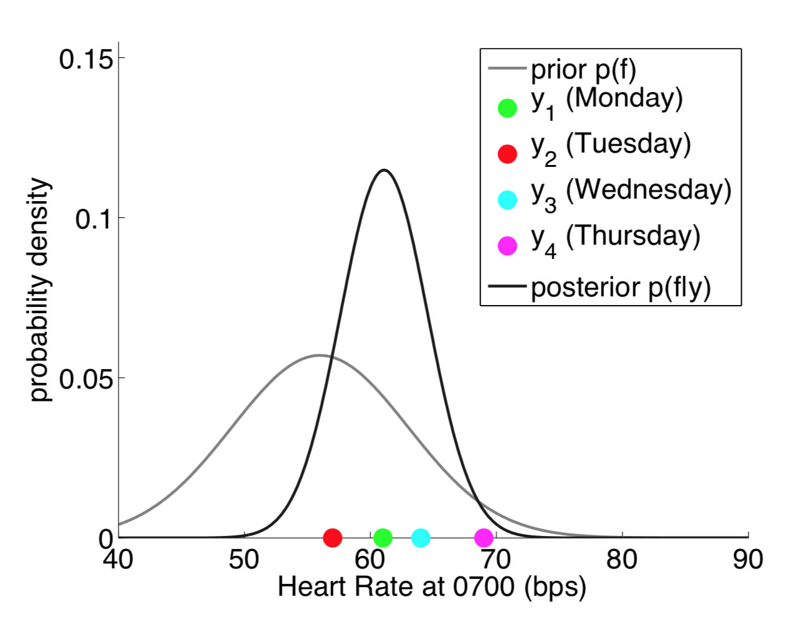

现在考虑不仅在每天的 7: 00 测心率，在 8:00 时也进行测量，这个时候变成两个维度（二元高斯分布），如图所示

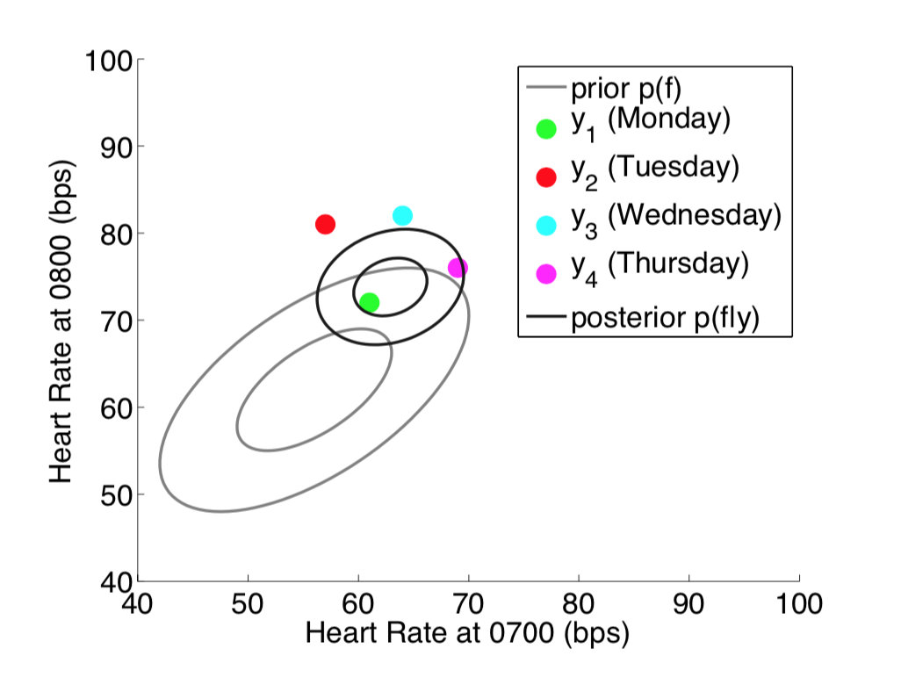

如果我们在每天的无限个时间点都进行测量，则变成了下图的情况。注意下图中把测量时间作为横轴，则每个颜色的一条线代表一个（无限个时间点的测量）无限维的采样。

**当对无限维进行采样得到无限多个点时，其实可以理解为对函数进行采样**。

周一一个函数,周二一个函数....

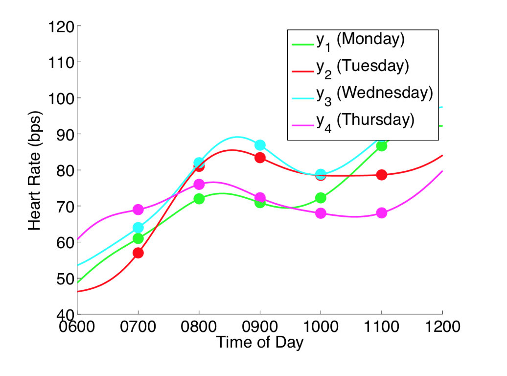

当从函数的视角去看待采样，理解了每次采样无限维相当于采样得到一个函数之后，原本的概率密度函数不再是点的分布 ，而变成了**函数的分布**。

**这个无限元高斯分布即称为高斯过程。**

高斯过程正式地定义为：对于所有

$$ \boldsymbol{x} = [x_1, x_2, \cdots, x_n] $$，$$ f(\boldsymbol{x})=[f(x_1), f(x_2), \cdots, f(x_n)] $$

都服从多元高斯分布，则称 $f$ 是一个高斯过程，表示为

 $$ f(\boldsymbol{x}) \sim \mathcal{N}(\boldsymbol{\mu}(\boldsymbol{x}), \kappa(\boldsymbol{x},\boldsymbol{x})) \tag{4} $$

这里 $$\boldsymbol{\mu}(\boldsymbol{x}): \mathbb{R^{n}} \rightarrow \mathbb{R^{n}} $$ 表示均值函数（Mean function），返回各个维度的均值； 

$$ \kappa(\boldsymbol{x},\boldsymbol{x}) : \mathbb{R^{n}} \times \mathbb{R^{n}} \rightarrow \mathbb{R^{n\times n}} $$ 为协方差函数 Covariance Function（也叫核函数 Kernel Function）返回各个维度之间的协方差矩阵。

一个高斯过程为一个均值函数和协方差函数唯一地定义，并且**一个高斯过程的有限维度的子集都服从一个多元高斯分布**（为了方便理解，可以想象二元高斯分布两个维度各自都服从一个高斯分布）。

> 对于一个$p$维的高斯分布,决定它的分布的只有两个参数,一个是$p$维的均值向量$\mu_p$,他反应了$p$维高斯分布中每一维随机变量的期望,另一个就是$p\times p$的协方差矩阵$\Sigma_{p\times p}$,它反应了高维分布中,每一维随机变量自身的方差,以及不同维度之间的协方差
>
> 定义在连续域$T$上的高斯过程其实也是这样,它是无限维的高斯分布,也需要描述每一个时刻$t$的均值,但是这个时候就不能使用向量了,因为在连续域上,维数是无限的,因此就该定义一个关于时刻$t$的函数,均值函数$m(t)$
>
> 协方差矩阵也是同理,无限维的情况下就定义为一个核函数$k(s,t)$,其中$s$和$t$表示任意两个时刻,核函数也称协方差函数.

### 核函数（协方差函数）

**核函数是一个高斯过程的核心**，核函数决定了一个高斯过程的性质。

核函数在高斯过程中起的作用是生成一个**协方差矩阵**（相关系数矩阵），**衡量任意两个点之间的“距离”**。

最常用的一个核函数为高斯核函数，也称为径向基函数 [RBF](https://en.wikipedia.org/wiki/Radial_basis_function_kernel)。其基本形式如下。

$$ K(x_i,x_j)=\sigma^2\mathrm{exp}\left( -\frac{\left |x_i-x_j\right |_2^2}{2l^2}\right) $$

其中 $ \sigma$和 $l$ 是高斯核的超参数,$l$是尺度因子,$\sigma^2$表示信号噪声,这两个参数是可以提前设置好的

从这个核函数的公式,我们可以解读出它的思想:

$x_i,x_j$表示高斯过程连续域上的两个不同的时间点,$|x_i-x_j|_2^2$是一个二范式,可以理解为两个点之间的距离,RBF输出的是一个标量,代表$x_i,x_j$这两个时间点对应的高斯分布之间的协方差,很明显,距离越远,两个分布之间的协方差越小,相关性越小,距离越近,相关性越高;

以上高斯核函数的 python 实现如下

```python
import numpy as np

def gaussian_kernel(x1, x2, l=1.0, sigma_f=1.0):
    """Easy to understand but inefficient."""
    m, n = x1.shape[0], x2.shape[0]
    dist_matrix = np.zeros((m, n), dtype=float)
    for i in range(m):
        for j in range(n):
            dist_matrix[i][j] = np.sum((x1[i] - x2[j]) ** 2)
    return sigma_f ** 2 * np.exp(- 0.5 / l ** 2 * dist_matrix)

def gaussian_kernel_vectorization(x1, x2, l=1.0, sigma_f=1.0):
    """More efficient approach."""
    dist_matrix = np.sum(x1**2, 1).reshape(-1, 1) + np.sum(x2**2, 1) - 2 * np.dot(x1, x2.T)
    return sigma_f ** 2 * np.exp(-0.5 / l ** 2 * dist_matrix)

x = np.array([700, 800, 1029]).reshape(-1, 1)
print(gaussian_kernel_vectorization(x, x, l=500, sigma_f=10))
```

输出的协方差矩阵为

输入三个时间点,输出3x3的协方差矩阵,反应的是任意时间点对应的高斯分布之间的协方差,对角线是自身的方差

```
[[100.    98.02  80.53]
 [ 98.02 100.    90.04]
 [ 80.53  90.04 100.  ]]
```

由此高斯过程的两个核心要素:均值函数和协方差函数都知道了,按照高斯过程存在性定理(不深究),一旦这两个要素确定了,那么整个高斯过程就确定了

$\xi_t\sim GP(m(t),k(s,t))$

## 高斯过程回归

这个过程我们其实可以看作是一个先验+观测值，然后推出后验的过程;

+ **先看高维高斯分布的条件概率**

  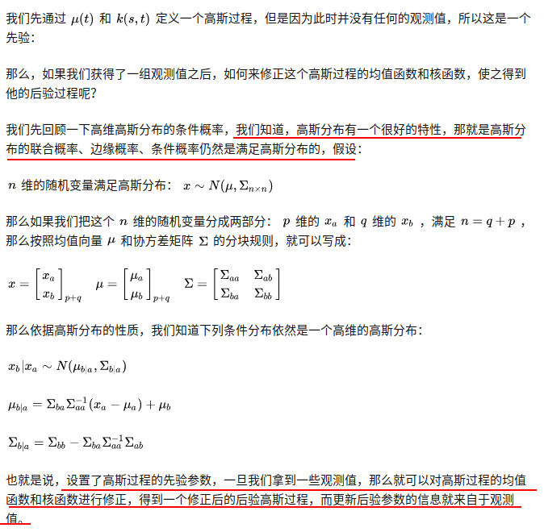

+ **后验高斯过程**

  

  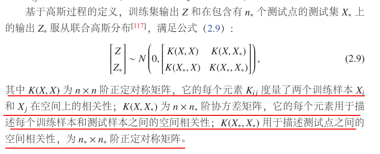

  ==从公式中我们可以发现,未观测到的$\mu^\star$其实是观测值$Y$的非线性组合,通过核函数来描述,所以核函数是GP的核心.==

  > 你不知道函数长什么样。但是你有一些样本，还有这些样本的函数值（带噪声）。高斯过程可以通过kernel距离，给你把这个函数补出来：
>
  > (通过新x和老x之间的关系,推断出新y)
>
  > 给一个新的样本，高斯过程可以告诉你函数值是多少。

  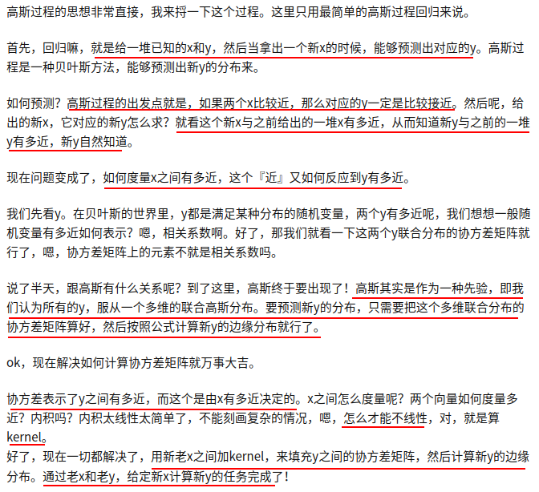

## 高斯过程实现&可视化

下图是高斯过程的可视化，其中蓝线是高斯过程的均值，浅蓝色区域 95% 置信区间（由协方差矩阵的对角线得到），每条虚线代表一个函数采样（这里用了 100 维模拟连续无限维）。左上角第一幅图是高斯过程的先验（这里用了零均值作为先验），后面几幅图展示了当观测到新的数据点的时候，高斯过程如何更新自身的均值函数和协方差函数。

[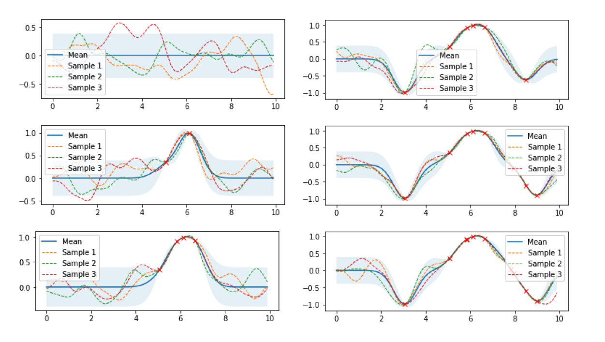](http://ww1.sinaimg.cn/large/006tNc79ly1g5ey8tww8oj30yr0jnwmq.jpg)

接下来我们用公式推导上图的过程。

将高斯过程的先验表示为

$f(\boldsymbol{x}) \sim \mathcal{N}(\boldsymbol{\mu}*{f}, K*{ff})$，对应左上角第一幅图，如果现在我们观测到一些数据 $ (\boldsymbol{x^{*}}, \boldsymbol{y^{*}}) $ ，并且假设 $ \boldsymbol{y^{*}} $ 与 $ f(\boldsymbol{x}) $ 服从联合高斯分布 $$ \begin{bmatrix} f(\boldsymbol{x})\ \boldsymbol{y^{*}}\ \end{bmatrix} \sim \mathcal{N} \left( \begin{bmatrix} \boldsymbol{\mu_f}\ \boldsymbol{\mu_y}\ \end{bmatrix}, \begin{bmatrix} K_{ff} & K_{fy}\ K_{fy}^T & K_{yy}\ \end{bmatrix} \right) $$

其中 $ K_{ff} = \kappa(\boldsymbol{x}, \boldsymbol{x}) $ ，$ K_{fy}=\kappa(\boldsymbol{x}, \boldsymbol{x^{*}}) , K_{yy} = \kappa(\boldsymbol{x^{*}}, \boldsymbol{x^{*}}) $ ，则有 

$$f \sim \mathcal{N}(K_{fy}^{T}K_{ff}^{-1}\boldsymbol{y}+\boldsymbol{\mu_f},K_{yy}-K_{fy}^{T}K_{ff}^{-1}K_{fy}) \tag{5}$$

公式（5）表明了给定数据$(\boldsymbol{x^{*}}, \boldsymbol{y^{*}})$ 之后函数的分布 $ f $ 仍然是一个高斯过程，具体的推导可见 [Gaussian Processes for Machine Learning](http://www.gaussianprocess.org/gpml/chapters/RW.pdf)。

这个式子可以看出一些有趣的性质，

**均值 $K_{fy}^{T}K_{ff}^{-1}\boldsymbol{y}+\boldsymbol{\mu_f}$ 实际上是观测点 $ \boldsymbol{y} $ 的一个线性函数**，

协方差项 $K_{yy}-K_{fy}^{T}K_{ff}^{-1}K_{fy}$ 的第一部分 $ K_{yy} $ 是我们的先验的协方差，**减掉的后面的那一项实际上表示了观测到数据后函数分布不确定性的减少**，如果第二项非常接近于 0，说明观测数据后我们的不确定性几乎不变，反之如果第二项非常大，则说明不确定性降低了很多。

上式其实就是高斯过程回归的基本公式，首先有一个高斯过程先验分布，观测到一些数据（机器学习中的训练数据），基于先验和一定的假设（联合高斯分布）计算得到高斯过程后验分布的均值和协方差。

### 简单高斯过程回归实现

考虑代码实现一个高斯过程回归，API 接口风格采用 sciki-learn fit-predict 风格。

由于高斯过程回归是一种非参数化的方法，每次的 inference 都需要利用所有的训练数据进行计算得到结果，因此并没有一个显式的训练模型参数的过程，所以 fit 方法只需要将训练数据记录下来，实际的 inference 在 predict 方法中进行。Python 代码如下

```python
from scipy.optimize import minimize


class GPR:

    def __init__(self, optimize=True):
        self.is_fit = False
        self.train_X, self.train_y = None, None
        self.params = {"l": 0.5, "sigma_f": 0.2}
        self.optimize = optimize

    def fit(self, X, y):
        # store train data
        self.train_X = np.asarray(X)
        self.train_y = np.asarray(y)
        self.is_fit = True

    def predict(self, X):
        if not self.is_fit:
            print("GPR Model not fit yet.")
            return

        X = np.asarray(X)
        Kff = self.kernel(self.train_X, self.train_X)  # (N, N)
        Kyy = self.kernel(X, X)  # (k, k)
        Kfy = self.kernel(self.train_X, X)  # (N, k)
        Kff_inv = np.linalg.inv(Kff + 1e-8 * np.eye(len(self.train_X)))  # (N, N)
        
        mu = Kfy.T.dot(Kff_inv).dot(self.train_y)
        cov = Kyy - Kfy.T.dot(Kff_inv).dot(Kfy)
        return mu, cov

    def kernel(self, x1, x2):
        dist_matrix = np.sum(x1**2, 1).reshape(-1, 1) + np.sum(x2**2, 1) - 2 * np.dot(x1, x2.T)
        return self.params["sigma_f"] ** 2 * np.exp(-0.5 / self.params["l"] ** 2 * dist_matrix)
def y(x, noise_sigma=0.0):
    x = np.asarray(x)
    y = np.cos(x) + np.random.normal(0, noise_sigma, size=x.shape)
    return y.tolist()

train_X = np.array([3, 1, 4, 5, 9]).reshape(-1, 1)
train_y = y(train_X, noise_sigma=1e-4)
test_X = np.arange(0, 10, 0.1).reshape(-1, 1)

gpr = GPR()
gpr.fit(train_X, train_y)
mu, cov = gpr.predict(test_X)
test_y = mu.ravel()
uncertainty = 1.96 * np.sqrt(np.diag(cov))
plt.figure()
plt.title("l=%.2f sigma_f=%.2f" % (gpr.params["l"], gpr.params["sigma_f"]))
plt.fill_between(test_X.ravel(), test_y + uncertainty, test_y - uncertainty, alpha=0.1)
plt.plot(test_X, test_y, label="predict")
plt.scatter(train_X, train_y, label="train", c="red", marker="x")
plt.legend()
plt.show()
```

结果如下图，红点是训练数据，蓝线是预测值，浅蓝色区域是 95% 置信区间。真实的函数是一个 cosine 函数，可以看到在训练数据点较为密集的地方，模型预测的不确定性较低，而在训练数据点比较稀疏的区域，模型预测不确定性较高。

[](http://ww2.sinaimg.cn/large/006tNc79ly1g5f1y505m5j30b8077dg9.jpg)

### 超参数优化

上文提到高斯过程是一种非参数模型，没有训练模型参数的过程，一旦核函数、训练数据给定，则模型就被唯一地确定下来。但是核函数本身是有参数的，比如高斯核的参数 $ \sigma $ 和 $ l $ ，我们称为这种参数为模型的超参数（类似于 k-NN 模型中 k 的取值）。

**核函数本质上决定了样本点相似性的度量方法**，进行影响到了整个函数的概率分布的形状。上面的高斯过程回归的例子中使用了 $ \sigma=0.2 $ 和 $ l=0.5 $ 的超参数，我们可以选取不同的超参数看看回归出来的效果。

[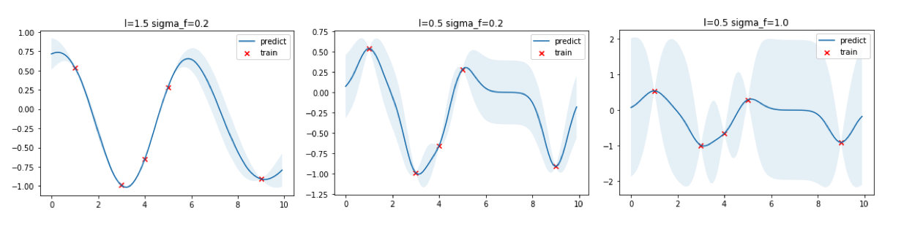](http://ww2.sinaimg.cn/large/006tNc79ly1g5f2gikjrej30yb08q40y.jpg)

从上图可以看出，$ l $ 越大函数更加平滑，同时训练数据点之间的预测方差更小，反之 $ l $ 越小则函数倾向于更加“曲折”，训练数据点之间的预测方差更大；$ \sigma $ 则直接控制方差大小，$ \sigma $ 越大方差越大，反之亦然。

**如何选择最优的核函数参数** $ \sigma $ 和 $ l $ 呢？

答案最大化在这两个超参数下 $ \boldsymbol{y} $ 出现的概率，

通过**最大化边缘对数似然（Marginal Log-likelihood）来找到最优的参数**，

边缘对数似然表示为 

$$ \mathrm{log}\ p(\boldsymbol{y}|\sigma, l) = \mathrm{log} \ \mathcal{N}(\boldsymbol{0}, K_{yy}(\sigma, l)) = -\frac{1}{2}\boldsymbol{y}^T K_{yy}^{-1}\boldsymbol{y} - \frac{1}{2}\mathrm{log}\ |K_{yy}| - \frac{N}{2}\mathrm{log} \ (2\pi) \tag{6} $$ 

具体的实现中，我们在 fit 方法中增加超参数优化这部分的代码，最小化负边缘对数似然。

```python
from scipy.optimize import minimize


class GPR:

    def __init__(self, optimize=True):
        self.is_fit = False
        self.train_X, self.train_y = None, None
        self.params = {"l": 0.5, "sigma_f": 0.2}
        self.optimize = optimize

    def fit(self, X, y):
        # store train data
        self.train_X = np.asarray(X)
        self.train_y = np.asarray(y)

         # hyper parameters optimization
        def negative_log_likelihood_loss(params):
            self.params["l"], self.params["sigma_f"] = params[0], params[1]
            Kyy = self.kernel(self.train_X, self.train_X) + 1e-8 * np.eye(len(self.train_X))
            return 0.5 * self.train_y.T.dot(np.linalg.inv(Kyy)).dot(self.train_y) + 0.5 * np.linalg.slogdet(Kyy)[1] + 0.5 * len(self.train_X) * np.log(2 * np.pi)

        if self.optimize:
            res = minimize(negative_log_likelihood_loss, [self.params["l"], self.params["sigma_f"]],
                   bounds=((1e-4, 1e4), (1e-4, 1e4)),
                   method='L-BFGS-B')
            self.params["l"], self.params["sigma_f"] = res.x[0], res.x[1]

        self.is_fit = True
```

将训练、优化得到的超参数、预测结果可视化如下图，可以看到最优的 $ l=1.2 $，$ \sigma_f=0.8 $

[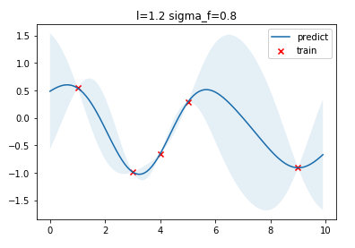](http://ww2.sinaimg.cn/large/006tNc79ly1g5fgxxpx32j30b007pjrp.jpg)

这里用 scikit-learn 的 [GaussianProcessRegressor](https://scikit-learn.org/stable/modules/generated/sklearn.gaussian_process.GaussianProcessRegressor.html#sklearn.gaussian_process.GaussianProcessRegressor) 接口进行对比

```python
from sklearn.gaussian_process import GaussianProcessRegressor
from sklearn.gaussian_process.kernels import ConstantKernel, RBF

# fit GPR
kernel = ConstantKernel(constant_value=0.2, constant_value_bounds=(1e-4, 1e4)) * RBF(length_scale=0.5, length_scale_bounds=(1e-4, 1e4))
gpr = GaussianProcessRegressor(kernel=kernel, n_restarts_optimizer=2)
gpr.fit(train_X, train_y)
mu, cov = gpr.predict(test_X, return_cov=True)
test_y = mu.ravel()
uncertainty = 1.96 * np.sqrt(np.diag(cov))

# plotting
plt.figure()
plt.title("l=%.1f sigma_f=%.1f" % (gpr.kernel_.k2.length_scale, gpr.kernel_.k1.constant_value))
plt.fill_between(test_X.ravel(), test_y + uncertainty, test_y - uncertainty, alpha=0.1)
plt.plot(test_X, test_y, label="predict")
plt.scatter(train_X, train_y, label="train", c="red", marker="x")
plt.legend()
```

得到结果为 $ l=1.2, \sigma_f=0.6 $，这个与我们实现的优化得到的超参数有一点点不同，可能是实现的细节有所不同导致。

[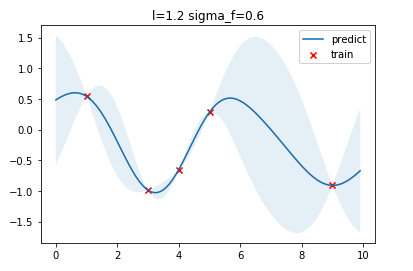](http://ww4.sinaimg.cn/large/006tNc79ly1g5fh435oqhj30bh07jmxh.jpg)


### 多维输入

我们上面讨论的训练数据都是一维的，高斯过程直接可以扩展于多维输入的情况，直接将输入维度增加即可。

```python
def y_2d(x, noise_sigma=0.0):
    x = np.asarray(x)
    y = np.sin(0.5 * np.linalg.norm(x, axis=1))
    y += np.random.normal(0, noise_sigma, size=y.shape)
    return y

train_X = np.random.uniform(-4, 4, (100, 2)).tolist()
train_y = y_2d(train_X, noise_sigma=1e-4)

test_d1 = np.arange(-5, 5, 0.2)
test_d2 = np.arange(-5, 5, 0.2)
test_d1, test_d2 = np.meshgrid(test_d1, test_d2)
test_X = [[d1, d2] for d1, d2 in zip(test_d1.ravel(), test_d2.ravel())]

gpr = GPR(optimize=True)
gpr.fit(train_X, train_y)
mu, cov = gpr.predict(test_X)
z = mu.reshape(test_d1.shape)

fig = plt.figure(figsize=(7, 5))
ax = Axes3D(fig)
ax.plot_surface(test_d1, test_d2, z, cmap=cm.coolwarm, linewidth=0, alpha=0.2, antialiased=False)
ax.scatter(np.asarray(train_X)[:,0], np.asarray(train_X)[:,1], train_y, c=train_y, cmap=cm.coolwarm)
ax.contourf(test_d1, test_d2, z, zdir='z', offset=0, cmap=cm.coolwarm, alpha=0.6)
ax.set_title("l=%.2f sigma_f=%.2f" % (gpr.params["l"], gpr.params["sigma_f"]))
```

下面是一个二维输入数据的高斯过程回归，左图是没有经过超参优化的拟合效果，右图是经过超参优化的拟合效果。

[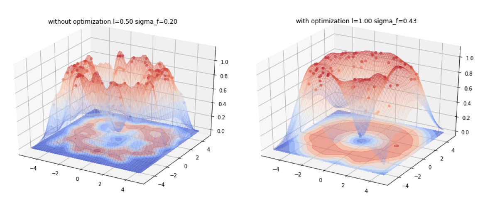](http://ww4.sinaimg.cn/large/006tNc79ly1g5fm65aifoj30x40e4wpw.jpg)

以上完整的的代码放在 [toys/GP](https://github.com/borgwang/toys/tree/master/GP)。

### 高斯过程回归的优缺点

+ 优点
  + （采用 RBF 作为协方差函数）具有平滑性质，能够拟合非线性数据
  + 高斯过程回归天然支持得到模型关于预测的不确定性（置信区间），直接输出关于预测点值的概率分布
  + 通过最大化边缘似然这一简洁的方式，高斯过程回归可以在不需要交叉验证的情况下给出比较好的正则化效果
+ 缺点
  + 高斯过程是一个非参数模型，每次的 inference 都需要对所有的数据点进行（矩阵求逆）。
  
    对于没有经过任何优化的高斯过程回归，n个样本点时间复杂度大概是 $\mathcal{O}(n^3)$，空间复杂度是 $\mathcal{O}(n^2)$，在数据量大的时候高斯过程变得 intractable
  
  + 高斯过程回归中，先验是一个高斯过程，likelihood 也是高斯的，因此得到的后验仍是高斯过程。在 likelihood 不服从高斯分布的问题中（如分类），需要对得到的后验进行 approximate 使其仍为高斯过程
  
  + RBF 是最常用的协方差函数，但在实际中通常需要根据问题和数据的性质选择恰当的协方差函数

## 高斯过程地面点分离

### 算法介绍

这里简单介绍: [利用高斯过程分离地面](http://www.massey.ac.nz/~rwang/publications/13-JINT-Chen.pdf), 该论文中的高斯过程的使用. 

我们知道, 对于平坦的地面`length-scal`$l$应该取较大值, 而对于粗糙的地面则该取较小值, 在该论文中, 为了提高分类的精度, 对于每个扇区(扇形区域)使用非静态的, 各向同性的协方差函数: $$ k(r_i, r_j) = \sigma_f^2(l_i^2)^{\frac{1}{4}}(l_j^2)^{\frac{1}{4}}(\frac{l_i^2 + l_j^2}{2})^{-\frac{1}{2}} \times \exp(-\frac{2(r_i - r_j)^2}{l_i^2 + l_j^2}) $$ 为每一个$r_i$, 都计算一个单独的$l_i$. 论文中采用INSAC(Incremental Sample Consensus)的方式迭代地进行高斯过程, 从而区分地面点和外点. 算法流程如下:

[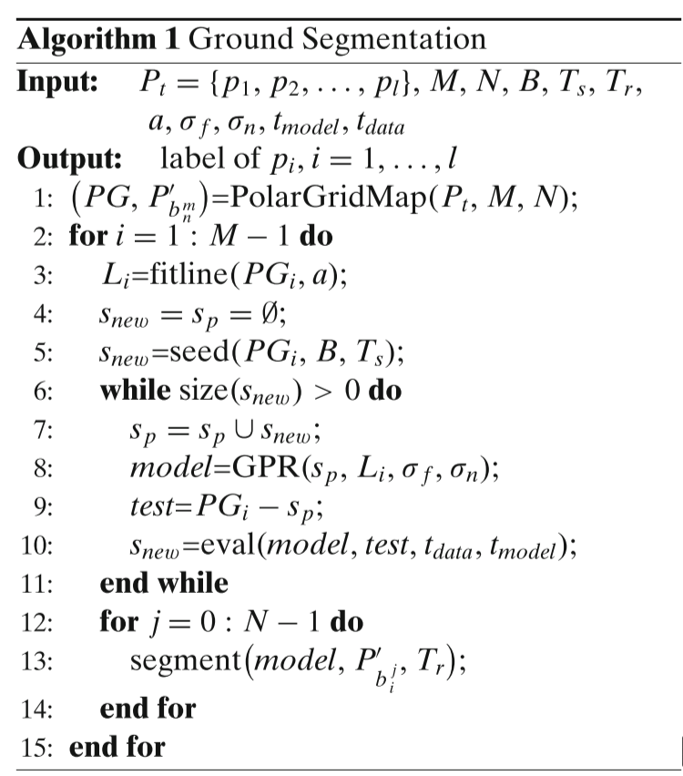](https://github.com/wegatron/gaussian_process_ground_seg/blob/master/rc/gp_ground_detect.PNG)

这里, M是扇区的数量, N是每个扇区bin的数量, $PG_i$是代表扇区, $P_{b_n^m}'$代表扇区中的bin, 在激光范围$B$内高度不低于$T_s$的点作为种子点. 在判断时, 认为每个bin中地面的高度是不变的(取一个均值), 与地面高度差超过阈值$T_r$的点认为是障碍物点, 否则认为是地面点. 这里不作详细的解释, 详细信息参看论文《Gaussian-Process-Based Real-Time Ground Segmentation for Autonomous Land Vehicles》.

### 代码实现

在wavelib的实现中, 并没有为每一个$r_i$单独计算$l_i$, 而是将$l$作为一个输入参数. 当然, `hyper-parameters`和$\sigma_n^2$, 也作为输入参数. 

该代码基本实现该算法, 其中的INSAC(Incremental Sample Consensus)值得借鉴. 简化后的公式: 
$$
\begin{aligned} 
k(r_i, r_j) 
&= \sigma_f^2 \exp(-\frac{(r_i - r_j)^2}{2l^2})\\
& K = k + \sigma_n^2 \mathbf{I} 
\end{aligned}
$$
各参数的直观理解: $\sigma_f^2$, 理解为不确定度的一个缩放, $\sigma_f^2$越大, 不确定度放大越快.

$l$, 理解为不同距离点之间的相关性, $l$越大, 点与点之间的相关性越强, 这个回复到中心值的速度就越慢(高斯过程有一个恢复到中心值的趋势, 这里中心值为0).

[](https://github.com/wegatron/gaussian_process_ground_seg/blob/master/rc/gp_param_l_0.png) [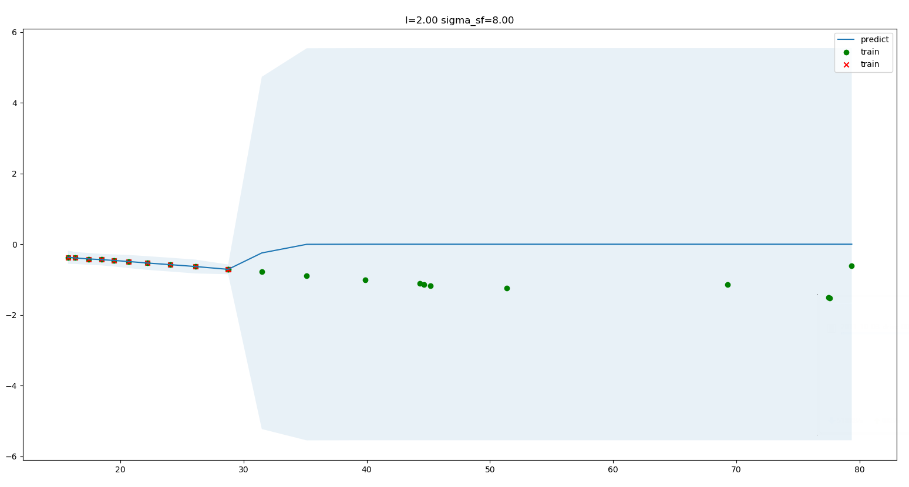](https://github.com/wegatron/gaussian_process_ground_seg/blob/master/rc/gp_param_l_1.png) [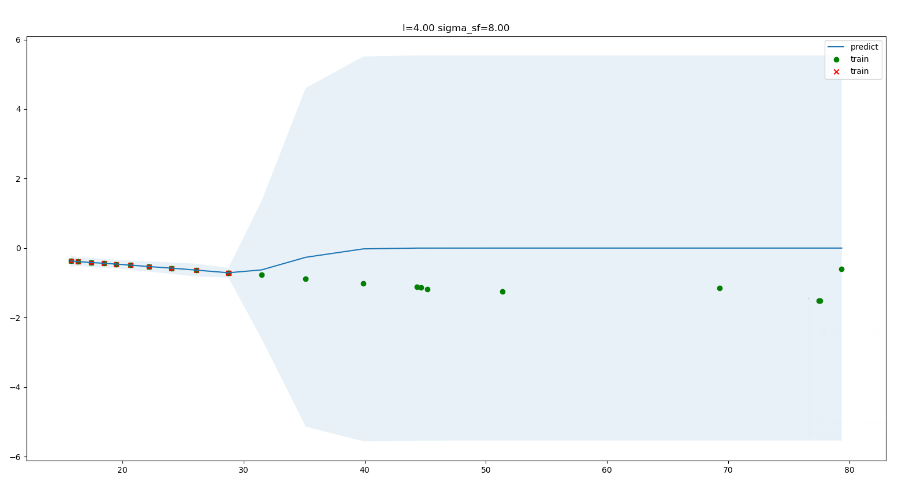](https://github.com/wegatron/gaussian_process_ground_seg/blob/master/rc/gp_param_l_2.png)

$\sigma_n^2$, 理解为不确定度的一个基相加, $\sigma_n^2$越大.

[](https://github.com/wegatron/gaussian_process_ground_seg/blob/master/rc/gp_sigma_sn_0.png) [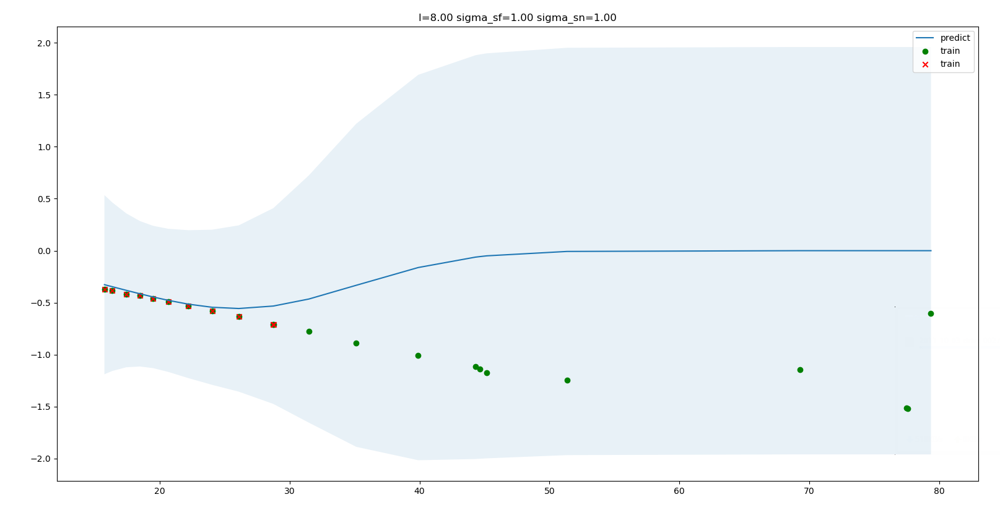](https://github.com/wegatron/gaussian_process_ground_seg/blob/master/rc/gp_sigma_sn_1.png)

### 代码的一些改进

1. 参考了..根据梯度选取种子点

2. insac过程中, 判断点是否是inlier的方法优化 原实现认为 $\frac{|y_{test} - y_{predict}|}{\sigma} < th$ 则为inlier, 由上面的图可以看出, 当距离越远, $\sigma$越大(不确定度也越大), 这样的判断是不准确的. 原方法代码:

   ```C++
   double met = (sig_points[k].height - f_s(k)) / (sqrt(this->params.p_sn + vf * vf));
   if (vf < this->params.p_tmodel 
     & std::abs(met) < this->params.p_tdata) {  // we have an inlier!
     ...
   }
   ```

   在进行一次拟合后, 我们得到了测试点的预测分布$\mathcal{N}(y_{predict}, \sigma_{predict})$, 按照此分布, 我们要求在 $[y_{test} - th, y_{test}+th_{height}]$ 区间内的概率超过 $th_{probility}$. 这里$th_{height} = 0.1, th_{probility}=0.8$, 即 **我们有80%的概率, 真实的地面高度与测试值相差在0.1米以内**.

   [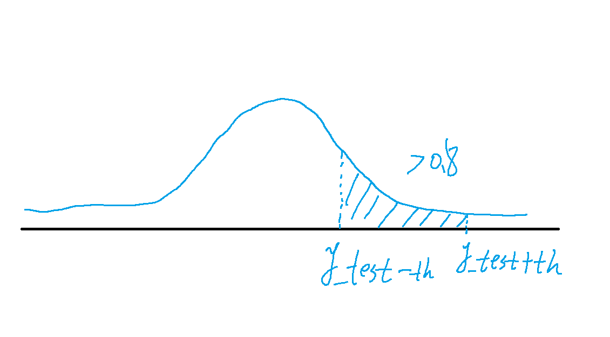](https://github.com/wegatron/gaussian_process_ground_seg/blob/master/rc/gp_insac_th.png)

   简化积分的计算, 使用 $(P(y_{test} - th) + P(y_{test} + th))*0.5*th$来近似.

3. TODO 超参数优化

Code:

## Result

[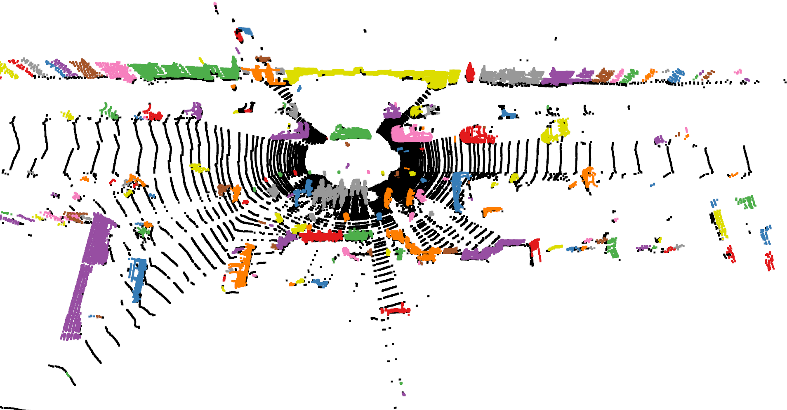](https://github.com/wegatron/gaussian_process_ground_seg/blob/master/rc/segmented_res.png)

## reference

+ [高斯过程 Gaussian Processes 原理、可视化及代码实现](https://zhuanlan.zhihu.com/p/75589452)
+ [通俗易懂地介绍Gaussian Process](https://www.zhihu.com/question/46631426)
+ [高斯过程的基本原理](https://www.bilibili.com/video/av35626047/)
+ [机器学习中的高斯过程](https://www.datalearner.com/blog/1051459170229238)
+ [Gaussian Process 理论](http://www.dam.brown.edu/people/mraissi/teaching/2_gaussian_processes_tutorial/)
+ [Matlab GP example 代码](https://github.com/maziarraissi/TutorialGP)
+ [GP Ground Segmentation](http://www.massey.ac.nz/~rwang/publications/13-JINT-Chen.pdf)
+ [GP Ground Segmentation Code Wavelib](https://github.com/wavelab/libwave/tree/master/wave_matching/include/wave/matching)
+ [Carl Edward Rasmussen - Gaussian Processes for Machine Learning](http://www.gaussianprocess.org/gpml/chapters/RW.pdf)
+ [MLSS 2012 J. Cunningham - Gaussian Processes for Machine Learning](http://www.columbia.edu/~jwp2128/Teaching/E6892/papers/mlss2012_cunningham_gaussian_processes.pdf)
+ [Martin Krasser's blog- Gaussian Processes](http://krasserm.github.io/2018/03/19/gaussian-processes/)
+ [scikit-learn GaussianProcessRegressor](https://scikit-learn.org/stable/modules/generated/sklearn.gaussian_process.GaussianProcessRegressor.html)

+ https://github.com/wegatron/gaussian_process_ground_seg/search?l=cmake)