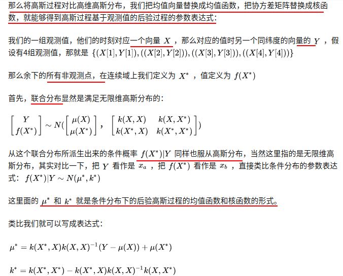
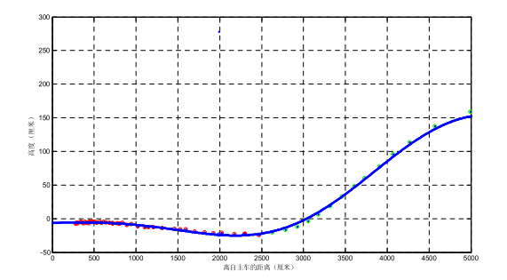
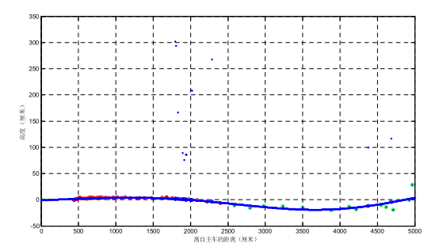

### 1.高斯过程简单介绍

首先介绍一下高斯过程回归的一些概念;

高斯分布从一维扩展到多维,再从多维扩展到无限维就是高斯过程,高斯过程是定义在连续域上的无限个高斯随机变量组成的随机过程,每个维度上的值都属于一个高斯分布,在多维高斯分布中使用协方差矩阵表示不同高斯分布之前的关系,在高斯过程中使用协方差函数(核函数)来表示不同维度之间的关系;

高斯过程正式地定义为：对于所有

$$ \boldsymbol{x} = [x_1, x_2, \cdots, x_n] $$，$$ f(\boldsymbol{x})=[f(x_1), f(x_2), \cdots, f(x_n)] $$

都服从多元高斯分布，则称 $f$ 是一个高斯过程，表示为

 $$ f(\boldsymbol{x}) \sim \mathcal{N}(\boldsymbol{\mu}(\boldsymbol{x}), \kappa(\boldsymbol{x},\boldsymbol{x})) \tag{4} $$

这里 $$\boldsymbol{\mu}(\boldsymbol{x}): \mathbb{R^{n}} \rightarrow \mathbb{R^{n}} $$ 表示均值函数（Mean function），返回各个维度的均值； 

$$ \kappa(\boldsymbol{x},\boldsymbol{x}) : \mathbb{R^{n}} \times \mathbb{R^{n}} \rightarrow \mathbb{R^{n\times n}} $$ 为协方差函数 Covariance Function（也叫核函数 Kernel Function）返回各个维度之间的协方差矩阵。

就像高斯分布可以用均值和协方差完全确定一样,一个高斯过程为一个均值函数和协方差函数唯一地定义，并且**一个高斯过程的有限维度的子集都服从一个多元高斯分布**（为了方便理解，可以想象二元高斯分布两个维度各自都服从一个高斯分布）。

在机器学习中,高斯过程可以被用来解决回归问题,当前,回归的常见做法是把**函数参数化**,如线性回归的权重,但GP不同,它直接对函数建模生成非参数模型,可以用来表示函数的**分布情况**,由此产生的一个突出优势就是它不仅能模拟任何黑盒函数,还能模拟不确定性,当涉及丰富的建模可能性和大量随机参数时，高斯过程十分简单易用。

比如说使用高斯过程进行曲线的回归(拟合),给定一个训练数据集$X,Y$,我们认为训练数据x对应的函数值y服从一个一维高斯分布,所有的数据服从一个高维高斯分布,使用核函数来表达任意两个训练数据之间的关系,最常用的是高斯核函数,两个x距离越近,相关性越高;

输入一个测试数据x_test,我们需要回归出它的y值,在高斯过程中,就是估计出在测试数据位置处的高斯分布,通过高斯核函数给出的测试数据和训练数据之间的相关性估计出一个均值和方差,这个过程可以看做有个先验和观测,估计后验概率的过程,(通过新x和老x之间的关系,推断出新y的值)

==从公式中我们可以发现,未观测到的$\mu^\star$其实是观测值$Y$的非线性组合,通过核函数来描述,所以核函数是GP的核心.==

这就是使用高斯过程解决回归问题的基本过程，首先有一个高斯过程先验分布，观测到一些数据（机器学习中的训练数据），基于先验和一定的假设（联合高斯分布）计算得到高斯过程后验分布的均值和协方差。

高斯过程回归没有显示的一个训练过程,每次的预测都需要使用所有的数据点,如果数据中会有噪声,就会产生偏差;

### 2.高斯过程用于地面分割

首先对点云数据进行极坐标栅格化,每一个栅格内保存高度最小点的距离和高度,把每一个扇形中高度值最小的点作为最初的训练数据,如果把这些点连成一个曲线,距离是x轴,高度是y轴,这样就把地形估计问题转化为了一维的高斯过程回归;

这些高度值最小的点中只有一部分是地面点,其他点是障碍物点,可以使用增量更新的方法来去除这些噪点;

将激光雷达标定到地面上,即地面点的理想z值是0,

首先假设在B(20)米范围内,高度值小于T(0.3m)的点都是真的地面点,把这些点作为种子点,作为第一批训练数据,然后按照从近到远的顺序去遍历其他点,这些点就是测试数据;每遍历到一个点,就用之前说的高斯过程回归的方法,估计当前位置的高斯分布的均值和方差,使用两个约束来确定遍历到的点是不是地面点,一个是估计的方差小于给定阈值,说明估计的不确定性很小,第二个是估计的均值和实际高度值差距不大,如果同时满足这两个约束,就把这个点加入种子点中,共同作为训练数据,否则,就认为这个点是障碍物点,直到这个扇形中所有的点都访问过;

用这些最终的种子点采用高斯回归模型训练地面模型,根据扇形中第 j 个块离原点O的距离Op,采用训练的地面模型获得该块中近似的地面高度H,根据车辆的越障能力,设置两个阈值$T_p(0.3),T_n(-0.15)$,然后计算这个块中其他点的高度与地面高度的距离,如果高度差值大于$T_p$就认为是正障碍物,小于$T_n$是负障碍物点,在这两者之间全部标记为地面点;

这样得到的正障碍物点中包含有悬挂物如树冠、横跨马路的电线错分成自主车不可通行的障碍物，而实际上自主车是可以从它们下面安全经过。所以还需要从上述正障碍点中继续分离出其中的悬挂物,对一个栅格中的障碍物点按照z坐标进行排序,然后根据高度从小到达依次计算两个相邻点$P_n-P_m$之间的距离$z_n-z_m$,如果距离大于设置的阈值,就把高度大于$z_n$的点都标记为正障碍物;

